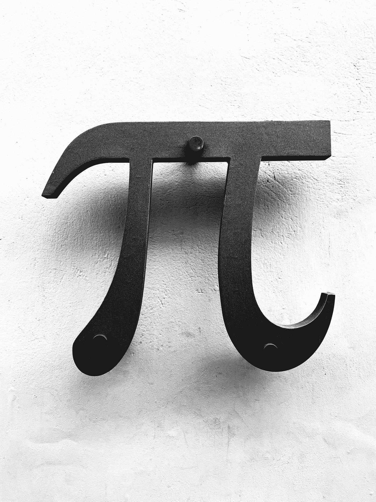
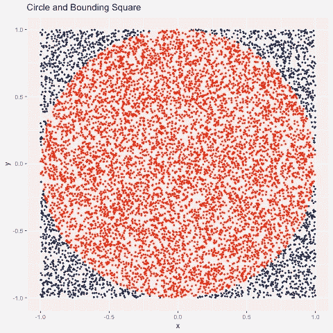
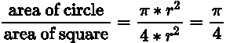
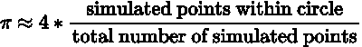
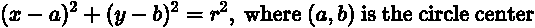
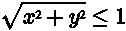
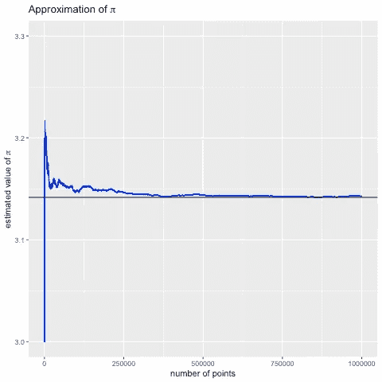

# 用蒙特卡罗模拟法估计圆周率

> 原文：<https://towardsdatascience.com/estimating-pi-using-monte-carlo-simulation-in-r-91d1f32406af?source=collection_archive---------5----------------------->

## 如何只用几行代码模拟圆周率？

Taso Katsionis 在 [Unsplash](https://unsplash.com?utm_source=medium&utm_medium=referral) 拍摄的照片

说明如何使用蒙特卡罗模拟的一个常见例子是通过估计圆周率。本文将向您展示如何使用 r 用几行代码完成这一模拟。在编写代码之前，让我们先来看一下我们将用来估计圆周率的数学公式。

作者图片

# 找出圆周率的表达式

圆周率是一个数学常数，大约为 3.14159，表示圆的周长与其直径的比值。我们如何在模拟中找到一个表达式来计算圆周率的近似值？

我们知道圆的面积是由π* r 计算出来的，包围正方形的面积是(2r) = 4r。用圆的面积除以正方形的面积，我们得到两个面积的比值:

这意味着我们可以使用以下公式估算圆周率:

通过在这个正方形内模拟随机数，我们得到了圆形面积和正方形面积的近似值。因此，我们可以通过取落在圆内的模拟点与模拟点总数的比率并乘以 4 来估计圆周率。

为了识别哪些点落在圆内，我们使用圆的等式:

在我们的示例中，圆心为(0，0)，半径为 1，因此满足以下标准的模拟点位于圆内。

# 为模拟编写函数

我们的函数将采用两个参数，**种子**用于再现性，以及**迭代**以便我们可以选择我们想要生成多少个模拟点。

该功能经历以下步骤:

*   设定种子。
*   从均匀分布中生成选定数量的随机点，**最小值**和**最大值**被设置为我们的域边界，这里为-1 和 1。这些随机数存储在两个向量中，一个用于 x 坐标，一个用于 y 坐标。
*   计算每个(x，y)点的 sqrt(x +y ),并将它们存储在一个向量中。
*   通过计算 sqrt(x +y ) ≤1 来计算圆内有多少个点。
*   用圆内的*点数*与*总点数*之比乘以 4 来估算 pi
*   返回估计圆周率的值

调用我们的 **simulate_pi()** 函数将返回种子 pi 的近似值以及传递给其参数的点数。*请注意，由于函数中没有种子，由于生成了不同的随机数，模拟每次运行将产生不同的估计值。*

将 seed 设置为 28 并使用 10，000 个随机点，得到的估计值为 3.1724。相当接近圆周率，但可能还不够接近到让我们满意的程度。让我们看看如何改进这一估计。

# 增加生成点的数量将改善我们的估计

我们可以使用 sapply()在一次调用中为不同数量的生成点估计 pi。

运行下面的代码给出 10，100，1，000，10，000，100，000 和 1，000，000 个模拟点的 pi 估计值。

正如我们所看到的，pi 的估计值随着点数的增加越来越接近 pi 的真实值。这说明了蒙特卡罗模拟的一个重要方面；仅使用少量随机点通常会给出较差的近似值。平均而言，随着点数的增加，近似值将会提高。

# 绘制估计的 pi 值

为了说明这一点，我们可以绘制圆周率的估计值，看看它是如何随着点数的增加而变化的。为了绘制该图，我们需要将每个估计值存储在一个数据框中。我们可以通过如下修改函数来做到这一点。

现在我们有了一个生成所需数据的函数。让我们
生成数据，并绘制从第一个点到 100，000 个点的 pi 近似值。

正如我们所看到的，pi 的估计值在第一次模拟中相当不准确，但随着模拟次数的增加，它越来越接近 pi 的实际值。

本文中使用的代码可以在这个 [GitHub repo](https://github.com/TalkingDataScience/estimate_pi_with_R) 中找到。

如果你喜欢阅读这样的故事，并且想支持我成为一名作家，考虑注册成为一名媒体会员。每月 5 美元，你可以无限制地阅读媒体上的故事。如果你注册使用我的链接，我会赚一小笔佣金。

<https://medium.com/@andreagustafsen/membership> 