# 估计邻居级别的政治关系

> 原文：<https://towardsdatascience.com/estimating-political-affiliation-at-the-neighborhood-level-403b587a9e34?source=collection_archive---------35----------------------->

## 没有电话，没有调查，没有网上投票——只有好的数据。


由 [Unsplash](https://unsplash.com?utm_source=medium&utm_medium=referral) 上的 [Element5 数码](https://unsplash.com/@element5digital?utm_source=medium&utm_medium=referral)拍摄

*这篇文章提供了一个在邻里层面估计政治倾向的高层次概述。如需更深入的讨论，请查看随附的* [*Google Colab 笔记本*](https://colab.research.google.com/drive/1i3yzeWNsJ5huwX7-frEgwz_Sb_CZEFyh?usp=sharing) *或最近的* [*Meetup 演示文稿*](https://www.youtube.com/watch?v=NYV4fB3IU0k) *。*

***免责声明:我是 SafeGraph 公司的数据科学承包商，该公司的数据用于本项目。***

# 介绍

政治派别是一个强大的变量，它与宗教极端主义、疫苗拒绝、对体罚的立场等因素相关联。研究人员用它来理解各种现象。企业用它来了解他们的市场。政治运动用它来赢得选举。

不幸的是，政治党派数据通常只能在县或区一级获得。虽然收入、种族、人口和教育等其他人口统计变量可以通过美国人口普查局在[人口普查小组(CBG)一级获得，但政治派别却不能。*注:平均而言，每个州由 67 个以上的社区团体组成。*](https://www.census.gov/programs-surveys/geography/about/glossary.html#par_textimage_4)

因此，政治党派变量可能会忽略一个县或地区内的重要变化。例如，查看下图。当在县一级进行估计时，科布县(佐治亚州)稍微倾向于民主党(蓝色)。当在 CBG 层面进行估计时，很明显科布县的许多地方都倾向于共和党(红色)。

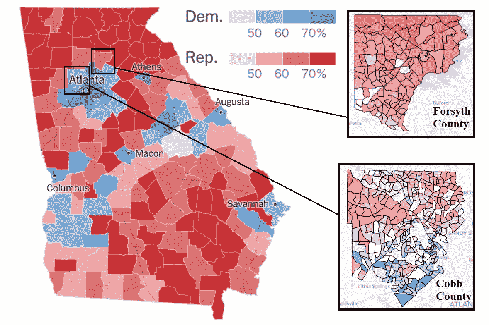

来自《纽约时报》的县级地图(左)。本文作者提供的人口普查区块组级地图(右)。

有了正确的数据和工具，我们可以很容易地做出这些估计。

# 材料

> 步行交通模式+投票地点/结果=政治派别

我们使用三个数据集和一个 API 来进行这些估计。对于本教程，代码和示例数据已在 [my GitHub](https://github.com/kruser1/political-affiliation-census) 上提供。

## 数据

*   投票地点([科布](https://www.cobbcounty.org/elections/voting/election-day)和[佐治亚州福塞斯](https://www.forsythco.com/Departments-Offices/Voter-Registrations-Elections/Precincts-and-Voting-Locations)县):2020 年美国大选投票地点地址
*   [选举结果](https://results.enr.clarityelections.com/GA/105369/web.264614/#/access-to-races)(格鲁吉亚):2020 年美国大选投票地点结果
*   [安全图模式](https://docs.safegraph.com/docs/weekly-patterns):指示给定时间段内每个兴趣点(POI)的访客的家庭 CBG 的步行交通数据

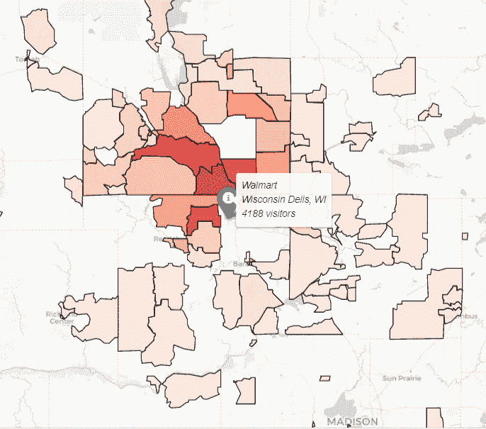

使用 SafeGraph 模式，我们可以看到哪些人口普查区块组(cbg)的居民最常去威斯康星州戴尔的沃尔玛。

当我们将安全图模式与选举结果相结合时，我们可以将选举结果与 cbg 相关联。

一个问题是:由于地址格式不一致，连接 POI 数据很困难。幸运的是，我们可以使用 **Placekey** 来解决这个问题。

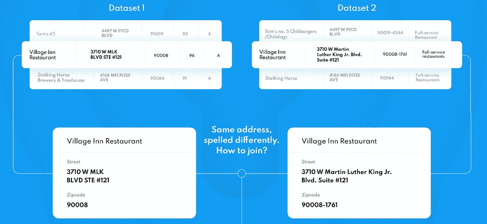

在两个不同的数据集中，相同的地址通常具有不同的格式。上面的行对应于同一个 POI，但是地址的格式不同。这使得在没有开放、唯一标准的情况下连接 POI 数据集变得极其困难。

## 连接数据

*   [Placekey](https://www.placekey.io/) :大规模连接兴趣点数据的免费工具，非常有用，因为大多数兴趣点数据集没有标准化的地址列(“AVE”vs“AVE .”vs“Avenue”，“NW”vs“n . w .”vs“northwestern”vs“NW”等)


位置键看起来像什么？

Placekey 是美国(以及加拿大，很快会有更多国家)每个 POI 的开放、唯一的标准标识符。当给定位置参数(地址数据或坐标/位置名称)时，Placekey API 返回一个 Placekey。

我们希望按选区将 Patterns `visitor_home_cbgs`列与选举结果对齐。然后我们可以估计每个 CBG 的政治倾向。

看看下面的图片，记住以下几点:

*   **红色**:选区 ID 列，用于合并选举结果和选区位置。
*   **黄色** : Placekey 列，用于将辖区位置与 SafeGraph 模式合并。
*   **蓝色**:选举结果和访客住宅人口普查区块组列。所有这些合并的目标是将`visitor_home_cbgs`与选举结果相匹配。

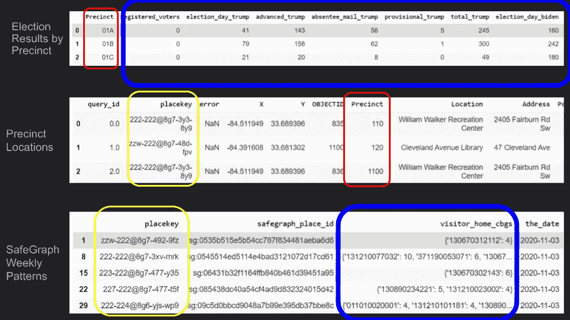

我们的三个数据集和用来连接它们的列。“选区选举结果”将与“选区位置”一起出现在“选区”栏(红色)。“辖区位置”将与“地点键”栏(黄色)上的“安全图表每周模式”相结合。我们的目标是使用相应的位置将模式‘visitor _ home _ cbgs’列与选举结果(蓝色)相匹配。 ***注意:必须使用 Placekey API 将“placekey”列添加到“分局位置”数据集中。***

例如，给定下表中的选区投票总数，假设 CBG `123456789012`是 A 区 50%的访问者、B 区 20%的访问者和 c 区 10%的访问者的家

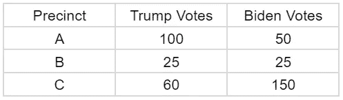

虚拟选区的虚拟数据。

然后我们估计 CBG`123456789012`的总票数为:

*   `Trump = .50*100 + .20*25 + .10*60 = 50 + 5 + 6 = 61`
*   `Biden = .50*50 + .20*25 + .10*150 = 25 + 5 + 15 = 45`

# 步伐

**提醒:** [详细讨论和代码在 GitHub](https://github.com/kruser1/political-affiliation-census) 上。用附带的谷歌 Colab 笔记本再创作超级容易！

## 1)读入数据

相当简单——将 CSV 数据读入熊猫数据帧。我们在上面看到了三个数据集(选举结果、投票地点和安全图模式)的例子。

## 2)将投票数据与模式数据相结合

将选举结果与投票地点联系起来。 如上图所示，将选举结果数据与`Precinct`列的投票地点数据连接起来。

**b. *向投票数据添加 Placekey 列。*** 使用 [Placekey API](https://docs.placekey.io/) ，为来自步骤 **2a** 的投票数据中的每个地址请求 Placekey。使用 [Python 库](https://pypi.org/project/placekey/)处理 Placekeys 使这一步变得简单。

下面是一个查询示例:

```
place = {
     "query_id": "0",
     "location_name": "Twin Peaks Petroleum",
     "street_address": "598 Portola Dr",
     "city": "San Francisco",
     "region": "CA",
     "postal_code": "94131",
     "iso_country_code": "US"
   }
pk_api.lookup_placekey(**place, strict_address_match=True)Output:{‘query_id’: ‘0’, ‘placekey’: ‘227-222@5vg-82n-pgk’}
```

成功返回查询后，我们将 Placekey 添加到投票数据中的相应行。

**c. *在 Placekey 上加入模式和投票数据。*** SafeGraph 模式带有内置的 Placekey，因此我们可以简单地将模式数据帧与`placekey`上的投票数据帧连接起来。这应该是一个“内部”连接，因为只有一小部分模式行对应于轮询位置。此外，一些轮询位置可能没有被 SafeGraph 模式覆盖。

结果示例:

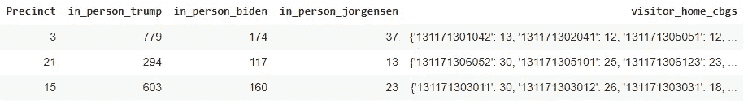

现场选举结果和 SafeGraph 步行交通数据是一致的。

## 3)被游客之家 CBG 引爆

您会注意到`visitor_home_cbgs`列是 JSON 格式的，其中的键是一个 CBG，值是来自该行所在区域的 CBG 的访问者数量。我们需要垂直展开`visitor_home_cbgs`列来提取这些数据。幸运的是，SafeGraph 有一个 [Python 库](https://github.com/SafeGraphInc/safegraph_py)来让这个过程变得不那么痛苦。

下面是仅过滤到分区 3 的结果数据帧。请注意，`in_person_trump`、`in_person_biden`和`in_person_jorgensen`列在每一行中都是相同的，因为每一行都对应于 Prccinct 3。`cbg`列包括分区 3 的`visitor_home_cbgs` JSON 对象中的每个键。`visitors`列是 JSON 对象中键的对应值。

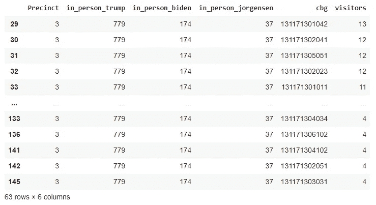

让我们再次查看这个相同的数据帧，但是这次过滤到所有行，其中`cbg`是‘131171301011’。

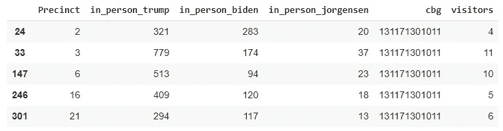

来自 CBG 的游客 131171301011。

## 6)计算估计的 CBG 政治归属

接下来，我们计算在每个辖区看到的来自每个 CBG 的访问者的比例。例如，从' 131171301011 '看到的访问者总数是 36(`visitors`列的总和)。那么`portion`就是`visitors / total_visitors`。

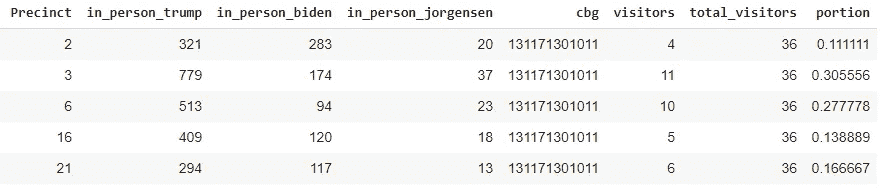

然后，我们有以下 CBG 的“131171301011”:

*   `in_person_trump = sum( in_person_trump * portion ) = 321*.11111 + 779*.305556 + 513*.277778 + 409*.138889 + 294*.166667 = 522`
*   `in_person_biden = sum( in_person_biden * portion ) = 283*.11111 + 174*.305556 + 94*.277778 + 120*.138889 + 117*.166667 = 146.9`
*   `in_person_jorgensen = sum( in_person_jorgensen * portion ) = 20*.11111 + 37*.305556 + 23*.277778 + 18*.138889 + 13*.166667 = 24.6`

我们感兴趣的是与每个候选人相关的部分(而不是实际的投票数——如果我们想计算投票数，我们必须归一化 SafeGraph 的访问者计数，因为计数是基于样本的)。为了计算 CBG“131171301011”的从属关系，我们有:

*   `trump = in_person_trump / (in_person_trump + in_person_biden + in_person_jorgenson) = **.753**`
*   `biden = in_person_biden / (in_person_trump + in_person_biden + in_person_jorgenson) = **.212**`
*   `jorgensen = in_person_jorgensen / (in_person_trump + in_person_biden + in_person_jorgenson) = **.035**`

以下是该数据集中的一些其他 cbg:

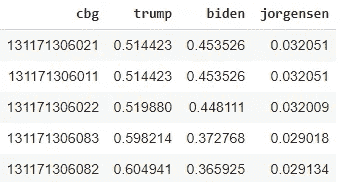

*注:附带的* [*Google Colab 笔记本*](https://github.com/kruser1/political-affiliation-census) *中的实际估计值可能会因增加的标准化步骤而略有不同。*

## 7)地图估计

最后一步，我们可以通过映射隶属关系来可视化我们的估计。蓝色表示倾向拜登，红色表示倾向特朗普，白色表示五五开。很明显，一些 cbg 丢失了，这将在下面简要说明。CBGs 的右上分组对应于 Forsyth 县，而左下分组对应于 Cobb 县。福塞斯县相当同质，但科布县有一些变化。总的来说，科布县似乎越靠近亚特兰大越蓝，但也有一些例外。

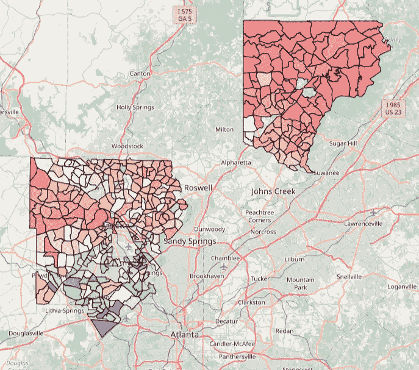

# 限制

1.  客流量数据对应于选举日的整个星期。人们可以尝试通过删除基于前几周或后几周的“预期流量”来纠正这一点。
2.  我们仅使用现场投票进行估计，这是有问题的，因为(a)许多选票是邮寄来的，因为选举是在疫情期间进行的，(b)邮寄来的选票往往倾向于民主党。人们可以尝试在县一级纠正这种情况，或者在了解县选举规则和选民登记数据的情况下，在 CBG 一级纠正这种情况。
3.  一些 CBG 的估计完全不见了。根据分析的需要，缺失的估计值可以完全忽略，用中间值/平均值插补、最近邻估计值插补或最近投票点插补进行估计。

# 结论

虽然这种方法有一些局限性，但由此产生的估计值为研究人员、企业和政治活动提供了更多的价值。有了 CBG 级别的估计，政治倾向可以前所未有地与美国人口普查变量(如收入、种族、教育、年龄等)相关联地进行分析。Placekey 支持大规模的 CBG 级别的政治关联评估，这反过来又支持强大的洞察力。

这项工作的未来方向可能是分析诸如投票率、选民压制等等。安全图模式包括停留时间和行驶距离的值。在分析这些东西之前，您需要对原始模式数据进行标准化，因为 SafeGraph 的数据是整个美国人口的样本，并且基础面板会随着时间的推移而变化。缩放步骤超出了本教程的范围，但是在 [GitHub](https://github.com/kruser1/political-affiliation-census) 中有所涉及。

资料和笔记本都是给你用的！你能发现哪些真知灼见？！