# 估计合同终止前的时间——生命线生存分析

> 原文：<https://towardsdatascience.com/estimating-time-until-contract-termination-survival-analysis-with-lifelines-212734cbca23?source=collection_archive---------32----------------------->

## 估计生命线特定事件发生的时间


卢克·切瑟在 [Unsplash](https://unsplash.com?utm_source=medium&utm_medium=referral) 上的照片

我敢肯定，每个人在数据职业生涯的某个阶段都会遇到这样的情况，当你想要估计某个特定事件将要发生时，例如，“什么时候有人会流失？”或者“保险的死亡索赔何时发生？”。我们通常会使用时间序列方法来解决这个问题，但生存分析是典型的方法。

在这篇文章中，我想向大家介绍什么是生存分析及其在 Lifelines Python 包中使用现实生活中的合同终止数据的应用。让我们开始吧。

# 生存分析

## **简介**

什么是生存分析？生存分析是一种统计分析，旨在测量个体的寿命。比如“这个种群活多久？”。这可以用生存分析来回答。

虽然最初它被用来衡量个人的寿命(生或死)，但这种分析足以回答各种问题。您可能对人们购买保险到索赔的时间间隔感兴趣，或者对人们进入主题公园到离开公园的时间间隔感兴趣。重要的是数据具有事件的持续时间。

## **审查**

在我上面的解释之后，您可能会有一个后续问题“我可能有数据，但如果我没有我想要的事件持续时间的所有数据，该怎么办？”例如，你可能需要等到 60 年，直到你分析的所有个人都要求他们的死亡保险——但你想在更短的时间内做出决定(可能是现在)。

这就是为什么我们有权利审查的概念。这个概念定义了排除非发生事件寿命(或持续时间)的个体，我们仅有的信息是当前的持续时间。

为了说明这一点，我们将使用来自 [Kaggle](https://www.kaggle.com/HRAnalyticRepository/employee-attrition-data) 的数据集示例，该示例涉及合同终止时的员工流失。

```
import pandas as pd
df = pd.read_csv('MFG10YearTerminationData.csv') 
df[['length_of_service', 'STATUS']]
```

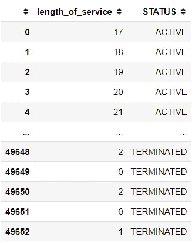

作者创建的图像

我们可能会从数据中问这个问题“员工合同终止前的持续时间是多长？”。因为我们对终止时间感兴趣，所以我们需要员工数据及其合同状态(有效或终止)。

如果你看到上面的数据，我们就会有服务年限。这是员工到目前为止或合同终止之前在公司服务的时间(以月为单位)。如果状态仍然有效，那么我们已经对数据进行了右删截，因为我们仍然不知道他们的雇佣合同将于何时终止(我们将有效状态的服务年限填写为从雇佣时间到当前时间之间的月数)。

审查也是为了缓解某些个人不同的进入时间的问题。我们现有的数据肯定不会同时雇用该员工；有些是很久以前雇佣的，有些是最近才加入的。

为什么我们需要了解右删？这是因为生存分析被开发来处理使用右删失数据的估计。我们所有的估计都是基于我们右删的数据。

如果您仍然对这个概念不满意，让我们使用 Lifelines Python 包进入应用程序。

# **生命线**

我将跳过生存分析数学部分，因为本文的中心部分是使用生命线包来估计直到合同终止的时间。如果你对生存分析的深入数学解释感兴趣，你可以访问生命线包[这里](https://lifelines.readthedocs.io/en/latest/index.html)。

## **安装**

为了做好准备，让我们安装生命线包。

```
#install with pip
pip install lifelines
```

或者

```
#install via conda
conda install -c conda-forge lifelines
```

## Kaplan-Meier 估计下的生存函数

安装了这个包之后，我们现在可以用生命线包进行生存分析了。作为开始，我们将使用[卡普兰-迈耶估计](http://en.wikipedia.org/wiki/Kaplan%E2%80%93Meier_estimator)来估计生存函数。

```
from lifelines import KaplanMeierFitter
kmf = KaplanMeierFitter()
```

数据集准备就绪后，我们将进行一项功能工程，将“状态”变量转换为 0 或 1，而不是文本(该功能将被称为“观察到的”)。

```
df['Observed'] = df['STATUS'].apply(lambda x: 1 if x == 'TERMINATED' else 0)
```

现在我们有了所有需要的数据；持续时间和观察到的事件。让我们从创建生存函数开始。

```
#Kaplan-Meier estimation
kmf.fit(df['length_of_service'], df['Observed'])
```

如果成功，此通知将显示在您的笔记本中。


作者创建的图像

接下来，我们可以尝试绘制生存函数，以查看整个时间内的生存概率(员工合同终止未发生的概率)。

```
import matplotlib.pyplot as plt
plt.figure(figsize = (8,8))
plt.title('Employee Contract Termination Survival Function')
kmf.plot_survival_function()
```

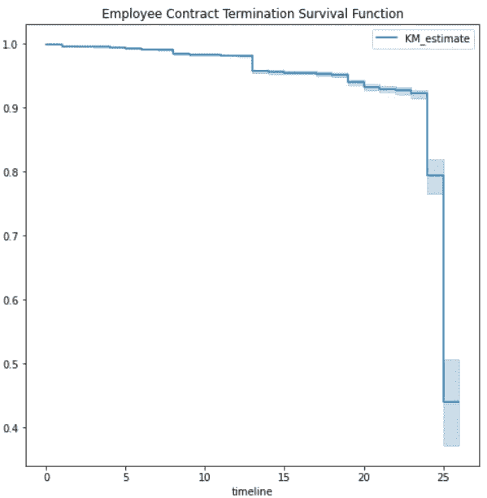

作者创建的图像

上图显示了雇佣合同不会随时间终止的概率。显示有趣信息的情节；在前 23 个月，你的合同被终止的可能性相对较低，但当你进入第 24 个月和第 25 个月时，你的生存概率(合同未被终止)变得显著降低。这意味着大多数的**终止发生在你合同时间**的第 24 或 25 个月。

如果您对实际数字比图中显示的更感兴趣，您可以通过运行以下代码来显示生存函数估计。

```
kmf.survival_function_
```

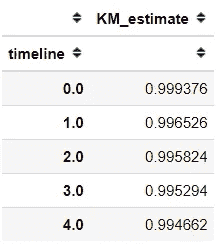

作者创建的图像

或者，如果您对终止概率的累积密度更感兴趣，您可以运行下面的代码。

```
kmf.cumulative_density_
```

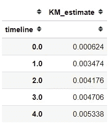

作者创建的图像

## 比较两种不同的 Kaplan-Meier 估计

我们可能会有另一个问题；"合同终止时间在性别上有差异吗？"。为了回答这个问题，我们可以建立两个不同的数据集和生存函数。

```
#Separate the Male and Female data
df_m = df[df['gender_short'] == 'M']
df_f = df[df['gender_short'] == 'F']#Prepare the survival function
kmf_m = KaplanMeierFitter()
kmf_f = KaplanMeierFitter()#Estimate both dataset to acquire the survival function
kmf_m.fit(df_m['length_of_service'], df_m['Observed'], label = 'Male')
kmf_f.fit(df_f['length_of_service'], df_f['Observed'], label = 'Female')#Produce the survival function plot
plt.figure(figsize = (8,8))
plt.title('Employee Contract Termination Survival Function based on Gender')
kmf_m.plot_survival_function()
kmf_f.plot_survival_function()
```

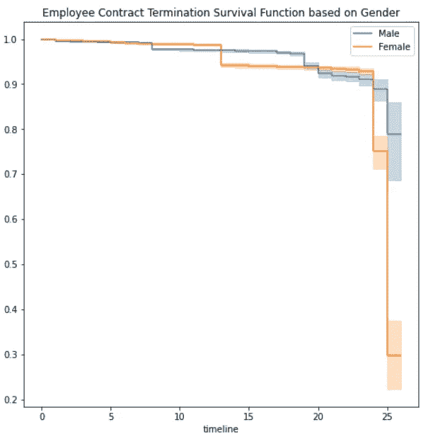

作者创建的图像

这里我们有了另一个令人兴奋的结果。该图显示，雌性**的生存概率远低于雄性**。在第 25 个月，与雄性相比，雌性的存活概率显著下降。

如果男性和女性的合同终止时间存在差异，我们可以使用统计假设检验来评估我们的假设。要使用的标准测试是对数秩测试，生命线在包内提供该测试。

```
from lifelines.statistics import logrank_testresults = logrank_test(df_m['length_of_service'], df_f['length_of_service'], df_m['Observed'], df_f['Observed'], alpha=.95)results.print_summary()
```

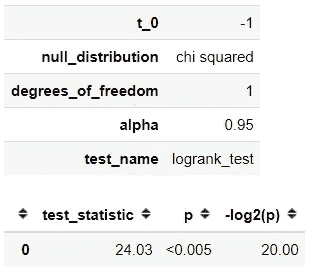

作者创建的图像

从测试结果来看，我们获得了小于 0.05 的 P 值，这意味着我们拒绝零假设，并接受男性和女性在合同终止时间上存在差异。这是一件令人不安的事情，但是让我们把结论放在一边，直到我们进一步分析事情。

## **危险函数使用**尼尔森-艾伦

之前我们讨论了生存函数，但您可能对在 *t 发生的死亡(合同终止)事件的概率更感兴趣。这是*风险函数的内容，估计死亡概率。

我们将使用 Nelson-Aalen 估计作为估计风险函数的方法。幸运的是，生命线软件包已经提供了这个功能。

```
from lifelines import NelsonAalenFitter
naf = NelsonAalenFitter()naf.fit(df['length_of_service'], df['Observed'])
plt.figure(figsize = (8,8))
plt.title('Employee Contract Termination Hazard Function')
naf.plot_cumulative_hazard()
```

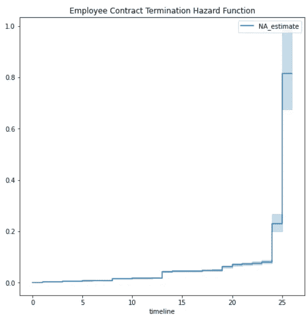

作者创建的图像

风险函数感觉像是生存函数的逆函数。从图中，我们可以看到，它开始缓慢，并在第 24 和 25 个月结束时走高。尽管如此，你在图中看到的是累积风险率，我们通过观察时间 *t* 的风险率来解释结果。

如果我们想得到实际的次数 *t* ，可以运行下面的代码。

```
naf.cumulative_hazard_
```

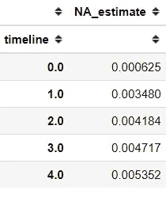

作者创建的图像

随着时间的推移，合同终止事件发生的时间概率越大，风险率越大。

## Cox 比例风险模型下的生存回归

通常，除了您认为会影响生存分析的持续时间之外，您还会有其他数据。这种技术就是我们所说的生存回归。

在生存回归中有一些流行的模型，但是 Cox 的模型最常用于这个问题。让我们用之前拥有的数据集来尝试这个模型。

我假设只有年龄、性别和业务单位会影响员工合同的期限。

```
training = df[['age', 'gender_short', 'BUSINESS_UNIT', 'length_of_service','Observed']].copy()
```

根据这些数据，我们需要为机器学习做好准备。这意味着我们需要一次性编码分类变量。

```
training = pd.get_dummies(data = training, columns = ['gender_short', 'BUSINESS_UNIT'], drop_first = True)training.head()
```

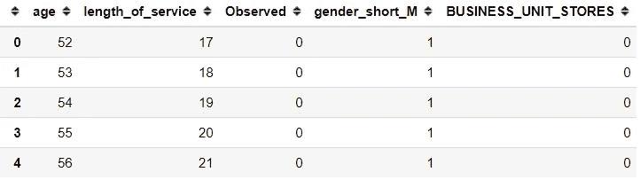

作者创建的图像

这是我们将用于考克斯模型的数据集。让我们看看这些变量是否在影响员工合同终止时间。

```
from lifelines import CoxPHFittercph = CoxPHFitter()
cph.fit(training, duration_col='length_of_service', event_col='Observed')
cph.print_summary()
```

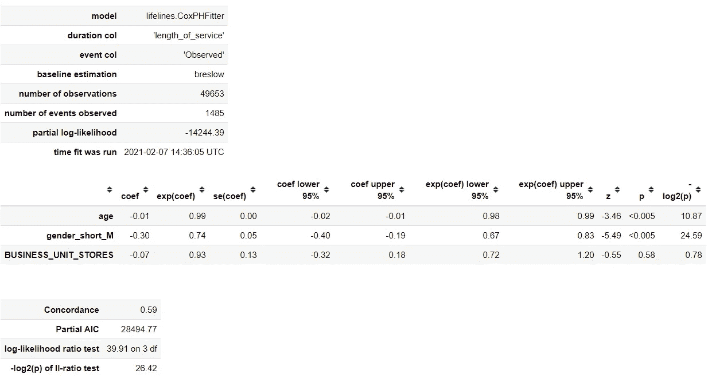

作者创造的形象

从上面的模型总结中，我们可以看到，BUSINESS_UNIT_STORES 是唯一不影响持续时间的变量，因为 P 值大于 0.05，而其他变量具有显著的结果。

为了解释，我们可以评估变量的系数。就拿年龄系数来说吧，是-0.01。这意味着，年龄每增加一个单位，基线风险函数就会降低一倍(-0.01)或 0.99。你可以这样解释，随着年龄的增长，合同终止的几率会降低 1%左右。

在拟合模型之后，我们可以使用这个模型来预测新数据的生存函数。

```
cph.predict_survival_function(training[['age', 'gender_short_M', 'BUSINESS_UNIT_STORES']].loc[0]).plot()
```

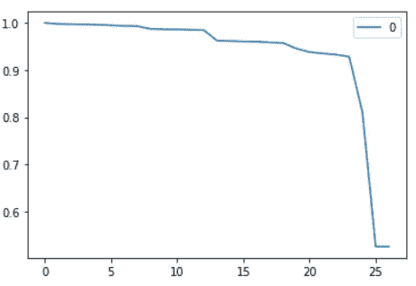

作者创建的图像

我们提供给模型的数据产生了以下生存函数，其中生存概率在第 25 个月显著下降(约 50%)。

为了更好地理解这个模型，我们可以绘制生存曲线，看起来就像我们改变了一个变量，而保持其他一切不变。这用于了解给定模型时变量的影响。

我们想了解年龄变量对我们模型的影响；我们可以使用下面的代码绘图。

```
cph.plot_partial_effects_on_outcome(covariates='age', values=[20,30, 40, 50], cmap='coolwarm', figsize = (8,8))
```

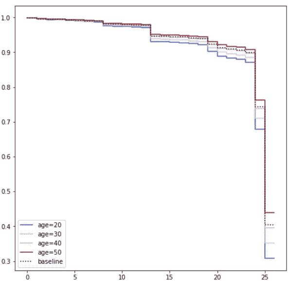

作者创建的图像

给定年龄，我们可以看到生存概率随着年龄的增长而增加。这意味着我们可以假设老年人比年轻人更不容易被终止合同。

# **结论**

生存分析是一种试图用一个问题来解决问题的分析，比如“某人什么时候会流失？”或者“保险的死亡索赔何时发生？”。

使用 Lifeline 包，我们可以更容易地进行生存分析，正如我们从合同终止数据中看到的那样。通过生存分析，我们发现，当员工工作时间达到 24 和 25 个月时，终止合同的可能性最高。此外，女性和年轻人终止合同的可能性更高。

# 如果您喜欢我的内容，并希望获得更多关于数据或数据科学家日常生活的深入知识，请考虑在此订阅我的[简讯。](https://cornellius.substack.com/welcome)

> 如果您没有订阅为中等会员，请考虑通过[我的介绍](https://cornelliusyudhawijaya.medium.com/membership)订阅。