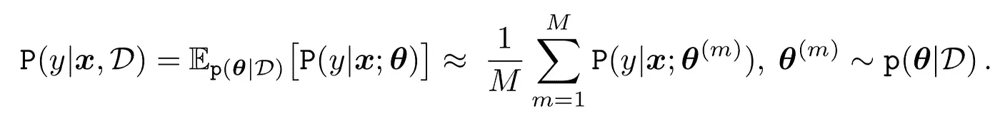
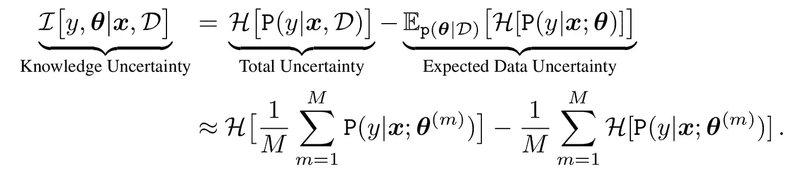
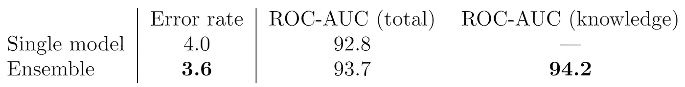

# 使用 CatBoost 分类器估计不确定性

> 原文：<https://towardsdatascience.com/estimating-uncertainty-with-catboost-classifiers-2d0b2229ad6?source=collection_archive---------27----------------------->

## *如何利用模型集检测未知的网络入侵*

数据不确定性示例(图片由 Yandex 提供)

这是我们关于梯度推进决策树模型(GBDT)中不确定性估计的教程的第二部分。[第一部分](/tutorial-uncertainty-estimation-with-catboost-255805ff217e)讨论回归问题中的不确定性估计。在这篇文章中，我们将展示如何解决分类问题，以及不确定性在实际任务中的应用。包含这篇文章中描述的实验的 GitHub 知识库可以在[这里](https://github.com/yandex-research/GBDT-uncertainty)找到。

## **为什么不确定？**

在机器学习的高风险应用中，重要的是检测系统何时不确定并且可能出错。这些应用包括医疗诊断、金融预测等等。数据通常以表格形式表示，具有不同性质和规模的特征。对于这样的数据，最好的结果通常是用 GBDT 模型实现的，例如 CatBoost。

回想一下，不确定性有两个主要来源:数据和知识。数据的不确定性是由于数据中的噪声(目标值的高方差或重叠类别)而产生的。当模型被给予远离训练数据的输入时，知识不确定性出现。由于模型对这个地区知之甚少，它可能会出错。因此，知识不确定性可用于检测异常实例。

## **KDD 入侵检测**

我们将通过一个实例演示如何使用 CatBoost 进行异常检测。为此，我们考虑 [KDD-99 入侵检测数据集](http://kdd.ics.uci.edu/databases/kddcup99/kddcup99.html)。任务是检测网络入侵，以保护计算机网络免受未经授权的用户。模型被训练为将网络活动分类为正常或几种入侵类型之一。至关重要的是，测试集包含了几种在训练集中没有观察到的攻击类型——这与真实的实际场景非常吻合。对于 ML 系统来说，能够检测异常行为是很重要的——用户行为会随着时间的推移而漂移，恶意黑客总是试图找到攻击系统的新方法。

因此，我们的目标是:

*   区分正常和恶意的网络活动
*   将恶意网络活动分为已知的攻击类型
*   检测以前未发现的攻击

## 数据集和预处理描述

对于这个实验，我们按照[3]中的描述对数据进行预处理。我们将原始测试数据分成两个子集:一个称为“域内测试”的子集包含训练数据中存在的攻击类型，另一个称为“域外测试”的子集仅包含未知的攻击类型。然后，任务是基于不确定性的度量来分类输入样本是属于域内还是域外测试集。我们在训练数据上训练 10 个 SGLB catboost 模型的集合。在 [*GitHub*](https://github.com/yandex-research/GBDT-uncertainty) 上有一个完全重新创建这个设置的脚本。

## 分类的不确定性估计

给定 SGLB 分类模型的集合，可以如下计算不确定性。每个模型产生已知类别的分布。我们可以通过将所有模型的预测分布平均在一起来组合所有模型，以获得*预测后验*:

*作者图片*

预测后验的*熵*是*总不确定性的集合。总不确定度*是上述*数据*和*知识不确定度*的总和(详见【1，2】)。我们可以通过考虑*集合多样性*的度量，例如互信息，将总不确定性分离成其组成部分，这产生了*知识不确定性*的估计:

*作者图片*

为什么*集合多样性*度量*知识不确定性*？我们假设模型集合将对熟悉的数据产生非常相似、几乎相同的预测，并且随着输入距离训练数据越来越远，将产生越来越多样化的预测。我们可以考虑多样性的其他度量方法，这些方法都会产生对知识不确定性的估计，但这超出了本文的范围。

## 结果

现在让我们看看我们在 KDD 入侵检测数据集上获得了什么。首先，我们在[多类](https://catboost.ai/docs/concepts/loss-functions-multiclassification.html)机制中训练单个 SGLB CatBoost 模型。预测网络活动类型的误差率为 4%。然后，我们评估我们检测异常(未知)攻击类型的能力。为此，我们用预测的熵来衡量不确定性。我们通过 ROC 曲线下的面积来评估质量[2]。获得的 ROC-AUC 为 92.8。

然后，我们通过使用 SGLB CatBoost 模型的集成来改进结果[1]。为此，我们训练了 10 个独立的 SGLB 模型(用不同的种子)。首先，我们观察到平均集合预测将错误率提高到 3.6%。然后，我们比较两种不确定性度量:*总不确定性，*作为预测后验熵(平均预测)度量，*知识不确定性，*作为互信息度量。正如预期的那样，使用达到 94.2 ROC-AUC 值的*知识不确定性*获得了最好的结果。

10 个 SGLB CatBoost 模型的 Ensembe 结果

## 带回家

这个小实验表明，我们可以使用梯度增强模型的集合来实现两个目标:

*   即使在不平衡的数据集中，也能提高分类精度
*   改进域外/异常输入检测

这证明了使用 GBDT 模型集合的好处。

[1] A. Malinin，L. Prokhorenkova 和 A. Ustimenko，[ICLR 2021 会议论文集](https://arxiv.org/pdf/2006.10562.pdf)中通过系综提高梯度的不确定性。

[2]一种马林宁。[深度学习中的不确定性估计及其在口语评估中的应用](https://www.repository.cam.ac.uk/bitstream/handle/1810/298857/PhD_Thesis-61.pdf?sequence=1)。博士论文，2019。

[3] Divekar 等人，[基于异常的网络入侵检测基准数据集:KDD 杯 99 备选方案](https://arxiv.org/pdf/1811.05372.pdf)ICCCS 2018 论文集。