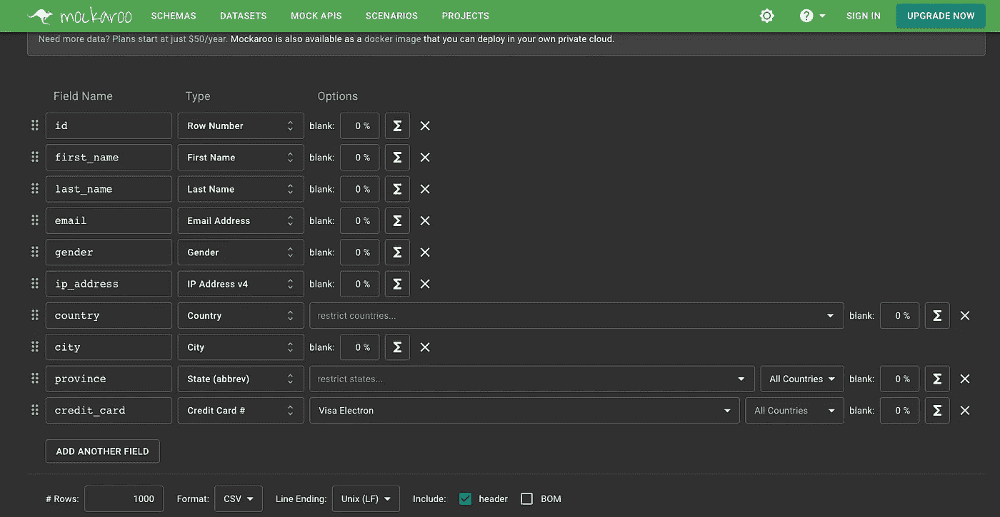
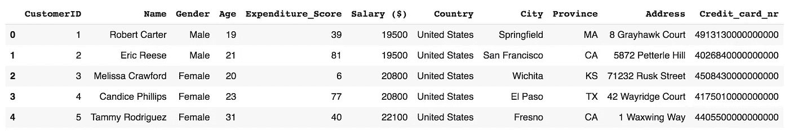
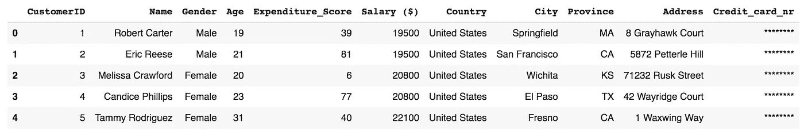
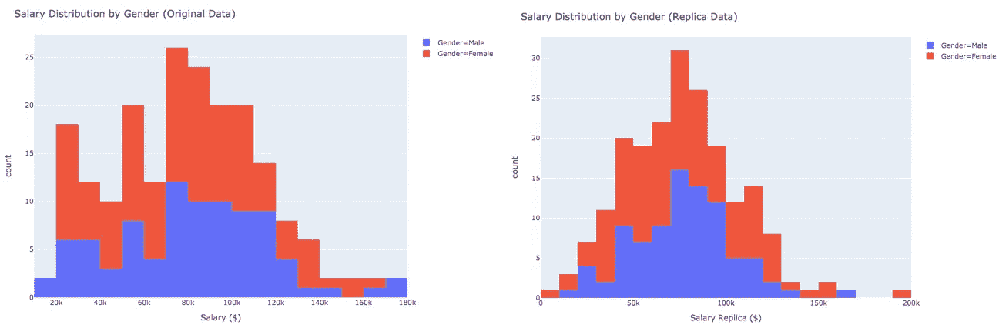
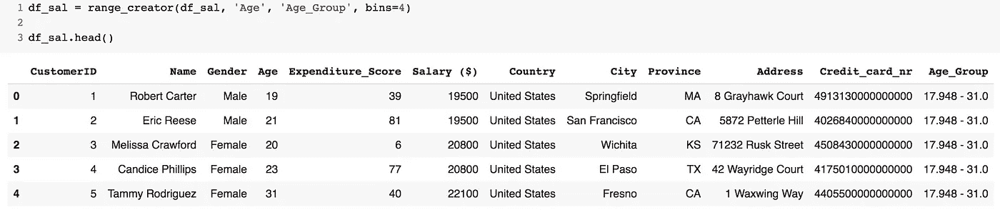

# 道德数据工作:技术数据保护的教训

> 原文：<https://towardsdatascience.com/ethical-data-work-lessons-on-technical-data-protection-e6ab2d0c6571?source=collection_archive---------32----------------------->

## 一个初学者友好的教程，探索伦理数据科学——阐明一个人如何在保护敏感、私人信息的同时处理数据。

利亚姆·塔克在 [Unsplash](https://unsplash.com/s/photos/security?utm_source=unsplash&utm_medium=referral&utm_content=creditCopyText) 上拍摄的照片

***来自《走向数据科学》编辑的提示:*** *虽然我们允许独立作者根据我们的* [*规则和指导方针*](/questions-96667b06af5) *发表文章，但我们无法验证每个作者的贡献。这篇文章的作者重申，他不是在提供法律建议。详见我们的* [*读者术语*](/readers-terms-b5d780a700a4) *。*

# 介绍

作为天生好奇的数据科学家，我们的工作就是疯狂处理数据。我们真的被它迷住了。日复一日，我们的任务是清理凌乱的桌子，建立因果关系模型，开发防弹预测。我们大多数人都满怀激情地这样做。

然而，无论我们的任务是什么，无论是复杂的还是平凡的，最终都与数据洞察力有关。事实上，我们所做的一切都是为了获取有价值的商业优势，在学术界，是为了推进科学前沿。因此，作为一群数据专业人员，我们有一个共同点:我们每个人都利用他们的技能来释放数据的全部潜力。

但是这种对价值释放的执着并不是在每种情况下都是有益的。如果没有任何限制，我们对洞察力的狂热追求会造成巨大的伤害。每一项缺乏平衡的努力都是如此。这就是为什么我正在写你刚才正在阅读的这篇文章，探索公司和学者在利用数据时必须面对的限制。实际上，隐私受到数据保护法规的保护，本质上是定义数据工作边界的法律约束。

# 数据保护:技术实施

公司需要遵守各种规则和法规，以避免违反数据保护。其中一些很容易导致巨额罚款和持久的声誉损害，尤其是在数据盗窃的情况下。

为了实现这一点，他们需要实现一些机制，让个人能够完全控制存储在他们身上的数据。除此之外，限制敏感信息的收集和保留也很重要。“这是怎么做到的？”你可能会想。以下段落给出了明确的答案。

# 技巧 1:简单抑制

每当我们希望匿名化一个数据集时，我们首先必须获得一些关于原始数据的统计特征的信息。因此，获得感兴趣的一列(或多列)的概率分布是必要的，这样我们就可以创建原始数据的匿名副本。

一个很好的实验资源是 mocker oo([https://www.mockaroo.com/](https://www.mockaroo.com/))，它允许软件开发者和数据科学家创建人工数据集。人们甚至不会注意到数据集不是真实的。然而，最重要的是，它们是完全可定制的。因此，如果您需要一些模拟数据来开始构建您的应用程序，或者只是尽可能地模仿真实数据，Mockeroo 是您的最佳选择。

Mockeroo 的摘要信息。作者照片。

使用 Mockeroo，我收集了一个虚构的数据集，包含姓名、年龄、性别、地址和信用卡信息。

表 1:人工数据集。作者照片。

如上图所示，我们有敏感的 PII，比如人名，以及他们的财务信息。然而，这还不是全部。包括国家、城市和州的非敏感 PII，如性别和地址信息也是可见的。这种碎片足以使怀有恶意的公司或个人造成伤害。因为他们可以创建与地理位置相关的用户资料来操纵选民意图，就像剑桥分析丑闻中所做的那样。让我们看看如何匿名化这个假设真实的数据集。

表 2:人工数据集。作者照片。

当然，模式可能会更复杂，并且实际上剥离的细节水平会有所不同。但是像这样简单的隐藏策略可能有助于遵守数据保护法。

现在让我们转向下一组技术。

# 技巧 2:用抽样代替数字

在我们希望匿名化数据集的任何情况下，我们都必须获得一些关于原始数据的统计属性的信息。获取感兴趣的列的概率分布是必要的，这样我们就可以创建具有相同统计属性的匿名版本。

下面的函数使用 Scipy 库从我们的原始数据中绘制一个偏斜的正态分布，以创建一个具有相同统计模式的副本。这确保了匿名性，同时也使我们在获取见解的过程中不会丢失数据。

参数 a 根据底层数据表现为右倾斜还是左倾斜而变化。当参数 a=0 时，我们处理的是好的旧的正态分布。下面我们可以看到左边是原始数据，右边是匿名的复制工资数据。您可以使用 alpha 来实现底层发行版的最佳副本。

图表 1:作者对比直方图照片。

# 技术 3:用 Faker 替换敏感数据

现在转向一个不可或缺的伦理数据科学工具，我们将探索名为 Faker 的伪数据生成 Python 库。根据文档，Faker 是一个 Python 库，可以为您生成假数据。从姓名、地址、信用卡详细信息到更复杂的数据，如地理数据，你会发现这个包非常有用，很可能把它添加到你的书签中。

你可能想知道它是如何工作的？在我的虚构数据集中，我用它来生成基于性别栏的真实姓名。

我发现有趣的是，我小说中的一些人有博士头衔，尽管如果这能以某种方式反映在薪水上，那就更棒了。无论如何，您可能希望使用 Faker 编写一些实用函数，用虚构数据替换敏感数据。

# 技术 4:汇总到箱中

数据的概括是通过应用聚合操作(如宁滨、舍入和更广泛的分类)来实现的，以便用不太精确的值替换非常精确的值。从本质上说，这就好像我们稍微模糊了一个人的脸，而我们仍然可以从广义上看到他们的特征。通过这样做，敏感数据和个人标识符被删除，而数据仍然对分析有用。

这里我们使用 Pandas cut 函数来将年龄分组到分类切片中。

表 3:宁滨之后的人工数据集。作者照片。

# 结论

直到不久前，科学家们还在不顾伦理考虑的情况下，将人类作为实验品。为了从数据中获得尽可能多的洞察力，现代数据科学家可能也会这样做。不是人体，而是私人的敏感信息。正因为如此，各国政府制定了 GDPR 和 2018 年数字个人数据法案等法律。因此，我们有责任采用上述技术以符合道德的方式处理个人数据。

这些技术对索马里等发展中国家的数据专业人员特别有价值。在这样的环境中运行，数据的所有权和生产仍然不清楚，巨大的挑战摆在他们面前。其中之一是缺乏有效的国家机构，这导致了一个基本上不受监管和限制的数据生态系统的出现。匿名化提供了技术解决方案。

在本文中，我们研究了一些有趣的技术，这些技术将帮助伦理数据科学家保护隐私，而不会丢失原始数据中一些具有统计学洞察力的宝石。这些技术只是少数。还有很多其他的。但这是另一个帖子的故事。

如果你能跟随我的[媒介](https://medium.com/@warsamewords)，我将不胜感激。如果你能在我的[博客](https://www.warsamewords.com/)上订阅时事通讯就更好了，我正在那里为未来的出版物建立读者群。我的推特账号是 **@warsame_words** ，我欢迎反馈和建设性的批评——对于后者来说， [LinkedIn](https://www.linkedin.com/in/mohamed-warsame-428136153/) 是一个受欢迎的渠道。谢谢你陪我走完这段旅程。

# 参考

</three-more-ways-to-make-fictional-data-3d99a699f709>  <https://datacated.medium.com/general-data-protection-regulation-gdpr-b7745c5a69ff>  <https://somalipublicagenda.org/who-owns-data-in-somalia/> 