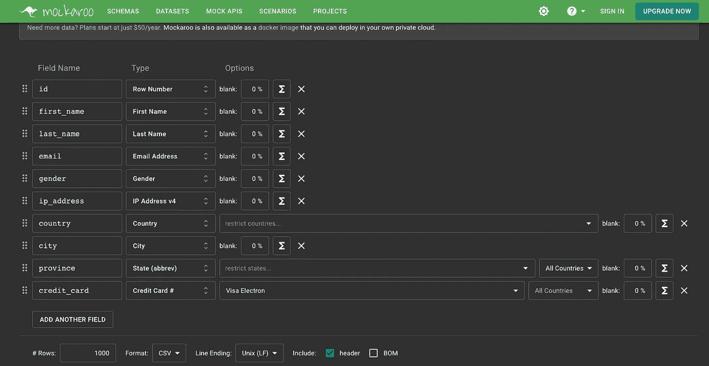

# 道德数据工作:技术数据保护的教训

> 原文：<https://towardsdatascience.com/ethical-data-work-lessons-on-technical-data-protection-e6ab2d0c6571?source=collection_archive---------32----------------------->

## 一个初学者友好的教程，探索伦理数据科学——阐明一个人如何在保护敏感、私人信息的同时处理数据。

利亚姆·塔克在 [Unsplash](https://unsplash.com/s/photos/security?utm_source=unsplash&utm_medium=referral&utm_content=creditCopyText) 上拍摄的照片

***来自《走向数据科学》编辑的提示:*** *虽然我们允许独立作者根据我们的* [*规则和指导方针*](/questions-96667b06af5) *发表文章，但我们无法验证每个作者的贡献。这篇文章的作者重申，他不是在提供法律建议。详见我们的* [*读者术语*](/readers-terms-b5d780a700a4) *。*

# 介绍

作为天生好奇的数据科学家，我们的工作就是疯狂处理数据。我们真的被它迷住了。日复一日，我们的任务是清理凌乱的桌子，建立因果关系模型，开发防弹预测。我们大多数人都满怀激情地这样做。

然而，无论我们的任务是什么，无论是复杂的还是平凡的，最终都与数据洞察力有关。事实上，我们所做的一切都是为了获取有价值的商业优势，在学术界，是为了推进科学前沿。因此，作为一群数据专业人员，我们有一个共同点:我们每个人都利用他们的技能来释放数据的全部潜力。

但是这种对价值释放的执着并不是在每种情况下都是有益的。如果没有任何限制，我们对洞察力的狂热追求会造成巨大的伤害。每一项缺乏平衡的努力都是如此。这就是为什么我正在写你刚才正在阅读的这篇文章，探索公司和学者在利用数据时必须面对的限制。实际上，隐私受到数据保护法规的保护，本质上是定义数据工作边界的法律约束。

# 数据保护:技术实施

公司需要遵守各种规则和法规，以避免违反数据保护。其中一些很容易导致巨额罚款和持久的声誉损害，尤其是在数据盗窃的情况下。

为了实现这一点，他们需要实现一些机制，让个人能够完全控制存储在他们身上的数据。除此之外，限制敏感信息的收集和保留也很重要。“这是怎么做到的？”你可能会想。以下段落给出了明确的答案。

# 技巧 1:简单抑制

每当我们希望匿名化一个数据集时，我们首先必须获得一些关于原始数据的统计特征的信息。因此，获得感兴趣的一列(或多列)的概率分布是必要的，这样我们就可以创建原始数据的匿名副本。

一个很好的实验资源是 mocker oo([https://www.mockaroo.com/](https://www.mockaroo.com/))，它允许软件开发者和数据科学家创建人工数据集。人们甚至不会注意到数据集不是真实的。然而，最重要的是，它们是完全可定制的。因此，如果您需要一些模拟数据来开始构建您的应用程序，或者只是尽可能地模仿真实数据，Mockeroo 是您的最佳选择。

Mockeroo 的摘要信息。作者照片。

使用 Mockeroo，我收集了一个虚构的数据集，包含姓名、年龄、性别、地址和信用卡信息。

表 1:人工数据集。作者照片。

如上图所示，我们有敏感的 PII，比如人名，以及他们的财务信息。然而，这还不是全部。包括国家、城市和州的非敏感 PII，如性别和地址信息也是可见的。这种碎片足以使怀有恶意的公司或个人造成伤害。因为他们可以创建与地理位置相关的用户资料来操纵选民意图，就像剑桥分析丑闻中所做的那样。让我们看看如何匿名化这个假设真实的数据集。

表 2:人工数据集。作者照片。

当然，模式可能会更复杂，并且实际上剥离的细节水平会有所不同。但是像这样简单的隐藏策略可能有助于遵守数据保护法。

现在让我们转向下一组技术。

# 技巧 2:用抽样代替数字

在我们希望匿名化数据集的任何情况下，我们都必须获得一些关于原始数据的统计属性的信息。获取感兴趣的列的概率分布是必要的，这样我们就可以创建具有相同统计属性的匿名版本。

下面的函数使用 Scipy 库从我们的原始数据中绘制一个偏斜的正态分布，以创建一个具有相同统计模式的副本。这确保了匿名性，同时也使我们在获取见解的过程中不会丢失数据。

参数 a 根据底层数据表现为右倾斜还是左倾斜而变化。当参数 a=0 时，我们处理的是好的旧的正态分布。下面我们可以看到左边是原始数据，右边是匿名的复制工资数据。您可以使用 alpha 来实现底层发行版的最佳副本。

图表 1:作者对比直方图照片。

# 技术 3:用 Faker 替换敏感数据

现在转向一个不可或缺的伦理数据科学工具，我们将探索名为 Faker 的伪数据生成 Python 库。根据文档，Faker 是一个 Python 库，可以为您生成假数据。从姓名、地址、信用卡详细信息到更复杂的数据，如地理数据，你会发现这个包非常有用，很可能把它添加到你的书签中。

你可能想知道它是如何工作的？在我的虚构数据集中，我用它来生成基于性别栏的真实姓名。

我发现有趣的是，我小说中的一些人有博士头衔，尽管如果这能以某种方式反映在薪水上，那就更棒了。无论如何，您可能希望使用 Faker 编写一些实用函数，用虚构数据替换敏感数据。

# 技术 4:汇总到箱中

数据的概括是通过应用聚合操作(如宁滨、舍入和更广泛的分类)来实现的，以便用不太精确的值替换非常精确的值。从本质上说，这就好像我们稍微模糊了一个人的脸，而我们仍然可以从广义上看到他们的特征。通过这样做，敏感数据和个人标识符被删除，而数据仍然对分析有用。

这里我们使用 Pandas cut 函数来将年龄分组到分类切片中。

表 3:宁滨之后的人工数据集。作者照片。

# 结论

直到不久前，科学家们还在不顾伦理考虑的情况下，将人类作为实验品。为了从数据中获得尽可能多的洞察力，现代数据科学家可能也会这样做。不是人体，而是私人的敏感信息。正因为如此，各国政府制定了 GDPR 和 2018 年数字个人数据法案等法律。因此，我们有责任采用上述技术以符合道德的方式处理个人数据。

这些技术对索马里等发展中国家的数据专业人员特别有价值。在这样的环境中运行，数据的所有权和生产仍然不清楚，巨大的挑战摆在他们面前。其中之一是缺乏有效的国家机构，这导致了一个基本上不受监管和限制的数据生态系统的出现。匿名化提供了技术解决方案。

在本文中，我们研究了一些有趣的技术，这些技术将帮助伦理数据科学家保护隐私，而不会丢失原始数据中一些具有统计学洞察力的宝石。这些技术只是少数。还有很多其他的。但这是另一个帖子的故事。

如果你能跟随我的[媒介](https://medium.com/@warsamewords)，我将不胜感激。如果你能在我的[博客](https://www.warsamewords.com/)上订阅时事通讯就更好了，我正在那里为未来的出版物建立读者群。我的推特账号是 **@warsame_words** ，我欢迎反馈和建设性的批评——对于后者来说， [LinkedIn](https://www.linkedin.com/in/mohamed-warsame-428136153/) 是一个受欢迎的渠道。谢谢你陪我走完这段旅程。

# 参考

 [## 制造虚构数据的另外三种方法

### 一个制造虚构数据的库存工具

towardsdatascience.com](/three-more-ways-to-make-fictional-data-3d99a699f709)  [## 通用数据保护条例(GDPR)

### 《通用数据保护条例》( GDPR)将于下月 2018 年 5 月 25 日生效，旨在统一…

datacated.medium.com](https://datacated.medium.com/general-data-protection-regulation-gdpr-b7745c5a69ff)  [## 谁拥有索马里的数据？结束该国私有化的知识经济-索马里公共议程

### 这份简报提出了关于索马里境内援助相关知识的生产和所有权的重要问题…

somalipublicagenda.org](https://somalipublicagenda.org/who-owns-data-in-somalia/)