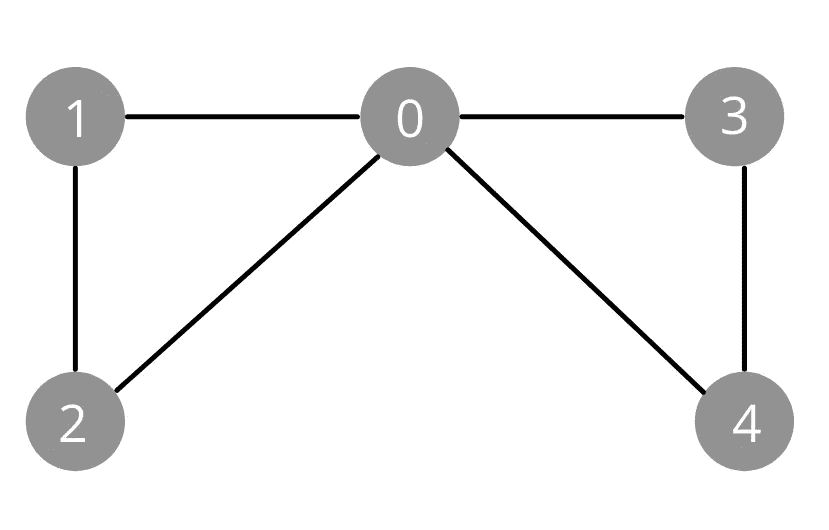
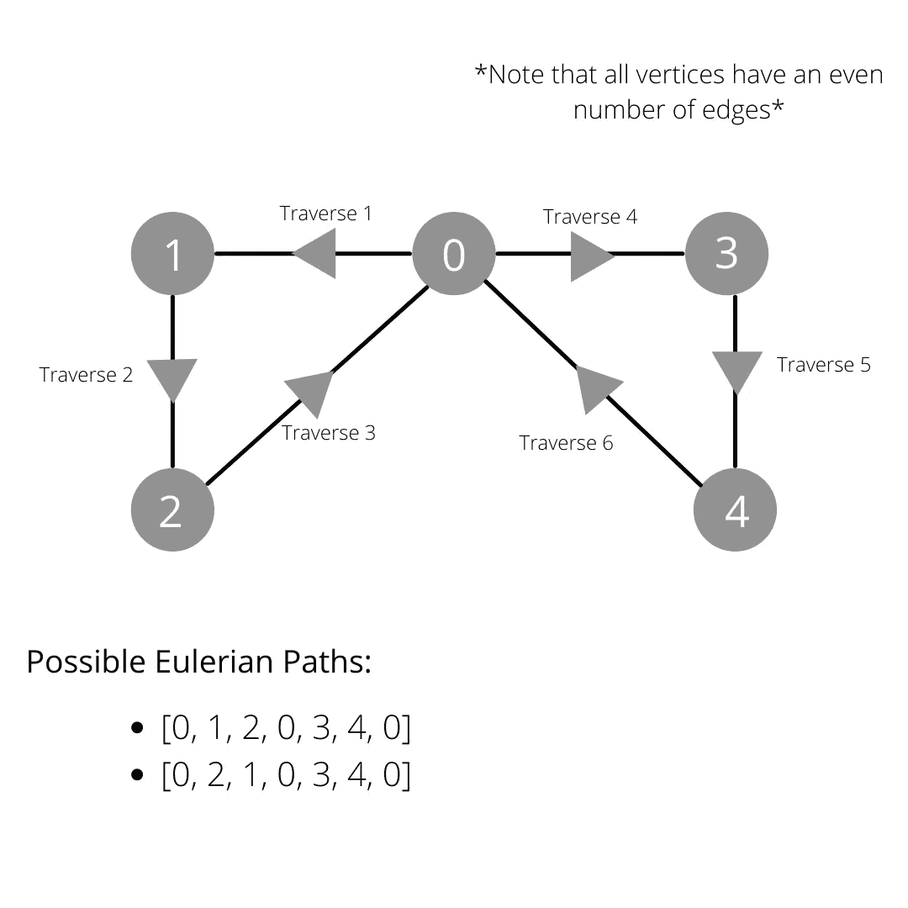
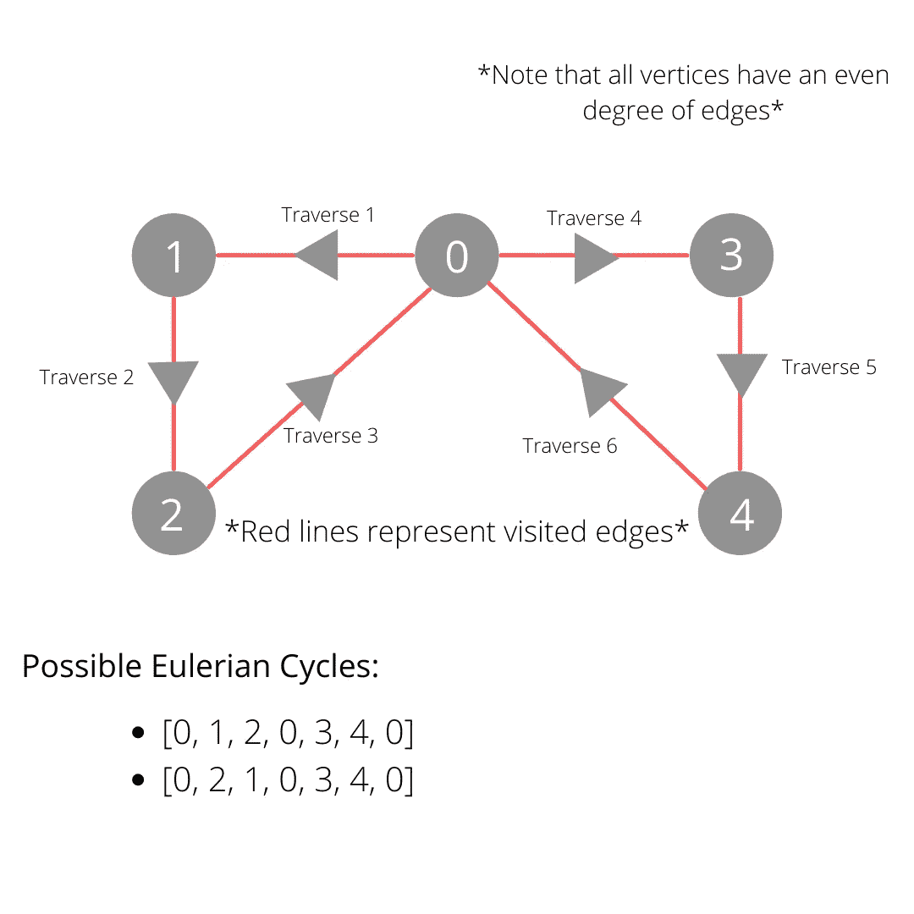

# 欧拉周期:为什么它们如此独特，它们对 21 世纪的我们有意义吗？

> 原文：<https://towardsdatascience.com/eulerian-cycles-why-are-they-so-unique-and-are-they-any-significant-to-us-in-the-21st-century-3ca489af585c?source=collection_archive---------15----------------------->

## 欧拉圈和路是图论中最有影响力的概念之一。然而，什么是真正的欧拉周期和路径，18 世纪的路径对未来的 21 世纪有什么意义？

欧拉圈和路是迄今为止在数学和创新技术领域最有影响力的图论概念之一。欧拉在 1736 年首次发现了这些回路和路径，因此命名为“欧拉回路”和“欧拉路径”谈到图论，理解图形和创建图形比看起来稍微复杂一些。有许多变量需要考虑，使它们看起来更像一个难题，而不是一个实际问题。然而，当我们谈论欧拉周期和路径时，相对容易理解发生了什么。

欧拉周期示例|作者图片

欧拉路径是图中每条边只被访问一次的路径。欧拉路径可以有任何起点和任何终点；但是，最常见的欧拉路径会返回到起始顶点。如果一个图本身满足两个条件:所有具有非零度边的顶点都是连通的，并且如果零个或两个顶点具有奇数度并且所有其他顶点具有偶数度，那么我们可以很容易地检测出该图中的欧拉路径。请注意，在无向图中不可能只有一个奇数度的顶点(欧拉路径在无向图中很常见)，因为无向图中所有度的总和总是偶数。但是你可能会问，“我们怎么知道一个顶点的度数是奇数还是偶数？”。对于那些不了解图的度数的人来说，求顶点的度数不同于求典型角度的度数。如果一个顶点的边的总数是奇数，则称该顶点的度数为奇数。但是，如果一个顶点的边的总数是偶数，则称该顶点的度数为偶数。这个奇偶顶点条件允许我们理解一个给定的图是否是欧拉的。

要知道一个图是否是欧拉的，或者换句话说，要知道一个图是否有欧拉圈，我们必须知道图的顶点必须位于每条边被访问一次的地方，并且最后一条边又回到起始顶点。欧拉循环本质上只是欧拉路径的扩展定义。如果它看起来令人困惑，那么想象一下，“有没有可能不用举起铅笔或钢笔(一笔)就能画出图形？”。欧拉周期通常并不常见，这是因为它的一个顶点条件。还记得一个顶点的偶数度和奇数度吗？是的，对于一个欧拉图形来说，所有的顶点都必须是偶数，因为没有一个“特定的”顶点代表图形的中间。此外，每个顶点有偶数个边允许我们遍历图形并返回到开始的顶点，不管我们选择哪个顶点作为开始点，这是我们定义的主要目标。

如果你没有得到，不要担心；让我们来看一个小的视觉效果，看看我们如何用一个改进的深度优先遍历算法遍历并找到一个欧拉路径和一个欧拉环。我们将使用深度优先遍历来遍历与上图中相同的图，因为我们希望按深度而不是横向遍历路径，因为这样效率会很低。

在欧拉路径中，每当我们访问一个顶点时，我们会通过两条未访问的边和一个端点。根据定义，欧拉路径中的所有中间顶点都必须是偶数度。然而，我们没有假设所有的中间顶点都有偶数条边，而是假设绝对中间顶点是边最多的顶点。此外，以防万一，如果两个顶点有相同数量的顶点，这是图中最大的，我们可以选择任何一个，因为它不会影响遍历。具有最多边的顶点意味着该顶点是大多数顶点的中间，创建了到图中大多数顶点的路径。因此，我们已经知道，具有最大边数的顶点必须在不同的边上至少经过不止一次才能遍历整个图。

使用深度优先遍历算法，我们从每个顶点开始按深度遍历每条路径。记住，每个顶点只能访问一次；然而，具有最多边的顶点可以被访问多次，以允许图形的完整遍历，因为一些顶点可能不通向对面图形上的其他顶点。该算法将查看顶点(或当前顶点的邻居)是否没有被访问过，并将其添加到路径中。否则，通过使用回溯(跟踪前一个顶点及其边)，该算法确保如果当前顶点与最大顶点相同，我们可以将其添加到路径中；否则，如果当前顶点已经被访问过，我们可以离开顶点并继续遍历它的边。这个过程对图中的每个顶点及其邻居重复进行，以创建每个可能的欧拉路径。当然，这个算法有一个误差范围；在寻找欧拉路径时，该算法可以行进到其他顶点，这些顶点可能不是当前顶点的邻居的一部分。为此，最后，我们让算法评估每条路径，并检查最大顶点是否是路径的根顶点，因为最大顶点具有到多个顶点的边。如果是这样，我们可以得出结论，该路径是欧拉路径。

欧拉路径|作者图片

对于欧拉循环，记住任何顶点都可以是中间顶点。因此，根据定义，所有的顶点都必须是偶数度。但是请记住，欧拉回路只是欧拉路径的扩展定义:最后一个顶点必须通向一条未访问的边，这条边又通向起始顶点。由于深度优先遍历的自然行为，最后一个顶点将总是具有未访问的边，直到顶点本身被遍历。我们知道这一点，因为 DFS 算法跟踪已经访问过的顶点。如果最后一个顶点是图中唯一没有被遍历的顶点，那么应该假设它的边是图中唯一没有被访问的边。然而，如果还有多条边，这意味着要么该图不是欧拉图(最后一个顶点有奇数条边)，要么有另一个未访问的顶点。因此总结一下，只有一条边通向起始顶点。通过按深度逐个遍历每条边，并获得我们的欧拉路径(因为具有欧拉路径的图被认为是*半欧拉的)*，我们可以比较欧拉路径的最后一个顶点是否具有通向我们开始的顶点的边。如果是这样，这个图就被认为是欧拉图。但是你可能会问，“如果图中没有欧拉路径呢？”。好问题！图中总是有欧拉路径。这一切都是为了以这样一种方式重新排列图形，其中可以创建一条路径，每条边只交叉一次。你可以把它看作是解决一个难题！

欧拉周期|作者图片

这里是我的欧拉周期和路径模拟的链接:[https://github.com/GEEGABYTE1/Eulerian](https://github.com/GEEGABYTE1/Eulerian)

但是为什么欧拉循环和路径如此重要呢？到底遍历每条边一次并在我们开始的地方结束有什么意义呢？欧拉回路和路径有许多实际应用。在数学中，图可以用来解决许多复杂的问题，如哥尼斯堡桥问题。此外，邮递员可以使用欧拉路径来获得一条路线，这样他们就不必原路返回。在更广的范围内，欧拉循环和路径对画家、垃圾收集、飞机驾驶员、GPS 开发者(例如，谷歌地图开发者)、分发广告的营销人员是有用的；本质上任何使用路径的人或事物。

让我们来看看一个流行的图问题，叫做*旅行推销员，*，作为例子，看看欧拉路径和循环对推销员和女推销员是如何重要的。问题是你有一个城市图，这些城市之间有一定的距离(边权重)。目标是找到一条最短的路径，让您可以游览每个城市一次，然后到达您开始旅行的城市。

为了解决这个问题，并让您了解欧拉路径和循环如何在实际应用中发挥作用，我开发了一个贪婪算法，它可以输出访问所有城市的最具成本效益的路径。

假设销售人员必须前往城市`[a,b,c,d]`，以一定的成本行进一条路径(例如，从点`a`行进到点`d`的成本值为 5)，该算法评估城市(当前顶点)的每个邻居的权重。我们首先将所有地点设置为`unvisited`，因为我们实际上还没有遍历它们。现在，我们随机得到一个当前顶点(我们的起点),因为我们希望我们的算法计算每一个可能的情况和路径，在这种情况下，将是 *4！*(因为我们有 4 个输入)。为了比较边和它们的权重，我们得到权重最小的边(假设它是最便宜的)，在将它添加到最终路径后，我们将它设置为当前顶点，最终将返回该路径。就像跟踪边和顶点以查看一个图是否有欧拉路径或循环一样，该算法通过不断更新跟踪未访问和已访问顶点的字典，来跟踪每次当前顶点更新(转到下一个城市)时所有已访问的顶点。我们这样做是因为我们不希望销售人员回到他们已经走过的路径，就像我们不希望我们的遍历算法在寻找欧拉路径时遍历已经遍历过的边一样。

看看我对旅行推销员问题的完整解决方案:[https://github.com/GEEGABYTE1/TravelingSalesMan](https://github.com/GEEGABYTE1/TravelingSalesMan)

假设我总结了前两段关于欧拉循环和路径的重要性。在这种情况下，它们是必不可少的，因为它们是最佳寻路或一般寻路的基础。这些年来，随着新算法的引入，寻路技术得到了巨大的发展，但是它们到底有什么重要的呢？信不信由你，我们所知道的大多数算法都是寻路算法。使用寻路概念和欧拉路径的最受欢迎的算法之一是谷歌地图及其高效的寻路算法，优步的司机和旅行者寻路算法(当我们订购优步并查看司机的位置时，这是他们的寻路算法在工作！)，特斯拉的功能，他们的汽车可以自动驾驶到主人那里，通过互联网路由数据包，等等！你在我刚刚列出的这些算法中发现什么共同点了吗？这些算法减少了为到达期望位置而走不必要的路径和距离的额外工作。通过欧拉路径和循环，这些寻路算法将行进效率引入了一个全新的水平(记住，寻路算法和欧拉路径共享相同的基本行为)。随着技术和算法的不断发展，它们将继续以更快的速度发展。再回头看看旅行推销员问题。欧拉路径通过减少旅行所需的能量和销售人员潜在的总成本，允许销售人员更有效地旅行，而不是让销售人员以随机成本沿着随机路径旅行到每个房子，直到他们完成任务。

欧拉循环和路径在许多领域都是有用的。数学和寻路恰好是我们今天拥有的众多突出和相关的例子之一。这些循环和路径是给我们的日常生活带来突破的许多小型数学模型之一。因此，想象一下其他数学表达式、模型和悖论在我们的生活中创造了许多我们甚至没有注意到的突破！不过不要担心；作为一个对数学和计算机科学充满热情的人，我将继续撰写著名数学家的各种数学概念和当今不断发展的创新技术如何相互关联，共同帮助我们更“高效”地生活！