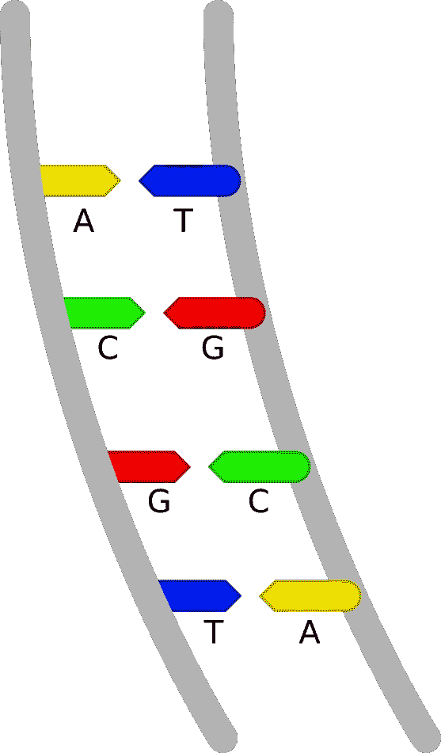

# 欧拉路径和 DNA 测序

> 原文：<https://towardsdatascience.com/eulerian-paths-and-dna-sequencing-2b85d5aada8b?source=collection_archive---------25----------------------->

## 像柯尼斯堡桥这样的小玩意是如何帮助现代科学家对 DNA 进行排序的

柯尼斯堡大教堂，右边的这座桥是欧拉时代幸存的两座桥之一。|图片由 Gumerov Ildar 提供

DNA 测序是现代研究的重要组成部分。它使许多不同的领域得以发展，包括遗传学、元遗传学和系统发育学。如果没有测序和将 DNA 组装成基因组的能力，现代世界对疾病、其进化和适应，甚至我们的历史/系统发育的理解将会更加松散。

> 在讨论欧拉优化晨跑如何帮助我们在这一领域取得长足进步之前，有必要为排序和优化问题奠定一些基础。

在这个故事中，我将使用 DNA 这个词来描述作为测序目标的遗传密码和基因，但请记住，类似的过程也适用于 RNA 等其他东西的测序。这种对测序如何工作的描述并不意味着生物信息学家或生物学家每天都在做这个工作。此描述是为我的数据科学家同事准备的，他们希望了解这个过程及其问题，因此，这将是一个非常高层次的概述。如果你是一名生物学家/生物信息学家，你可能仍然有兴趣阅读这篇文章，以获得数据科学家的观点，但它可能值得跳过下一部分。

DNA 测序包括提取和读取样本中的 DNA 链。我是说，这听起来很简单？但是，如何着手执行这项任务呢？以下是 Illumina 测序仪工作原理的高级概述。

DNA 碱基——作者图片

DNA 是一串双链的核酸碱基。这些基地被称为 ACGT，因为他们的名字以这些字母开头。在 RNA 的情况下，T 是尿嘧啶，用字母 u 表示。这些碱基中的每一个只与另一个碱基结合，A 与 T 结合，G 与 c 结合。这两个碱基的结合称为碱基对。我们称之为“DNA”的这些碱基对的长螺旋串，因此，测序的目标是读取这些碱基是什么。因为它们只和另外一对结合，我们不需要阅读两条 DNA 来排序；我们只需要读取一条链，因为另一条链是确定的。

测序的第一步是提取 DNA(这部分使用化学/物理过程完成)，并使用超声波将 DNA 断裂成更小的片段。这些较小的片段然后被切割成单链，并在它们的头部和尾部附着小蛋白质。这些头和尾是特别设计的蛋白质，它们与载玻片上相似的匹配蛋白质结合。

然后是一个复制过程，其中特定的酶/蛋白质将匹配的碱基对重新构建到每条单链上，再次形成双链。然后这些双链被分裂成单链，这一过程重复几次，每次增加单链的数量。

在这一点上，我们准备开始测序实际的 DNA！DNA 链的物理解读是由独特的碱基促成的，这些碱基的化学结构中添加了荧光化合物。这些一次添加一个到上一步的簇中，以结合 DNA 链上的下一个可用碱基。使用激光来激发荧光成分，并且对于来自簇的该碱基，存在给定波长的可检测的闪光。重复这一过程，直到所有碱基配对。至此，DNA 的读取完成。

测序仪可以使用这些闪光和发射光的强度/波长来了解读数的质量，因为 DNA 链中的任何不一致都会导致不同颜色的闪光。理想情况下，在这一点上，我们希望看到单一波长的强烈发射，以显示簇中的所有链都与同一对结合，这样我们就可以确定这个读数是准确的。

这一过程使用一种独特的载玻片，称为细胞分析仪和测序机内的检测器。本文中的细胞分析仪可以看作是一个具有网格布局的载玻片。检测器可以被认为是一种特殊类型的数码相机。网格布局对应于检测器的像素，这导致每个 DNA 聚类被测序，从检测器的图像中提取其自己的像素集。处理这些图像以提取序列中的每个碱基对以及该碱基对的质量。

在这一点上，我们有大量的数据以较小的单次读取的形式存在。这些读数是 DNA 链的小段；它们必须被重新组装成更大的块，称为重叠群(contigs，contiguous 的缩写)；然后重叠群被组装回靶基因。

> 那么，我们如何将这些阅读组合成更广泛的序列呢？

序列读取-按作者排列的图像

这是一个足够简单的概念。我们只是将短的阅读重叠，寻找重叠，当它们重叠足够长时，我们假设它们是 DNA 的连续长度。假设有足够多的读取并且这些读取具有足够高的质量，这个过程重复进行；最终，这一过程会正确地重建出相关的基因组。这种暴力方式甚至需要数周时间来组装一个简单的基因组。一定有更好的办法。

将这些短阅读放在一起成为一个目标序列并不像听起来那么困难！多年来，这一领域取得了一些重要进展。解决这一问题的第一个重大进展是将阅读构建成连续序列视为旅行推销员问题。为了实现这一点，从单个读数构建一个图。这些将每个读取表示为一个节点，每个边表示连接的节点(读取)之间的重叠。然后，我们所要解决的就是遍历给定的图，恰好访问所有节点一次！这个恰好访问所有节点一次的过程在形式上被称为哈密尔顿步行。有许多方法可以解决哈密尔顿步行，并且许多方法实现起来很有趣。

> 我将借此机会在此快速切入正题，谈谈哈密顿行走问题的一个独特实例。它被称为旅行推销员问题。

考虑一个图网络，其中节点代表城市，城市之间的边代表距离。这个想法是每个城市只去一次，走最少的距离。我最喜欢的解决旅行推销员问题的方法。遗传算法是解决哈密尔顿步行的一个有趣的选择！遗传算法是一类机器学习模型，它模拟问题的一组可能的解决方案，并通过多代“繁殖”和“变异”来优化它们。我在下面链接的 Kaggle 上的笔记本来自一个旧的比赛，参与者被要求优化圣诞老人分发礼物的路线。这个问题本质上可以归结为一个主题恰当的年度旅行推销员问题。为了总结本笔记中的代码，构建了一组解决方案。这是随机选择的有序节点列表，没有替换。每个节点之间的距离通过遍历该列表来求和，以产生该个体的最终健康分数。然后，最好的个体被复制到下一代，连同他们解决方案的变异版本。一些被访问的单个节点被交换以产生一个新的被访问节点列表。通过这种对下一代的选择性提升和变异，算法最终收敛于一个解。

<https://www.kaggle.com/schlerp/genetic-reindeer-ftw>  

回到本文的中心主题，不幸的事实是，所有求解方法都是计算密集型的。例如，强力方法需要评估更差的 N！可能的哈密尔顿路径，其中 N 代表图网络中的节点数。您可以看到，随着图中节点数量的增加，这种情况会很快失控。

有没有更好的方法来重建这个图，给我们一个更简单的问题来解决？是啊！有一种重新构建这个问题的方法，可以用一个经过验证且成本低得多的解决方案来解决这个问题。如果我们把重叠部分表示为节点，把读数表示为边，会怎么样？图形网络的这种漂亮而简单的重新排列给了我们一个新的问题要解决。我们现在希望每个边只访问一次，而不是每个节点只访问一次。将短的 DNA 序列排列成更长的连续片段的任务现在不是表示为求解一个哈密尔顿步行而是表示为求解一个欧拉路径！

<https://en.wikipedia.org/wiki/Seven_Bridges_of_K%C3%B6nigsberg>  

欧拉在 1736 年经典地定义了欧拉路径，因为他们证明了柯尼斯堡问题的七桥是不可解的。这个问题被表述为:是否有可能从任何地方出发走完柯尼斯堡的所有七座桥？欧拉努力解决这个问题，尽管他尽了最大努力，他还是找不到解决方案，最终认为这是不可能的。然而，作为严谨的数学家，仅仅宣布一个问题不可解是不够的！欧拉设计了一个数学证明，用图形网络来表示这种情况。这个证明本质上可以归结为以下陈述(当谈到无向图时):

> 欧拉路径只有在图是欧拉的情况下才是可解的，这意味着它有零个或两个奇数边的节点。

直观上，上面的说法可以认为是如下。如果您通过一条边进入一个节点，然后通过另一条边离开，则所有节点都需要偶数条边。沿着这条思路延伸，有两种特殊情况，一个节点可以有奇数条边，一个是开始行走的节点，一个是结束行走的节点！

欧拉路径可以使用 Hierholzer 算法在线性时间内求解！这是对哈密尔顿步行的巨大改进，并且算法的实现更简单！因为这篇文章已经很长了，所以我就不赘述 Hierholzer 算法的各个步骤了。然而，我想把它作为一个小游戏留给用户！

你能不用查就能算出这个算法可能是什么吗(我在下面提供了一个算法描述的链接)？当我了解到这个算法是一个在迷宫中寻找路径的特殊解决方案时，我做了类似的比较。

> 提示:假设给定的迷宫有一个解决方案，将你的手放在左边(或右边)的墙上，继续走，最终你会找到迷宫的解决方案。

<https://en.wikipedia.org/wiki/Eulerian_path#Hierholzer.27s_algorithm>  

我从中获得了很多乐趣，我希望这篇文章能够激发您的兴趣，让您更深入地了解数据科学这个迷人的领域！请在评论中告诉我关于图网络的其他令人兴奋的应用！