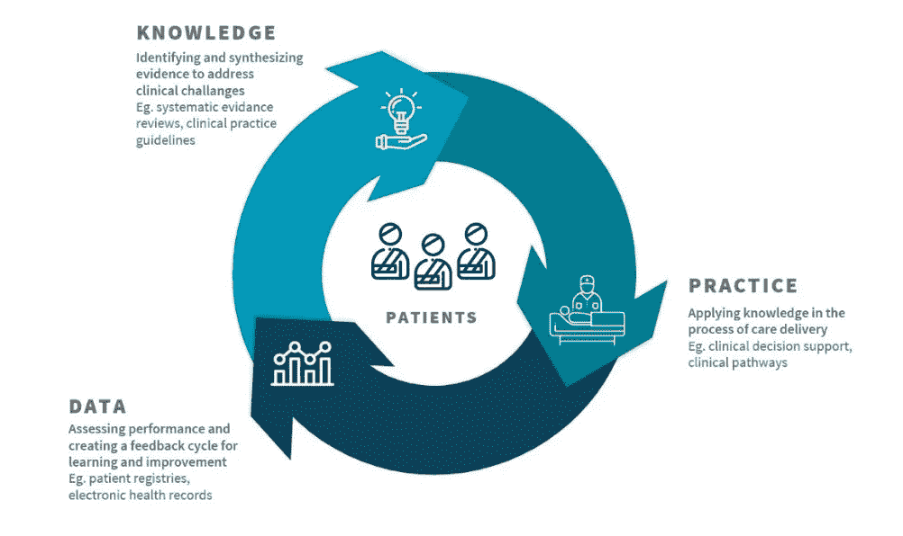

# 欧洲严格的隐私法是不道德的:GDPR 如何损害医疗质量

> 原文：<https://towardsdatascience.com/europes-stringent-privacy-laws-are-unethical-how-gdpr-compromises-quality-of-care-46fba357c04?source=collection_archive---------41----------------------->

## 意见

## 要求改革的呼声。

人们意识到，在过去十年的数据革命中，欧洲已经坐失良机，这种意识已经一路蔓延到位于布鲁塞尔的欧洲总部。为了控制损害，欧洲委员会去年发布了一份白皮书[1]，强调了人工智能(AI)的重要性。他们在信中写道，欧洲打算:

> [..]成为数据经济及其应用创新的全球领导者[..].

熟悉欧洲通用数据保护条例[2]或简称 GDPR 的读者可能会对采用人工智能的计划的规模(数十亿欧元)和广度(从医疗保健到旅游)感到惊讶。例如,《GDPR》第 12 条规定，应处理个人信息

> [..]以简明、透明、可理解和容易理解的形式，使用清晰易懂的语言[..].

有人可能会说，人工智能固有的数学本质，以及它的数字表示(包括*事后*可解释性)，回避了用“简单语言”进行描述。由此看来，GDPR 禁止任何形式的消化私人信息的人工智能。此外，GDPR 要求明确同意"自动特征分析和个人决策"(第 22 条)和数据共享。

医疗保健似乎处于欧洲关于人工智能截然不同的政策(吸收还是禁止)之间这一紧张领域的中心。去年，医学界在人工智能方面取得了令人印象深刻的进步，特别是在成像领域，深度学习模型通常优于认证的医生。例如 CT 扫描中的肺癌检测[3]，病理切片中的恶性细胞检测[4]，以及使用胸部 X 射线的新冠肺炎诊断[5]，等等。重要的是，这些例子都依赖于向公众发布新的数据集。这一点至关重要:医学进步，尤其是人工智能的进步，取决于数据的可用性。

随着电子健康记录(几乎)在医疗领域的全面渗透，以及每年国民生产总值的 10%用于医疗保健，世界似乎就在我们的脚下。但现实是，在欧洲，隐私法禁止在没有事先(知情)同意的情况下共享医疗数据——即使是为了研究目的。问题是大多数医学研究关注的是生物特征数据——如血液、医学扫描、医生笔记或组织——这些数据不能匿名。想想法医学的显著成功:即使是最轻微的一滴生物物质，至少在原则上，也可以追溯到个人。这同样适用于医学成像等其他形式。因此，医疗保健数据仍然在筒仓中，通过嗡嗡作响的风扇和嗡嗡作响的磁盘的永久噪音实现，深深地位于医院的“安全”范围内，安全地远离科学家和创新者。

## 戈德温定律

那么，我们如何理解欧洲支持隐私的情绪呢？虽然已经过了几代人，但我认为它的回声可以追溯到第二次世界大战。例如，在荷兰，德国人在控制了这个国家后，突击检查了人口普查记录。这些档案表明哪些公民是犹太人后裔，然后被用来追捕犹太人[7]。据信，这一事实是第二次世界大战期间荷兰大量犹太人被杀的部分原因[7]。二战结束后，欧盟作为对民族主义的回应而成立，其目标是防止战争暴行重演。

## 不公正的分歧

欧洲支离破碎的医疗数据格局及其严格的隐私法带来的后果非常严重。最明显的是，中国和美国与欧洲之间在人工智能领域已经迫在眉睫的巨大技术差距将继续扩大。与此同时，欧洲婴儿潮时期出生的人口意味着公民年龄越来越大，需要更多的照顾，而劳动力却在减少。鉴于这些人口统计数据，通过人工智能实现医疗自动化将是确保欧洲人获得应得医疗的关键组成部分。

无论欧洲是否会参与其开发，人工智能的进步仍将进入临床。到目前为止，美国食品和药物管理局(FDA)已经批准了 130 多个人工智能申请[9]。这些产品将很快进入欧洲医生的手中。然而，对于购买中国或美国技术的欧洲人来说，最紧迫的风险将是，训练数据中的任何人口偏差都将在人工智能中表现出来。

知情同意——患者在法律文件上签字同意参加医学研究——是患者参与的一个众所周知的障碍。因此，文化水平较低的人群在医学试验中往往代表性不足。然而，社会经济和地理因素通常对健康和疾病有很大的决定性。因此，知情同意可以通过有偏见的证据导致护理不足，从而加剧社会经济和地理差异。类似地，如果欧洲无法汇编代表其人口的数据集，我们就有可能依赖于具有前所未有的人口偏差的技术。

总之，我们有办法——医疗记录和欧盟的资金——通过人工智能改善欧洲人的健康，减少整个欧洲大陆的痛苦。然而，我们做出了由 GDPR 编纂的政治选择，不这样做。对我来说，这在道德上是不可接受的。

## 联合学习:出路何在？

为了摆脱这个难题，一些努力正在进行中——比如英伟达的克拉拉(CLARA)为这个法律问题带来了一个技术解决方案:联合学习。人工智能不是共享数据，而是从分散的数据存储库中学习，这些存储库可能是加密的，位于其本地站点。联合学习理论上看起来不错。但是在实践中，不检查数据，几乎不可能进行错误分析，更不用说调试模型了。Ng 教授最近对以数据为中心的人工智能(T4)的强调进一步强调了联合方法的局限性。

## 补救措施:选择退出

图 1:学习保健系统。图片来源:参考。[11].

为了实现尽可能最好的护理，需要向一个系统的范式转变，在这个系统中，通过数据产生和实现知识是以组织架构为基础的:[学习型医疗保健系统](https://en.wikipedia.org/wiki/Learning_health_systems)【10】。每个接受治疗的患者都是一个新的数据点，一个获得新见解的潜力。有了它，我们不断改进对患者的护理，不断创新和学习(如图 1 所示)。

为了达到这种乌托邦式的医疗保健观点，我们需要废除当前形式的欧洲隐私法。相反，我呼吁(I)使用和共享医疗数据的选择退出系统，而不是知情同意；也就是说，除非您拒绝，否则您的医疗记录将用于改善医疗保健；以及(ii)为人工智能发挥其全部潜力提供足够空间的立法框架。通过生成和共享数据，我们将一起改善人们的生活，不仅是在欧洲，而是在全球范围内。

因此，我呼吁改革。让我们把自己从 GDPR 的枷锁中解放出来，这样科学就能再次证明。

# 参考文献

[1]:欧洲委员会。"论人工智能——欧洲追求卓越和信任的方法."(2020): 1–26.

[2]: [欧洲议会和理事会 2016 年 4 月 27 日关于在个人数据处理和此类数据自由流动方面保护自然人并废除指令 95/46/EC(一般数据保护条例)的条例(EU)2016/679](https://eur-lex.europa.eu/eli/reg/2016/679/oj)

[3]: Ardila，Diego，等，“在低剂量胸部计算机断层扫描上使用三维深度学习进行端到端肺癌筛查。”自然医学 25.6(2019):954–961。

[4]:崔、苗、张大卫。“人工智能和计算病理学。”实验室调查 101.4(2021):412–422。

[5]:王、林、、王。“Covid-net:一种定制的深度卷积神经网络，用于从胸部 x 射线图像中检测新冠肺炎病例。”科学报告 10.1(2020):1–12。

[6]:如[1]中所定义的生物特征数据:“通过与自然人的身体、生理或行为特征有关的特定技术处理产生的个人数据，这些数据允许或确认该自然人的独特认证或身份，如面部图像或指纹数据。”

[7]:【https://nl.wikipedia.org/wiki/Holocaust#Nederland 

[8]:[https://EC . Europa . eu/Eurostat/statistics-explained/index . PHP？title =老龄化 _ 欧洲 _-_ 统计 _ 人口 _ 发展](https://ec.europa.eu/eurostat/statistics-explained/index.php?title=Ageing_Europe_-_statistics_on_population_developments)

[9]:吴，埃里克，等，“如何评估医疗人工智能设备:限制和建议，从一个分析，美国食品和药物管理局的批准。”自然医学 27.4(2021):582–584。

[10]:福利、汤姆和弗格斯·费尔迈克尔。“学习医疗保健系统的潜力。”学习保健项目(2015 年)。

[11]:学习指南:临床数据导论，医疗保健专业化中的 AI，斯坦福大学。