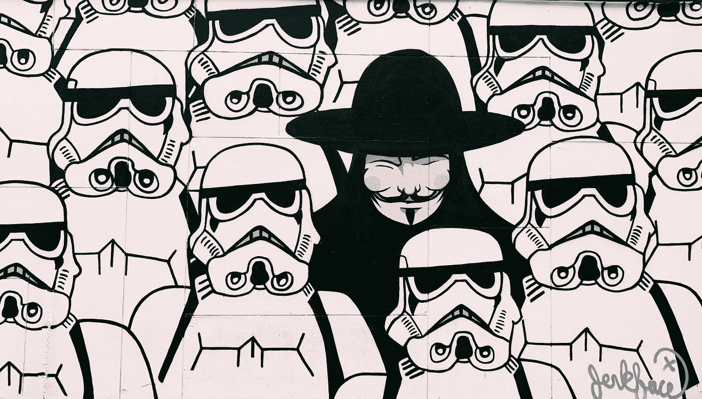
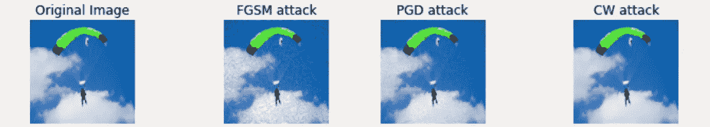
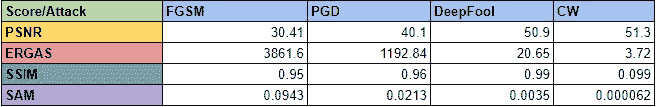

# 用 Python 中的相似性度量评估对立实例

> 原文：<https://towardsdatascience.com/evaluating-adversarial-examples-with-similarity-metrics-in-python-13acb9b5fa9f?source=collection_archive---------21----------------------->

## 使用相似性度量来查看哪些攻击对图像的改变最大

乔恩·泰森在 [Unsplash](https://unsplash.com?utm_source=medium&utm_medium=referral) 上的照片

对于分类神经网络，一个相反的例子是一个输入图像被扰乱(或有策略地修改),使得它被故意错误地分类。有各种算法利用给定分类模型的内部工作(梯度和特征图),并修改输入图像，使其要么只是误分类(无目标攻击),要么总是误分类到特定类别(有目标攻击)。

在本文中，我们将研究一些白盒攻击(在了解模型的内部工作原理后生成攻击的算法)，并使用相似性度量来指出其中一些攻击的鲁棒性增强。

攻击:

*   [*快速渐变标志法*](https://arxiv.org/abs/1412.6572) *(FGSM)*
*   **【PGD】**
*   *[deep fool](https://arxiv.org/pdf/1511.04599.pdf)*
*   *[*卡里尼&瓦格纳*](https://arxiv.org/abs/1608.04644) *(C & W)**

***生成攻击***

*有几个 Python 库已经实现了这些(和其他)攻击算法，并且还提供了现成的模块来为我们的用例生成这些算法。 [Cleverhans](https://github.com/cleverhans-lab/cleverhans) 、 [FoolBox](https://github.com/bethgelab/foolbox) 和 [ART](https://adversarial-robustness-toolbox.readthedocs.io/en/latest/) 是三个广泛使用并定期维护的开源库，用于对抗性示例(AE)生成。目前，我们使用艺术。*

*按如下方式安装对抗性鲁棒性工具箱:*

*`pip install adversarial-robustness-toolbox`*

*或者参考[官方知识库](https://github.com/Trusted-AI/adversarial-robustness-toolbox)获取进一步指导。*

*接下来，我们可以生成如下所示的攻击:*

*为了生成攻击，我们使用 InceptionNet V3 模型作为算法生成攻击的基础。我们使用在 ImageNet 数据集中找到的真实世界图像，因此也使用在 ImageNet 上预训练的 InceptionNet V3 的 PyTorch 模型。*

**attack.generate()* 方法的输出是一个包含扰动图像的列表，格式与输入相同(采用*(通道，宽度，高度)*格式，像素值在范围[0，1]内)。*

**

*每次攻击的样本图像。作者图片*

*在上面的图像中，我们可以看到 FGSM 攻击造成了肉眼可见的扰动。据说这是一种相对较弱的攻击。然而 CW 展现的是理想的情况！没有可见的扰动，并且该攻击被证明对分类器比其余的更鲁棒。*

*接下来，我们可以测量这些被攻击的图像与原始图像的相似性。*

*对于人眼来说，很容易分辨出两个给定图像的质量有多相似。然而，如果想要量化这种差异，我们需要数学表达式。从余弦相似性到 ERGAS，有几种这样的度量标准可以用来测试图像与其原始版本相比的“质量”。*

*通常，当从现有图像生成新图像时(在去噪、去模糊或任何此类操作之后)，量化再生的不同程度将是有益的。*

*我们可以把这个应用程序也看作我们的用例。*

*我们从现有的文献中知道，DeepFool 和 CW 是稳健的攻击，欺骗分类器的成功率更高。它们也很难被检测到，因为它们对目标图像的干扰(或噪声)很小。这些点已经分别使用模型分类精度的降低和图像的视觉外观进行了评估。*

*但是让我们尝试用这个质量指数来量化后一部分。*

*[阅读更多关于在 Python 中实现这些图像相似性度量的信息。](/measuring-similarity-in-two-images-using-python-b72233eb53c6)*

## *Python 中的相似性度量*

*我们将使用 Python 中的 [*sewar*](https://pypi.org/project/sewar/) 库来实现一些可用的指标。*

*从`pip install sewar` 开始，导入所需的模块，如下所示*

*除了这些，我们将只使用 [PSNR](https://en.wikipedia.org/wiki/Peak_signal-to-noise_ratio#:~:text=Peak%20signal%2Dto%2Dnoise%20ratio%20(PSNR)%20is%20an,the%20fidelity%20of%20its%20representation.) 、[尔加斯](https://www.mdpi.com/2072-4292/8/10/797/pdf/1)、 [SSIM](https://en.wikipedia.org/wiki/Structural_similarity) 和[萨姆](https://www.l3harrisgeospatial.com/docs/spectralanglemapper.html)。我只选择了这几个，因为在像 CW 和 DeepFool 这样的强大攻击中，在上面列出的所有攻击中，只有这几个能够以明显的方式捕捉和放大差异。*

*进口的 *sewar* 模块可以直接使用，如*

*`ergas_score = ergas(original, adversarial)`*

*下面你可以看到各种攻击和各种分数的结果。显然，ERGAS 和 SAM 比其他人更能放大不同攻击之间的差异。*

**

*四个有效度量的原始图像和敌对图像之间的相似性分数。图片作者。*

*根据我们的假设，我们看到 CW 攻击图像的相似性得分大于 FGSM/PGD 攻击。这意味着对抗图像比其他不太复杂的攻击更类似于 CW/DeepFool 的原始图像。*

*请自行尝试[其他类型的攻击](https://adversarial-robustness-toolbox.readthedocs.io/en/latest/modules/attacks/evasion.html)！*

> *感谢您从头到尾的阅读！您可以通过 LinkedIn[联系我，获取任何信息、想法或建议。](https://www.linkedin.com/in/param-raval/)*