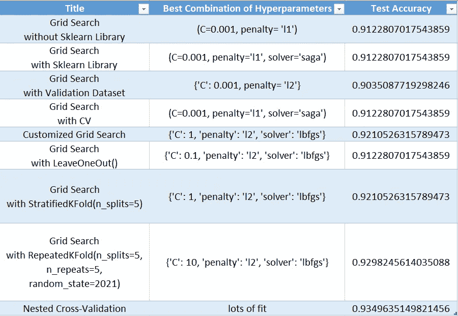

# 评估所有可能的超参数组合-网格搜索-

> 原文：<https://towardsdatascience.com/evaluating-all-possible-combinations-of-hyperparameters-grid-search-e41c7044e8e?source=collection_archive---------21----------------------->

## 一个视图中有/没有 Sklearn 库的超参数组合

```
***Table of Contents*****1\. Introduction
2\. Grid Search without Sklearn Library
3\. Grid Search with Sklearn Library
4\. Grid Search with Validation Dataset
5\. Grid Search with Cross-Validation
6\. Customized Grid Search
7\. Different Cross-Validation types in Grid Search
8\. Nested Cross-Validation
9\. Summary**
```


在 [Unsplash](https://unsplash.com?utm_source=medium&utm_medium=referral) 上 [Tekton](https://unsplash.com/@tekton_tools?utm_source=medium&utm_medium=referral) 拍摄的照片

# 1.介绍

每个项目的模型和预处理都是独立的。超参数根据数据集进行调整，对每个项目使用相同的超参数会影响结果的准确性。例如，在逻辑回归算法中有不同的超参数，如*、【求解器】、【C】、【惩罚】*，这些超参数的不同组合会给出不同的结果。类似地，支持向量机也有可调参数，如 gamma 值、C 值，它们的组合也会给出不同的结果。这些算法的超参数可在 sklearn 网站上获得。开发人员的目标是设计一个具有概化和高精度的模型，因此，检测超参数的最佳组合对于提高精度非常重要。

本文涉及评估超表的所有组合，以提高模型的准确性和结果准确性的可靠性。

# 2.没有 Sklearn 库的网格搜索

用户要求评估的组合通过 Sklearn 库中的 *GridSearchCV* 进行测试。事实上，该模型适合每一个单独的组合，揭示了最好的结果和参数。例如，当我们考虑 LogisticRegression 时，如果为 *C* 选择 4 个不同的值，为*惩罚*选择 2 个不同的值，则该模型将拟合 8 次，并且每次的结果将表示。现在让我们在不使用 sklearn 库的情况下在癌症数据集上创建网格搜索:

```
IN[1]
cancer=load_breast_cancer()
cancer_data   =cancer.data
cancer_target =cancer.targetIN[2]
x_train,x_test,y_train,y_test=train_test_split(cancer_data,cancer_target,test_size=0.2,random_state=2021)best_lr=0
for C in [0.001,0.1,1,10]:
    for penalty in ['l1','l2']:
        lr=LogisticRegression(solver='saga',C=C,penalty=penalty)
        lr.fit(x_train,y_train)
        lr_score=lr.score(x_test,y_test)
        print("C: ",C,"penalty:",penalty,'acc  {:.3f}'.format(lr_score))
        if lr_score>best_lr:
            best_lr=lr_score
            best_lr_combination=(C,penalty)print("best score LogisticRegression",best_lr)
print("C and penalty",best_lr_combination)
**OUT[2]
C:  0.001 penalty: l1 acc:0.912
C:  0.001 penalty: l2 acc:0.895
C:  0.1 penalty: l1 acc:0.904
C:  0.1 penalty: l2 acc:0.904
C:  1 penalty: l1 acc:0.895
C:  1 penalty: l2 acc:0.904
C:  10 penalty: l1 acc:0.904
C:  10 penalty: l2 acc:0.904
best score LogisticRegression 0.9122807017543859
C and penalty (0.001, 'l1')**
```

> 逻辑回归的所有超参数和更多参数可通过此[链接](https://scikit-learn.org/stable/modules/generated/sklearn.linear_model.LogisticRegression.html)访问。

可以看出，为每个组合创建了准确度值。开发人员可以通过选择超参数的最佳组合来提高模型的准确性。OUT[2]表示超参数的最佳组合是 C=0.001，罚值=L1。

让我们使用支持向量分类器和决策树分类器创建相同的过程。

```
IN[3]
#SVC
best_svc=0
for gamma in [0.001,0.1,1,100]:
    for C in[0.01,0.1,1,100]:
        svm=SVC(gamma=gamma,C=C)
        svm.fit(x_train,y_train)
        score=svm.score(x_test,y_test)
        #print("gamma:",gamma,"C:",C,"acc",score)
        if score>best_svc:
            best_svc=score
            best_svc_combination=(gamma, C)print("best score SVM",best_svc)
print("gamma and C",best_svc_combination)
**OUT[3]
best score SVM 0.9210526315789473
gamma and C (0.001, 100)**IN[4]
#DT
best_dt=0
for max_depth in [1,2,3,5,7,9,11,13,15]:
    dt = DecisionTreeClassifier(max_depth=max_depth, random_state=2021)
    dt.fit(x_train,y_train)
    dt_score=dt.score(x_test,y_test)
    #print("max_depth:",max_depth,dt_score)
    if dt_score>best_dt:
        best_dt=dt_score
        best_dt_depth=(max_depth)

print("best dt_score:",best_dt)
print("best dt depth:", best_dt_depth)
**OUT[4]
best dt_score: 0.9473684210526315
best dt depth: 3**
```

> 决策树分类器的所有超参数和更多参数可以从这个[链接](https://scikit-learn.org/stable/modules/generated/sklearn.tree.DecisionTreeClassifier.html)访问，支持向量分类器可以从这个[链接](https://scikit-learn.org/stable/modules/generated/sklearn.svm.SVC.html)访问。

OUT[3]表示 SVC 的最佳组合是 gamma=0.001，C=100。OUT[4]表示 DTC 的最佳组合是 max_depth=3。

# 3.使用 Sklearn 库进行网格搜索

让我们使用 sklearn 库做同样的事情:

```
IN[5]
param_grid_lr = {'C': [0.001,0.1,1,10],'penalty': ['l1','l2']}gs_lr=GridSearchCV(LogisticRegression(solver='saga'),param_grid_lr)x_train,x_test,y_train,y_test=train_test_split(cancer_data,
cancer_target,test_size=0.2,random_state=2021)gs_lr.fit(x_train,y_train)
test_score=gs_lr.score(x_test,y_test)
print("test score:",test_score)
print("best combination: ",gs_lr.best_params_)
print("best score: ", gs_lr.best_score_)
print("best all parameters:",gs_lr.best_estimator_)
print("everything ",gs_lr.cv_results_)
**OUT[5]
test score: 0.9122807017543859
best combination:  {'C': 0.001, 'penalty': 'l1'}
best score:  0.9054945054945055
best all parameters: LogisticRegression(C=0.001, penalty='l1', solver='saga')**
```

如上所述，使用 *train_test_split* 分割数据集。通过使用 *GridSearchCV* ，使用具有各种超参数组合的逻辑回归算法对训练数据集进行了训练。可以看出，准确率和最佳参数同上。 *GridSearchCV* 有很多属性，所有这些都可以在 sklearn [网站](https://scikit-learn.org/stable/modules/generated/sklearn.model_selection.GridSearchCV.html)上找到。

# 4.使用验证数据集进行网格搜索

在以前的研究中，数据被分为测试集和训练集。用所有组合尝试训练数据集，并将最高比率应用于测试数据集。不过在这个[环节](/increasing-model-reliability-model-selection-cross-validation-1ce0bf506cd)中说明了，用 random 拆分 *train_test_split* 是一种赌博，不一定能给出可靠的结果。现在，在将数据分为训练集和测试集以增加可靠性之后，让我们将训练数据集分为训练集和验证集。让我们用训练数据集训练模型，用验证数据进行评估，在为模型确定最合适的超参数后，将其应用于最初分配的测试数据集。即使精度值较低，模型也会更一般化。这比假的高精度更可取。

```
IN[6]
x_valtrain,x_test,y_valtrain,y_test=train_test_split(cancer_data,
cancer_target,test_size=0.2,random_state=2021)x_train,x_val,y_train,y_val=train_test_split(x_valtrain,y_valtrain,
test_size=0.2,random_state=2021)param_grid_lr = {'C': [0.001,0.1,1,10],'penalty': ['l1','l2']}
gs_lr=GridSearchCV(LogisticRegression(solver='saga'),param_grid_lr)
gs_lr.fit(x_train,y_train)
val_score=gs_lr.score(x_val,y_val)print("val score:",val_score)
print("best parameters: ",gs_lr.best_params_)
print("best score: ", gs_lr.best_score_)new_lr=LogisticRegression(solver='saga', C=0.001, penalty='l2').fit(x_valtrain,y_valtrain)
test_score=new_lr.score(x_test,y_test)
print("test score", test_score)
**OUT[6]
val score: 0.9010989010989011
best parameters:  {'C': 0.001, 'penalty': 'l2'}
best score:  0.9092465753424659
test score 0.9035087719298246**
```

用训练数据集(x_train，y_train)对其进行训练，用验证数据集(x_val，y_val)对其进行评估，并确定最佳组合。然后，使用训练数据集+验证数据集的最佳组合创建新模型，使用更多数据，最后，使用在第一次分裂中分配的测试数据集对其进行评估。

同样的过程可以不使用 sklearn 或者按照上面的模板进行其他算法。


[JESHOOTS.COM](https://unsplash.com/@jeshoots?utm_source=medium&utm_medium=referral)在 [Unsplash](https://unsplash.com?utm_source=medium&utm_medium=referral) 上拍照

# 5.交叉验证网格搜索

数据集分为训练集和测试集。通过交叉验证将训练数据集分离为训练集+验证集。让我们在不使用 sklearn 库来理解系统的情况下实现它:

```
IN[7]
x_valtrain,x_test,y_valtrain,y_test=train_test_split(cancer_data,
cancer_target,test_size=0.2,random_state=2021)best_lr=0
for C in [0.001,0.1,1,10]:
    for penalty in ['l1','l2']:
        lr=LogisticRegression(solver='saga',C=C,penalty=penalty)
        cv_scores=cross_val_score(lr,x_valtrain,y_valtrain,cv=5)
        mean_score=np.mean(cv_scores)
        if mean_score>best_lr:
            best_lr=mean_score
            best_lr_parameters=(C,penalty)print("best score LogisticRegression",best_lr)
print("C and penalty",best_lr_parameters)
print("**************************************")new_cv_lr=LogisticRegression(solver='saga',C=0.001,penalty='l1').fit(x_valtrain,y_valtrain)
new_cv_score=new_cv_lr.score(x_test,y_test)
print('test accuracy:',new_cv_score)
**OUT[7]
best score LogisticRegression 0.9054945054945055
C and penalty (0.001, 'l1')
**************************************
test accuracy: 0.9122807017543859**
```

将 *x_valtrain* (训练+验证)数据集分割为 CV=5 的值，并将最初分配的测试数据应用于具有最佳参数的重建模型。

同样的过程可以应用于 sklearn 库:

```
IN[8]
param_grid_lr = {'C': [0.001,0.1,1,10,100],'penalty': ['l1','l2']}gs_lr=GridSearchCV(LogisticRegression(solver='saga'),param_grid_lr,
cv=5)x_valtrain,x_test,y_valtrain,y_test=train_test_split(cancer_data,
cancer_target,test_size=0.2,random_state=2021)gs_lr.fit(x_valtrain,y_valtrain)
gs_lr_score=gs_lr.score(x_test,y_test)
print('test acc:',gs_lr_score)
print("best parameters: ",gs_lr.best_params_)
print("best score: ", gs_lr.best_score_)
**OUT[8]
test acc: 0.9122807017543859
best parameters:  {'C': 0.001, 'penalty': 'l1'}
best score:  0.9054945054945055
best all parameters LogisticRegression(C=0.001, penalty='l1', solver='saga')**
```

可以看出，获得了相同的结果和相同的最佳参数。

# 6.定制网格搜索

只要允许，参数组合是可能的。有些参数不能相互组合。例如，当*解算器在 LogisticRegression 中选择了:【saga】*时，可以应用*【L1】**【L2】**【elastic net】*，但对于解算器:*【lbfgs】*，只能应用*【L2】*(或*【无】*)。使用 GridSearch 可以克服这个缺点，如下所示:

```
IN[9]
x_valtrain,x_test,y_valtrain,y_test=train_test_split(cancer_data,
cancer_target,test_size=0.2,random_state=2021)param_grid_lr=[{'solver':['saga'],'C':[0.1,1,10],'penalty':['elasticnet','l1','l2']},
               {'solver':['lbfgs'],'C':[0.1,1,10],'penalty':['l2']}]gs_lr = GridSearchCV(LogisticRegression(),param_grid_lr,cv=5)
gs_lr.fit(x_valtrain,y_valtrain)
gs_lr_score=gs_lr.score(x_test,y_test)
print("test score:",gs_lr_score)
print("best parameters: ",gs_lr.best_params_)
print("best score: ", gs_lr.best_score_)
**OUT[9]
test score: 0.9210526315789473
best parameters:  {'C': 1, 'penalty': 'l2', 'solver': 'lbfgs'}
best score:  0.9516483516483516**
```

根据选定的最佳参数创建新模型，并通过 *GridSearchCV* 应用测试数据。

# 7.网格搜索中的不同交叉验证类型

到目前为止，交叉验证已经被实现为 k-fold，但是也可以应用不同的交叉验证方法:

```
IN[10]
x_valtrain,x_test,y_valtrain,y_test=train_test_split(cancer_data,
cancer_target,test_size=0.2,random_state=2021)param_grid_lr=[{'solver':['saga'],'C':[0.1,1,10],'penalty':['elasticnet','l1','l2']},
               {'solver':['lbfgs'],'C':[0.1,1,10],'penalty':['l2']}]IN[11]
gs_lr_loo = GridSearchCV(LogisticRegression(),param_grid_lr,cv=LeaveOneOut())
gs_lr_loo.fit(x_valtrain,y_valtrain)
gs_lr_loo_score=gs_lr_loo.score(x_test,y_test)print("loo-test score:",gs_lr_loo_score)
print("loo-best parameters: ",gs_lr_loo.best_params_)
print("**********************************************")
**OUT[11]
loo-test score: 0.9122807017543859
loo-best parameters:  {'C': 0.1, 'penalty': 'l2', 'solver': 'lbfgs'}
************************************************IN[12]
skf = StratifiedKFold(n_splits=5)
gs_lr_skf = GridSearchCV(LogisticRegression(),param_grid_lr,cv=skf)
gs_lr_skf.fit(x_valtrain,y_valtrain)
gs_lr_skf_score=gs_lr_skf.score(x_test,y_test)print("skf-test score:",gs_lr_skf_score)
print("skf-best parameters: ",gs_lr_skf.best_params_)
print("**********************************************")
**OUT[12]
skf-test score: 0.9210526315789473
skf-best parameters:  {'C': 1, 'penalty': 'l2', 'solver': 'lbfgs'}
************************************************IN[13]
rkf = RepeatedKFold(n_splits=5, n_repeats=5, random_state=2021)
gs_lr_rkf= GridSearchCV(LogisticRegression(),param_grid_lr,cv=rkf)
gs_lr_rkf.fit(x_valtrain,y_valtrain)
gs_lr_rkf_score=gs_lr_rkf.score(x_test,y_test)print("rkf-test score:",gs_lr_rkf_score)
print("rkf-best parameters: ",gs_lr_rkf.best_params_)
print("**********************************************")
**OUT[13]
rkf-test score: 0.9298245614035088
rkf-best parameters:  {'C': 10, 'penalty': 'l2', 'solver': 'lbfgs'}
************************************************
```

当*用 *C=10* 和*罚值= L2*重复折叠*获得最高精度值时，确定精度值与之接近的所有其他结果的 C 值是不同的。

# 8.嵌套交叉验证

到目前为止，测试数据已经被 *train_test_split* 分离，训练数据已经被分离成一个训练集和一个交叉验证的验证集。为了进一步推广这种方法，我们还可以通过交叉验证来拆分测试数据:

```
IN[14]
param_grid_lr=[{'solver':['saga'],'C':[0.1,1,10],'penalty':['elasticnet','l1','l2']},
               {'solver':['lbfgs'],'C':[0.1,1,10],'penalty':['l2']}]gs=GridSearchCV(LogisticRegression(),param_grid_lr,cv=5)
nested_scores=cross_val_score(gs,cancer.data,cancer.target,cv=5)print("nested acc",nested_scores)
print("Average acc: ", nested_scores.mean())
**OUT[14]
nested acc [0.94736842 0.93859649 0.94736842 0.9122807  0.92920354]
Average acc:  0.9349635149821456**
```

对于*解算器='saga'* ，有 3x3 个组合，对于*解算器='lbfgs'* ，有 3x1 个组合。模型在内部交叉验证中拟合了 5 次，在外部交叉验证中拟合了 5 次。

所以，模型的总拟合数为 9x5x5 + 3x5x5 = 300。

# 9.摘要



图一。标题摘要，按作者分类的图像

> 网格搜索和交叉验证的缺点是需要很长时间来拟合几十个模型。n_jobs 值可以由用户设置，并且可以分配要使用的 CPU 内核数量。如果设置了 n_jobs=-1，则使用所有可用的 CPU 核心。

## 回到指引点击[此处](https://ibrahimkovan.medium.com/machine-learning-guideline-959da5c6f73d)。

<https://ibrahimkovan.medium.com/machine-learning-guideline-959da5c6f73d> 