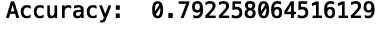

# 评估 Python 中的分类模型

> 原文：<https://towardsdatascience.com/evaluating-classification-models-in-python-6b5277e3d524?source=collection_archive---------38----------------------->

## 了解分类性能指标


照片由[像素](https://www.pexels.com/photo/selective-focus-photography-of-color-pencil-lot-2170/)上的 [Pixabay](https://www.pexels.com/@pixabay) 拍摄

机器学习分类是一种监督学习，其中算法将一组输入映射到离散输出。分类模型在不同的行业中有广泛的应用，并且是监督学习的主要支柱之一。这是因为，在各行各业中，许多分析问题都可以通过将输入映射到一组离散的输出来构建。定义分类问题的简单性使得分类模型具有通用性和行业不可知性。

构建分类模型的一个重要部分是评估模型性能。简而言之，数据科学家需要一种可靠的方法来测试模型对结果的正确预测程度。许多工具可用于评估模型性能；根据你要解决的问题，有些可能比其他的更有用。

例如，如果您的数据准确性中有所有结果的相等表示，那么混淆矩阵可能足以作为性能度量。相反，如果您的数据显示不平衡，这意味着一个或多个结果明显不足，您可能希望使用精度等指标。如果您想了解您的模型在跨越决策阈值时的稳健程度，像接收机工作特性曲线下面积(AUROC)和精度召回曲线下面积(AUPRC)这样的指标可能更合适。

考虑到选择合适的分类指标取决于您试图回答的问题，每个数据科学家都应该熟悉一套分类性能指标。Python 中的 Scikit-Learn 库有一个度量模块，可以轻松快速地计算准确度、精度、AUROC 和 AUPRC。此外，了解如何通过 ROC 曲线、PR 曲线和混淆矩阵可视化模型性能也同样重要。

这里，我们将考虑构建一个简单的分类模型来预测客户流失的概率。客户流失是指一段时间后，客户离开公司、退订或不再购买。我们将使用[电信客户流失数据](https://www.kaggle.com/blastchar/telco-customer-churn)，它包含一个虚构的电信公司的信息。我们的任务是预测客户是否会离开公司，并评估我们的模型执行这项任务的效果如何。

**建立分类模型**

让我们从将电信客户流失数据读入 Pandas 数据帧开始:

```
df = pd.read_csv(‘telco_churn.csv’)
```

现在，让我们显示前五行数据:

```
df.head()
```


我们看到数据集包含 21 列，既有分类值又有数值。该数据还包含 7，043 行，对应于 7，043 个不同的客户。

让我们建立一个简单的模型，将任期(客户在公司工作的时间长度)和每月费用作为输入，预测客户流失的可能性。输出列将是 Churn 列，其值为 yes 或 no。

首先，让我们修改目标列，使其具有机器可读的二进制值。我们将为 Churn 列指定值 1 表示是，0 表示否。我们可以通过使用 numpy 中的 where()方法来实现这一点:

```
import numpy as npdf[‘Churn’] = np.where(df[‘Churn’] == ‘Yes’, 1, 0)
```

接下来，让我们定义我们的输入和输出:

```
X = df[[‘tenure’, ‘MonthlyCharges’]]y = df[‘Churn’]
```

然后，我们可以将我们的数据分开，用于训练和测试。为此，我们需要从 sklearn 的 model_selection 模块中导入 train_test_split 方法。让我们生成一个占我们数据 67%的训练集，然后使用剩余的数据进行测试。测试集由 2，325 个数据点组成:

```
from sklearn.model_selection import train_test_splitX_train, X_test, y_train, y_test = train_test_split(X, y, test_size=0.33, random_state=42)
```

对于我们的分类模型，让我们使用一个简单的逻辑回归模型。让我们从 Sklearn 中的 linear_models 模块导入 LogisticRegression 类:

```
from sklearn.linear_models import LogisticRegression
```

现在，让我们定义一个逻辑回归类的实例，并将其存储在一个名为 clf_model 的变量中。然后，我们将使我们的模型适合我们的训练数据:

```
clf_model = LogisticRegression()clf_model.fit(X_train, y_train)
```

最后，我们可以对测试数据进行预测，并将预测结果存储在一个名为 y_pred 的变量中:

```
y_pred = clf_model.predict(X_test)
```

既然我们已经训练了我们的模型并对测试数据进行了预测，我们需要评估我们的模型表现如何。

**准确度&混淆矩阵**

一个简单且广泛使用的性能指标是准确性。这就是正确预测的总数除以测试集中的数据点数。我们可以从 Sklearn 中的 metric 模块导入 accuracy_score 方法，计算准确度。accuracy_score 的第一个参数是存储在 y_test 中的实际标签。第二个参数是预测，它存储在 y_pred 中:

```
from sklearn.metrics import accuracy_scoreprint(“Accuracy: “, accuracy_score(y_test, y_pred))
```



我们看到我们的模型有 79%的预测准确率。虽然这是有用的，但我们并不真正了解我们的模型具体预测客户流失或不流失有多好。混淆矩阵可以给我们更多的信息，让我们知道我们的模型对每一个结果做得有多好。

如果您的数据不平衡，考虑这个指标是很重要的。例如，如果我们的测试数据有 95 个无客户流失标签和 5 个客户流失标签，通过猜测每个客户的“无客户流失”,它可能会误导给出 95%的准确率。

现在让我们从预测中生成一个混淆矩阵。让我们从 Sklearn 的 metrics 模块导入混淆矩阵包:

```
from sklearn.metrics import confusion_matrix
```

让我们生成混淆矩阵数组，并将其存储在一个名为 conmat 的变量中:

```
conmat = confusion_matrix(y_test, y_pred)
```

让我们从混淆矩阵数组创建一个数据帧，称为 df_cm:

```
val = np.mat(conmat)classnames = list(set(y_train))df_cm = pd.DataFrame(val, index=classnames, columns=classnames,)print(df_cm)
```


现在，让我们使用 Seaborn 热图方法生成混淆矩阵:

```
import matplotlib.pyplot as pltimport seaborn as snsplt.figure()heatmap = sns.heatmap(df_cm, annot=True, cmap=”Blues”)heatmap.yaxis.set_ticklabels(heatmap.yaxis.get_ticklabels(), rotation=0, ha=’right’)heatmap.xaxis.set_ticklabels(heatmap.xaxis.get_ticklabels(), rotation=45, ha=’right’)plt.ylabel(‘True label’)plt.xlabel(‘Predicted label’)plt.title(‘Churn Logistic Regression Model Results’)plt.show()
```


那么，这个数字到底告诉了我们什么关于我们的模型的性能呢？沿着混淆矩阵的对角线看，让我们注意数字 1，553 和 289。数字 1，553 对应于模型正确预测不会流失的客户数量(意味着他们会留在公司)。数字 289 对应于模型正确预测会流失的客户数量。

如果我们能把它们显示为总数的百分比，那就更有用了。例如，了解 289 个正确预测的客户占所有搅动的百分比将是有用的。我们可以通过在热图之前添加以下代码行来显示每个结果的百分比:

```
df_cm = df_cm.astype(‘float’) / df_cm.sum(axis=1)[:, np.newaxis]
```


正如我们所看到的，我们的模型正确地预测了 91%没有流失的客户和 46%流失的客户。这清楚地说明了使用准确性的局限性，因为它没有给我们关于正确预测结果的百分比的信息。

ROC 曲线& AUROC

很多时候，公司希望使用预测的概率，而不是离散的标签。这允许他们选择将结果标记为阴性或阳性的阈值。在处理概率时，我们需要一种方法来衡量模型在概率阈值上的泛化能力。到目前为止，我们的算法已经使用默认阈值 0.5 分配了二进制标签，但是理想的概率阈值可能会更高或更低，这取决于用例。

在平衡数据的情况下，理想的阈值是 0.5。当我们的数据不平衡时，那么理想的阈值往往会更低。此外，公司有时更喜欢使用概率，而不是完全离散的标签。考虑到预测概率的重要性，了解使用哪些指标来评估它们是很有用的。

AUROC 是一种衡量模型跨越决策阈值的稳健程度的方法。它是真阳性率对假阳性率的曲线下的面积。真阳性率(TPR)为(真阳性)/(真阳性+假阴性)。假阳性率是(假阳性)/(假阳性+真阴性)。

在我们的客户流失问题的背景下，这将衡量我们的模型在不同概率阈值内捕捉不流失客户的能力。

让我们从计算 AUROC 开始。让我们从指标模块导入 roc_curve 和 roc_auc_score 方法:

```
from sklearn.metrics import roc_curve, roc_auc_score
```

接下来，让我们使用训练好的模型在测试集上生成预测概率:

```
y_pred_proba = clf_model.predict_proba(np.array(X_test))[:,1]
```

然后，我们可以计算不同概率阈值的假阳性率(fpr)、真阳性率(tpr):

```
fpr, tpr, thresholds = roc_curve(y_test, y_pred_proba)
```

最后，我们可以绘制我们的 ROC 曲线:

```
sns.set()plt.plot(fpr, tpr)plt.plot(fpr, fpr, linestyle = ‘ — ‘, color = ‘k’)plt.xlabel(‘False positive rate’)plt.ylabel(‘True positive rate’)AUROC = np.round(roc_auc_score(y_test, y_pred_proba), 2)plt.title(f’Logistic Regression Model ROC curve; AUROC: {AUROC}’);plt.show()
```


真实正比率越快接近 1，我们的 ROC 曲线的行为就越好。因此，我们的模型在 ROC 曲线方面表现得相当好。此外，0.82 的 AUROC 相当不错，因为完美模型的 AUROC 应为 1.0。我们看到，当使用默认阈值 0.5 时，91%的负面案例(意味着没有客户流失)被我们的模型正确预测，所以这不应该太令人惊讶。

**AUPRC(平均精度)**

精确回忆曲线下的区域让我们很好地理解了不同决策阈值下的精确度。精度是(真阳性)/(真阳性+假阳性)。回忆是真实阳性率的另一种说法。

在客户流失的情况下，AUPRC(或平均精度)是衡量我们的模型在多大程度上正确预测客户将离开公司，而不是预测客户将留下来，跨越决策阈值。生成精度/召回曲线并计算 AUPRC 与我们对 AUROC 所做的类似:

```
from sklearn.metrics import precision_recall_curvefrom sklearn.metrics import average_precision_scoreaverage_precision = average_precision_score(y_test, y_test_proba)precision, recall, thresholds = precision_recall_curve(y_test, y_test_proba)plt.plot(recall, precision, marker=’.’, label=’Logistic’)plt.xlabel(‘Recall’)plt.ylabel(‘Precision’)plt.legend()plt.title(f’Precision Recall Curve. AUPRC: {average_precision}’)plt.show()
```


我们可以看到，AUPRC 为 0.63，我们的精确度/回忆曲线的精确度快速下降，我们的模型在预测客户是否会随着概率阈值的变化而离开方面做得不太好。这个结果是意料之中的，因为我们看到当我们使用默认阈值 0.5 时，只有 46%的流失标签被正确预测。对于那些对数据和代码感兴趣的人来说，Python 脚本可以在[这里](https://github.com/spierre91/builtiin/blob/main/classification_performance.py)找到。

**结论**

跨领域和行业的数据科学家必须对分类性能指标有深刻的理解。了解用于不平衡或平衡数据的指标对于清楚地传达模型的性能非常重要。天真地使用准确性来传达来自不平衡数据训练的模型的结果，可能会误导客户认为他们的模型比实际情况表现得更好。

此外，深入了解预测在实践中的应用也很重要。可能是这样的情况，一家公司寻找离散的结果标签，它可以用来做决定。在其他情况下，公司更感兴趣的是使用概率来做决策，在这种情况下，我们需要评估概率。熟悉评估模型性能的许多角度和方法对于机器学习项目的成功至关重要。

python 中的 Scikit-learn 包方便地为跨行业使用的大多数性能指标提供了工具。这允许您在较短的时间和相对较少的代码行内从多个角度获得模型性能的视图。快速生成混淆矩阵、ROC 曲线和精度/召回曲线使数据科学家能够更快地迭代项目。

无论您是想要快速构建和评估问题的机器学习模型，比较 ML 模型，选择模型特征，还是调整您的机器学习模型，掌握这些分类性能指标的知识都是一项非常宝贵的技能。

如果你有兴趣学习 python 编程的基础知识、Pandas 的数据操作以及 python 中的机器学习，请查看[*Python for Data Science and Machine Learning:Python 编程、Pandas 和 sci kit-初学者学习教程*](https://www.amazon.com/dp/B08N38XW2Q/ref=sr_1_1?dchild=1&keywords=sadrach+python&qid=1604966500&s=books&sr=1-1) *。我希望你觉得这篇文章有用/有趣。*

***本帖原载于*** [***内置博客***](https://builtin.com/machine-learning) ***。原片可以在这里找到***<https://builtin.com/data-science/evaluating-classification-models>****。****