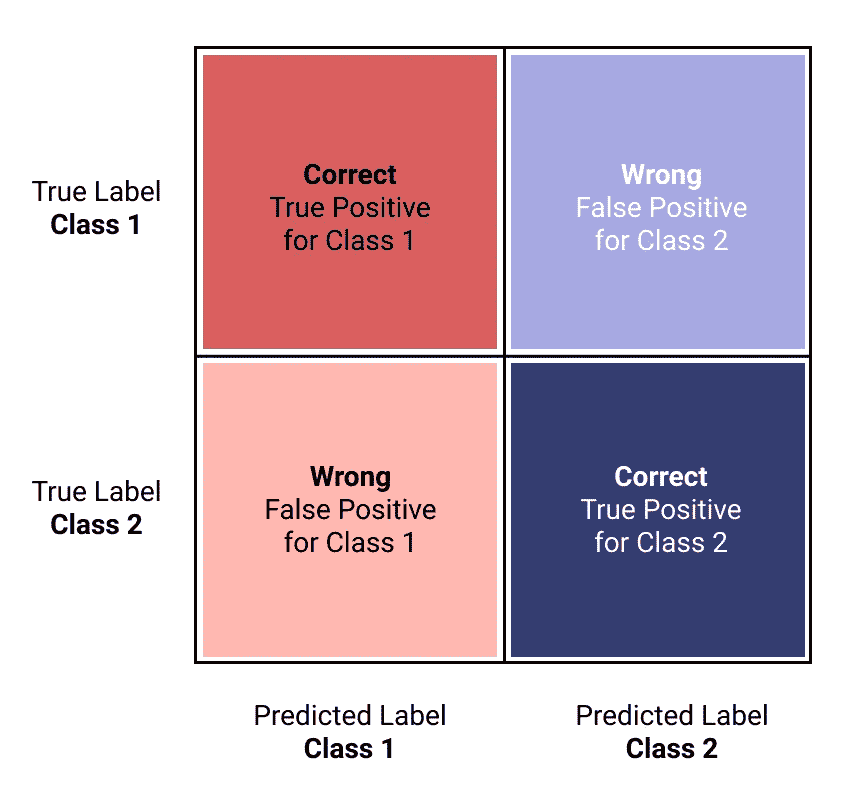
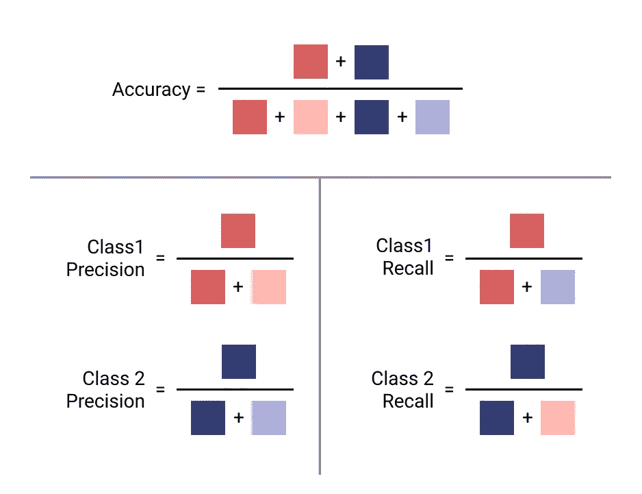
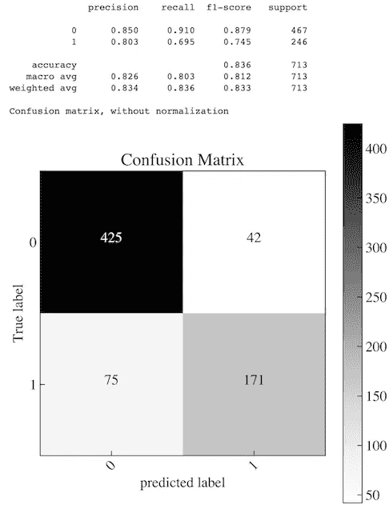

# 停止用准确性来评估你的分类模型

> 原文：<https://towardsdatascience.com/evaluating-ml-models-with-a-confusion-matrix-3fd9c3ab07dd?source=collection_archive---------15----------------------->

## 如何解释混淆矩阵以及何时使用不同的评估指标


由 [Unsplash](https://unsplash.com?utm_source=medium&utm_medium=referral) 上的[真空背景](https://unsplash.com/@vackground?utm_source=medium&utm_medium=referral)拍摄

# 二元分类的模型评估

理解如何评估模型是任何机器学习(ML)项目的关键部分。很多时候，当我们从 ML 开始，或者当与不精通 ML 的人交谈时，术语**准确性**被作为模型性能的概括而抛出。谈论一个模型的**准确性**的问题是，它具体指的是一种计算，将它正确分类的观察值数量除以测试集中的总数量。

虽然当数据集完全平衡(正负类相等)时,**精度**对于模型性能来说是可以接受的，但事实是这种情况很少发生。有一些处理不平衡数据的方法，我将在后面的帖子中讨论，但现在，让我们了解如何正确地解释模型性能的结果。

**更多:**关于处理**不平衡数据**的信息，查看我的另一篇帖子:[处理不平衡数据](https://medium.com/data-knows-all/working-with-imbalanced-data-efbd96b3e655)。

# 解读混淆矩阵

在对模型进行数据训练和测试之后(Scikit-Learn 对这一过程有很好的描述)，您可以生成一个**混淆矩阵**来查看模型是如何被错误分类的。混淆矩阵是一个 2x2 的表格(用于二进制分类),在其轴上绘制了**实际**值与**预测**值。一旦你理解了如何解读它，就很容易直观地看到你的模型的表现。



作者图片

该矩阵在左上角和右下角象限显示正确分类的观察值，而在其他角落显示错误分类的观察值。将这些独立地看作行或列有助于您解释每个类。

# 评估指标

1.  **准确性:**模型的观察百分比在两个类中都被正确预测。*不要将此用于不平衡数据*。你可以有非常高的准确率，但是小众类的表现可能很恐怖。
2.  **Precision:** 告诉你这个类的预测有多可靠。例如，当精度分数高并且模型预测该类时，您可以相信它是正确的。
3.  **回忆:**告诉你模型对类的预测有多好。高召回率和低精度意味着它在该类中表现良好，但是可能在结果中包括其他类。
4.  **F1 得分:**计算精确度和召回率的调和平均值，将它们合并成一个指标。

下图是我所见过的说明每个计算是如何执行的最佳方式。一旦你明白你要优化的是什么，你应该使用哪种类型的指标，它也可以帮助你。



作者图片

例如，如果您希望最大限度地减少 1 类的误报，那么**1 类精度**是适合您的度量标准(图中的*为深红色和浅红色*)。

**注意:** *精度*是矩阵中*列*的关系，*召回*是矩阵中*行*的关系。

# 为你想要的结果而优化

选择正确的评估指标的一个关键部分是决定什么是你想要的最重要的结果。我认为这分为三件事:

1.  **最小化误报:**这方面的一个用例可能是垃圾邮件过滤器。理想情况下，您绝不会希望将一个真实的邮件标记为垃圾邮件，并将其归档到垃圾邮件文件夹中。用户错过重要消息的可能性很高；所以，你要减少误报，选择*精度高*的型号。
2.  **尽量减少假阴性:**这里对我来说最好的例子就是医学筛查。如果算法对病人有假阴性，这将是非常糟糕的，但他们生病了。最好标出潜在的问题，并让专家跟进。在这种情况下，你要重点关注一个*高召回*。
3.  **两者皆有:**如果你的用例没有偏向其中之一，那么选择 *F1* 来平衡*精度和*召回的度量。

# 实践中的混淆矩阵

这是最近我训练的随机森林算法的混淆矩阵。我的目标是预测用户何时会从 SaaS 的*试用*账户转为*付费*账户。该示例是根据 **Scikit-Learn** 创建的，显示了上述各种评估指标。在我的例子中，*正*类(`1`)转换为付费，负类转换失败。看一看你自己，看看你如何解释结果。



作者图片

# 密码

为了输出上面的混淆矩阵，您可以使用下面的代码

```
from sklearn.metrics import classification_report
from sklearn.metrics import ConfusionMatrixDisplay
```

```
# print classification report
print(classification_report(y_test, y_pred, digits=3))

# show confusion matrix
ConfusionMatrixDisplay.from_predictions(y_test, 
                                        y_pred, 
                                        cmap=plt.cm.Blues)
```

```
plt.show()
```

有关显示混淆矩阵的更多信息，请参见 [Scikit-Learn](https://scikit-learn.org/stable/auto_examples/model_selection/plot_confusion_matrix.html) 文档。

# 结论

混淆矩阵是评估*二元*和*多类*分类模型性能的有力工具。然而，诀窍不仅仅是理解如何解释矩阵；是为了真正理解正确的*评价指标*来使用。切记不要默认*精度*；对于你想要的结果，有一个合适的标准！尽情享受吧！

如果你喜欢阅读这样的故事，并想支持我成为一名作家，可以考虑报名成为一名媒体成员。一个月 5 美元，让你可以无限制地访问成千上万篇文章。如果你使用[我的链接](https://medium.com/@broepke/membership)注册，我会赚一小笔佣金，不需要你额外付费。