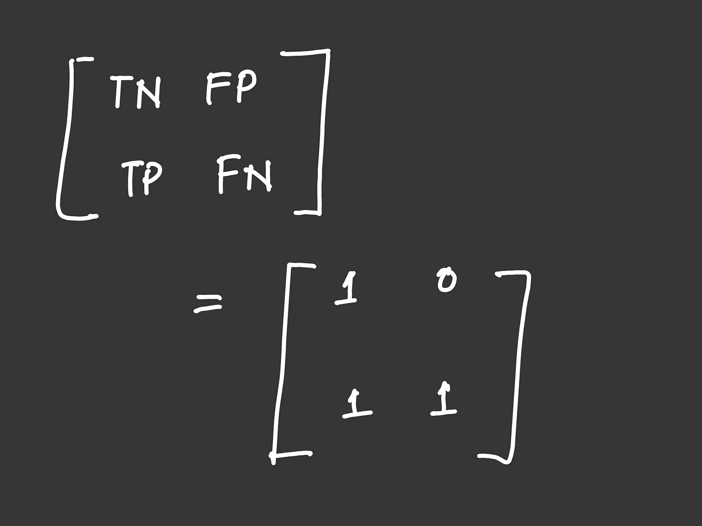
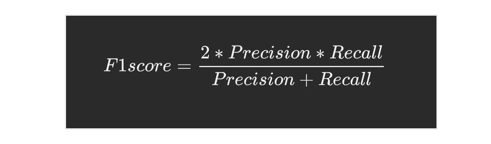
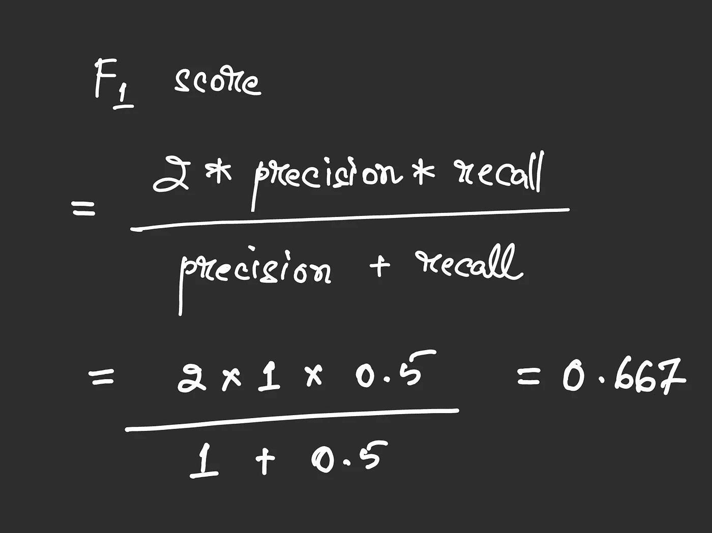
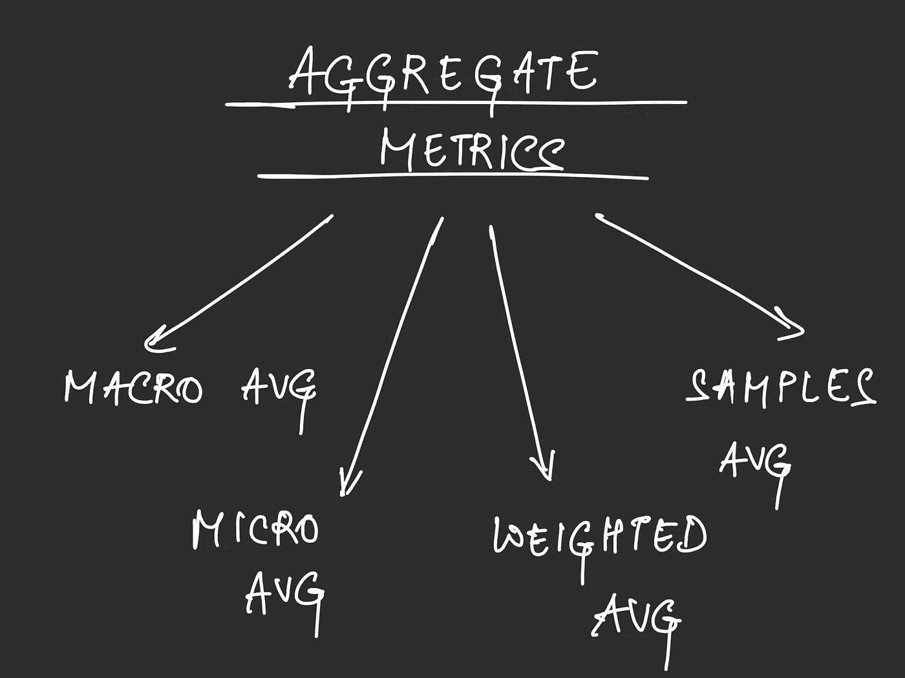
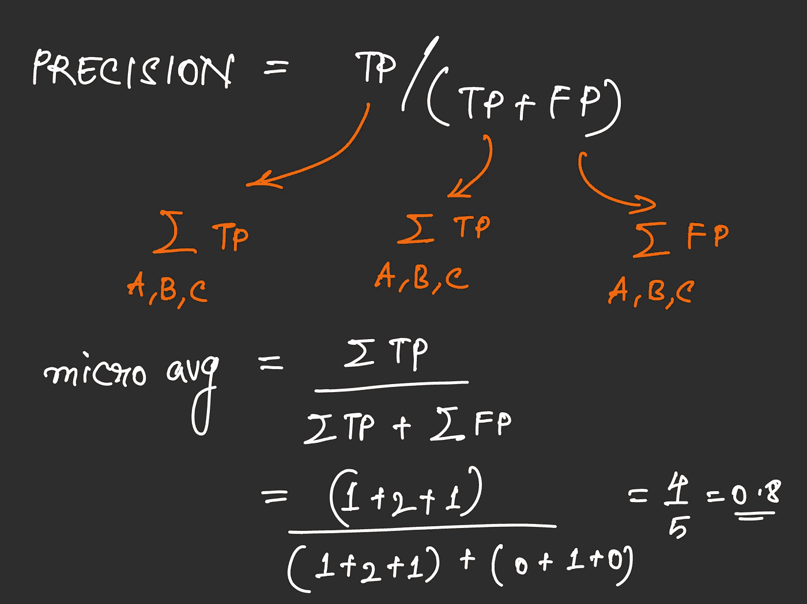
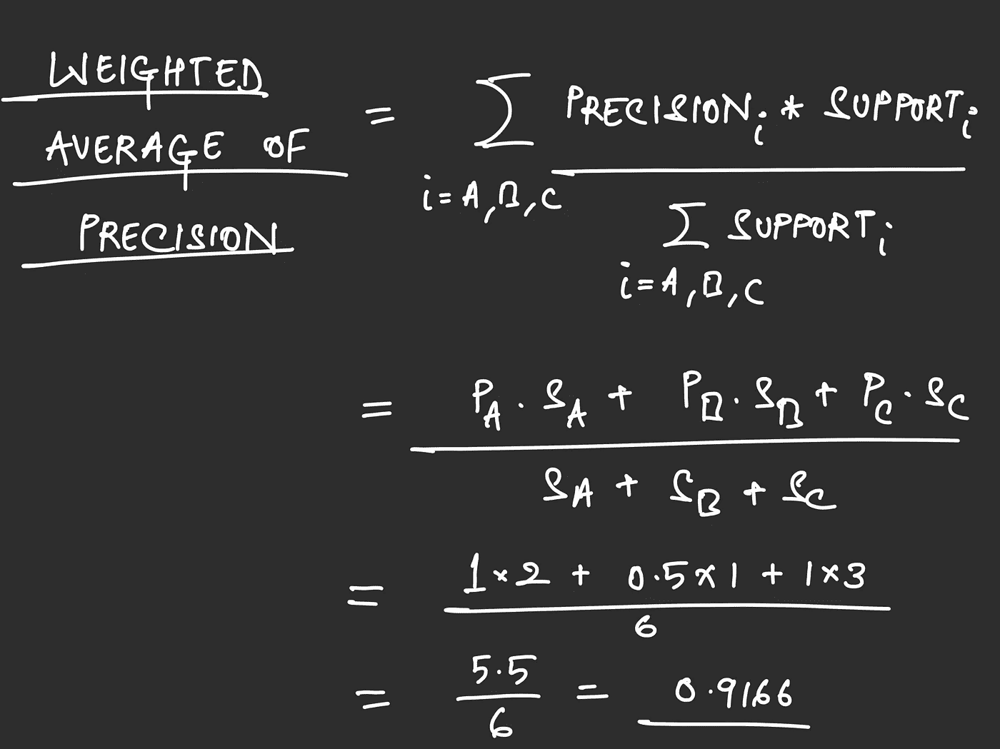
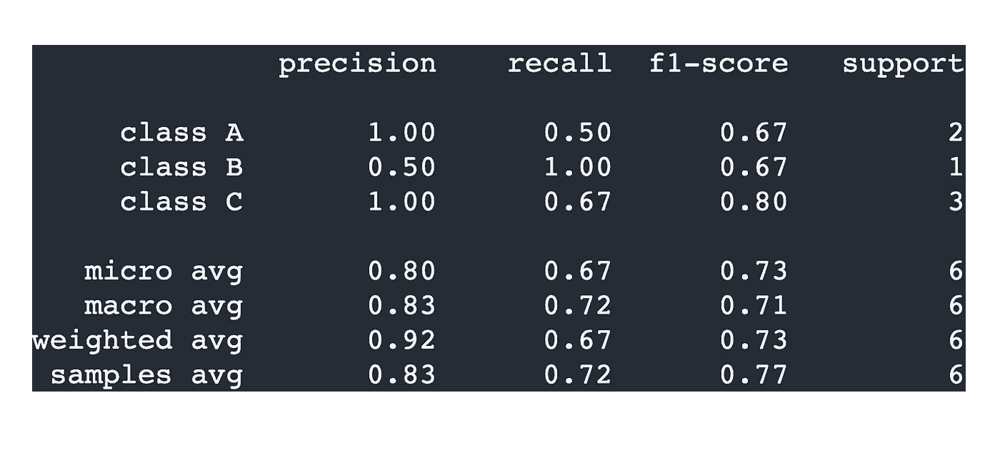

# 评估多标签分类器

> 原文：<https://towardsdatascience.com/evaluating-multi-label-classifiers-a31be83da6ea?source=collection_archive---------0----------------------->

## 以及这些指标在不同场景下如何变化


作者图片

# 介绍

分类是机器学习的一个重要应用。这是一项预测性建模任务，需要为数据点分配一个类别标签，这意味着该特定数据点属于所分配的类别。

# 目录

```
- Accuracy
- The Confusion Matrix
- A multi-label classification example
- Multilabel classification confusion matrix
- Aggregate metrics
- Some Common Scenarios
```

# 准确(性)

开发和应用模型是一回事，但是如果没有评估它们的方法，实验很快就会变得毫无意义。

大多数人都知道准确性是什么，即使只是在直观的意义上——某件事情有多准确，指的是它实现某个目标的频率。这个目标可能是一个足球运动员的射门击中目标的频率，或者对明天天气的预测有多准确。

说到分类，它是通过一个模型正确分类数据的频率来衡量的。

简而言之，对于分类问题，精确度可以用以下公式来衡量:

```
accuracy = number of correct predictions / total predictions
```

# 准确性并不能说明全部

这似乎是评估一个模型的好方法——你会期望一个“更好”的模型比一些“不太好”的模型更准确。虽然这通常是正确的，但准确性有时无法给你完整的图像，例如不平衡的数据集。

假设您有属于两个类的数据:`red`和`blue`。红色类别拥有大多数数据点。假设他们的比例是`9:1`。


红色类与蓝色类的比率—作者使用 [draw.io](https://app.diagrams.net/)

这意味着给定 100 个数据点，90 个将属于类别`red`，而只有 10 个将属于类别`blue`。

> 现在，如果我的模型训练得太差，以至于它总是预测**红色**，不管它给出什么数据点，该怎么办？

你可能已经明白我的意思了。

在上面的例子中，我的模型的准确率最终是 90%。它会让所有的`reds`正确，所有的`blues`错误。因此，精确度将为`90 / (90 + 10)`或 **90%** 。

客观地说，这将是一个相当不错的分类精度目标。但是准确性，在这种情况下，隐藏了这样一个事实，即我们的模型实际上什么也没有学到，并且总是预测红色类别。

# 混乱矩阵

混淆矩阵是一个正确和错误地分为以下几类的矩阵:

*   **真阳性(TP):** 正确预测阳性类别
*   **真阴性(TN):** 正确预测阴性类别
*   **假阳性(FP):** 错误预测阳性类别
*   **假阴性(FN):** 错误预测阴性类别

使用这些，定义了类似于**精度**、**召回、**和 **f1 分数**的指标，与**精度**相比，这些指标为我们提供了一个更准确的衡量标准。

回到我们的例子，我们的负类是类`red`，正类是`blue`。假设我们在 100 个数据点上测试我们的模型。保持相同的分布，90 个数据点将是`red`，而 10 个数据点将是`blue`，并且我们的模型将在所有情况下预测`red`(负类)。

它的混淆矩阵是:

```
True positive   = 0 (we never predict the positive class)
True negative   = 90 (we always predict the negative class)
False positive  = 0 (we never predict the positive class)
False Negative  = 10 (we labeled the positive class as neg)
```

**计算精度、召回率和 F1 值**

```
**Precision** = TP / (TP + FP)
          = 0 / (0 + 0)
          = undefined**Recall**    = TP / (TP + FN)
          = 0 / (0 + 10)
          = 0
```

因此，尽管我的模型的`accuracy`是`90%`，一个普遍好的分数，但它的`precision`是`undefined`而`recall`是`0`，这表明该模型甚至一次都没有预测到正类。

这是一个很好的例子，说明准确性并不能给我们提供全貌。分别对精度和召回率也是如此。

# 多标签分类

多标签分类是指一个数据点可以被分配到多个类别，并且有许多类别可用的情况。

这与**多类分类不同，**多类分类是每个数据点只能被分配到一个类，而不考虑可能的类的实际数量。

> 与多类别分类不同，在多标签分类中，类别并不相互排斥

使用精度、召回率和 f1 分数等指标来评估二进制分类器是非常简单的，所以我不会讨论这个问题。对多标签分类做同样的事情也不太难——只是稍微复杂一点。

为了使它更简单，让我们来看一个简单的例子，我们将在过程中对其进行调整。

# 一个例子

假设我们有分布在三个类别中的数据——A 类、B 类和 c 类。我们的模型试图将数据点分类到这些类别中。这是一个多标签分类问题，所以这些类不是排他的。

## 估价

让我们以 3 个数据点作为简单事物的测试集。

```
expected   predicted
A, C        A, B
C           C
A, B, C     B, C
```

我们先来看看**多标签问题**的混淆矩阵是什么样子，然后为其中一个类创建一个单独的混淆矩阵作为例子。

我们将使用 sklearn 的`MultiLabelBinarizer`对类 A、B 和 C 进行编码。因此，每个预测都可以表示为一个三位的字符串，其中第一位代表 A，然后是 B，最后一位是 c。

```
expected    predicted
1 0 1       1 1 0
0 0 1       0 0 1
1 1 1       0 1 1
```

## **注**

> 基于一个读者的问题，我想澄清像二进制化器和缩放器这样的变换应该是只适合你的训练集的**。**当然，您希望在推理过程中应用这些相同的转换，但是它们并不适合新数据。
> 
> 上面列出的预期和预测标签只是为了直观地了解它们有什么不同。

```
train, test <- data
transformed_train <- fit + transformtransformed_test <- transform (using the same scaler/binarizer)
```

基于我们的测试，让我们找出 A 类的混淆矩阵。

## A 级

为了计算真阳性，我们正在考虑我们的模型预测标签 A 并且预期标签也包含 A 的情况。

所以 TP 等于 1。

到了 FP，我们寻找那些我们的模型预测了标签 A 但是 A 不在真正的标签中的情况。

所以 FP 是 0。

来到 TN，这是期望标签和预测标签都不包含 a 类的地方。

所以 TN 是 1。

最后，FN 表示 A 是一个预期的标签，但是我们的模型没有预测到它。

所以 FN 是 1。

让我们使用这些值来制作 A 类的混淆矩阵:

```
TN   FPFN   TP
```

我们得到:



A 类的困惑矩阵——作者在 IPad 上写的

可以对其他两个类进行类似的计算。

```
**Class B:** 1   1
         0   1**Class C:** 0   0 
         1   2
```

## 混淆矩阵

像我们刚刚计算的混淆矩阵可以使用 sklearn 的`multilabel_confusion_matrix`生成。我们简单地传入预期和预测标签(在二进制化它们之后),并从混淆矩阵列表中获取第一个元素——每个类一个。

```
confusion_matrix_A
    = multilabel_confusion_matrix(y_expected, y_pred)[0]
```

输出与我们的计算一致。

```
print(confusion_matrix_A)# prints:
1  0
1  1
```

## 精确度、召回率和 F1 分数

使用我们刚刚计算的混淆矩阵，让我们作为一个例子来计算 A 类的每个度量。

**A 级精度**

精确度简单来说就是:

```
Precision = TP / (TP + FP)
```

在 A 类的情况下，结果是:

```
1 / (1 + 0) = 1
```

**召回 A 类**

使用如下给出的召回公式:

```
Recall = TP / (TP + FN)
```

我们得到:

```
1 / (1 + 1) = 0.5
```

**F1-A 类分数**

这只是我们计算的精度和召回率的调和平均值。



F1 分数的公式—作者使用 [draw.io](https://app.diagrams.net/)

这给了我们:



计算 F1-A 类分数——作者使用 [draw.io](https://app.diagrams.net/)

可以用同样的方式为 B 类和 C 类计算这些度量。

在完成所有其他类的测试后，我们得到了以下结果:

**B 类**

```
Precision = 0.5
Recall = 1.0
F1-score = 0.667
```

**丙类**

```
Precision = 1.0
Recall = 0.667
F1-score = 0.8
```

## 聚合指标

宏观、微观、加权和抽样平均值等聚合指标为我们提供了模型执行情况的高级视图。



我们将要讨论的综合指标——作者在 IPad 上

**宏观平均**

这只是所有类别中某个指标(精确度、召回率或 f1 分数)的平均值。

在我们的例子中，精度的宏观平均值是

```
Precision (macro avg)
= (Precision of A + Precision of B + Precision of C) / 3
= 0.833
```

**微平均**

通过考虑每个类别的所有 TP、TN、FP 和 FN，将它们相加，然后使用这些来计算指标的微平均值，来计算指标的微平均值

例如，微精度可以是:

```
micro avg (precision) = sum(Tp) / (sum(TP) + sum(FP))
```

对于我们的例子，我们最终得到:



Precision 的微观平均值——作者在 IPad 上写的

**加权平均**

这只是单个类的度量值的平均值，由该类的支持进行加权。



Precision 的加权平均值——作者在 Ipad 上给出的

**样本平均值**

这里，我们计算每个样本的指标，然后对它们进行平均。在我们的例子中，我们有三个样本。

```
expected   predicted
A, C        A, B
C           C
A, B, C     B, C
```

对于`sample #1`，预测了 A 和 B，但是期望的类是 A 和 C

所以这个样本的精度是`1 / 2`，因为在两个预测标签中，只有一个是正确的。

对于`sample #2`，预测到了`C`，预计到了`C`。

所以这个样本的精度是`1`——所有预测的标签都是预期的。

对于`sample #3`，预测了`B`和`C`，但所有三个标签都是预期的。

因为所有预测的标签都是预期的，所以精度是`1`。注意，虽然`A`没有被预测到，但是丢失的标签不会影响精确度，只会影响召回率。

平均这个，我们得到我们的**样本的平均精度。**

```
(1/2 + 1 + 1) / 3 = 5/6 = 0.833
```

也可以为`recall`和 `f1-score`计算这些总量。

## **分类报告**

将所有这些放在一起，我们最终得到了我们的分类报告。我们的计算值与 sklearn 生成的值相匹配。我们就用 sklearn 的`metrics.classifiction_report`函数。

```
classification_report(
    y_expected,
    y_pred,
    output_dict=False,
    target_names=['class A', 'class B', 'class C']
)
```



Sklearn 生成的分类报告

# 一些常见场景

这些是评估多标签分类器时可能出现的一些情况。

## 在你的测试数据中有重复

真实世界的测试数据可以有副本。如果您不删除它们，它们会如何影响您的模型的性能？评估分类模型时通常使用的聚合指标是平均值的形式。因此，重复的影响归结于这些重复的数据点是否被正确分类。

## 您的模型只预测了一些预期的标签

当您的模型没有预测每个预期的标签，也没有预测额外的标签时，您会看到较高的精度值和较低的召回值。

无论你的模型预测什么，它都是正确的(高精度)，但它并不总是预测预期的(低回忆)。

## 您的模型预测的标签比预期的多

这与前一种情况相反。由于您的模型预测了额外的标注，这些额外的类将以较低的精度结束(因为这些预测不是预期的)。同时，你的模型也预测了所有预期的标签，所以你最终会得到高的回忆分数。

## 高精度—高召回率

这是一个理想的场景，精确度和召回率都很高。直观地说，这意味着当我们的模型预测一个特定的标签时，这通常是一个预期的标签，当一个特定的标签是预期的时，我们的模型通常是正确的。

## 高精度—低召回率

这意味着我们的模型在预测时确实是有选择性的。当数据点特别难以标记时，我们的模型选择不冒预测不正确标签的风险。这意味着当我们的模型预测一个特定的标签时，它往往是正确的(高精度)，但反过来就不是这样了(低召回)。

## 低精度—高召回率

在这种情况下，我们的模型的预测相当宽松。即使不完全确定，也更有可能给数据点分配一个标签。正因为如此，我们的模型很可能会给某些数据点分配不正确的标签，从而导致精度下降。

## 阈值处理以改善结果

大多数算法使用 0.5 的阈值。这意味着置信度大于 0.5 的预测被认为属于正类，而不考虑置信度较低的预测。

这与整个精确回忆的讨论有什么关系？好吧，想想如果你修改这个阈值会发生什么。

如果你提高你的门槛，你会对你的模型预测更加严格。既然只分配了具有高可信度的预测，那么您的模型在预测类时更有可能是正确的，从而导致高精度。与此同时，您的模型可能会错过置信度较低的预期标签，从而导致较低的召回率。

另一方面，降低模型的分类阈值意味着模型对其预测较为宽松。这将意味着你的模型更有可能预测预期的标签，尽管它们可能是低信心的决定，这意味着你将有很高的回忆。但是现在你的模型不那么严格了，它分配的标签很可能不是预期标签的一部分，导致精度降低。

## 平衡召回率和精确度

正如我们刚刚看到的，在精确度和召回率之间有一个折衷。如果你使你的模型具有高度选择性，你最终会得到更好的精度，但是面临召回率下降的风险，反之亦然。

在这两个指标之间，什么更重要取决于您试图解决的问题。

医学诊断工具，如皮肤癌检测系统，不能将一个癌症病例标记为非癌症病例。在这里，你会想尽量减少假阴性。这意味着你试图最大化回忆。

同样，如果你考虑一个推荐系统，你更关心的是推荐客户可能不感兴趣的东西，而不是不推荐他们感兴趣的东西。在这里，负面消息不是问题，目标是让内容尽可能相关。因为我们在这里减少了误报，我们关注的是精确度，而不是召回。

## 注意#1:不断忘记精确和召回的区别？

Jennifer 在 data science StackExchange 网站上的回答中解释了记住精度和召回代表的区别的一个好方法:

<https://datascience.stackexchange.com/a/54172>  

## **注意#2:除了本文讨论的指标，还有其他指标吗？**

绝对的。不同类型的问题有不同的衡量标准，最适合特定的情况。即使对于我们刚刚讨论的情况，即多标签分类，也有另一个称为汉明分数的度量，它评估模型的预测与预期的接近程度。你可以把它看作是多标签分类器的一种更宽容的准确性。

Rahul Agarwal 的这篇优秀的《走向数据科学》文章是一个很好的起点。

</the-5-classification-evaluation-metrics-you-must-know-aa97784ff226>  

# 示例代码

本文中使用的所有代码都可以在以下位置获得:

<https://github.com/Polaris000/BlogCode/tree/main/MetricsMultilabel>  

# 结论

使用正确的度量标准评估您的模型是必要的。实验进行到一半时，意识到自己测量的东西是错误的，这可不是一件有趣的事情。

您可以通过找出哪些指标与您的用例最相关来避免这种情况，然后实际理解这些指标是如何计算的以及它们的含义。

希望本文能让您了解如何评估多标签分类器。感谢阅读！

## 更新

> `22/21/12`

*   修复召回公式中的问题

> `2/11/21`

*   改进措辞
*   添加示例代码

> `*15/4/22*`

*   添加关于转换数据的注释

> `*18/1/23*`

*   修正计算步骤中的一个打字错误
*   突出显示类名以提高可读性