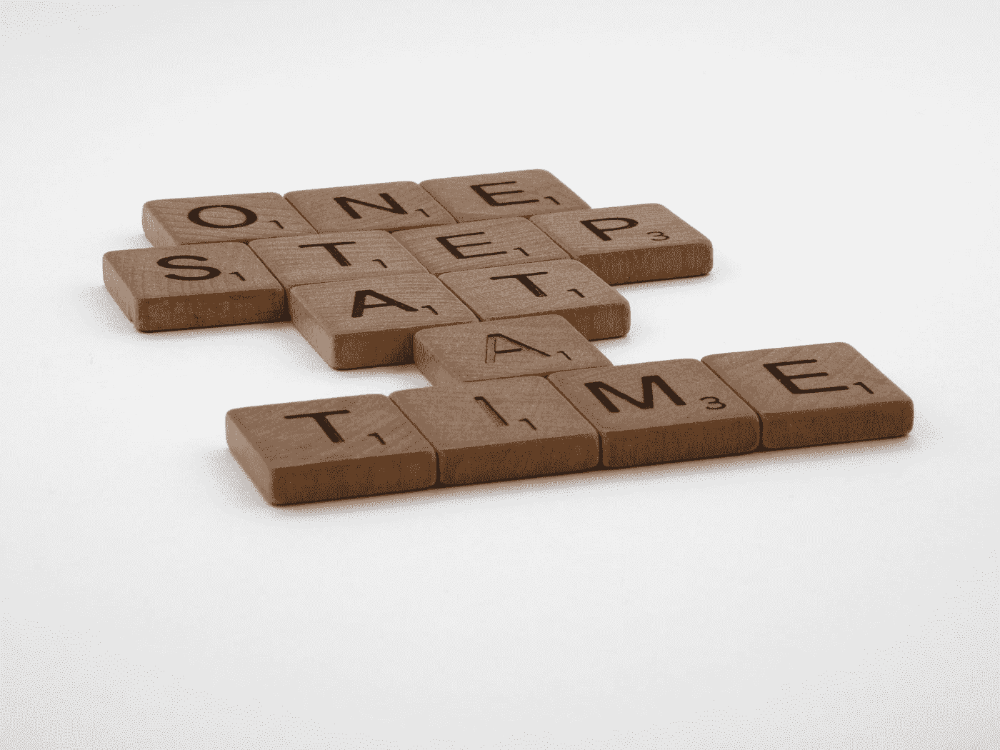
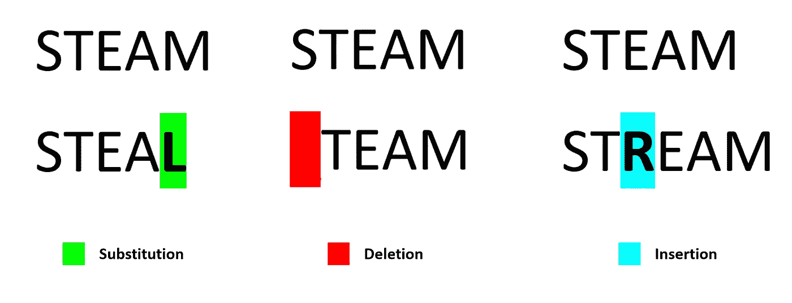
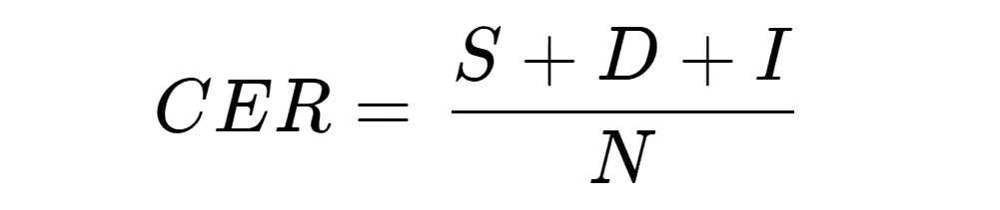
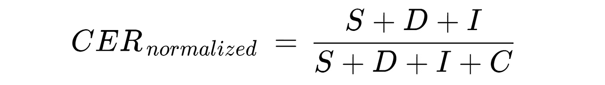
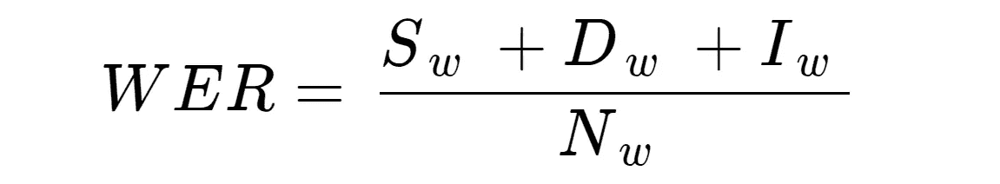
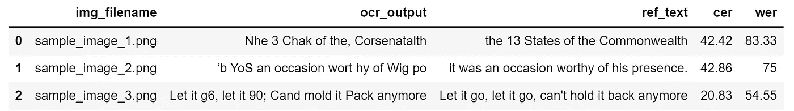

# 用字符错误率(CER)和单词错误率(WER)评估 OCR 输出质量

> 原文：<https://towardsdatascience.com/evaluating-ocr-output-quality-with-character-error-rate-cer-and-word-error-rate-wer-853175297510?source=collection_archive---------4----------------------->

## 测量光学字符识别输出质量的关键概念、示例和 Python 实现

布雷特·乔丹在 [Unsplash](https://unsplash.com?utm_source=medium&utm_medium=referral) 上的照片

## **内容**

> *(****1****)*[*评估指标的重要性*](#4fa2)*(****2****)*[*错误率和 Levenshtein 距离*](#1db9)*(****4****)*[*单词错误率(***)**](#f820)

# *评估指标的重要性*

*成功地从您的 OCR 模型生成输出的伟大工作！您已经完成了标记和预处理图像、设置和运行神经网络以及对输出应用后处理的艰苦工作。*

*现在的最后一步是评估你的模型表现如何。即使它给出了很高的置信度，我们也需要用客观的标准来衡量性能。由于您不能改进您没有度量的东西，这些度量标准是 OCR 模型迭代改进的重要基准。*

*在本文中，我们将研究用于评估 OCR 输出的两个指标，即**字符错误率(CER)** 和**单词错误率(WER)** 。*

**

*弗勒在 [Unsplash](https://unsplash.com?utm_source=medium&utm_medium=referral) 上的照片*

# *错误率和 Levenshtein 距离*

*评估预测输出的通常方法是使用*准确度*度量，其中我们表示匹配( **1** )或不匹配( **0** )。但是，这并没有提供足够的粒度来有效地评估 OCR 性能。*

*我们应该使用**错误率**来确定 **OCR 转录的**文本和**基础事实**文本(即*参考*文本被手动标记)彼此不同的程度。*

*一个常见的直觉是查看有多少字符被拼错。虽然这是正确的，但实际的错误率计算要比这复杂得多。这是因为 OCR 输出可能与基本事实文本的长度不同。*

*此外，还有三种不同类型的误差需要考虑:*

*   ***替换** **错误**:拼错的字符/单词*
*   ***删除** **错误**:丢失或遗漏字符/单词*
*   ***插入** **错误**:包含不正确的字符/单词*

**

*三个基本错误的例子 **|** 图片作者*

*现在的问题是，你如何**测量两个文本序列之间的错误程度**？这就是 Levenshtein 距离出现的原因。*

***Levenshtein 距离**是测量两个字符串序列之间差异的距离度量。它是将一个单词(或句子)变成另一个单词(或句子)所需的最少 ***单个字符(或单词)编辑***(即插入、删除或替换)次数。*

*例如，“*连指手套*和“*配件*之间的 Levenshtein 距离是 **3** ，因为将一个转换成另一个至少需要 3 次编辑。*

1.  ****m***itten→***f***itten(用 **f** 代替 **m***
2.  *fitt***e***n→fitt***I***n(用 **i** 代替 **e** )*
3.  *fittin→fittin**gg**(在末尾插入 **g***

*两个文本序列的差异越大，所需的编辑次数就越多，因此 Levenshtein 距离就越大。*

# *字符错误率(CER)*

## *(一)方程式*

*CER 计算基于 [Levenshtein 距离](#9bd1)的概念，其中我们计算了**将基本事实文本(又名*参考文本*)转换为 OCR 输出**所需的**最小**字符级操作数。*

*它用以下公式表示:*

**

*字符错误率(CER)公式*

**其中:**

*   ***S**S**=**S**S**替换的数量*
*   ***D**=D**D**删除数*
*   ***I =** 第**I**n 次*
*   ***N****=****N**参考文本中的字符数(又名地面真相)*

**加成提示:分母 N 也可以用以下公式计算:* ***N**=****S****+****D****+****C****(其中****C******

*该等式的输出代表参考文本中在 OCR 输出中被**错误**预测的字符的**百分比**。CER 值越低( **0** 为满分)，OCR 模型的性能越好。*

## *(二)举例说明*

*让我们看一个例子:*

**

*手写 ID 样本|来源:[https://commons . wikimedia . org/wiki/File:Test-OCR-handled . jpg](https://commons.wikimedia.org/wiki/File:Test-OCR-Handwritten.jpg)*

*   ****地面真相*** *参考正文* : **809475127***
*   ****OCR*** *转录输出文本* : **80g475Z7***

*有几个错误需要编辑**将 OCR 输出转换成真实情况**:*

1.  ****g*** 代替 ***9*** (参考文本字符 3)*
2.  *缺少 ***1*** (在参考文本字符 7 处)*
3.  ****Z*** 而不是 ***2*** (参考文本字符 8)*

*这样，下面是输入到等式中的值:*

*   *替换数量**=**2*****
*   ***删除数( **D** ) = **1*****
*   ***插入次数( **I** ) = **0*****
*   ***参考文本中的字符数( **N** ) = **9*****

***基于以上，我们得到(2+1+0)**/**9 =**0.3333**。当转换为百分比值时，CER 变为 **33.33%** 。这意味着序列中的每个第三个*字符都被错误转录。****

***我们对所有成对的转录输出和相应的基础事实重复该计算，并且**取这些值的平均值**以获得总的 CER 百分比。***

## ***㈢CER 正常化***

***需要注意的一点是，CER 值可以超过 100%，尤其是有很多插入的时候。例如，地面实况' **ABC'** 和更长的 OCR 输出' **ABC12345** '的 CER 是 **166.67%** 。***

***让我感到有点奇怪的是，误差值可以超过 100%，所以我四处看了看，设法找到了 Rafael C. Carrasco 写的一篇[文章，讨论了如何应用**归一化**:](https://sites.google.com/site/textdigitisation/qualitymeasures/computingerrorrates)***

> ***有时错误数除以编辑操作数(`i + s + d`)和正确符号数`c`之和，总是大于分子。***

***上述归一化技术使 CER 值始终落在 0–100%的范围内。它可以用这个公式来表示:***

******

***归一化 CER 公式***

****其中* **C** =正确的**字符数*****

## ***(四)什么是好的 CER 值？***

***没有单一的基准来定义一个好的 CER 值，因为它高度依赖于用例。不同的场景和复杂性(例如，印刷文本与手写文本、内容类型等。)会导致不同的 OCR 性能。尽管如此，还是有几个来源可供我们参考。***

***[2009 年发表的一篇关于审查大规模澳大利亚报纸数字化项目中 OCR 准确性的文章提出了这些基准(针对**印刷文本**):](http://www.nla.gov.au/ndp/project_details/documents/ANDP_HowGoodCanitGet.pdf)***

*   *****良好的** OCR 准确率:CER **1‐2%** (即 98–99%的准确率)***
*   *****平均** OCR 准确率:CER **2-10%*****
*   *****差** OCR 准确率:CER**10%**(即准确率低于 90%)***

***对于涉及**手写**文本且具有高度**异构**和**词汇外**内容的复杂案例(如申请表)，高达约 [20%](https://arxiv.org/pdf/1909.10120.pdf) 的 CER 值可视为令人满意。***

******

***照片由[思想目录](https://unsplash.com/@thoughtcatalog?utm_source=medium&utm_medium=referral)在 [Unsplash](https://unsplash.com?utm_source=medium&utm_medium=referral) 上拍摄***

# ***单词错误率(WER)***

***如果你的项目涉及特殊序列的转录(例如，社会安全号码，电话号码等。)，那么 CER 的使用将是相关的。***

***另一方面，如果单词错误率涉及有意义的单词的段落和句子的转录(例如，书页、报纸)，则单词错误率可能更适用。***

******

***单词错误率(WER)公式***

***WER 的模式与 CER 相同，但 WER 的运作方式却不同。它表示将一个**句子**转换成另一个句子所需的**单词**替换、删除或插入的数量。***

***WER 通常与 CER 有很好的相关性(假设误差率不是非常高)，尽管绝对 WER 值预计会高于 CER 值。***

***例如:***

*   ***地面真相:**‘我叫肯尼斯’*****
*   ***OCR 输出: **'myy nime iz kenneth'*****

***由上可知， **CER** 为 **16.67%，**而 **WER** 为 **75%** 。75%的 WER 值很容易理解，因为句子中 4 个单词中有 3 个被错误转录。***

# ***Python 示例(使用 TesseractOCR 和 fastwer)***

***我们已经介绍了足够多的理论，所以让我们来看一个实际的 Python 代码实现。***

***[**点击此处查看完整演示 Jupyter 笔记本**](https://github.com/kennethleungty/OCR-Metrics-CER-WER/blob/main/OCR_Metrics_CER_WER_Colab.ipynb)***

***在演示笔记本中，我运行开源的[**tesselectr**](https://github.com/tesseract-ocr/tesseract)模型，从几个手写*文本的样本图像中提取输出。然后，我利用 **fastwer** 包，从转录的输出和地面真相文本(我手动标记)中计算 CER 和 wer。****

******

***示例 Python 实现的输出|作者提供的图片***

# *****总结一下*****

***在本文中，我们介绍了 CER 和 WER 的概念和例子，以及如何在实践中应用它们的细节。***

***虽然 CER 和 WER 很方便，但他们不是 OCR 模型的防弹性能指标。这是因为原始文档的质量和状况(例如，手写清晰度、图像 DPI 等。)的作用与 OCR 模型本身同等重要(如果不是更重要的话)。***

*****欢迎您加入我的数据科学学习之旅！**关注此[媒体页面](https://kennethleungty.medium.com/)以了解更多数据科学内容，或者在 [LinkedIn](https://www.linkedin.com/in/kennethleungty/) 上联系我。享受评估您的 OCR 模型的乐趣！***

***</russian-car-plate-detection-with-opencv-and-tesseractocr-dce3d3f9ff5c>  </the-dying-relu-problem-clearly-explained-42d0c54e0d24> ***