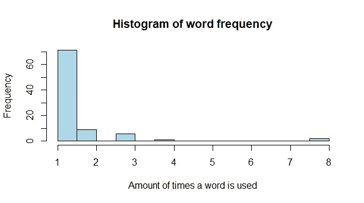
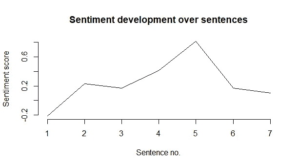
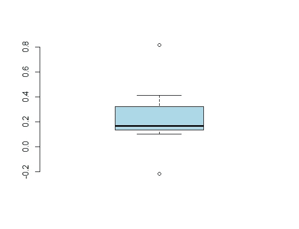

# 用 R 评估文本数据中的情感

> 原文：<https://towardsdatascience.com/evaluating-sentiment-in-textual-data-with-r-e7e0bcf44ef4?source=collection_archive---------35----------------------->

## 对于处理文本数据来说，r 是一种极好的语言。处理文本数据时，一个有用的工具是确定正在评估的文本的情感。使用 Tidyverse 和 Sentimentr 包，我们甚至不用阅读就可以获取文本的情感！

爱德华·乔佩蒂亚在 [Unsplash](https://unsplash.com?utm_source=medium&utm_medium=referral) 上拍摄的照片

让我们直入主题，评价以下三个句子:

1.  “这句话里一切都是中性的，普通的。”
2.  “这句话里的一切都是伟大而美好的。”
3.  “这句话里的一切都是恐怖而痛苦的。”

显然，第一句有中性情绪，第二句有正面情绪，第三句有负面情绪。使用 R 中的包 *sentimentr* ，我们可以用下面的代码获得每个句子的情感分数:

每个句子的情感得分如下:

在解释输出时，我们可以看到所有文本字符串都有 1 个元素 id、1 个句子、8 个单词和一个情感分数。注意，句子 1 具有 0 的情感分数，而句子 2 和 3 分别具有正和负的分数。如果我们将第三句中的“可怕”一词替换为“有趣”，新的情绪得分将为 0.088。由此看来,“有趣”似乎比“可怕”具有更高的情感分数，从而提高了句子的平均情感。

接下来，让我们使用一个文本字符串，它由几个带有不同情绪的句子组成。

考虑以下来自(虚构的)季度收益报告的文字:

“第四季度的收益为负七千万欧元。然而，相对于市场竞争而言，运营仍然保持强劲，并取得了多项 R&D 突破。在未来的时间里，我们将开始重组薄弱的业务，增加或专注于最大限度地降低管理费用和行政成本，以保持竞争力。”

将情感()函数应用于这些句子并评估情感:

输出显示我们有三个句子，字数分别是 12、21 和 26。不出意外，第一句由于亏损公告，平均情绪为负。接下来的两句话似乎更乐观一点。

此外，我们想要检查获得了情感分数的单词。有不同的词汇奖励不同的单词，选择正确的单词对匹配上下文至关重要。让我们来看看 M. L. (2017)的 Jockers 单词表。下面的代码将所有字符设置为小写，去掉标点符号，拆分字符串，并显示情感得分不为零的单词:

总共有 9 个单词获得了情感得分。有些情绪得分是有道理的(比如“突破”和“弱”)。然而，像“关注”和“竞争”这样的词不一定是积极的或消极的，因为它取决于上下文。事实上，相对于他们的竞争对手，这家公司做得很好！

让我们应用 *Loughran &麦当劳金融词汇列表(2016)*中哪个更适合金融环境。该数据集发表在 Loughran，t .和 McDonald，B. (2011 年)《什么时候负债不是负债？文本分析、字典和 10-k。”金融杂志，66:35–65。

有趣的是，当应用新的更适合的单词列表时，4 个单词被删除。还要注意单词的奖励/惩罚比前一个例子更重。这表明选择与上下文相匹配的单词列表是很重要的。

最后，让我们用更多的句子来扩展文本，并对收益报告进行一些有趣的数据可视化(仅限 base R 图)。

1.  **这篇课文倾向于重复很多单词吗？**

正如我们所看到的，这篇文章中的大多数单词都是不同的(只出现一次)。出现了 8 次的单词是“The”。

2.**每个句子中的情感是如何演变的？**

这篇文章以消极情绪开始，在第 5 句达到顶峰。在阅读报告之前，这可能是非常有趣的信息。

3.**情感分数的汇总统计看起来怎么样？**

该文本的中间情感值约为 0.2，胡须也非常接近中间值，异常值为-0.2 和 0.8。这表明该文本有一点积极的情绪。

总之，情感分析是分析文本数据的一个非常强大的工具，使用 r 中的包 *sentimentr* 和 *tidyverse* 应用起来非常简单。在评估情感得分时考虑上下文很重要，应该使用正确的单词列表/词典来更有效地捕捉文本的上下文。最后，在语料库上使用数据可视化可以给你提供有用的信息，例如单词是如何分布的，句子中的情感是如何演变的，以及摘要统计看起来如何。