# 用张量流估算盘状星系的空间倾角

> 原文：<https://towardsdatascience.com/evaluating-the-spatial-inclination-of-disk-galaxies-with-tensorflow-bea0e53442d3?source=collection_archive---------29----------------------->

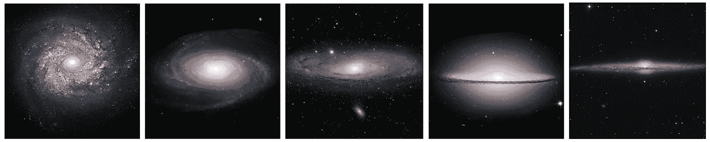

螺旋星系从正面到侧面排序。所有的图像都被旋转以使星系的半长轴水平对齐。从左到右，星系分别是(1) NGC 3982 演职员表: [*哈勃太空望远镜*](https://en.wikipedia.org/wiki/Hubble_Space_Telescope) *(HST)，(2) M81 (NGC 3031)，图像演职员表:* [*NASA*](http://www.nasa.gov/) *，*[*ESA*](http://www.spacetelescope.org/)*，以及* [*哈勃遗产*](http://heritage.stsci.edu/) *团队(【T25 图片鸣谢:* [*【刘晨】*](https://unsplash.com/photos/jgt81f_UDuU) *(4)草帽星系(M101)，鸣谢:* [*哈勃太空望远镜*](https://en.wikipedia.org/wiki/Hubble_Space_Telescope) *，(5)*NGC 4565*:*[*肯克劳福德*](https://en.wikipedia.org/wiki/NGC_4565#/media/File:Needle_Galaxy_4565.jpeg) (许可证: [CC BY-SA 3.0](https://en.wikipedia.org/wiki/en:Creative_Commons) *)。 HST 图片在“公共领域”,从维基百科下载。*

盘星系的分类在天文分析中起着重要的作用，例如测量它们的距离或它们的光被光环中的尘埃衰减。如下图所示，“*倾角*”是观测者视线与星系盘法向量之间的夹角。

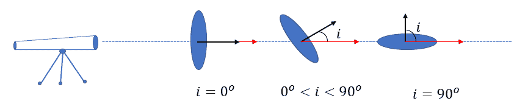

盘状星系的倾角可以粗略地从定义其边界的投影椭圆的轴比中推导出来。虽然这种近似法可能提供足够好的倾角估计，但在大约 30%的情况下，由椭圆度得出的倾角由于各种原因是有问题的，例如存在支配轴比测量的突出凸起。由于潮汐效应，一些星系甚至可能不是轴对称的。

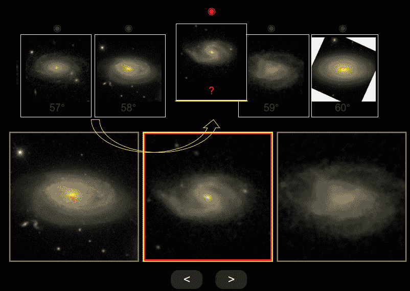

鸣谢:[银河倾斜动物园](http://edd.ifa.hawaii.edu/inclination/)

我的博士研究涉及测量大约 20，000 个螺旋星系的空间倾角。我设计了一个名为[星系倾角动物园](http://edd.ifa.hawaii.edu/inclination/) ( *GIZ* )的交互式 GUI，通过可视化地将每个星系与一组已知倾角的标准星系进行比较，找到目标星系的倾角。众包这个项目帮助我在 9 个月内获得了每个星系的至少 3 次独立测量。

*GIZ* 项目的成果为我提供了足够大的样本来调查我最喜欢的机器学习算法的潜力，如卷积神经网络(CNN)，以避免未来类似的繁琐任务。在这里，我的主要目标是从光学图像中评估螺旋星系的倾角，无论它是以灰度还是彩色格式呈现。

# 数据

为了获得每个星系的剪切图像，我从 [SDSS DR12 数据库](https://www.sdss.org/dr12/)下载了所有可用的校准单次曝光，然后我将它们转换成全曝光的灰度图像。另外，我直接从 [SDSS 快看](http://skyserver.sdss.org/dr16/en/tools/quicklook/summary.aspx?)图片服务器查询了彩色剪影。虽然我以 512x512 向 GIZ 的用户提供了所有的图片，但是为了这个项目，我将图片下采样到 128x128 来构建我的 CNN 模型。这使得模型的复杂性可以用我可用的计算资源来管理。

最初的研究要求我只包括空间倾角在 45 到 90 度之间的星系。每个星系的标签是人类用户在应用一些微小调整后独立测量的平均值。我将用户分为两组，我比较了他们对相似星系的测量，以更好地了解他们的典型表现。我发现两组之间差异的均方根是~2.6ᵒ.任何达到类似或更高精度的最大似然模型都有可能被用于未来的天文研究。


*增强图像的例子。在每个面板中，银河 PGC ID 都是青色的。红色是倾斜度，品红色是图像通带，即 r、I 和 c，其中 c 代表 RGB。*

# 数据扩充

为了避免过度拟合，我通过利用增强方法来增加样本量。每个星系的倾角与其在图像上的投影位置角度和图像质量无关。因此，我通过组合变换(如平移、旋转、镜像、添加高斯噪声、改变对比度、模糊)来运行样本，从而生成更多的图像。所有这些变换都保持图像的长宽比不变，以确保星系的椭圆形状及其倾角得以保留。因为我的样本是不平衡的，所以我在不同的倾斜间隔调整增加率，以达到标签几乎均匀分布的结果。

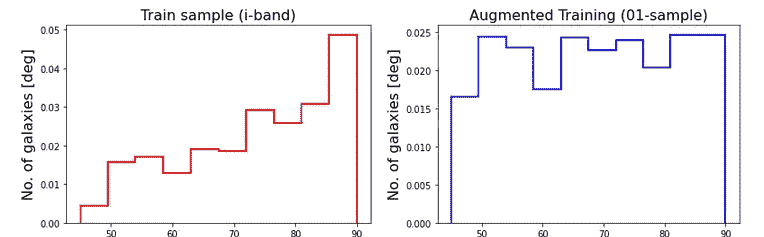

*左:原始样本星系的倾角分布。右图:增强样本倾向的分布*

# 卷积神经网络模型

在探索不同的网络架构时，我发现位于 VGG 的模型——卷积过滤器的大小为 3×3——最简单，但在解决这个问题时仍然很强大。其他知名架构如 *ResNET* 也很有吸引力。然而，在这种情况下，它们需要大量的计算资源来达到满意的结果。迁移学习是另一种方法，在这种方法中，预先训练好的网络的最后几层被去掉，并用新的几层代替，以适应问题的要求。我发现由庞大的数据集训练的网络比我所需要的更复杂，如 [ImageNet](https://www.image-net.org/) 。对于我的应用程序来说，即使重新训练这种网络的最后几层，通常也比从头开始设计和训练一个更简单的网络需要更长的时间。星系图像的本质比日常生活中可能包含许多物体、形状和颜色的照片更简单。

由于缺乏足够的计算能力，我采取了试错法来寻找令人满意的架构。为了探索许多模型，我利用了一小部分原始数据。我调查了三个表现良好的 CNN，它们在层数和自由参数方面略有不同。

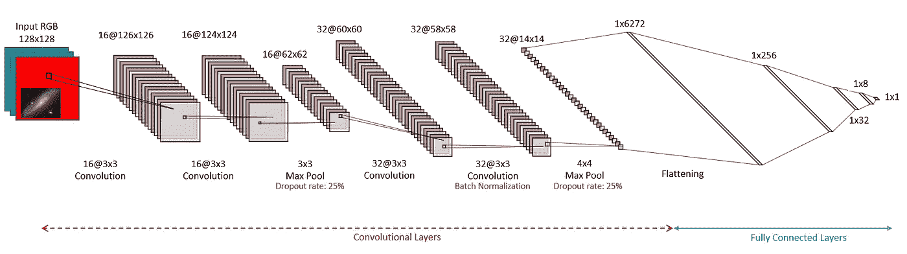

本研究中使用的最简单的卷积神经网络

在这里，我只呈现我研究的三个 CNN 中最简单的一个。该模型的自由参数总数约为 160 万。它由两组双卷积层组成，后面是 ***Maxpooling*** 和***dropooling***层。我选择`**Tanh**`作为最后一层的激活函数，因为它输出-1 和 1 之间的数字，这与我的样本中的有限倾斜范围更兼容，即 45 到 90 度。

下面是我如何在 TensorFlow 中实现这个模型:

下表显示了模型摘要:

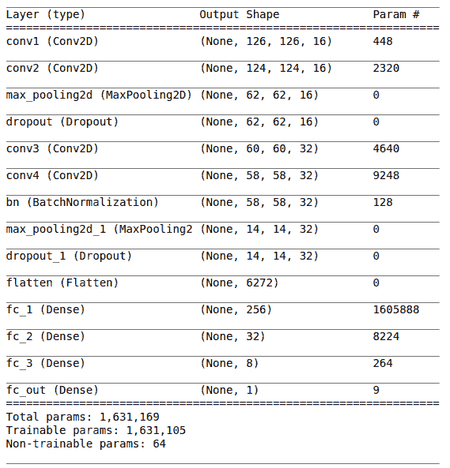

# 培养

在训练过程之前，我留出 10%的样本用于测试和模型评估。我使用“ ***亚当*** ”优化器和“ ***均方误差*** ”作为损失函数，并在训练过程中跟踪均方误差(MSE)和平均绝对误差(MAE)指标。我通过将所有图像除以 255 来标准化它们，并将倾斜度线性映射到-1 和 1 之间的值。

我使用 [Google Colab Pro](https://colab.research.google.com) 服务进行培训。对于 128x128 图像和增强，打开整个增强样本所需的内存超出了所选服务的能力。我试图通过在磁盘上存储 50 个随机批次的训练样本来解决这个问题。每个训练步骤都从加载随机训练批次开始。然后，它继续根据前一步骤重建网络，并将训练过程推进一个时期。在每一步结束时，我都会存储一个网络快照，供下一步使用。我根据需要不断更新网络，多次覆盖所有的训练批次。

在下面的代码中，`trainer`是将训练过程推进一个时期并返回性能指标的函数。

下图说明了不同训练时期的训练集和测试集的网络评估指标。训练过程显然可以在大约 1000 次迭代时停止。然而，我的实验表明，一些过度训练有助于消除预测中的倾向依赖偏差。此外，过度拟合降低了 MSE 和 MAE 指标的波动幅度。

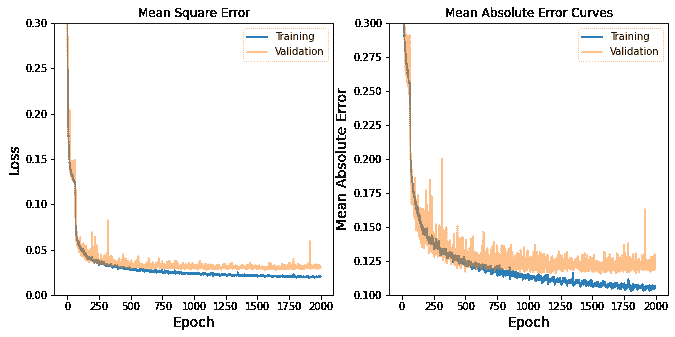

以下是我的训练方法的一些利弊:

**专业版**

*   生成尽可能多的训练星系的能力，而不用担心内存大小
*   在任何点停止训练过程，并从离开的地方继续该过程。如果由于缺少足够的内存而导致执行崩溃，这一点尤其有用，如果其他不相关的进程使系统变得混乱，这种情况更有可能发生
*   监控培训过程，并在培训过程中做出决策

**Con(s)**

*   训练时间由 i/o 过程支配，而不是在每个时期更新网络参数所需的时间

# 测试

现在，是时候用我的~ 2000 个测试星系来评估训练好的模型的性能了。

我根据模型预测的准确性来评估模型的性能。下图显示了预测倾角和测量值之间的差异，即`Δi=iₘ-iₚ`。每个点代表测试样本中的一个星系。预测值`iₚ`通过将训练好的网络应用于测试样本而直接生成。红色实线显示数据点的最小二乘线性拟合结果。

为了改善最终预测，我多次训练每个模型，以探索[引导聚合](https://en.wikipedia.org/wiki/Bootstrap_aggregating)在改善结果方面的能力。为了简单起见，我将每个训练好的模型标记为`Model_vgg (m)`，其中`m`表示模型的*味道。`m=0`表示使用整个训练样本训练的模型，`m≠0`表示基于 67%的数据训练的模型。每个面板显示一个模型的结果。RMS 和 MAE 表示δI 在零附近波动的“*均方根*”和“*平均绝对误差*”。*

如图所示，在所有情况下，差异的均方根都比~3.5ᵒ差。回想一下，基于相同指标的平均人类绩效是~2.6ᵒ.在最右边的面板中，绿点是使用所有模型口味的预测中值计算的。正如预期的那样，平均模型的 RMS 和 MAE 度量都得到了改进。希望有足够的计算资源和训练更多不同架构的模型，我们可以达到人类水平的精度。

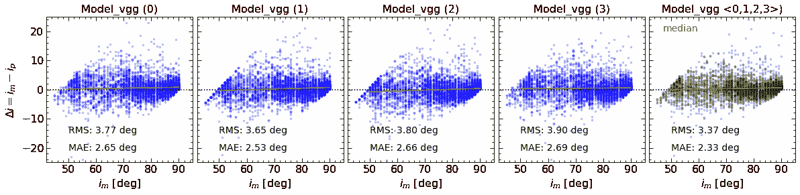

*预测值和测量值与测量值之间的差异*

# **与基于椭圆度的倾角的比较**

作为基线，我从螺旋星系投影图像的椭圆度推导出它们的倾角。倾角由观察到的轴比 b/a 确定，通过

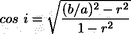

其中`r`是从侧面观察时星系的固有轴比。为了我们的目的`r=0.3`产生更真实的倾向。不过，该值不一定在整个样本中保持不变，可以低至`r=0.1`。下面，我绘制了`i`与实际倾角`iₘ`的关系图，这是我研究的所有 CNN(左)和我使用星系椭圆率计算的那些 CNN(右)的预测中值。

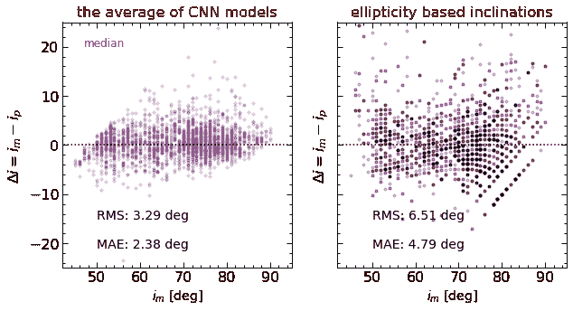

显然，CNN 模型能够产生比那些从轴比中粗略得出的更可靠的倾角。

# Web 应用程序和 API

我已经以一个 [web 应用程序](https://edd.ifa.hawaii.edu/inclinet/)和一个 REST API 的形式部署了这个项目的最佳生成模型，以满足未来的所有需求。

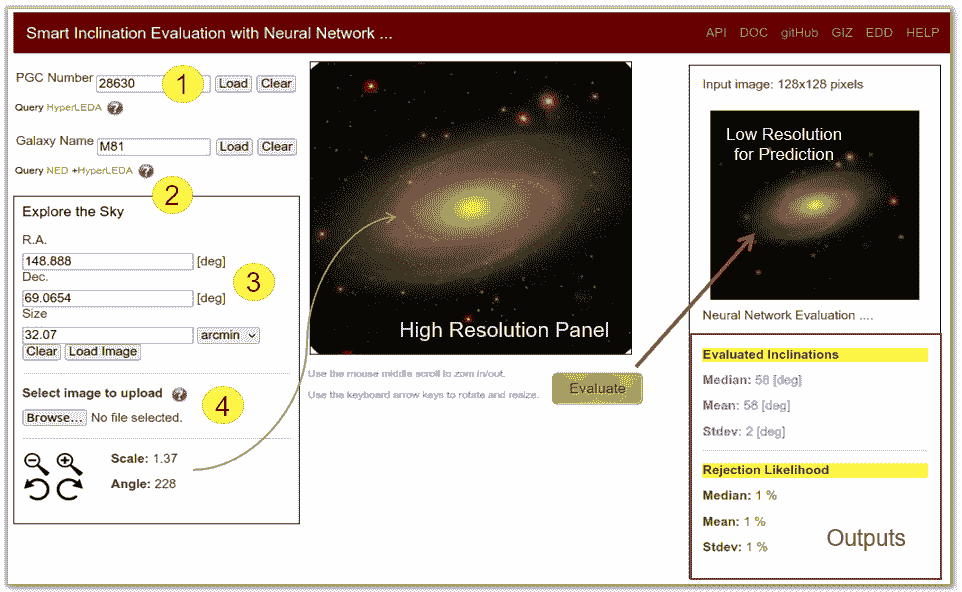

信用:[倾斜](https://edd.ifa.hawaii.edu/inclinet/)

这个在线 GUI 允许用户通过四种不同的方法提交 galaxy 图像。SDSS 覆盖的星系可以使用它们的 PGC ID (1)，通用名(2)和赤道坐标(3)来查询。用户还可以上传他们感兴趣的任何星系图像(4)。

有关如何使用 API 的完整文档，请参考:[https://edd.ifa.hawaii.edu/static/html/tutorial.html#API](https://edd.ifa.hawaii.edu/static/html/tutorial.html#API)

下面，我列出了使用这个 API 的三种不同方式。要么在您最喜欢的互联网浏览器的地址栏中输入 URL，要么简单地使用`curl`或任何您最喜欢的工具向该应用程序发送发布请求。应用程序以 JSON 格式返回评估的倾斜度。

```
$ curl http://edd.ifa.hawaii.edu/inclinet/api/pgc/<pgc_id>$ curl http://edd.ifa.hawaii.edu/inclinet/api/objname/<galaxy_name>$ curl -F ‘file=@/path/to/galaxy/image.jpg’ http://edd.ifa.hawaii.edu/inclinet/api/file
```

# 摘要

我研究了三个 CNN 模型从它们的光学图像评估螺旋星系倾角的能力。所有这些模型都表现出比基于椭圆率的倾角更好的精度。我注意到，对多个训练场景和模型架构的结果进行平均(bagging 方法)可以提高整体评估性能。

我以 web GUI 和 API 的形式在线展示了构建得最好的模型。

为了进一步改进，我建议使用来自大星系模拟的已知倾角的合成星系，如 [Illustris](https://www.illustris-project.org/) 。还可以通过引入更多的复杂性来改进数据扩充，这允许网络获得关于星系的各种实例的足够的专业知识。

如果你对更多细节感兴趣，我的代码和部署计划可以在我的 GitHub 上找到，地址是[https://github.com/ekourkchi/inclinet_project](https://github.com/ekourkchi/inclinet_project)

# 数据可用性

我在这篇文章中使用的所有倾向都在 Kourkchi 等人的表 1 中列出..145K 。该表的完整版本也可以在[河外距离数据库(EDD)](http://edd.ifa.hawaii.edu/dfirst.php) 的公共领域中以“ [CF4 初始候选者](http://edd.ifa.hawaii.edu/describe_columns.php?table=kcf4cand)”的标题获得。通过 [SDSS 成像数据库(数据发布 12)](https://www.sdss.org/dr12/imaging/) ，潜在的星系图像[可以公开](https://www.sdss.org/science/data-release-publications/)。

# 参考

*   *Cosmicflows-4:约 10，000 Tully-Fisher 距离的目录* (Kourkchi 等人，2020，ApJ，902，145， [arXiv:2009.00733](https://arxiv.org/pdf/2009.00733) )
*   *螺旋星系在光学和红外波段的整体衰减* (Kourkchi 等人，2019，ApJ，884，82， [arXiv:1909.01572](https://arxiv.org/pdf/1909.01572) )
*   *河外距离数据库，* [(塔利，R. B .等人，2009，AJ，138，323)](https://ui.adsabs.harvard.edu/abs/2009AJ....138..323T/abstract)
*   *旋涡星系中的全球性灭绝*， [(Tully et al. 1998，AJ，115，2264)](https://ui.adsabs.harvard.edu/abs/1998AJ....115.2264T/abstract)
*   银河倾斜动物园 [(GIZ)](http://edd.ifa.hawaii.edu/inclination/index.php)