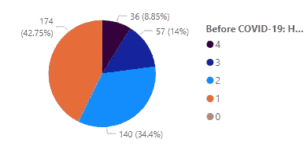
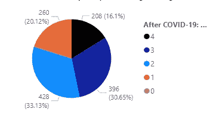
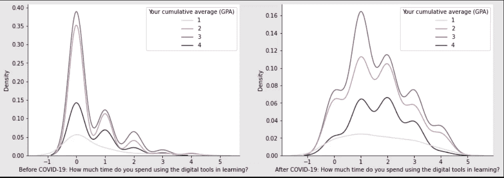
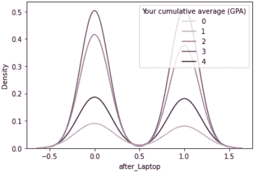
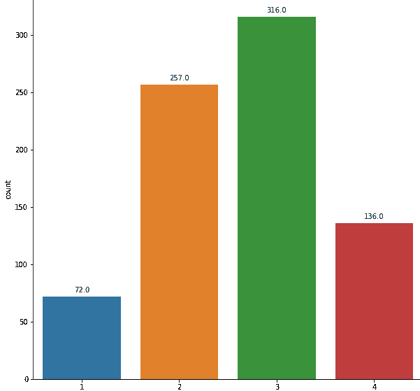
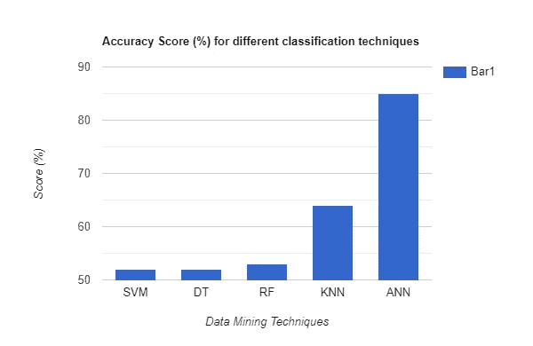
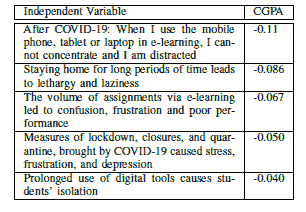

# 新冠肺炎期间学生学习成绩的评估与预测

> 原文：<https://towardsdatascience.com/evaluation-and-prediction-of-students-academic-performance-during-covid-19-40bb2b90141b?source=collection_archive---------22----------------------->

## [实践教程](https://towardsdatascience.com/tagged/hands-on-tutorials)

## 使用数据挖掘技术预测学生成绩的语义方法

又到了一年中的这个时候。考试当天早上翻阅最后几分钟的笔记，像猿猴一样狼吞虎咽地吃着早餐去赶去考场的最后一班车，到达指定的考场，无意中听到有人在讨论一个你完全不知道的话题，最后坐在长凳上，被 30 个紧张的学生围着写试卷。如果这种考前惯例对许多人来说听起来很陌生，我道歉。但是对于许多在新冠肺炎之前的学生来说(还记得吗？)我们的考试就是这样进行的，最终根据分数来评判我们的表现。但是，在这个世界上，被 30 个人包围在一个房间里听起来令人憎恶，闻所未闻，考场已经被我们的绘画室取代，教室从来没有如此错过，有没有一种方法可以让我们分析和预测学生的表现？疫情及其后遗症改变了学生的学习方式吗？如果是的话，它们以何种方式影响了学生的学业表现？

进入**教育数据挖掘(EDM)。**数据挖掘本身就是从庞大而复杂的数据集中提取模式并得出推论的方法。把单词*教育*放在它前面，它就变成了从来自教育系统的数据中寻找模式并做出推论。教育数据挖掘杂志将 EDM 定义为-

> “……一门新兴学科，致力于开发方法来探索从教育环境中获得的独特且日益庞大的数据，并使用这些方法来更好地了解学生及其学习环境”

EDM 最重要的功能之一是根据过去的活动预测学生的表现。现在，*活动*可以意味着很多事情，多年来，许多研究人员已经使用不同的指标来评估学生的表现。这可能包括查看过去的 CGPA 分数或内部评估、学生人口统计(收入水平、性别、学校类型等)。)或者课外活动。所有这些都是预测学生学习成绩的重要指标，以前也曾成功地预测过。但我们想知道的是，当学生被带离他/她的传统学习环境时会发生什么，就像禁闭期间发生的一样。这些数据挖掘技术仍然有效并能准确预测学生的表现吗？如果是这样，我们应该用什么指标来建立一个可行的模型？

# 1.资料组

有一件事变得很清楚，那就是我们需要更准确地考虑反映学生学习环境的因素。为此，我们使用约旦大学学生的数据集作为我们的主要数据集，该数据集以 Likert 类型的问卷形式记录了学生的回答。这个数据集非常有用，因为它不仅引发了学生对他们使用数字工具进行学习的反应，而且还考虑了他们过度使用所造成的心理影响，这反过来又成为学生学习成绩的一个关键因素。

<https://www.sciencedirect.com/science/article/pii/S2352340920309987>  

此外，受上述调查的启发，我们还创建了一个[谷歌表单链接](https://docs.google.com/forms/d/e/1FAIpQLSdWs_oPDMZyt4LVbXkCQVMJ-3Q31n1cRp5_cJDW0DKlDK98cw/viewform?usp=sf_link)，并将其分发给印度各大学的本科生。该表格还向学生提出了类似的问题，以及他们的人口统计信息，如年龄、级别/年级、性别和平均绩点(就像在约旦数据集中一样)，然后被添加到我们的原始数据集中。由于这两个数据集都是在封锁宣布后编译的，学生们已经习惯了使用数字工具进行学习。

下面给出了实际数据集的一小部分

超过 801 排，我想我们已经准备好了。

# 2.数据准备

在蝙蝠的右边，我们注意到许多值需要被机器翻译来理解它们。在 30 个特征列中，22 个是基于李克特量表的调查条目，1 个是二元列(性别)，其余是基于不同分类值的条目，包括我们的目标值(GPA)。为了使数据机器可读，我们将以下值转换成数字或二进制值-

1.  将所有 Likert 响应转换为数值(“强烈不同意”:0，“不同意”:1，“强烈同意”:4，“不确定”:2，“同意”:3)
2.  对所有分类特征执行一次性编码。
3.  以及我们的目标值的标签编码(GPA:'低于 60 /低于 2.0':0，' 60–69/2–2.49 ':1，' 70–79/2.5–299 ':2，' 80–89/3–3.49 ':3，'+90 / +3.5':4)和小时值(“3–6”:1，“6–9”:2，“9–12”:3，“+12”:4，“1–3”:0)。
4.  由于只有 4 行 GPA 低于 2.0，我们将其删除。
5.  移除所有 NaN 值后，我们剩下 781 行和 46 列。最后，我得到了如下所示的清理后的数据集:

已清理数据集的小样本

# 3.EDA 和特征选择

新冠肺炎前后花在数字工具上的时间

正如所料，covid 前后使用数字工具学习的时间形成了鲜明的对比。使用数字工具超过 3-6 小时的学生比例增加了 22.6%，而使用数字工具超过 9-12 小时的学生比例增加了 16.6%。但更有趣的是，我们可以看到这种变化对学生 GPA 分数的影响。为了理解这一点，我们使用**核密度估计(KDE)** ，它可以被定义如下

> 在统计学中，核密度估计是一种估计随机变量概率密度函数的非参数方法。

我们基本上可以将其解释为基于特定值的事件发生的概率密度或可能性的度量。

用于学习的数字工具上花费的时间的 KDE 图之间的比较(Covid 之前和之后)v/s CGPA

在上图中，我们看到，如果学生在疫情后花 1-3 个小时在数字工具上学习，他们有更好的机会获得更高的 CGPA。然而，在两条曲线中，过度使用在线学习工具导致学习成绩稳步下降。因此，直觉上我们可以说，过度使用数字工具可能会损害学生的学习成绩。稍后将详细介绍。

接下来，为了防止模型中的过度拟合，我们必须执行特征选择。现在，我们可以根据两个原则减少列数-

1.  如果特征本身和我们的目标值相关性不大。
2.  或者当两个特征高度相关时，我们只保留一个特征，以减少测试数据集中的差异。

为此，我们可以使用相关热图或 KDE 图。例如-

***在特征‘after _ laptop’上，KDE 分布对于‘0’和‘1’是相同的，这表明它与目标的相关性很差，因此被移除。***

# 4.重击

学生人数

在我们进入模型选择之前，我们需要考虑数据集中普遍存在的类别不平衡。处理不平衡数据集的挑战是，大多数机器学习技术将忽略少数类，从而导致少数类的性能较差，尽管通常少数类的性能最重要。为了解决这个问题，我们使用合成少数过采样技术或 SMOTE。SMOTE 的基本解释是，它会通过选择那些接近其特征空间的例子来合成新的例子，从而使少数类人口过多。或者简单地说，它将为在我们的数据集中代表不足的类生成新的行。

# 5.型号选择

在确定对数据集最具预测性的分类模型之前，我们按 0.33 的比率将数据分为测试集和训练集。之后，我们使用了 5 种数据挖掘技术，根据它们在之前的论文中对学生成绩预测的有效性-

1.  支持向量机
2.  决策图表
3.  随机森林
4.  k-最近邻
5.  人工神经网络

为了评估该模型，我们使用**【准确性】**作为我们的评分标准，它给出了所有数据点中正确预测的数据点的数量。

# 6.结论

当我们开始这个项目时，我们想回答两个问题-

1.  我们可以使用反映当前情况的非传统指标来预测学生的表现吗？
2.  疫情和随后的封锁对学生的学术生活有什么影响？

为了回答第一个问题，我们看到所有的分类技术都给了我们相当好的性能，其中人工神经网络是最准确的。因此，我们甚至可以进一步改进我们的模型，这可能会给我们带来更好的结果。

现在，要回答第二个问题，请看下表-

相关系数 b/w 自变量和目标值

这些是表格中被问到的一些问题以及它们在 GPA 中对应的系数值。这张表基本上告诉我们，同意上述问题的学生有更高的机会获得更低的 GPA 分数。这与我们在进行 EDA 时发现的数字一致，即 72.5%的学生不建议继续在线学习模式，因为“这对社会和心理都不健康”。因此，根据这项研究，我们可以得出结论，疫情效应不仅对学生的心理健康产生了负面影响，而且对他们的学习成绩也产生了不利影响。

最后，我希望这个模型可以作为任何有兴趣研究新冠肺炎以及随后对学生和教育机构实施的措施的影响的人的参考。

这里是到我的 GitHub 的[链接](https://github.com/kartikaya924/Student-Performance-Prediction-using-Data-Mining-Techniques)，它包含了这个项目使用的代码和数据集。