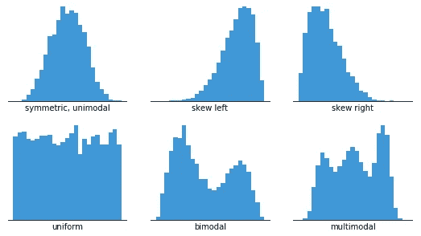
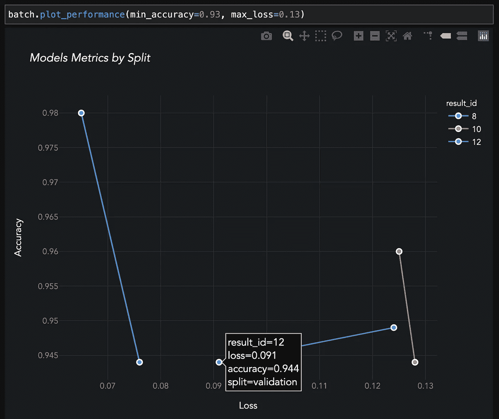
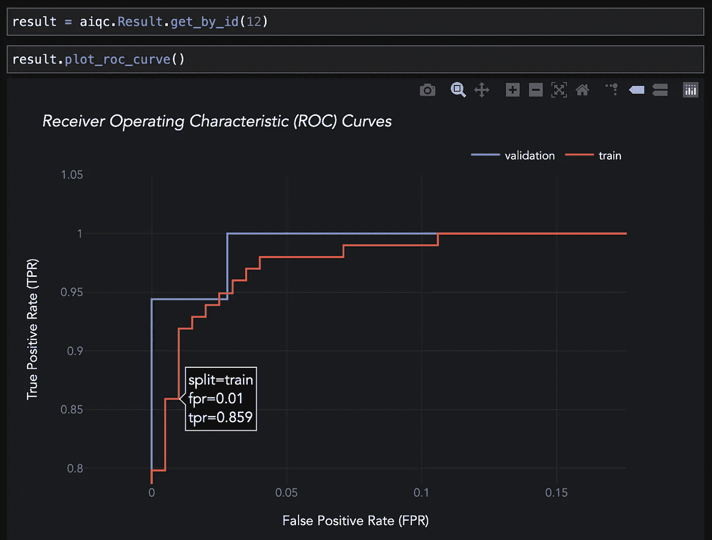
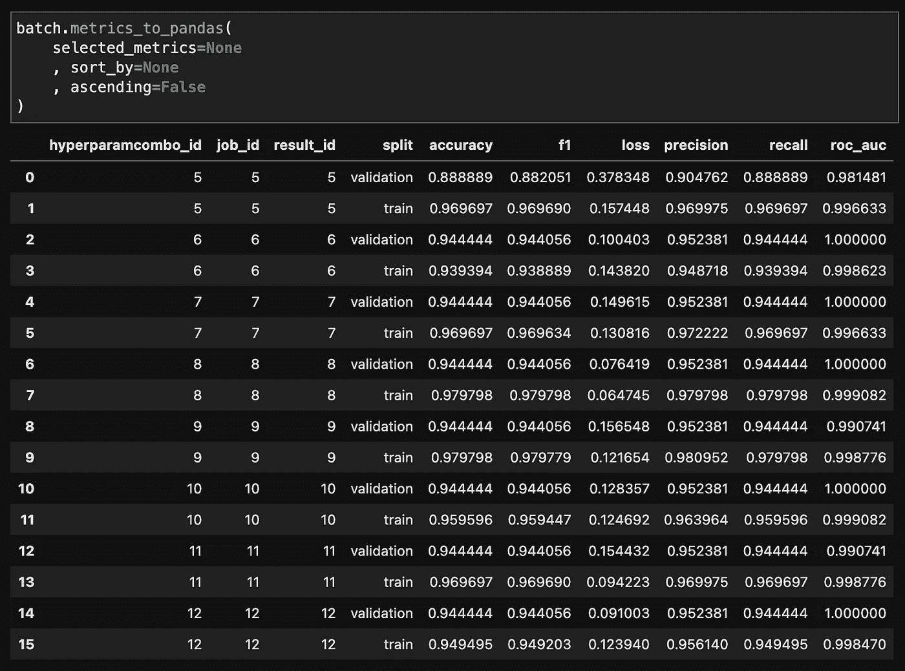

# 评估偏差

> 原文：<https://towardsdatascience.com/evaluation-bias-are-you-inadvertently-training-on-your-entire-dataset-b3961aea8283?source=collection_archive---------21----------------------->

## [入门](https://towardsdatascience.com/tagged/getting-started)

## 您是否无意中对整个数据集进行了训练？


图片来源:http://bit.ly/pexels_artichokes 安民([)](http://bit.ly/pexels_artichokes)

> 通过使用从模型对测试数据的性能中获得的洞察力，我们有效地使用了我们的整个数据集来调整模型，而无需直接在测试样本上训练模型。

# 现状。

70:30 的比例，我们随处可见。其中 70%的样本用于*训练*模型，30%留出来*测试*该模型:

```
features_train, features_test, labels_train, labels_test = sklearn.preprocessing.train_test_split(
    features, labels,
    test_size=0.30
)
```

默认情况下，这种双向分割被硬编码到大多数机器学习工具中。然而，通过思维实验，我们将探究它是如何将偏见引入我们的模型的。

# 对学术最佳实践的怀疑。

作为机器学习的新手，我担心让太多象牙塔中的最佳实践只是为了表面而悄悄进入我的工作流程。

> 百分之三十？！为什么会丢弃近三分之一的数据！这怎么被认为是数据“科学”呢？

因此，我花了一段时间来适应留出更多数据的想法，希望训练一个更具普遍性的模型。

在我想出如何在我自己的数据集上产生高精度模型之后，我对更先进技术的怀疑只是加强了——特别是当它引入第三个 ***验证分割*时。**拒绝更多来自我的训练分割训练的数据怎么可能产生更好的结果？

> 另外，我喜欢我的垃圾模特！他们成功了！“这里有人动过测试数据吗？”我问自己。“没有，没有人在碰测试数据。”我推理道。拆分发生在工作流的早期。模特是不可能看到的。那么所有的*验证*大惊小怪的是什么呢？

# 有缺陷的培训流程示例。

让我们角色扮演一个假设的和过度简化的 2 分裂训练过程的一些迭代，看看我们是否能发现关于我们的测试数据的信息在哪里泄漏。

```
Run 1
+-------+-----------+------+
| Train | (acc)     | 0.88 |
+-------+-----------+------+
| Test  | (val_acc) | 0.74 |
+-------+-----------+------+
```

看起来我们的模型在学习。很好。鉴于这是我们的第一次运行，我们可能会从这些数据中获得更多的准确性，所以让我们更改批量参数，看看会发生什么。

```
Run 2
+-------+-----------+------+
| Train | (acc)     | 0.94 |
+-------+-----------+------+
| Test  | (val_acc) | 0.87 |   # increased batch size.
+-------+-----------+------+
```

是的，当然模型那样表现更好。好的，好的，快到了。现在添加另一层，真正提取最后一层细节。

```
Run 3
+-------+-----------+------+
| Train | (acc)     | 0.98 |
+-------+-----------+------+
| Test  | (val_acc) | 0.63 |  # extra layer of depth.
+-------+-----------+------+
```

邦克！嗯，很明显，额外的一层覆盖了训练数据。因此，让我们回滚这一变化，并与我们现有的层，而不是玩神经元的数量。

```
Run 4
+-------+-----------+------+
| Train | (acc)     | 0.95 |
+-------+-----------+------+
| Test  | (val_acc) | 0.94 |  # increased neurons.
+-------+-----------+------+
```

尤里卡—数据世界的真正主人！宇宙中没有任何数据能逃过我们的推断！

# 反思。

踩刹车。这里刚刚发生了什么？我们模型的改进实际上来自哪里？

好吧，纵观所有的运行，有什么共同点？我给你一个提示——在这个工作流程中实际上有第二个神经网络在执行一个隐藏的回归分析。不，它没有深埋在反向传播的源代码中。它一直就在我们眼皮底下。是你的大脑！

作为数据科学家，在评估模型时，我们正在根据我们的性能指标执行我们自己的内部超参数扫描。我们是整个培训过程的共同点。

事实上，由于神经网络仅使用*损失*作为其改进的指导指标，其他指标如*准确性*和 *R* 的存在只是为了帮助我们了解我们的模型表现如何。

T 因此，当我们根据我们所了解到的以前的拓扑结构和超参数如何影响测试数据的准确性来改变我们的模型时，我们就在我们的模型中引入了巨大的偏差。通过使用从模型对测试数据的性能中获得的洞察力，我们有效地使用了我们的整个数据集来调整模型，而无需直接在测试样本上训练模型。

# 怎么修。

那么，我们如何才能防止自己将这种偏见引入我们的工作流程呢？

良好的第一步是开始使用第三个 ***验证分割*** 来评估您的训练跑步。这允许你真正地将你的测试数据作为*保持*分割。只有当您认为您已经有了一个模型，并且该模型能够根据它在验证数据上的表现很好地进行*概括*时，您才可以使用这种维持分离来进行评估。

> 请记住，我们使用第三次验证分割的根本原因是不要对算法隐藏样本。相反，我们这样做是为了在多次运行中重新设计算法时，对作为性能指标评估者的我们自己隐藏这一点。

跨拆分的数据分布如下所示:

```
splits = {
    "train": 0.67,
    "validation": 0.13,
    "test": 0.20
}
```

你会问，如何确定尺寸分割？这完全取决于你有多少数据。如果您有很多数据，那么您可以让您的验证和测试分割侵蚀您的训练集。然而，样本的数量(100、500、1000)实际上并不重要。这一切都是为了能够确保每一次分割都能代表更广泛的样本群体。这意味着每个分割包含相同程度的可变性。15 个学生的教室代表一个学校吗？来自日内瓦的 10，000 人的样本集准确地反映了整个欧盟吗？也许是/也许不是。

**分层。**

这种更广泛的代表性是通过*将数据*分层实现的；确保每个分割均匀分布。数据在每次分割中是否具有相同的“形状”?



图片鸣谢:Mike Yi，[直方图完全指南](http://bit.ly/histogramz) (2019) ChartIO

然而，即使我们根据我们的标签和我们所有的特征进行分层，也有可能在每次分割中存在一些看不见的可变性。我说的不仅仅是离群值。请记住，实际收集的特征只是可用于描述样本的无数特征中的一小部分。我们的模型试图在训练中梳理出一些潜在的、看不见的特征。

> ***侧边栏*** *:如果我们使用 sklearn 的* StratifiedKFold() *方法进行留一法交叉验证，实际上是免费得到验证折叠和分层。*
> 
> *然而，这意味着在将它们输入到深度学习库中时，你必须跟踪每个折叠分组的样本索引。此外，您可能没有足够的数据来确保每个文件夹中都有来自每个类的样本，这导致在计算度量时非常痛苦。它也不处理连续变量的分层。您也许可以通过一个简单的验证分割来逃脱。*

# 解决方案。

我们已经看到，引入*验证分割或折叠*给我们的工作流增加了更多的移动部分，特别是如果我们执行交叉验证的话。

幸运的是，开源的 *AIQC* 框架，用于可重复的深度学习数据准备和批量模型调整，可以为您处理这些！

[github.com/aiqc/aiqc](https://github.com/aiqc/aiqc)

在这里，我们可以看到高级 API 如何使分层数据的拆分和折叠变得轻而易举:

```
splitset = aiqc.Dataset.Tabular.make( dataFrame_or_filePath = df
    , dtype = None  *# option to force a specific data type.* , label_column = 'object'
    , features_excluded = None **, size_test = 0.22
    , size_validation = 0.12
    , fold_count = 5** *# number of folds for cross-validation.* **, bin_count = 3** *# number of bins for stratification.* *, label_encoder = None
    , feature_encoders = None  #see next blog!*
)
```

如果您需要手动访问拆分/折叠，可以通过以下方法获取:

```
Foldset.to_numpy(
    id:int
    , fold_index:int
    , fold_names:list #['folds_train_combined', 'fold_validation']
    , include_label:bool
    , include_featureset:bool
    , feature_columns:list
 )
```

之后，您甚至可以设置`hide_test=True`来防止关于您的维持集的自动化性能指标和图表被泄露。



AIQC:批量中每个模型的每个分割/折叠的自动化度量。按性能阈值过滤。在这里，测试分割是隐藏的。



AIQC:一个用于分类分析的自动化图表的例子。



AIQC:分类分析的自动化度量。

# 外卖。

*   当基于旧模型在*测试/维持数据*上的性能调整新模型时，实践者将偏差引入他们的模型。
*   添加验证分割/折叠作为缓冲，保护测试/维持数据免受审查。
*   对数据集进行切片需要分层，以确保它能够代表总体。更复杂的是，这也导致需要计算更多的指标和图表。
*   与大多数机器学习工具不同，AIQC API 可以轻松使用验证拆分/折叠，动态跟踪每个拆分/折叠，并自动计算它们的指标。

# 期待。

现在，你可能想知道，既然我们已经对数据进行了大量的分割，我们如何对每个分割/折叠进行编码呢？这是我们下一篇博客的主题！