# 评估指标

> 原文：<https://towardsdatascience.com/evaluation-metrics-18db24a91223?source=collection_archive---------22----------------------->

## 探索不同的方法来评估分类问题的机器学习模型。


图片由[卢克·切瑟](https://unsplash.com/@lukechesser)在 [Unsplash](https://unsplash.com) 上拍摄

这是 2 篇文章系列的第 1 部分，其中我们讨论了机器学习(ML)问题的不同评估指标。评估算法的输出与对算法本身建模一样重要。评估一个项目有助于确定该项目的*影响力*如何，以及如何对其进行*改进*。在本文中，我们将回顾 ***分类*** 的评估指标。那么，我们开始吧。

# 混淆矩阵

***混淆矩阵*** 是一个 *N* x *N* 矩阵，其中 *N* 表示*目标*变量中*类别*的数量(例如 *1* 和 *0* 是**的*幸存*列中的两个*类/类别***

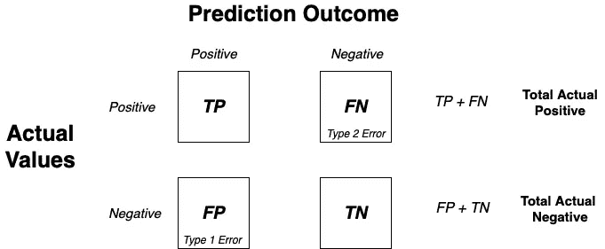

图一。混乱矩阵布局(图片由作者提供)

我们先写出预测是**正** ( ***P*** )还是**负** ( ***N*** )，然后根据实际值决定是**真** ( ***T*** )还是**假** ( ***F*** )。

```
╔═══════════╦════╦════╦════╦════╦════╦════╦════╦════╗
║ Actual    ║ 1  ║ 1  ║ 1  ║ 0  ║ 1  ║ 1  ║ 0  ║ 0  ║
╠═══════════╬════╬════╬════╬════╬════╬════╬════╬════╣
║ Predicted ║ 0  ║ 1  ║ 0  ║ 0  ║ 1  ║ 1  ║ 1  ║ 0  ║
╠═══════════╬════╬════╬════╬════╬════╬════╬════╬════╣
║           ║ FN ║ TP ║ FN ║ TN ║ TP ║ TP ║ FP ║ TN ║
╚═══════════╩════╩════╩════╩════╩════╩════╩════╩════╝
               *Table 1\. Sample Data*
```

考虑上表。对于第一种情况，预测值为 0，因此我们将*写成负*，由于实际值与预测值矛盾，我们将*写成假*，使其成为*假负* ( *FN* )。同样，评估每一个案例，计算它们，并填写混淆矩阵布局。

```
# Confusion matrix of sample data (Table 1)
from sklearn.metrics import confusion_matrix
confusion_matrix(Actual, Predicted)╔═══╦═══╗
║ 3 ║ 2 ║
╠═══╬═══╣
║ 1 ║ 2 ║
╚═══╩═══╝
```

# 分类成本

***分类成本*** (CoC)是对分类模型计算成本的一种度量。我们计算成本的方法是将*权重*分配给混淆矩阵。简单来说，如果分类正确，我们奖励*奖励*，如果分类错误，我们处罚*。*

```
╔════════╦═══════════════════╗
║        ║ PREDICTED CLASS   ║
╠════════╬════════╦════╦═════╣
║        ║ C(*i*|*j*) ║ +  ║ -   ║
║ ACTUAL ╠════════╬════╬═════╣ 
║        ║    +   ║ -1 ║ 100 ║
║ CLASS  ╠════════╬════╬═════╣
║        ║    -   ║ 1  ║ 0   ║ C(*i*|*j*): Cost of misclassifying class
╚════════╩════════╩════╩═════╝         *j* example as class *i
           Table 2*
```

这里， ***-1*** 是奖励， ***100*** 是惩罚。因此，对于上述混淆矩阵，CoC 为:

```
# Cost of sample data (Table 1)
(3 x (-1)) + (2 x 100) + (1 x 1) + (2 x 0) = **198**
```

成本越低，型号越好。

# 准确(性)

最常用的评估方法是*。它是正确预测值与总预测值之比。*

*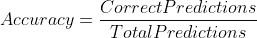**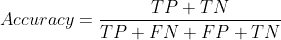*

```
*# Accuracy of sample data (Table 1)
from sklearn.metrics import accuracy_score
accuracy_score(Actual, Predicted)0.625*
```

# *准确性与 CoC*

*选择一个*精度*或 C *ost* 取决于我们为其建模 ML 解决方案的领域。考虑两个模型， ***M₁*** 和 ***M₂*** ，以及它们与以下成本和精度的权衡。*

```
*╔════════╦══════════════════╗       ╔════════╦══════════════════╗
║ M₁     ║ PREDICTED CLASS  ║       ║ M₂     ║ PREDICTED CLASS  ║
╠════════╬══════╦═════╦═════╣       ╠════════╬══════╦═════╦═════╣
║        ║      ║  +  ║  -  ║       ║        ║      ║  +  ║  -  ║
║ ACTUAL ╠══════╬═════╬═════╣       ║ ACTUAL ╠══════╬═════╬═════╣
║        ║   +  ║ 150 ║ 40  ║       ║        ║   +  ║ 250 ║ 45  ║
║ CLASS  ╠══════╬═════╬═════╣       ║ CLASS  ╠══════╬═════╬═════╣
║        ║   -  ║ 60  ║ 250 ║       ║        ║   -  ║ 5   ║ 200 ║
╚════════╩══════╩═════╩═════╝       ╚════════╩══════╩═════╩═════╝
            *Table 3*                              *Table 4*     

          Accuracy = 80%                       Accuracy = 90%              
          Cost     = 3910                      Cost     = 4255*
```

*选择哪种模式取决于一家公司在精确度和成本方面的灵活程度。让我们考虑这样一个场景，您正在开发一个模型来对患有[](https://github.com/codebankss/liver-disease-detection)*肝病的患者进行分类。在这里，我们可以通过几个*假阳性**(1 型错误)*来使它工作，但是我们不能承受*假阴性**(2 型错误)*。因此，我们希望选择一个精确度更高的模型。或者，在制造公司，我们可以承受一些错误，但成本是至关重要的，成本较低的模型将是我们的选择。**

**在以下情况下，成本与精度成正比:**

**C(+|-)=C(-|+)= q，C(+|+)= C(-|-)= p**

```
**╔════════╦═════════════════╗
║        ║ PREDICTED CLASS ║      N = a + b + c + d
╠════════╬═══════╦════╦════╣      
║        ║       ║ +  ║ -  ║
║ ACTUAL ╠═══════╬════╬════╣      Accuracy = (a + d)/N
║        ║    +  ║ a  ║ b  ║
║ CLASS  ╠═══════╬════╬════╣
║        ║    -  ║ c  ║ d  ║
╚════════╩═══════╩════╩════╝
       *Confusion Matrix*╔════════╦═════════════════╗
║        ║ PREDICTED CLASS ║      Cost = p(a+d) + q(b+c)
╠════════╬═════════╦═══╦═══╣           = p(a+d) + q(N-a-d)
║        ║ C(*i*|*j*)  ║ + ║ - ║           = qN - (q - p)(a + d)
║ ACTUAL ╠═════════╬═══╬═══╣           = N[q-(q-p)x Accuracy]
║        ║    +    ║ p ║ q ║
║ CLASS  ╠═════════╬═══╬═══╣
║        ║    -    ║ q ║ p ║
╚════════╩═════════╩═══╩═══╝
         *Cost Matrix***
```

# **比率比较**

**我们不能完全依赖准确性进行评估。考虑以下数据不平衡的情况。**

```
**╔════════╦═════════════════╗
║        ║ PREDICTED CLASS ║
╠════════╬═══════╦═══╦═════╣
║        ║       ║ + ║  -  ║
║ ACTUAL ╠═══════╬═══╬═════╣
║        ║   +   ║ 4 ║  2  ║
║ CLASS  ╠═══════╬═══╬═════╣
║        ║   -   ║ 8 ║ 486 ║
╚════════╩═══════╩═══╩═════╝
            *Table 5***
```

**上述模型的预测能力绝对*差*，然而我们有(486+4)/(4+2+8+486)=*98%*。对于这种类型的分类，精确度是不够的。它只是不够健壮。为了克服不平衡数据的问题，可以使用以下指标。**

## **真实阳性率**

**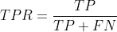**

**它的值介于 0 到 1 之间。*的 TPR 值越高，*的型号越好*。它代表了预测因子中真正的阳性率。***

## *假阴性率*

*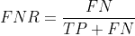*

*就像 TPR 一样，它的范围是 0 到 1。它代表预测值中的假阴性率。*降低*，使*更好*。*

*同样，我们有 TNR 和 FPR。*

## *真实负利率*

*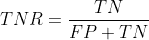*

## *假阳性率*

*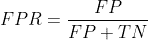*

# *精确*

****精度*** 是一个评估指标，它告诉我们在所有正面预测中，有多少*实际上是*正面的。当我们不能承受假阳性(FP)时，就使用它。*

*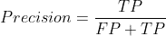*

# *回忆*

****回忆*** 告诉我们，在所有实际阳性中，有多少是预测阳性。当我们不能承受假阴性时，就使用它(FN)。较低的回忆值告诉我们，我们在数据中缺少好的例子。*

*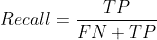*

## *精确度与召回曲线*

**

*图二。精度与召回曲线(图片由作者提供)*

# *f1-分数*

*有时候，精确和回忆孰轻孰重并不明确。因此，两者可以结合起来，以获得一个良好的模型评估方法。它叫做***F1——分数*** 。F1 是*的谐音*和*的意思是*的精确和召回。*

*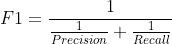*

*当精度变为*等于*时，达到最大值，以便调用。*

```
*# Classification report of sample data (Table 1)
from sklearn.metrics import classification_report
classification_report(actual, predicted)╔══════════════════╦═══════════╦════════╦══════════╦═════════╗
║                  ║ precision ║ recall ║ f1-score ║ support ║
╠══════════════════╬═══════════╬════════╬══════════╬═════════╣
║ 0                ║   0.50    ║  0.67  ║   0.57   ║    3    ║
╠══════════════════╬═══════════╬════════╬══════════╬═════════╣
║ 1                ║   0.75    ║  0.60  ║   0.67   ║    5    ║
╠══════════════════╬═══════════╬════════╬══════════╬═════════╣
║                  ║           ║        ║          ║         ║
╠══════════════════╬═══════════╬════════╬══════════╬═════════╣
║ accuracy         ║           ║        ║   0.62   ║    8    ║
╠══════════════════╬═══════════╬════════╬══════════╬═════════╣
║ macro average    ║   0.62    ║  0.63  ║   0.62   ║    8    ║
╠══════════════════╬═══════════╬════════╬══════════╬═════════╣
║ weighted average ║   0.66    ║  0.62  ║   0.63   ║    8    ║
╚══════════════════╩═══════════╩════════╩══════════╩═════════╝
                       *Classification Report**
```

# ***注***

1.  **精度*、*召回*和*F1-得分*是 ***成本敏感*** 。你不必同时考虑准确性和成本。*
2.  **精度*偏向 *C(+|+)* 和 *C(+|-)* 。*
3.  **回忆*偏向 *C(+|+)* 和 *C(-|+)* 。*
4.  **F1-评分*偏向除 *C(-|-)* 以外的所有。*
5.  *精心策划的算法的性能还取决于目标变量的****【错误分类成本】******以及训练集和测试集的*** 大小。**
6.  **F1 分数缺乏可解释性，因此应在*中与其他评估指标*结合使用。根据用例，两个指标的组合就足够了。**

# **阈值处理**

**当我们有一个模型来预测类的概率(预测是 0/1)，而不是类本身。因此，可以设置 ***阈值*** 值来根据概率将预测分类为 0 或 1。让我们更加了解。**

## **AUC-ROC**

*****AUC-ROC*** 是*曲线下面积—受试者工作特性*的缩写。这个名字来源于信号检测理论，最初用于区分 ***噪声*** 和 ***非噪声*** 。它是一个二元分类的评估度量，给出了 ***假阳性率*** 和 ***真阳性率*** 之间的权衡。**

**ROC 曲线上的每个点都是模型分类的*性能*的*表示*。改变算法、样本分布或成本矩阵的阈值会改变点的位置。考虑包含两个类的 1D 数据集— ***0*** 和 ***1*** 。**

**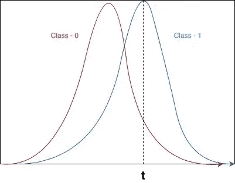**

**图三。ROC 曲线 1(图片由作者提供)**

**任何值大于 ***t*** 的点被归类为 ***类-1*** 。 *ROC 曲线 2* 的曲线下面积为 AUC-ROC 值。AUC-ROC 越高，模型越好。**

**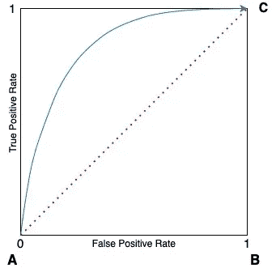**

**图 4。ROC 曲线 2(图片由作者提供)**

**图 4 中*∏ABC*的面积为 0.5(边长为 1 的正方形面积的一半)。因此，AUC-ROC 值*总是* *大于(或等于)0.5。***

## **如何绘制 ROC 曲线**

```
**╔══════════╦════════╦════════════╗
║ Instance ║ P(+|A) ║ True Class ║  Steps:
╠══════════╬════════╬════════════╣  1\. Calculate P(*+*|*A*) for each
║    1     ║  0.95  ║     +      ║     instance and sort them in 
╠══════════╬════════╬════════════╣     descending order.
║    2     ║  0.93  ║     +      ║
╠══════════╬════════╬════════════╣  2\. Take first probability as 
║    3     ║  0.87  ║     -      ║     threshold and calculate ***TPR***
╠══════════╬════════╬════════════╣     and ***FPR***.
║    4     ║  0.85  ║     -      ║
╠══════════╬════════╬════════════╣  3\. Repeat calculation of TPR and 
║    5     ║  0.85  ║     -      ║     FPR with every value of 
╠══════════╬════════╬════════════╣     P(*+*|*A*) as threshold.
║    6     ║  0.85  ║     +      ║
╠══════════╬════════╬════════════╣  4\. Plot FPR vs TPR.
║    7     ║  0.76  ║     -      ║
╠══════════╬════════╬════════════╣
║    8     ║  0.53  ║     +      ║
╠══════════╬════════╬════════════╣
║    9     ║  0.43  ║     -      ║
╠══════════╬════════╬════════════╣
║   10     ║  0.25  ║     +      ║
╚══════════╩════════╩════════════╝**
```

**现在，我们可以用这个方法**比较两个型号**吗？AUC-ROC 的问题是只考虑了概率的顺序。因此，它不能用于比较两个模型。如果我们使用 ROC 比较两个模型，它将考虑来自*单个*预测的阈值。因此，两个模型的 *TPR* 和 *FPR* 值将是相同的，它们的曲线也是如此，而两个模型的表现并不相同。它的意思是，考虑*模型 1* 预测类 *1* 的概率为 *96%* ，而*模型 2* ，对于相同的值，预测类 *1* 的概率为 *89%* 。因此，概率的顺序很重要。**

# **原木损失**

*****Log Loss*** 是每个实例的校正预测概率的对数的负平均值。对于*实际*分类值为 0，它们的预测值从 1 中减去。(注意，对于 Actual =1，我们不计算校正预测概率)**

```
**╔════════╦═════════════╦════════════╦═════════╗
║ Actual ║ Predicted   ║ Corrected  ║   log   ║
║        ║ Probability ║ Predicted  ║         ║
╠════════╬═════════════╬════════════╬═════════╣
║   1    ║    0.94     ║    0.94    ║ -0.0268 ║
╠════════╬═════════════╬════════════╬═════════╣
║   0    ║    0.56     ║ 1 - 0.56 = ║ -0.3565 ║
║        ║             ║    0.44    ║         ║
╠════════╬═════════════╬════════════╬═════════╣
║   0    ║    0.1      ║ 1 - 0.1 =  ║ -0.0457 ║
║        ║             ║    0.9     ║         ║
╚════════╩═════════════╩════════════╩═════════╝
                   *Table 6***
```

******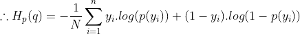**

**这里，*是*实际*类， ***p(yᵢ)*** 是实际类的*概率，*是*修正-预测概率*。它是一个用于比较两个模型的 ***健壮*** 度量。*****

*接下来，我们将讨论关于 ***回归*** 问题的评价指标。*