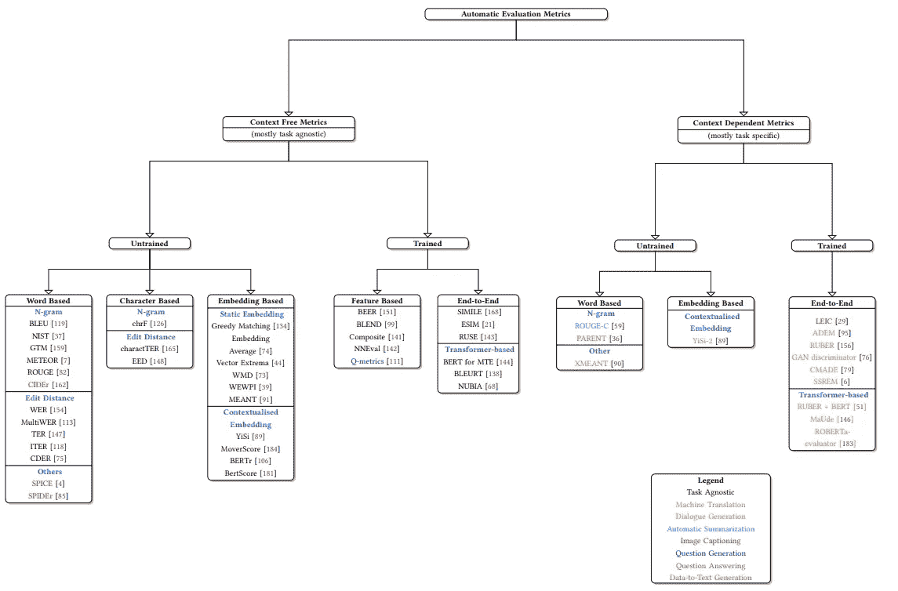
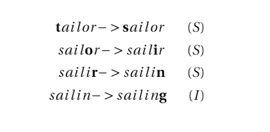
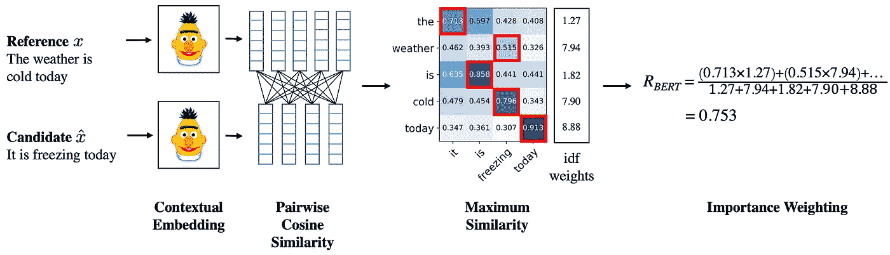
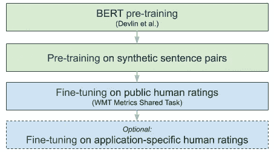
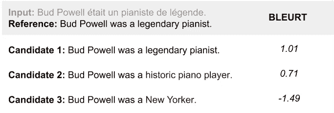
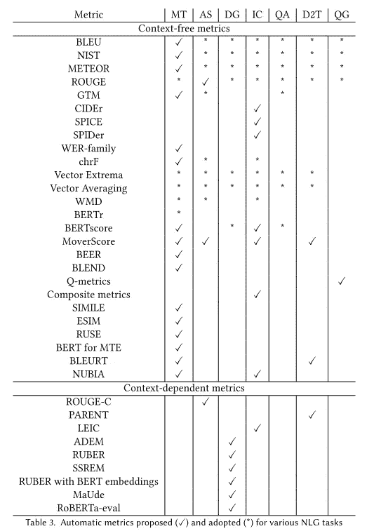

# 评价指标:评估 NLG 产出的质量

> 原文：<https://towardsdatascience.com/evaluation-metrics-assessing-the-quality-of-nlg-outputs-39749a115ff3?source=collection_archive---------13----------------------->

## 使用评估指标自动化 NLG 输出的评估流程，以节省时间并增加评分实例的容量。

詹妮弗·伯克在 [Unsplash](https://unsplash.com?utm_source=medium&utm_medium=referral) 上的照片

在我们开始之前；对于那些想直接跳到计算中并在他们的语料库上看到结果的人；最近，我们开源了一个用于评估 NLG 系统的 Python 包“Jury”。要为您的 NLG 模型计算指标，并对它们进行比较，您可以看看这个项目，并且您可以用几行代码轻松地进行设置:)。也可以阅读评审团的[官方博文。](https://medium.com/codable/jury-evaluating-performance-of-nlg-models-730eb9c9999f)

评委:[https://github.com/obss/jury](https://github.com/obss/jury)。

在机器学习领域，就像在最不相关的领域一样，我们需要某种评估。你可以想到一个学生参加考试，一辆汽车进行碰撞测试，一个 web 服务器进行负载测试，以及在 AI 中对一个模型进行性能评估。这些领域中的评估方法不同，进化标准设计也不尽相同。此程序主要用于评估模型输出的质量，以及在不同模型或不同设置之间进行比较等。

自然语言生成(NLG)是自然语言处理(NLP)的一个领域，是人工智能的一个应用子领域，其目标是产生文本输出。它有大量的子任务，如机器翻译(MT)、问题回答(QA)、摘要、问题生成(QG)等。这里，讨论是围绕输出为文本的模型的性能。NLG 主要是文本到文本，但一些 NLG 度量也可以应用并已经被采用，例如，评估语音到文本模型(如音素级别的编辑距离)。

虽然像[3]、[4]和[6]这样的早期作品是自动化评估度量发展的先驱，但它们是原始和简单的度量，还不能捕捉语言特征的一些复杂方面。他们开创的时代很快带来了改进的度量标准，其中一些被许多 NLG 任务广泛采用，但仍有关于它们是否足够的讨论。

有两种常见的方法来评估生成文本的质量(实际上有三种根据[这篇](https://en.wikipedia.org/wiki/Natural-language_generation#Evaluation)维基百科的文章):

人工评估:由人工评定者对生成的文本的质量进行评定的过程。通常，生成的输出被分发给一组人类评定者以增加多样性。

**ii)度量:**通过自动度量对生成的文本进行评级的过程，这可能需要在创建之前进行人工干预(我稍后会谈到这一点)。虽然它们中的许多都是针对特定的任务(如机器翻译)，但它们普遍适用于其他 NLG 任务。

这两种方法的主要区别在于保真度和努力/时间之间的权衡。人工评估是衡量生成文本质量的一种更好的方法，但它的成本很高。另一方面，度量具有成本效益，可以应用于大量生成的语料库，尽管它们可能不如人工评估好，并且还需要正确的参考语料库来比较生成的文本。

由[13]提出的 NLG 评估指标的一个很好的分类法(如果你想深入研究一篇调查论文，我强烈推荐你看一下这篇论文)，其中任务不可知的或任务相关的指标也被区分如下:

自动评估指标的分类[13]。

但是，在这里，我将评估指标分为 4 组，以进行总结并保持易读性:

*   字符串度量
*   基于 n 元语法的度量
*   基于嵌入的度量
*   学习功能

## **1。字符串度量**

这些是人工智能领域中用于文本输出的最早的度量标准。他们在字符或音素水平上工作。通常，这些指标属于[编辑距离](https://en.wikipedia.org/wiki/Edit_distance)系列。这一组中的大多数指标利用了编辑距离的三个主要组成部分:插入(I)、删除(D)和替换(S)。

编辑将“裁缝”转换为“帆船”，ED = 4。

上面的例子被广泛称为 Levenshtein 距离[6]。如果指标不使用替换，那么替换将计为 2 次操作，替换为序列删除和插入(反之亦然)，参见最长公共子序列(LCS)距离。

该组指标的早期版本基本上不考虑流畅性、句法和语义完整性，仅考虑词汇一致性。然而，改进的版本试图通过考虑短语转换、释义、同义词等来填补这一空白。

有许多利用编辑操作的推导，Wagner-Fischer 算法[11]，Levenshtein 距离[6]，Hamming 距离[3]等。除了在文本到文本的任务中使用之外，这些指标也被语音识别应用程序所采用。您可以看到一个[字符串指标列表](https://en.wikipedia.org/wiki/String_metric#List_of_string_metrics)。

## 2.基于 n 元语法的度量

这些度量使用 [n-grams](https://en.wikipedia.org/wiki/N-gram) 在生成的文本和参考语料库之间进行计算。这一组中广泛使用和众所周知的例子是 BLEU，它在参考语料库中寻找 n 元语法的对应，但是不考虑句法完整性和语法正确性。例如，BLEU 使用 n 元语法的顺序参数来计算 n 元语法的精度。作者提出简短惩罚来近似人类对短句的判断。

作为这个集合中的一个示例成员，您可以看到候选项 2 的二元模型精度的计算，这是计算 n 元文法顺序≥ 2 的 bleu 分数所需要的。

来源:[https://present 5 . com/cs-388-自然语言-处理-机器翻译-raymond/](https://present5.com/cs-388-natural-language-processing-machine-translation-raymond/)

早期的实验表明，BLEU 是许多 NLG 任务的良好指标，因为它与人类的判断密切相关。然而，目前人们认为 BLEU 可能会带来误导性的结果。[这里](/evaluating-text-output-in-nlp-bleu-at-your-own-risk-e8609665a213)是一篇详细的文章，聚焦于 BLEU 引起的潜在副作用，并提到了 [Rachael Tatman](https://medium.com/u/703b09baff4e?source=post_page-----39749a115ff3--------------------------------) 提出的替代方法。

这个群体的一些成员有 BLEU [10]，METEOR [1]，ROUGE [7]，NIST [2]，单词错误率(WER)[19]，翻译编辑率(TER) [16]，TER-Plus (TERP) [17]等。虽然像 WER 和 TER 这样的度量标准是从编辑距离中派生出来的，但它们是在单词级别上工作的，而不是在字符或音素级别上。

## 3.基于嵌入的度量

这组指标利用语言模型(LM)表示来计算相似性或不相似性的得分。通过 LM 获得生成的文本和参考语料库的嵌入，然后使用余弦相似性或相似性度量来计算相似性或不相似性。使用合适的 LM 可以在字符、单词、句子、段落或语料库级别上获得嵌入。人们可以简单地创建带有嵌入和某种相似或相异度量的定制计算。

由于嵌入和 LMs 的众多级别，该组中的指标相当多样化。通过不同级别嵌入和不同 LMs 的组合，可以设计通用的度量或用于特定的任务。

这组中的几个度量是嵌入平均[5]，贪婪匹配[12]，BERTscore [20]，YiSi [8]。这一组中常用的成员是 BERTScore，它使用 BERT 单词嵌入来计算候选单词和参考单词相对于候选单词和参考单词彼此的相似性(余弦相似性)。以这种方式可以看出，它类似于 F1 分数。我不打算在这里深入讨论细节，但简单地说，它还可以选择使用逆文档频率(IDF)对每个单词嵌入的余弦相似性得分进行加权。这意味着对稀有单词的匹配奖励更多，对常用单词的匹配奖励更少。BERTScore 计算阶段如下所示。

来源:https://github.com/Tiiiger/bert_score

> **一艘**宇宙飞船是**一艘**被设计用来在外层空间飞行的运载工具或机器。**一种**类型的人造卫星，宇宙飞船被用于**一**多种用途，包括通讯、地球观测、气象、导航、太空殖民、行星**探索**以及运输人类和货物。
> 
> 来源:[https://en.wikipedia.org/wiki/Spacecraft](https://en.wikipedia.org/wiki/Spacecraft)

例如，单词*“a”*由于经常出现而具有低权重，而单词*“exploration”*由于很少出现在语料库中而具有较高权重。

## 4.学习功能

这组指标的目的是找到一个映射 *f: (P，R)>人类评级*，其中 *P* 是预测(或生成的文本)，R 是引用*。*这些通过预训练回归模型提供预测和参考的端到端评估。

这些模型的输入可以有很大的不同，有些使用单词或文本嵌入，有些使用提取的统计数据和/或简单的指标(准确性、F1 等。)来自预测和参考等等。

这个群体的一些成员有格勒乌[9]，比尔[18]，鲁斯[15]，布莱特[14]等。例如，啤酒使用其他单词级别的指标，如召回率、精确度和 F1 分数，将生成的文本映射到人类评级。另一方面，RUSE 使用预测和参考的句子级嵌入来计算分数。BLEURT 是一个预训练的 BERT 模型，顶部有一个线性层。

来源:[https://ai . Google blog . com/2020/05/evaluating-natural-language-generation . html](https://ai.googleblog.com/2020/05/evaluating-natural-language-generation.html)

正如你所看到的，BLEURT 有两个预训练阶段，然后在公共人类评级上进行微调。可选地，它可以针对应用特定的人工评级进行微调，以用于手边的特定任务。下面，你可以看到 BLEURT 评价的几个候选句子。

来源:[https://ai . Google blog . com/2020/05/evaluating-natural-language-generation . html](https://ai.googleblog.com/2020/05/evaluating-natural-language-generation.html)

# 最后的话

我试图总结用于 NLG 系统的评估指标。到目前为止，我们涵盖了 4 个主要类别，它们(在某种意义上)是按时间顺序排列的。尽管这些度量标准简化了评估过程并减少了工作量，但是您应该使用相对更适合您的任务的度量标准。[13]举例说明了一些任务中几个指标的用法，如下所示。

任务间自动评估度量的使用。[13]

## 承认

特别感谢 [Cemil Cengiz](https://medium.com/u/e16ae3a11a91?source=post_page-----39749a115ff3--------------------------------) 的宝贵反馈，以及所有 obss ml 团队的讨论和支持。

# **参考文献**

班纳吉，s .，&拉维，A. (2005 年 6 月)。METEOR:一种与人类判断有改进相关性的机器翻译评估的自动度量。在*关于机器翻译和/或摘要的内在和外在评估措施的 acl 研讨会会议录*(第 65–72 页)。

多丁顿，G. (2002 年 3 月)。基于 n 元语法共现统计的机器翻译质量自动评估。第二届人类语言技术研究国际会议论文集*(第 138-145 页)。*

**【3】**海明，R. W. (1950)。错误检测和纠错码。*贝尔系统技术期刊*， *29* (2)，147–160。

**【4】**亨特，M. J. (1990)。评估连接词识别器的品质因数。*言语交际*， *9* (4)，329–336。

**【5】**兰道尔，t . k .&杜迈斯，S. T. (1997)。柏拉图问题的解决方案:知识的获取、归纳和表征的潜在语义分析理论。*心理复习*， *104* (2)，211。

**【6】**Levenshtein，V. I. (1966 年 2 月)。能够纠正删除、插入和反转的二进制代码。在*苏联物理学多克拉迪*(第 10 卷第 8 期第 707–710 页)。

林春燕(2004 年 7 月)。Rouge:一个自动评估摘要的包。在*中，文本摘要分支出*(第 74-81 页)。

**【8】**Lo，C. K. (2019，8 月)。YiSi --一个统一的语义机器翻译质量评估和估计标准，适用于具有不同级别可用资源的语言。在*第四届机器翻译会议论文集(第二卷:共享任务论文，第一天)*(第 507–513 页)。

【9】羊肉，a，德拉斯，m，万，s，&戴尔，R. (2007，6 月)。GLEU:句子级流利度自动评测。在*计算语言学协会第 45 届年会的会议录*(第 344-351 页)。

**【10】**帕皮尼，k，鲁科斯，s，沃德，t，&朱，W. J. (2002 年 7 月)。Bleu:一种自动评估机器翻译的方法。计算语言学协会第 40 届年会论文集(第 311-318 页)。

罗伯特·a·瓦格纳和迈克尔·j·费舍尔。1974.*串对串校正问题*。《美国计算机学会杂志》第 21 卷，第 1 期(1974 年 1 月)，第 168-173 页。DOI:https://DOI . org/10.1145/321796.321811

**【12】**俄罗斯，v .&林泰恩，M. (2012 年 6 月)。使用单词到单词的相似性度量对自然语言学生输入的最佳评估。在*智能教学系统国际会议上*(第 675–676 页)。斯普林格，柏林，海德堡。

**【13】**赛，A. B .，莫汉库马尔，A. K .，&哈普拉，M. M. (2020)。用于 NLG 系统的评价标准综述。arXiv 预印本 arXiv:2008.12009

**【14】**t . Sellam，d . Das，& Parikh，A. P. (2020)。BLEURT:学习文本生成的健壮度量。arXiv 预印本 arXiv:2004.04696

**【15】**岛中香，h .，Kajiwara，t .，&小牧，M. (2018，10 月)。Ruse:使用句子嵌入进行自动机器翻译评估的回归器。在*第三届机器翻译会议论文集:共享任务论文*(第 751–758 页)。

****斯诺弗，m .，多尔，b .，施瓦茨，r .，米丘拉，l .，&马霍尔，J. (2006 年)。有针对性人工标注的翻译编辑率研究。在*美洲机器翻译协会第七届会议论文集:技术论文*(第 223–231 页)。****

****斯诺弗，马修&马德纳尼，尼廷&多尔，邦妮&施瓦茨，理查德。(2009).TER-Plus:翻译编辑率的释义、语义和对齐增强。机器翻译。23.117–127.10.1007/s 10590–009–9062–9。****

*****斯塔诺耶维奇，m .&西玛安，K. (2014 年 6 月)。啤酒:作为排名更好的评价。第九届统计机器翻译研讨会论文集(第 414-419 页)。*****

*******，[19]，**苏桂英，吴明伟，&常建生(1992)。机器翻译系统的一种新的定量质量度量。载于【1992 年第 2 卷:第 14 届计算语言学国际会议。*****

*******【20】**张，t，基肖尔，v，吴，f，温伯格，k . q .&阿奇，Y. (2019)。bertscore:用 Bert 评估文本生成。 *arXiv 预印本 arXiv:1904.09675* 。*****