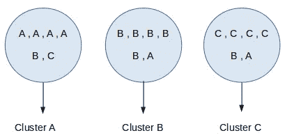
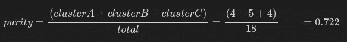
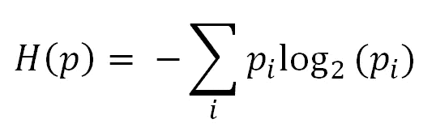
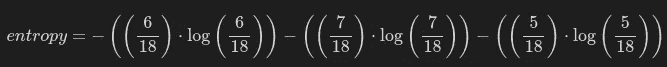
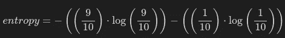
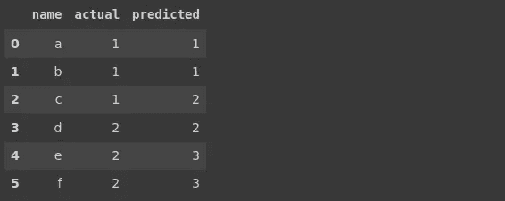
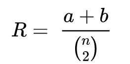

# 聚类模型的评估指标

> 原文：<https://towardsdatascience.com/evaluation-metrics-for-clustering-models-5dde821dd6cd?source=collection_archive---------5----------------------->

## 解释了 3 种不同的聚类指标


照片由 [Howard Bouchevereau](https://unsplash.com/@howardbouchevereau?utm_source=unsplash&utm_medium=referral&utm_content=creditCopyText) 在 [Unsplash](https://unsplash.com/s/photos/cluster?utm_source=unsplash&utm_medium=referral&utm_content=creditCopyText) 上拍摄

聚类是机器学习中的一项基本任务。聚类算法以将相似数据点分组在一起的方式将数据点分组在聚类中。

聚类算法的最终目标是实现高的类内相似性和低的类间相似性。换句话说，我们希望同一个集群中的数据点尽可能相互靠近。不同集群之间的距离需要尽可能大。

有不同的度量用于评估聚类模型的性能或聚类质量。在本文中，我们将介绍以下指标:

*   纯洁
*   标准化互信息
*   兰德指数

# 纯洁

纯度很容易计算。我们根据最常见的类别为每个聚类分配一个标签。那么纯度就变成正确匹配的类和聚类标签的数量除以总数据点的数量。

考虑这样一种情况，我们的聚类模型将数据点分成 3 个聚类，如下所示:



(图片由作者提供)

每个聚类被分配有最频繁的类别标签。我们将每个聚类中正确类别标签的数量相加，然后除以数据点的总数。



(图片由作者提供)

一般来说，纯度随着簇数的增加而增加。例如，如果我们有一个模型，将每个观察值分组到一个单独的簇中，那么纯度就是一。

正是因为这个原因，纯度不能作为聚类数量和聚类质量之间的折衷。

# 标准化互信息

NMI 与信息论有关。我们需要理解熵是什么，所以我先简单解释一下。

熵是一种量化不确定性的度量。



熵公式(图片作者提供)

Pi 是标签 i (P(i))的概率。让我们计算前面例子中的类标签的熵。

我们可以通过将属于该类别的数据点的数量除以数据点的总数来计算类别标签的概率。例如，A 类的概率是 6 / 18。

在我们的例子中，熵的计算如下。如果你运行计算，你会看到结果是 1.089。



(图片由作者提供)

标签在类之间近似平均分布，因此我们有相对高的熵。

熵随着不确定性的降低而降低。考虑这样一种情况，我们有两个类别(类别 A 中有 9 个数据点，类别 B 中有 1 个数据点)。在这种情况下，如果我们要预测随机选择的数据点的类别，我们比前一种情况更有把握。这种情况下的熵计算如下，结果为 0.325。



(图片由作者提供)

我们现在对熵有了基本的了解。当给定聚类标签时，归一化互信息(NMI)给出了类别标签的熵的减少。

在某种意义上，NMI 告诉我们当我们知道聚类标签时，关于类标签的不确定性减少了多少。

它类似于决策树中的信息增益。在构建决策树的过程中，每一次拆分都会给模型增加信息增益。事实上，选择了导致最高信息增益的分割。

回想一下有三个集群的案例。由于每个类别中的数据点数量大致相等，因此我们无法确定随机选取的数据点的类别。


(图片由作者提供)

然而，如果我们知道一个数据点属于聚类 A，则该点很可能属于 A 类。因此，我们的不确定性降低了。NMI 测量这种不确定性的减少。因此，它是聚类质量的度量。

NMI 的一个优点是，我们可以用它来比较具有不同聚类数的不同聚类模型，因为 NMI 是归一化的。

scikit-learn 的[normalized _ mutual _ info _ score](https://scikit-learn.org/stable/modules/generated/sklearn.metrics.normalized_mutual_info_score.html#sklearn.metrics.normalized_mutual_info_score)函数可用于计算 NMI。

# **兰德指数**

Rand 指数是两个聚类之间相似性的度量。我们可以用它来比较实际的类标签和预测的聚类标签，以评估聚类算法的性能。

第一步是创建一组无序的数据点对。例如，如果我们有 6 个数据点，该集合包含 15 个无序对，也称为二项式系数。使用 Python 的 scipy 包可以很容易地计算出二项式系数的数量。

```
import scipy.specia
scipy.special.binom(6,2)
15
```

考虑我们有以下数据点。



(图片由作者提供)

数据点的无序对是{a，b}、{a，c}、{a，d}、{a，e}、{a，f}、{b，c}、{b，d}、{b，e}、{b，f}、{c，d}、{c，e}、{c，f}、{d，e}、{d，f}、{ d，f}、{e，f }。

为了计算 rand 指数，我们对两个值感兴趣:

*   对于实际聚类和预测聚类，一对元素**在同一个聚类中的次数**。
*   对于实际聚类和预测聚类，一对元素**不在同一个聚类中的次数**。

对于实际和预测，对{a，b}中的元素在同一个群集中。另一对符合这个描述的是{e，f}(共 2 对)。

对于实际聚类和预测聚类，对{a，d}中的元素位于不同的聚类中。符合该描述的其他对是{a，e}、{a，f}、{b，d}、{b，e}、{b，f}、{c，e}、{c，f}(总共 8 对)

我们现在可以介绍兰德指数的公式:



兰德指数(作者图片)

*   a 是一对元素**在实际和预测聚类的同一个聚类中的次数**,我们计算为 2。
*   b 是一对元素**不在实际和预测聚类的同一个聚类中的次数，我们计算为 8。**
*   分母中的表达式是二项式系数的总数，即 15。

因此，这种情况下的 rand 指数是 10 / 15 = 0.67

scikit-learn 的 [rand_score](https://scikit-learn.org/stable/modules/generated/sklearn.metrics.rand_score.html#sklearn.metrics.rand_score) 函数可用于计算 rand 指数。

## 结论

我们已经讨论了聚类模型的 3 个常用评估指标。评估模型和创建模型一样重要。如果没有可靠和全面的评估，我们可能会在模型部署后得到意想不到的结果。

对评估指标的全面理解对于有效和恰当地使用它们至关重要。

感谢您的阅读。如果您有任何反馈，请告诉我。