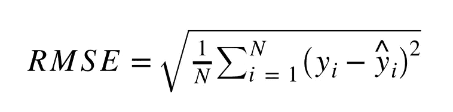

# 机器学习的评价标准

> 原文：<https://towardsdatascience.com/evaluation-metrics-for-machine-learning-2167fca1a291?source=collection_archive---------22----------------------->

## 某些度量比其他度量更好地度量模型性能。

艾萨克·史密斯在 [Unsplash](https://unsplash.com?utm_source=medium&utm_medium=referral) 上拍摄的照片

有太多的指标来确定机器学习模型的性能。了解哪种评估指标将正确地度量您的模型性能是有益的。某些度量比其他度量更好地度量模型性能，这取决于用例。我们将回顾回归和分类模型的一些通用评估指标。

# 回归

回归用于预测连续输出并使误差最小化。例如，您可以使用回归模型来预测销售额或收入。回归模型的两个基本评估度量是平均绝对误差和均方误差。

*注意:计算回归度量的一个技巧是逆向工作。让我们以平均绝对误差(MAE)为例。首先计算误差，然后是绝对值，最后是平均值。我们基本上是把 MAE 倒过来算成了“EAM”。*

## 平均绝对误差

**平均绝对误差**计算实际值和模型预测值之间的绝对差值。MAE 很适合用作基线，因为它考虑了绝对误差。使用 MAE 的问题在于，度量是相对于值和残差的。例如，什么被认为是好的或坏的 MAE？显然，您希望 MAE 接近 0，但是当您的误差值较大时，使用 MAE 评估您的模型会变得更加困难。

*注意:使用绝对误差也用作套索回归的 L-1 归一化*

计算 MAE 的公式:

梅公式

## 均方误差

**均方误差**计算误差，然后计算差值的平方，然后计算平均值。MSE 是另一个用作基线的好指标，因为它是一个像 MAE 一样的基本评估指标。然而，由于每个值都是平方的，所以 MSE 会增加误差。再次导致评估你的模型变得困难。

*注意:使用 sqaured 值也用作岭回归的 L-2 归一化*

计算 MSE 的公式:

MSE 公式

## RMSE(均方根误差)

**均方根误差**就像 MSE 一样，但是取输出的平方根。RMSE 是另一种基于残差平方的基本评估指标，但对较大误差的惩罚更大。

计算 RMSE 的公式:

RMSE 公式

## MAPE(平均绝对百分比误差)

**平均绝对百分比误差**尝试用 MAE 解决问题。其中 MAE 是相对的，基于残差的大小。MAPE 会将误差转换为百分比，其中您希望您的 MAPE 尽可能接近 0。还有其他使用绝对值和百分比的指标。(如猿、加权 MAPE、对称 MAPE 等。)

计算 MAPE 的公式:

MAPE 公式

## 平均绝对标度误差

**平均绝对比例误差**是一个允许您比较两个模型的指标。使用每个模型的 MAE，您可以将新模型的 MAE 放在分子中，将原始模型的 MAE 放在分母中。如果 MASE 值小于 1，则新模型的性能会更好。如果 MASE 值等于 1，则模型执行相同的操作。如果 MASE 值大于 1，则原始模型的性能优于新模型。

计算 MASE 的公式:

梅斯公式

# 分类

分类用于预测离散输出。一个流行的例子是“热狗/不是热狗”的概念。分类器旨在最大化可能性，以确定样本应如何分类。

## 准确(性)

准确性是最基本的指标之一，但经常会产生误导。原因是由于不平衡的阶级。如果你有一个达到 98%准确率的分类器，但是 98%的数据被归类为同一个标签，那么你的模型不一定很好。这是因为您的模型只是将所有东西都标记为同一个类。

举例:你有 98 个“热狗”，2 个“不是热狗”。你的模型会把所有东西都标上“热狗”的标签，不管它是什么，但仍然有 98%的准确率。即使这个模型完全忽略了其他的一切。

因此，您应该添加平衡数据的方法。(例如，上/下采样、合成数据等。)

精确度公式

## 精确

精度评估您的模型在进行预测时的精度。如果您希望您的模型在标记数据时保持保守，这是一个值得注意的好指标。明智地使用精度的一个例子是，当你的模型产生的每个“正面”标签都有很高的成本时。

精确公式

## 回忆

召回评估模型的敏感度。基本上，它检查您的模型在标记相关样本方面有多成功。

回忆公式

## f 分数

F 值，也称为 F 值，是精确度和召回率的调和平均值。如果您想在模型的精确度和召回率之间找到平衡，F 值是一个很好的衡量标准，应该用来找到一个总体上较好的模型。

*注:在下文中，下标“p”表示被归类为“肯定”的预测。*

f 分数公式

# 我可以使用哪些工具来帮助生成评估指标？

一般来说，Scikit Learn 有很棒的[评估度量函数](https://scikit-learn.org/stable/modules/model_evaluation.html)。对于分类度量标准，[分类报告](https://scikit-learn.org/stable/modules/generated/sklearn.metrics.classification_report.html#sklearn.metrics.classification_report)功能为您处理了很多事情，并快速显示了模型性能。特别列出了精确度、召回率和 F 值。

# 摘要

根据您的用例选择评估指标。不同的指标更适合不同的目的。选择适当的指标还可以让您在向他人展示您的数据和发现时，对您的模型更有信心。

另一方面，使用错误的评估指标可能对机器学习用例有害。一个常见的例子是关注准确性，使用不平衡的数据集。

需要一个起点并希望获得更多 Python 经验？查看 Scikit Learn 的[评估指标函数](https://scikit-learn.org/stable/modules/model_evaluation.html)。

# 链接

*   [Scikit 学习评估指标](https://scikit-learn.org/stable/modules/model_evaluation.html#classification-metrics)
*   [线性回归](/what-is-linear-regression-e44d2c4bf025)
*   [逻辑回归](/what-is-logistic-regression-d3f59ef1a9b)
*   [原版 Jupyter 笔记本](https://github.com/frankiecancino/ML-Tutorials/blob/master/evaluation_metrics.ipynb)
*   [领英](https://www.linkedin.com/in/frankie-cancino/)
*   [推特](https://twitter.com/frankiecancino)