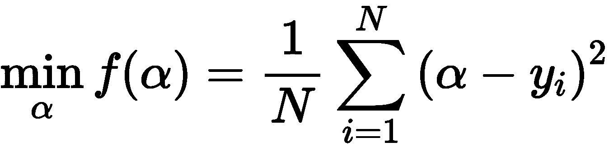

# 评估指标，续

> 原文：<https://towardsdatascience.com/evaluation-metrics-ii-e6f09ded4981?source=collection_archive---------28----------------------->

## 探索评估机器学习模型的不同方法系列的第 2 部分。


图像由[](https://unsplash.com/@chrisliverani)****上[**下**](https://unsplash.com)****

****在文章的**第二**部分，*评估度量*，我们将讨论不同的度量来评估 ***回归*** 算法。(第一部分可以在这里找到[](/evaluation-metrics-18db24a91223)*。)*****

*****在回归中，我们通过比较*预测值*和*实际值*来计算**误差**。误差决定了**预测值与**实际值的差距。误差的符号( **+** 或 **-** )让我们知道误差从*最佳拟合*回归线变化的方向。*****

```
 ***+--------------+-----------------+----------------------+
     | Actual Value | Predicted Value | Error                |
     |              |                 | (Predicted - Actual) |
     +--------------+-----------------+----------------------+
     | 19           | 28              |  9                   |
     +--------------+-----------------+----------------------+
     | 37           | 33              | -4                   |
     +--------------+-----------------+----------------------+
     | 25           | 20              | -5                   |
     +--------------+-----------------+----------------------+
     | 9            | 16              |  7                   |
     +--------------+-----------------+----------------------+
     | 22           | 15              | -7                   |
     +--------------+-----------------+----------------------+
                 *Table 1\. Sample Values and Error****
```

*****对于一个 ***分类*** 模型，如果它的评价度量得分是 0.8，那么它比一个随机*基线*模型的得分 0.5 要好得多(假设两个类的概率相等)。同样，在*回归中，*基线*可以被认为是用于评估目的的'*平均值'*或*'中位数'*。******

# ******均方误差******

*********MSE*** 因为简单，所以是*回归*的基本评价指标之一。它是*目标*值与*预测*值的*平方* *差值*的**平均值**。******

************

******图一。MSE 公式******

******MSE 去除了误差的负号，甚至惩罚了一个小误差，但是因为我们取误差的平方，它改变了误差的单位*(变成平方)。*******

*******为使 MSE 准确工作，数据应遵循正态分布****无异常值*** ，误差应无偏。MSE 越低，模型越好。********

*********目标均值*** 值最小化 MSE。考虑一个例子。给我们成对的数据:特征 ***𝑥ᵢ*** 和对应的目标值 **𝑦ᵢ ∈ *ℝ*** 。让我们将目标向量表示为**𝑦ᵢ∈*ℝ𝑁*t15】，这样 **𝑦ᵢ** 就是对象 **𝑥ᵢ** 的目标。同样，**𝑦̂∈*ℝ*t23】表示对物体的预测: **𝑦̂ᵢ** 表示物体 **𝑥ᵢ.************

****现在，如果所有 **𝑥ᵢ** 的预测值都等于 **𝛼: 𝑦̂ᵢ=𝛼** ，那么 **𝛼** 的值会使 MSE 误差最小化？****

********

****图二。最小化 MSE****

****我们需要*最小化*函数 **𝑓(𝛼)** 。相对于 **𝛼** 来说*是平滑的。因此， **𝛼*** 成为局部最优的必要条件是*****

********

****让我们找到满足条件的点:****

********

****由于*二阶导数* ( **d f/d𝛼** )在点 **𝛼*** 处为正，那么我们发现的就是局部极小值。因此，我们可以得出结论，MSE 度量的*最优*常数是 ***目标均值*** 值。****

# ****平均绝对误差****

*******MAE*** 是*绝对值*的*平均值*误差。MAE 的*基线*模型为 ***中位数*** 。如果 MAE 是*小*，这意味着模型预测的是*中值*。****

********

****图三。梅公式****

*****MAE* 是最基本的，非负误差计算方法。在计算误差时，必须使数值为非负值，否则，在大多数情况下，负值会抵消正值。MAE 的输出是*线性*。因此，大误差不会盖过小误差，并给出模型的无偏视图。或者，由于 MAE 是线性的，它不能(通过平方)给大或小的误差加权。****

*******目标中值*** 最小化 MAE。就像我们为 MSE 做的一样，我们能找到 MAE。这里，我们需要回答什么样的 **𝛼** 值会最小化 MAE 误差？****

********

****图 4。最小化 MAE****

****回想一下(∂|𝑥|/𝑑𝑥) = 𝑠𝑖𝑔𝑛(𝑥)，其中𝑠𝑖𝑔𝑛代表[符号功能](https://en.wikipedia.org/wiki/Sign_function)。因此，****

********

****所以我们需要找到这样的𝛼*****

********

****注意 **𝑔(𝛼*)** 是一个*分段常数非减*函数。**𝑔(𝛼*)=-1**为小于最小值的 **𝛼** 的所有值 *𝑦ᵢ* 和 **𝑔(𝛼*) = 1** 为 **𝛼 >最大值 *ᵢ 𝑦ᵢ*** 。功能*通过 **2/𝑁** 在每一点 **𝑦ᵢ** 跳转*。这里有一个例子，这个函数对于**𝑦**=[*-0.5，0，1，3，3.4* :****

********

****图五。 **𝑔(𝛼)** vs **𝛼** 剧情****

****基本上同样大小的 **𝑁** *跳跃*，从**1**开始，到 **1** 结束。很明显，你需要做的是关于**𝑁/2**t40】跳跃来撞击*零点*。这恰好发生在目标向量 **𝑔(𝑚𝑒𝑑𝑖𝑎𝑛(𝑦))=0** 的 ***中值*** 处。我们要小心区分两种情况:当有 ***偶数*** 点数和*奇数时，但直觉不变。*****

# *****均方根误差(RMSE)*****

********RMSE*** 是评估*回归*模型最常见的度量。就是*均方误差*的*平方根*。RMSE 用平方根将数值换算回原来的单位。如果 RMSE 高，那么*中的 ***与*中的*** 实际值与*预测值*有较大偏差。*****

******

***图六。RMSE 公式***

***RMSE 对大的错误很敏感。因此，每当您想要检测预测值和实际值之间的巨大差异时，它就非常有用。***

***尽管 RMSE 是一个很好的指标，但它在某些情况下不能一概而论。就像 MSE 一样，RMSE 对 ***离群值*** 很敏感。RMSE 也要求数据遵循*正态分布*。考虑下表。***

```
 *+--------+--------+-----------+
                 |        | Actual | Predicted |
                 +--------+--------+-----------+
                 | Case 1 | 1      | 401       |
                 +--------+--------+-----------+
                 | Case 2 | 10001  | 10401     |
                 +--------+--------+-----------+
                             Table 2.*
```

***在案例 1 中，我们可以得出结论，模型一定有问题，因为*实际值*和*预测值*的比例有很大差异，因此预测不正确。***

***在案例 2 中，*相对于*比例，差异不是太大，因此它是一个相当精确的模型。***

***在这两种情况下，RMSE 是相同的，因为它只考虑预测值和实际值之间的差异。***

# ***均方根对数误差***

******【RMSLE】***是 RMSE 的一个稍微修改但完全不同的版本，其中我们在*平方*之前取*实际*和*预测*值的**日志**。***

******

***图 7。RMSLE 公式***

***Log 按比例缩小输出值。如果数据中有异常值，RMSE 的大小会急剧增加，而 RMSLE 则保持在附近的范围内。所以比 RMSE***健壮*** 多了。***

# ***相对平方误差***

******RSE*** 是*训练*模型的均方差与*基线*模型的均方差之比*。****

********

****图 8。基本 RSE 公式****

****为了计算基线模型的 MSE，我们将考虑*实际值*和*实际值的总平均值*之间的**差**。****

********

****图九。扩展 RSE 公式****

****当 MSE(模型)变得*等于*MSE(基线)时，那么 **RSE = 1** ，这意味着我们的模型与预测所有值的平均值一样好。****

****如果 **RSE > 1** ，则该模型比基准模型差。因此，MSE(模型)越低，模型越好。这与数字越高，模型越好的观点相矛盾。****

# ****r 平方****

*******R*** 又称 ***决定系数*** 。r 告诉我们*独立*变量中的**变化**有多少是由*从属*变量**解释**的。这些信息让我们了解与基线模型相比，我们的模型的*符合度**。*****

**********

*****图 10。r 公式*****

*****因为它是一个比率，所以没有标度，R 的值在[0，1]之间，R 越高，模型越好。*****

*****每当你添加更多的 ***特征*** 到数据中，R 要么*增加*要么*根本不改变*而不考虑特征。有时，它可能会将结果导向相反的方向。它不会受到惩罚，因此 R 对于样本或特征数量的变化不是很鲁棒。*****

# ****调整后的 R 平方****

****为了克服 R 的缺点， ***调整后的 R*** 考虑了' **k** '，其中' **k** '是*特征数* ( *变量*)，' **N** '是*样本数*。****

********

****图 11。调整后的 R 公式****

******N-k-1** 是*自由度*，其有助于提供关于估计回归模型所需的*最小样本数*的**信息**。理想情况下，当有大量特征时，需要有一个大的样本来进行良好的拟合。****

****现在，如果添加特征和样本，分母( **N-k-1** )增加。如果 R 显著增加，这种变化可以得到补偿。但是，如果 R 不变，我们从调整后的 R 的等式中的 1 减去*一个更大的值。因此，调整后的 R 减小。*****

*****调整后的 R 值越高，模型越好。*****

# *****结论*****

*****评估*统计模型*对于识别 ***未见数据*** 上模型的 ***功效*** 非常关键。确定评估模型的正确指标甚至更为关键。此外，为了获得全面的理解，在不同的评估约束下测试模型变得非常重要。*****

****选择正确的指标是关于理解 ***业务需求*** 和 ***预期*** 期望的结果。基于各种目标，可以制定不同的新的评估度量，以获得 ***最优*** 结果。否则，可能会导致结果不明确。****

****[1]:张若池。(2019 年 7 月 14 日)。*度量*https://zhangruochi.com/Metrics/2019/07/14/****