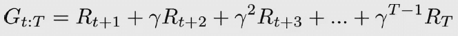
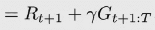
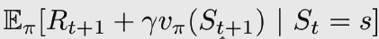

# 强化学习策略的评估

> 原文：<https://towardsdatascience.com/evaluation-of-rl-policies-14a9443d3554?source=collection_archive---------28----------------------->

## 在强化学习中，主体通常处理顺序的、评估的和抽样的反馈。

在这篇文章中，我们将关注能够同时处理顺序反馈和评估反馈的代理。甚至大多数人在同时平衡当前和长期目标以及收集和利用信息方面都存在问题。

*   **顺序**意味着您的代理可以接收延迟的信息。延迟的反馈使得解释反馈的来源变得棘手。顺序反馈引起了时间信用分配问题，这是确定哪个状态、行为或状态-行为对奖励负责的挑战。
*   **评价性**意味着反馈只是相对的，因为环境是不确定的。我们不知道环境的实际动态；我们无法访问转换函数和奖励信号。因此，作为不确定性的一个持续副产品，出现了勘探-开采权衡。
*   **Sampled** 表示代理需要使用收集到的反馈进行归纳，并基于该归纳做出明智的决策。

来源:维基百科([https://it.wikipedia.org/wiki/Robot](https://it.wikipedia.org/wiki/Robot))

我们的目标是估计一份保单的价值，也就是说，了解从一份保单中期望得到多少总回报。更确切地说，目标是估计策略π的状态值函数 vπ(s)。换句话说，这就是预测问题。

一般来说，所有学习价值函数的方法都是逐步将估计误差的一部分移向目标。大多数学习方法遵循的一般等式是估计=估计+步长*误差。误差就是采样目标和当前估计值之间的差值:(target-estimate)。计算这些目标的两种主要且相反的方法是蒙特卡罗和时差学习。这两种方法是可以用 n 步 TD 法概括的两个极端。仅仅通过改变步长，你就可以得到介于两者之间的任何代理。通过 TD(λ),单个代理可以以一种非常创新的方式将这两个极端以及两者之间的任何事物结合起来。

**蒙特卡洛**

MC 很直观。如果你想知道从一项政策中期望得到多少总回报，你只需用这项政策运行几集，收集数百条轨迹，然后计算每个州的平均值。

一点背景:状态、奖励、动作、下一个状态是一个体验元组。一系列的经历被称为轨迹。

1.  使用策略π与环境进行交互，直到代理达到终止状态。
2.  你计算遇到的每个状态的回报。你从状态 1 开始，增加和减少沿途收到的奖励，然后重复状态 2，直到最后一个状态。
3.  现在，您可以通过对从每个状态获得的回报进行平均来估计每集结束时的状态值函数。换句话说，您可以用平均值来估计期望值。

有趣的是，实现 MC 有不同的方式。单个轨迹可能包含对同一状态的多次访问。如果你独立计算每次访问后的回报，那么你使用的是每次访问 EVMC；另一方面，如果您只对每个州使用首次访问，则使用首次访问 MC (FVMC)。

**时差**

一方面，MC 具有可靠的收敛性质，因为它向实际回报更新价值函数估计，这是真实状态-价值函数 vπ(s)的无偏估计。另一方面，对于 MC，代理必须等到一集结束时才能获得实际回报，然后才能更新状态值函数估计。此外，实际回报是准确的，但方差高，因此样本效率低——因为它们在同一轨迹上累积了许多随机事件。

对于 TD，你使用单步回报，一旦你观察到下一个状态，你可以使用状态值函数估计作为下一步的回报估计。换句话说，TD 方法使用 vπ(s)的估计值来估计 vπ(s)。它启动并根据猜测进行猜测；它使用估计回报而不是实际回报。

TD 背后的大直觉是，从回报中，我们可以通过将一些项分组来重写等式。由此可知:

这种递归形式:

因此，这允许我们这样写状态值函数:

然后，我们可以估计每个时间步上的状态值函数。事实上:

1.  我们使用我们的策略推出单个交互步骤。
2.  我们在一步期望的样本上估计状态值函数。

TD 目标是真实状态值函数 vπ(s)的有偏估计，因为我们使用状态值函数的估计来计算状态值函数的估计。这也称为引导。值得注意的是，这一估计值的方差要低得多，因为 TD 目标只取决于一次经验。

**N 步 TD 学习**

MC 和 TD 将实际回报分散到所有状态。但是，我们可以把这两种方法推广成一种 n 步法，用 n 步来计算值函数。但是什么是好的 n 值呢？高于
1 的 n 值通常更好，但是我们也不应该去追求实际回报。自举有所帮助，但它的偏见是一个挑战。

*   **前视 TD(λ)** 使用所有 n 步返回，直到最后一步 T，然后用指数衰减值加权。在这个特定的版本中，代理必须等到一集结束后才能更新状态值函数估计。但至少我们有所收获:如果我们愿意接受偏差，我们可以得到更低方差的目标。
*   **后视 TD(λ)** 除了能够在每个时间步长应用更新之外，还可以调整偏差/方差权衡，就像 TD 一样。该方法跟踪一个状态是否合格以及合格多少，以便相应的值函数更新被正确地应用于合格的状态。它使用资格跟踪来实现，资格跟踪是一个内存向量，用于跟踪最近访问过的状态。在更新之后，合格跟踪向量被λ(权重混合因子)和γ(折扣因子)衰减，使得未来的加强事件对早期状态的影响较小。通过这样做，假设λ没有被设置为 1，则最近的状态在最近的过渡中遇到的奖励比在该集早期访问的那些状态获得更多的积分；否则，这类似于 MC 更新，其给在该集期间访问的所有州相同的信用(假设没有折扣)。

**结论**

在本文中，我们只处理预测问题，它包括估计代理的行为值。我们谈到了 MC 预测和 TD 学习。这两种方法是可以用 n 步 TD 法概括的两个极端。有了 TD(λ)，单个智能体就可以结合这两个极端和两者之间的一切。

*随时给我留言或:*

1.  通过[LinkedIn](https://www.linkedin.com/in/samuele-bolotta-841b16160/) 和 [Twitter](https://twitter.com/SamBolotta) 联系我
2.  在[媒体](https://medium.com/@samuelebolotta)上跟随我

# 参考

[曼宁——DRL](https://www.manning.com/books/grokking-deep-reinforcement-learning#toc)