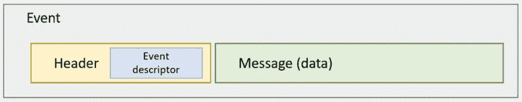
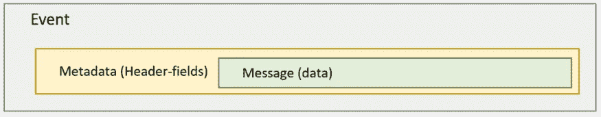

# 事件驱动架构和语义耦合

> 原文：<https://towardsdatascience.com/event-driven-architecture-and-semantic-coupling-7cd5c2f2fc99?source=collection_archive---------18----------------------->

## 解决事件驱动架构中的语义耦合对于真正实现松散耦合至关重要


图片来自 [Pixabay 许可](https://pixabay.com/no/service/license/)下的 [Pixabay](https://pixabay.com/no/photos/treet-blomster-eng-trestamme-276014/)

事件驱动架构(EDA)是构建松耦合应用程序(微服务与否)的关键。这是一种架构风格(参见这里的[和这里的](https://martinfowler.com/articles/201701-event-driven.html)和)，其中组件通过发出和响应事件来异步通信。

> 净化 1:一个**事件**是过去发生的事情。事件通知(或称事件消息)包含事件的描述。但是在大多数情况下，以及在本文中，事件指的是事件消息。
> 
> 净化 2:一个**生产者**是一个应用程序或应用程序组件，它发布指示其中一些状态变化的事件。
> 
> 净化 3:一个**消费者**是一个应用程序或应用程序组件，它监听事件并对它们做出反应。

应用程序是松散耦合的，

*   可以在不知道源或目标的情况下开发和运行单个组件。正是信息层上的交互需求为集成奠定了基础。
*   单个组件较少受限于平台、编程语言以及构建和运行环境。因此，每个应用程序组件都可以用最合适的技术来构建。有些甚至可能是商业现货(COTS)产品。
*   单个组件可以独立地进行扩展、配置、审计和合规性检查。

正如 Martin Fowler 在这里所解释的[，组件需要了解外部系统才能完成内部事务，这就产生了依赖性，导致了紧密耦合。这种知识例如可以是不同组件(例如，另一个应用)中的 API 端点是否存在并且正在运行和响应。当应用程序被设计为以被动-主动的方式工作时，这是可以避免的，在这种方式下，它们只对事件消息/通知做出反应。](https://www.youtube.com/watch?v=STKCRSUsyP0)

# 松耦合？还没有！

然而，在逻辑/语义层面上仍然存在微妙的耦合。如果我们不小心，这可能会导致更复杂的问题。

*   使用者要求事件消息具有特定的模式。如果生产者删除了一些字段，它会影响消费者，因为他们可能会围绕这些字段构建一些逻辑。同样，如果字段的数据类型发生变化，也可能会影响消费者。因此，生产者需要一个预先商定的模式。
*   由于生产者或消息代理/队列中的错误，事件可能会被重播或发布多次。这并不意味着事件发生了两次。消费者需要意识到这些小故障，并能够绕过它们。
*   消费者还需要确定发布这些事件的是真实的生产者，并且这些事件在发布过程中没有被操纵。
*   生产者和消费者都可能维护一个事件日志，其中存储了所有发布或消费的事件。如果组件利用事件源，这样的事件日志甚至可能是应用程序逻辑的基础。 [Event sourcing](https://youtu.be/A0goyZ9F4bg) 扩展了事件驱动架构，其中应用程序状态完全作为事件存储在事件日志中。该日志是事实的来源，任何进一步的更新也作为事件存储。日志本身是仅附加的，重放是恢复状态的一种方法。然后，重放事件的组件需要在表示同一数据实体中的状态变化的事件中适应历史模式变化。

通过移除同步 API 调用，我们实现了某种程度的解耦。但是对参与应用程序产生负面影响的依赖性并没有消失。

# 处理语义耦合

因为语义耦合是由信息交换产生的，因此需要在信息层面上解决。

让我们考虑下面的事件。

```
{
  "header":{
    "application-id":"CRM-application-id",
    "schema-url":"json-schema-url",
    "timestamp":1625507375542,
    "message-id":"9aeb0fdf-c01e-0131-0922-9eb54906e209",
    "event-descriptor":"customer.added"
  },
  "customerid":"cust-id",
  "firstname":"some firstname",
  "lastname":"some lastname"
}
```

此事件提供以下信息。

1.  发布它的应用程序
2.  消息的模式(指向相应 JSON-schema 的 URL 链接)
3.  发布的时间戳以及全局唯一的消息 id。
4.  事件描述符，说明事件是什么。在本例中，添加了一个新客户。事件描述符和应用程序 id 的组合必须是全局唯一的。
5.  添加的客户数据的详细信息。

这个事件组合可以如下图所示。



事件消息撰写

**那么这如何减少语义耦合导致的依赖性呢？**

每个事件都包含一个提供几个关键信息的标题。

*   模式 URI 指向该消息所遵循的特定模式(例如 JSON 模式)。任何消费者都有可能按照模式动态解析消息。这可能需要每条消息处理两次，首先读取头，根据模式选择正确的解析器，然后读取整个消息。但是好处是消费者可以按照模式解析消息。
*   该架构有助于在重播事件日志中的旧事件时解决历史架构更改，该事件日志可能与当前事件日志具有不同的架构。
*   全局唯一的消息 id 有助于识别无意的重放。重放的消息将具有与先前处理的消息相同的消息 id。因此，消费者可以是等幂的。
*   事件描述符是事件的特定于域的名称，在该域中是唯一的。上面的例子使用点符号来分隔主语和动词(总是用过去时态)。

事件的其余部分是数据。一般来说，它应该是胖的，这样每条消息本身就尽可能完整。fat 事件携带的数据足以保证不会回调其原始应用程序。但是胖事件并不意味着将所有数据放在一个事件中。这可以通过让 id/URIs 指向其他相关的数据对象来实现。主要的想法是使它在上下文中完整。

> 一种特定的技术或一种序列化的选择能对它有所帮助吗？当然，例如，Avro 有助于检测模式变化。Confluent 提供的模式注册表完全支持它。但是依赖于特定的技术会将解决方案与该特定的技术联系起来。这样做可能会有一些好处，但我更倾向于尽可能保持技术独立。

# 云事件

[云事件](https://github.com/cloudevents/spec/blob/v1.0.1/spec.md)是一个符合上述事件组合模式的具体标准例子。

上述相同的事件可以按照下面的云事件规范来表达。

```
{
  "specversion": "1.0",
  "type": "customer.added", 
  "source": "CRM-application-id",
  "id": "9aeb0fdf-c01e-0131–0922–9eb54906e209",
  "time": "2021–07–05T20:13:39.4589254Z",
  "dataschema": "json-schema-url",
  "data": {
    "customerid":"cust-id",
    "firstname":"some firstname",
    "lastname":"some lastname"
  }
}
```

这个事件的变体携带相同的信息，但是在组成上有一些不同。例如，没有显式标头。我通常将大部分字段归类为标题字段，作为消息的一部分。数据或核心状态变化在“*数据*元素内。“ *dataschema* ”指的是这个“ *data* ”元素的 JSON 模式，而不是整个事件。相反，整个事件的规范由“ *specversion* ”提供，只是作为一个版本号，在本例中为 1.0。

云事件中的事件组成可以如下图所示。



“云事件”中的事件消息组成

# 事件的真实性

通过给每条消息附加一个签名的散列，将有可能验证每个事件的真实性。

```
{
 "header":{
 …
  "message-hash":{
   "alg": "some algorithm",
   "salt": "some salt",
   "signed-hash": "0xa3f20717a25…fcfc994cee1b"
  }
 },
 …
}
```

这样做的代价显然是每次处理消息时都需要对消息进行哈希和签名验证。因此，只有在消息真实性非常重要的情况下，才应该使用这种方法。

# 版本控制

就像 REST API 版本一样，事件也可以有版本。我认为事件也是 API，因为它们在消费者中引发反应。

在上面的例子中，事件的版本是隐式的。事件的模式包含版本变更。我的例子中的“ *schema-url* ”或者云事件中的“ *dataschema* ”和“ *specversion* ”的组合处理它。

但是在某些情况下，显式事件版本是必要的。一个简单的方法是将版本附加到事件描述符上。

```
"event-descriptor":"customer.added.v1"
```

或者在云事件中:

```
"type":"customer.added.v1"
```

> 需要注意的是，事件的新版本必须与旧版本具有相同的语义和含义。它应该指示完全相同的数据实体/主题的状态变化。如果不是，那就不是事件的新版本，而是新事件。

# 结论

任何技术或架构风格都可以被使用和误用。可以理解也可以误解或者只是部分理解。对于事件驱动的架构也是如此。要创建真正松耦合的应用程序和系统，关注事件、事件的组合、模式并接受它们将会改变的事实是至关重要的。

图式进化既是事实，也是必然的恶。一个独立于技术的解决方案将使一个持久的解决方案能够经受住组织中应用程序环境的变化和底层技术体系的变化。

> 为什么是自然的照片？我认为自然也是由事件驱动的。行动和反应无处不在，无时不刻不在发生。实际上，自然是事件驱动的生态系统的完美例子。