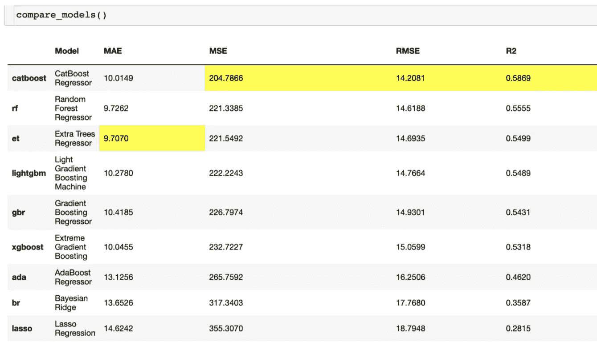
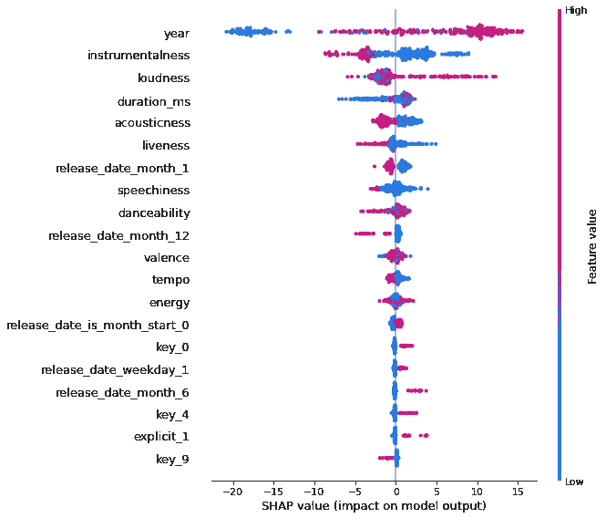

# 每个数据科学家都应该使用 PyCaret

> 原文：<https://towardsdatascience.com/every-data-scientist-should-use-pycaret-45a1e8e984be?source=collection_archive---------14----------------------->

## 意见

## 这就是为什么…机器学习的一站式商店


帕布鲁·阿罗约在[Unsplash](https://unsplash.com/s/photos/easy?utm_source=unsplash&utm_medium=referral&utm_content=creditCopyText)【1】上拍摄的照片。

# 目录

1.  介绍
2.  导入库和读取数据
3.  设置模型参数
4.  比较机器学习算法
5.  创建、解释和预测最终模型
6.  摘要
7.  参考

# 介绍

尽管过去的数据科学家不得不使用相当多的代码来测试、比较和评估机器学习算法，但最近出现了 Python 中的库，大大减少了这项工作。其中一个库是由 [Moez Ali](https://medium.com/u/fba05660b60f?source=post_page-----45a1e8e984be--------------------------------) 开发的[py caret](https://pycaret.org/)【2】，这是一个只需要少量代码的开源库，最终允许您快速准备数据，在几分钟内部署您的最终模型。PyCaret 函数有几个固有的好处。这些好处包括易用性、效率和学习新的机器学习算法。除了这些更多的好处之外，所有 PyCaret 模型都遵循四个主要步骤，这些步骤是执行一个进程的简单方法，否则，如果没有这个库，可能会花费更多的时间。也就是说，我将在下面讨论这四个步骤及其各自的好处和优势。

# 导入库和读取数据


照片由 [NASA](https://unsplash.com/@nasa?utm_source=unsplash&utm_medium=referral&utm_content=creditCopyText) 在[Unsplash](https://unsplash.com/s/photos/data?utm_source=unsplash&utm_medium=referral&utm_content=creditCopyText)【3】上拍摄。

与大多数数据科学项目一样，您将导入各自的库并读入数据。当然，我们将使用 PyCaret 的主库，以及另一个流行的库。

```
# import librariesfrom pycaret.regression import *
import pandas as pd
```

在这段代码中，您只需导入 PyCaret 库和回归模块，以及用于读取数据的熊猫。就 Python 代码而言，这几行代码是掌握大部分数据科学过程的开始。

```
# read in your datadata = pd.read_csv(‘file location of your data on your computer.csv’)
```

您可以导入的其他模块包括分类、聚类、异常检测、自然语言处理和关联规则挖掘。正如你所看到的，这个库包含了大多数类型的数据科学主题和特定的机器学习算法。

> 在这个回归模块中，您可以比较以下算法:

```
Linear RegressionLasso RegressionRidge RegressionElastic NetOrthogonal Matching PursuitBayesian RidgeGradient Boosting RegressorExtreme Gradient BoostingRandom Forest RegressorDecision Tree RegressorCatBoost RegressorLight Gradient Boosting MachineExtra Trees RegressorAdaBoost RegressorK Neighbors RegressorLasso Least Angle RegressionHuber RegressorPassive Aggressive RegressorLeast Angle Regression
```

> 利益

导入这个模块的好处是有大量的选项，而不必担心一个接一个地单独导入每个算法，最终节省时间并删除不必要的代码。

# 设置模型参数


约书亚·阿拉贡在[Unsplash](https://unsplash.com/s/photos/code?utm_source=unsplash&utm_medium=referral&utm_content=creditCopyText)【4】拍摄的照片。

现在我们知道了我们正在使用的算法类型，我们可以启动 PyCaret 的 setup 函数。该功能包括数据类型推断、清理和预处理数据、数据采样、训练-测试分割以及为再现性分配会话 ID 等任务。

*   *数据类型推断*

设置功能可以允许您包括您的数据和目标，这是数据科学和机器学习算法的最基本的方面。数据类型的例子包括`categorical`、`numeric`和`label`。运行设置后，只需按 enter 键即可检查和确认列/要素的数据类型。

*   *数据清洗和数据预处理*

在此步骤中，将自动应用缺失值插补，以及分类编码。对于数值特征，平均值填充缺失值，而对于分类特征，缺失值填充该特征的模式。

—更多预处理包括序数编码、基数编码、修复不平衡、标准化、变换函数

—对于特征工程，有目标变换、特征交互组特征、宁滨数值特征和组合稀有水平函数

*   *数据采样*

这个特性与致力于改进数据科学过程的库相比是非常独特的。如果样本大小超过 25，000，将构建一个线性模型来显示大小如何影响模型的性能。

*   *训练和测试分割*

一个常见的函数，PyCaret 包括在其设置步骤。默认的拆分比例是 70:30。

*   *会话 ID*

这个特性的另一个词或短语是随机种子，或者有时是随机状态。它被包括在内，以便如果正在使用不同的环境，或者您将来正在从事这个项目，您可以重现您的发现。

```
# setup your regression parameters regression = setup(data = data, 
 target = 'what you are trying to predict’,
 session_id = 200, 
 )
```

如您所见，上面的代码很简单，您已经完成了几乎一半的数据科学建模工作，实际上只有两部分代码。

> 利益

*   主要好处是您可以看到数据采样大小对常见指标(如准确性、AUC、召回率、精确度和 F1)的影响
*   无需转换即可自动推断数据类型(*有时*)
*   数字和分类特征的缺失值插补

# 比较机器学习算法



比较模型。作者截图[5]。

这个特性是 PyCaret 真正闪光的地方，它允许你比较几种机器学习算法，包括一些你可能还没有听说过的算法。有些算法在第一部分中已经提到，您可以对这些算法进行比较——并排比较准确度和误差指标，突出显示哪些算法是最好的。以下是其中的一些指标:

> 分类比较

*   准确性、AUC、召回率、精确度、F1 以及 Kappa 和 MCC

> 回归比较

*   MAE，MSE，RMSE，R2，RMSLE，MAPE

`compare_models()`功能的一些重要特征是`n_select`、`sort`、`include`和`exlucde`。

*   **n_select** :允许您根据精确度之类的指标返回最佳型号
*   **排序**:允许你根据你的度量进行排序，比如 MAE
*   **include** :在您的比较中仅使用某些算法—如果您知道某些算法耗时较长且不太有用，您可以使用以下参数
*   **排除**:从您的分析中移除不必要的或更长的训练模型

```
# compare modelscompare_models(n_select = 3, sort = 'MAE')
```

以上是如何将这些参数应用于比较模型特性的示例代码块。

> 利益

*   减少分离或删除你所知道的某些算法的时间(从以前的经验中*或从对你的数据的采样中*)——比如说，比较 20 个算法可能需要几个小时，这取决于包括哪些算法
*   便于比较的排序( *PyCaret 应自动突出显示哪个型号最好*)

# 创建、解释和预测最终模型



举例 SHAP 解释情节。作者截图[6]。

在 PyCaret 过程的最后一部分，你可以在看到几个模型的比较后创建一个最好的模型(*准确性，训练时间——这最终取决于你* `***best***`)。

> **创建模型功能的一些**关键参数如下:

*   折叠
*   交叉验证
*   学习率
*   最大深度
*   等等。

*模型*或机器学习名称被简化，例如，决策树是‘dt’，所以在这种情况下，让我们假设我们选择它来创建、预测和解释我们的最终模型。

在解释您的模型时，您可以查看无数的函数，包括:

*   汇总图
*   相关图
*   观察级别的原因图

这些情节是从广受欢迎的 SHAP 图书馆(*，在我看来，这是最好的功能重要解释库*

```
# create a model
dectrees = create_model('dt')# interpreting model
interpret_model(dectrees)# predict on test set
predictions = predict_model(dectrees)
```

> 利益

*   您可以轻松选择想要创建的模型
*   您可以轻松访问 SHAP 函数和相应的图

只需几行代码，您就可以选择想要使用的模型，解释特性和结果，最后根据一些测试数据进行预测。您甚至可以使用 PyCaret 和 AWS 部署模型。与 AutoML 和 MLFlow 的集成也很有用。

# 摘要

如您所见，PyCaret 的每个主要步骤都有各自的好处。虽然这篇文章出于解释的目的很长。我使用的代码非常简单，用于比较几个模型和预测测试数据。

> 总而言之，我们看了几个步骤，包括:

*   导入库和读取数据
*   设置模型参数
*   比较机器学习算法
*   创建、解释和预测最终模型

> 这些相同的步骤通过下面的代码表达出来:

```
# import libraries
from pycaret.regression import *
import pandas as pd# read in your data
spotify = pd.read_csv(‘file location of your data on your computer.csv’)# setup your regression parameters
regression = setup(data = data, 
 target = 'what you are trying to predict’,
 session_id = 200, 
 )# compare models
compare_models()# create a model
dectrees = create_model('dt')# predict on test set
predictions = predict_model(dectrees)# interpreting model
interpret_model(dectrees)
```

其他一些有用的特性(*，因为我还没有涵盖 PyCaret* 的所有方面)，包括但不限于消除多重共线性、主要胜任分析、忽略低方差和消除异常值

我希望您喜欢这篇关于每个人都应该知道的库的文章，PyCaret。现在，我将问你一些问题。你以前用过这个图书馆吗——为什么或为什么不用？你听说过吗？您是否喜欢更加人工化的数据科学过程，或者更具体地说，没有更像一站式商店的图书馆？使用这个强大的数据科学和机器学习库，你还体验到了哪些好处？谢谢你的阅读，我很感激！

*请随时查看我的个人资料和其他文章，* [Matt Przybyla](https://medium.com/u/abe5272eafd9?source=post_page-----45a1e8e984be--------------------------------) ，*也可以在 LinkedIn 上联系我。*

*我不隶属于上述任何公司。*

# 参考

[1]巴勃罗·阿罗约在 [Unsplash](https://unsplash.com/s/photos/easy?utm_source=unsplash&utm_medium=referral&utm_content=creditCopyText) 拍摄的照片，(2021)

[2] [Moez Ali](https://medium.com/u/fba05660b60f?source=post_page-----45a1e8e984be--------------------------------) ， [PyCaret 主页](https://pycaret.org/)，(2021)

[3]照片由 [NASA](https://unsplash.com/@nasa?utm_source=unsplash&utm_medium=referral&utm_content=creditCopyText) 在[Unsplash](https://unsplash.com/s/photos/data?utm_source=unsplash&utm_medium=referral&utm_content=creditCopyText)(2015)拍摄

[4]Joshua Aragon 在 [Unsplash](https://unsplash.com/s/photos/code?utm_source=unsplash&utm_medium=referral&utm_content=creditCopyText) 上拍摄的照片，(2019)

[5] M.Przybyla，比较模型截图，(2021 年)

[6] M.Przybyla，示例 SHAP 解读情节截图，(2021)