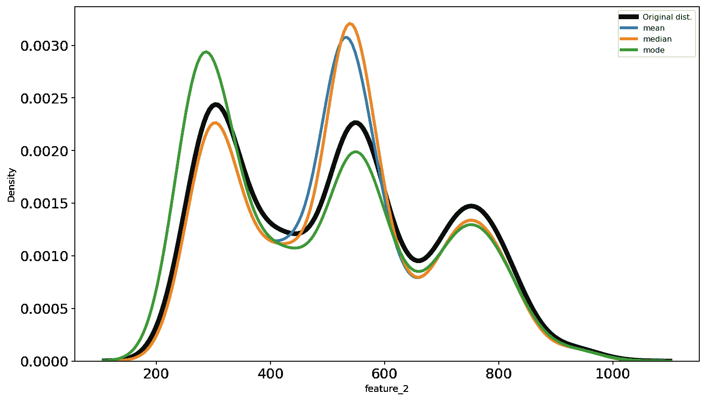
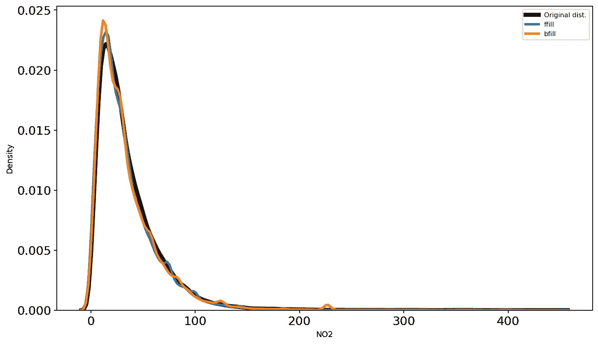
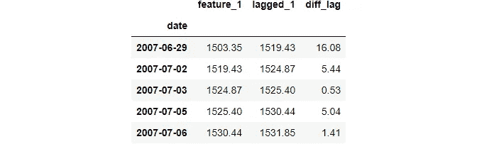
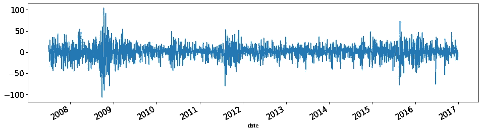

# 你可以(应该)使用的每一个熊猫函数来操纵时间序列

> 原文：<https://towardsdatascience.com/every-pandas-function-you-can-should-use-to-manipulate-time-series-711cb0c5c749?source=collection_archive---------2----------------------->

## 从基本的时间序列度量到窗口函数


**照片由** [**乔丹本顿**](https://www.pexels.com/@bentonphotocinema?utm_content=attributionCopyText&utm_medium=referral&utm_source=pexels) **上** [**像素**](https://www.pexels.com/photo/shallow-focus-of-clear-hourglass-1095601/?utm_content=attributionCopyText&utm_medium=referral&utm_source=pexels)

# 时间序列预测项目简介

最近，在 Kaggle 上发起了 Optiver Realized 波动率预测竞赛。顾名思义，这是一个时间序列预测的挑战。

我想参加，但事实证明我在时间序列方面的知识甚至不足以参加如此大规模的比赛。所以，我接受了这一点，认为这是我需要开始认真关注 ML 这个大领域的‘刺激’。

作为第一步，我想学习和教授你可以用来操作时间序列数据的每一个熊猫函数。这些函数是处理您在野外遇到的任何时间序列数据的基本要求。

我已经为这个话题准备了相当酷和有趣的文章，今天，你将会读到即将到来的第一个味道。尽情享受吧！

<https://ibexorigin.medium.com/membership>  

获得由强大的 AI-Alpha 信号选择和总结的最佳和最新的 ML 和 AI 论文:

<https://alphasignal.ai/?referrer=Bex>  

# 目录

这篇文章的笔记本可以在 Kaggle 上这里[阅读。](https://www.kaggle.com/bextuychiev/every-pandas-function-to-manipulate-time-series)

1.  基本数据和时间函数
2.  时间序列中缺失数据的插补/插值
3.  基本时间序列计算和指标
4.  重采样—上采样和下采样
5.  比较多个时间序列的增长
6.  窗口功能
7.  摘要

# 1.熊猫的基本日期和时间功能

## 1.1 导入时间序列数据

当使用`pd.read_csv`函数导入时间序列时，有两个参数你应该一直使用- `parse_dates`和`index_col`:

> 由于出版政策，数据集已被匿名化。如果你感兴趣，数据集的真实版本保存在[笔记本](https://www.kaggle.com/bextuychiev/every-pandas-function-to-manipulate-time-series)中。请注意，这种匿名不会妨碍您的体验。


`parse_dates`将类似日期的字符串转换为 DateTime 对象，`index_col`将传递的列设置为索引。该操作是对熊猫进行所有时间序列操作的基础。

当您在导入时不知道哪一列包含日期时，您可以在之后使用`pd.to_datetime`功能进行日期转换:

现在，检查日期时间格式字符串:

```
>>> data2.head()
```


它的格式是" %Y-%m-%d "(日期时间格式字符串的完整列表可以在[这里](https://docs.python.org/3/library/datetime.html#strftime-and-strptime-behavior)找到)。把这个传给`pd.to_datetime`:

向`pd.to_datetime`传递一个格式字符串可以显著加快大型数据集的转换速度。将`errors`设置为“强制”，将无效日期标记为`NaT`(不是日期，即-缺失)。

转换后，将 DateTime 列设置为索引(这是最佳时间序列分析的严格要求):

```
>>> data2.set_index("date", inplace=True)
```

## 1.2 熊猫时间戳

Pandas 中的基本日期数据结构是时间戳:

您可以使用正确的格式制作更精细的时间戳，或者更好的是，使用`datetime`模块:

完整时间戳具有如下有用的属性:


## 1.3 日期序列(时间戳)

pandas 中的一个`DateTime`列/索引被表示为一系列`TimeStamp`对象。

`pd.date_range`返回一个特殊的`DateTimeIndex`对象，它是`TimeStamps`的集合，具有给定范围内的自定义频率:

在指定日期范围(从 2010 年 10 月 10 日到 2020 年的同一天)后，我们告诉熊猫每月生成`TimeStamps`和`freq='M'`:

```
>>> index[0]Timestamp('2010-10-31 00:00:00', freq='M')
```

创建日期范围的另一种方法是传递开始日期，告诉您需要多少个周期，并指定频率:

因为我们将频率设置为年，所以带有 5 个周期的`date_range`返回 5 年/时间戳对象。可以传递给`freq`的[频率别名](https://pandas.pydata.org/pandas-docs/stable/user_guide/timeseries.html#timeseries-offset-aliases)列表很大，所以我在这里只提到最重要的几个:


也可以通过自定义频率，如“1 小时 30 分”、“5D”、“2W”等。再次，检查[这个链接](https://pandas.pydata.org/pandas-docs/stable/user_guide/timeseries.html#timeseries-offset-aliases)的完整信息。

## 1.4 切片

如果索引是一个`DateTimeIndex`，切片时间序列数据会非常直观。你可以使用部分切片:


如果日期时间足够精确，甚至可以达到小时、分钟或秒的级别。

请注意，熊猫切片日期在封闭的时间间隔。例如，使用“2010”:“2013”返回所有 4 年的行—它不像整数切片那样排除期末。

这个日期切片逻辑适用于其他操作，如在切片后选择特定的列:

# 2.缺失数据插补或插值

无论数据集的类型如何，缺失数据都是普遍存在的。这一部分是关于在时间序列的背景下对其进行估算。

> 你也可能在时间序列行话中听到它被称为缺失数据的**插值**。

除了基本的均值、中值和众数插补之外，一些最常用的技术包括:

1.  正向填充
2.  反向填充
3.  使用`pd.interpolate`进行中间插补

我们还将讨论基于模型的插补，如 KNN 插补。此外，我们将探索比较技术效率的可视化方法，并选择最适合底层分布的方法。

## 2.1 均值、中值和众数插补

让我们从基础开始。我们将在第一个匿名数据集中随机选择数据点，并将其转换为 NaN:

我们还将创建一个函数，绘制插补执行前后的原始分布:

我们将从 Sklearn 的`SimpleImputer`开始尝试技巧:

让我们针对我们刚刚创建的 3 个估算特征绘制原始`feature_2`分布图:



很难说哪条线最像黑线，但我会选绿色。

## 2.2 向前和向后填充

考虑这个小分布:


我们将使用向前和向后填充，并将它们作为单独的列分配回数据帧:


一旦检查了上面的输出，这些方法是如何工作的就应该很明显了。

现在，让我们对印度的空气质量数据集执行这些方法:



尽管非常基本，向前和向后填充实际上对气候和股票数据非常有效，因为附近数据点之间的差异很小。

## 2.3 使用`pd.interpolate`

Pandas 在`pd.interpolate`功能中提供了一整套其他统计插补技术。它的`method`参数接受技术名称作为字符串。

最流行的是“线性”和“最近”，但是你可以从函数的文档中看到完整的列表。在这里，我们将只讨论这两个。

考虑这个小分布:


我们再次应用这些方法，并将它们的结果赋回来:


很整洁，是吧？线性方法将任意两个非缺失点之间的距离视为线性间隔，并找到连接它们的直线(如`np.linspace`)。“Nearest”方法应该可以从它的名字和上面的输出中理解。

## 2.4 基于模型的 KNN 插补

我们将看到的最后一种方法是 K-最近邻算法。我不会详细说明算法是如何工作的，而只是展示如何在 Sklearn 中使用它。如果你想知道细节，我有一个单独的文章[在这里](/going-beyond-the-simpleimputer-for-missing-data-imputation-dd8ba168d505?source=your_stories_page-------------------------------------)。

KNN 最重要的参数是`k`——邻居的数量。我们将把该技术应用于具有几个值`k`的第一个数据集，并像我们在前面章节中所做的那样找到最佳的一个:


# 3.基本时间序列计算

Pandas 提供了计算最常见的时间序列计算的基本函数。这些被称为转移，滞后，以及所谓的百分比变化。

## 3.1 换档和滞后

时间序列中的一个常见操作是将所有数据点向后或向前移动一个或多个周期，以比较过去和未来的值。你可以使用熊猫的`shift`功能来完成这些操作。让我们看看如何将数据点 1 和 2 移至未来:


向前移动使您能够将当前数据点与一个或多个期间之前记录的数据点进行比较。

你也可以向后移动。这种操作也称为“滞后”:


向后移动使我们能够看到当前数据点和一个或多个周期后的数据点之间的差异。

换档或滞后后的常见操作是找出差异并绘制出来:



由于这种操作非常常见，Pandas 提供了`diff`函数来计算基于周期的差异:


## 3.2 百分比变化

可以从时间序列数据中得出的另一个常见指标是每日百分比变化:


要计算每天的百分比变化，向前移动一个周期，将原始分布除以移动后的分布，然后减去 1。结果值以前一天的比例给出。

因为这是一个常见的操作，Pandas 用`pct_change`函数来实现它:


## 4.重采样

通常，您可能希望增加或减少时间序列的粒度，以生成新的见解。这些操作被称为重采样或改变时间序列的频率，我们将在本节中讨论与它们相关的 Pandas 函数。

## 4.1 用`asfreq`改变频率

第二个数据集没有固定的日期频率，即每个日期之间的周期差异不相同:

```
data2.head()
```


让我们通过给它一个日历日频率(每日)来解决这个问题:

```
data2.asfreq("D").head(7)
```


我们只是把约会的频率变得更细了。结果，添加了新的日期，导致更多的值丢失。现在，您可以使用我们之前讨论过的任何技术对它们进行插值。

你可以在这里看到[的内置频率别名列表。更有趣的场景是使用自定义频率:](https://pandas.pydata.org/pandas-docs/stable/user_guide/timeseries.html#offset-aliases)


```
# 10 month frequency
data2.asfreq("10M", method="bfill").head(7)
```


还有一个`reindex`函数，操作类似，支持额外的缺失值填充逻辑。我们不会在这里讨论它，因为我们会考虑更好的选择。

## 4.2 使用`resample`进行下采样并聚合

在时间序列行话中，降低`DateTime`的频率被称为下采样。例如，将频率从每小时更改为每天，从每天更改为每周，等等。

我们看到了如何使用`asfreq`进行下采样。一个更强大的选择是`resample`，它的行为类似于`pd.groupby`。就像`groupby`根据分类值对数据分组一样，`resample`根据日期频率对数据分组。

让我们按月末频率对第一个数据集进行缩减采样:

与`asfreq`不同，使用重采样只返回重采样状态的数据。要查看每个组，我们需要使用某种类型的函数，类似于我们使用`groupby`的方式。

由于下采样减少了数据点的数量，我们需要一个聚合函数，如 mean、median 或 mode:

```
data1.resample("M").mean().tail()
```


还有一些函数返回一个组的第一条或最后一条记录:


也可以使用`agg`使用多个聚合功能:


## 4.3 使用`resample`进行上采样和插值

缩减采样的反面是使`DateTime`更加精细。这称为上采样，包括将频率从每天一次改为每小时一次、每小时一次改为每秒一次等操作。

向上采样时，您会引入新的日期，导致更多的值丢失。这意味着你需要使用某种类型的插补:


## 4.4 绘制重采样数据

如果不绘制结果，重采样不会产生太多效果。

在大多数情况下，进行缩减采样时，您会看到新的趋势和模式。这是因为下采样降低了粒度，从而消除了噪声:


绘制上采样分布只会引入更多噪声，所以我们在这里不做。

# 5.比较多个时间序列的增长

比较两个或多个随时间变化的数值是很常见的。例如，我们可能希望看到第一个数据集中要素 1 和 2 的增长率。但问题是:

第二分布具有高得多的值。将它们绘制在一起可能会将 feature_1 挤压成一条直线。换句话说，这两种分布具有不同的规模。

为了解决这个问题，统计学家使用标准化。最常见的变化是选择第一个记录的值，然后将其余的样本除以该值。这显示了每个记录与第一个记录相比是如何变化的。

这里有一个例子:


现在，上面输出中的每一行都显示了与第一行相比的百分比增长。

现在，让我们绘制它们来比较增长率:


从 2011 年到 2017 年，这两项功能都实现了超过 300%的增长。您甚至可以从其他数据集绘制时间序列:


如您所见，数据集 1 中的要素比第二个数据集中的另一个要素具有更高的增长率。

# 6.窗口功能

还有另一种类型的函数可以帮助您以新颖的方式分析时间序列数据。这些被称为窗口函数，它们帮助您聚合自定义数量的行，称为“窗口”

例如，我可以在我的[中型订户](https://medium.com/@ibexorigin)数据上创建一个 30 天的窗口，以查看过去 30 天中任何一天的订户总数。或者，餐馆老板可以创建一个每周窗口来查看上周的平均销售额。例子不胜枚举，因为您可以在数据上创建任意大小的窗口。

让我们更详细地探讨这些。

## 6.1 滚动窗口功能

滚动窗口功能将具有相同的长度。当它们滑过数据时，它们的覆盖范围(行数不变)。以下是一个包含 5 个时间段的数据滑动窗口示例:


下面是我们如何在 pandas 中创建滚动窗口:

```
>>> data1.rolling(window=5)Rolling [window=5,center=False,axis=0]
```

就像`resample`一样，它处于只读状态——为了使用每个窗口，我们应该链接某种类型的函数。例如，让我们为过去 5 个周期创建一个累计和:


显然，前 4 排是 NaNs。任何其他行将包含前 4 行和当前行的总和。

请注意窗口参数。如果传递一个整数，窗口大小将由该行数决定。如果您传递一个频率别名，如月、年、5 小时或 7 周，则窗口大小将是包含传递频率的单个单位的任意行数。换句话说，5 周期窗口可能与 5 天频率窗口大小不同。

例如，让我们绘制特性 2 的 90 和 360 天移动平均线，并绘制它们:


就像`groupby`和`resample`一样，您可以使用`agg`函数为每个窗口计算多个指标。

## 6.2 扩展窗口功能

另一种类型的窗口函数处理扩展窗口。每个新窗口将包含截至当前日期的所有记录:


扩展窗口对于计算“运行”指标非常有用，例如，运行总和、平均值、最小值和最大值、运行回报率等。

下面，您将看到如何计算累积和。累积和实际上是一个窗口大小为 1:


`expanding`函数有一个`min_periods`参数，决定初始窗口大小。

现在，让我们看看如何绘制跑步最小值和最大值:


## 摘要

我想祝贺是应该的！

现在，您知道了可以用来操作时间序列数据的每一个 Pandas 函数。这是一篇非常长的帖子，但绝对值得，因为现在你可以处理任何扔给你的时间序列数据。

这篇文章主要关注数据操作。该系列的下一篇文章将是关于更深入的时间序列分析，你可以在时间序列上创建的每个单独的图的类似文章，以及关于预测的专门文章。敬请期待！

## 您可能也会感兴趣…

*   [Matplotlib vs. Plotly:一劳永逸吧](/matplotlib-vs-plotly-lets-decide-once-and-for-all-ad25a5e43322?source=your_stories_page-------------------------------------)
*   [我为持续改进我的机器学习模型而做的 6 件事](https://medium.com/me/stories/public#:~:text=6%20Things%20I%20Do%20to%20Consistently%20Improve%20My%20Machine%20Learning%20Models)
*   [训练机器学习模型时要做的 5 件超级高效的事情](/5-short-but-super-productive-things-to-do-during-model-training-b02e2d7f0d06?source=your_stories_page-------------------------------------)