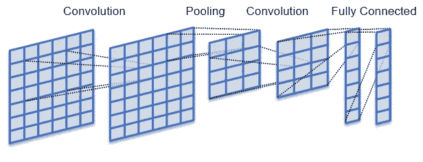
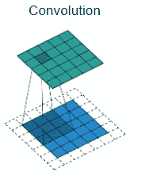
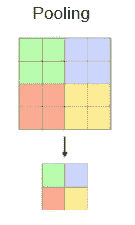
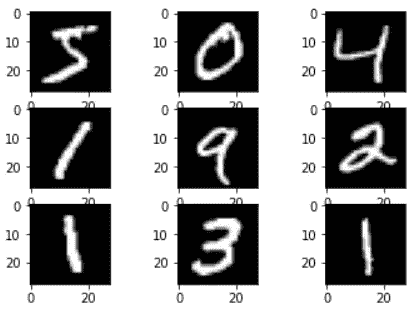
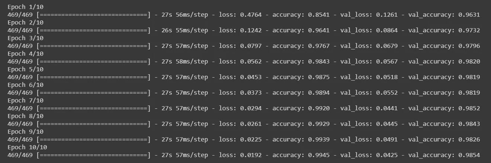
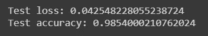

# 关于卷积神经网络的所有知识

> 原文：<https://towardsdatascience.com/everything-to-know-about-convolutional-neural-networks-fce7c3e480e7?source=collection_archive---------37----------------------->


克林特·王茂林在 [Unsplash](https://unsplash.com/s/photos/neural-networks?utm_source=unsplash&utm_medium=referral&utm_content=creditCopyText) 上拍摄的照片

## 数据科学

## 理解卷积神经网络的概念及其在构建图像分类模型中的实现

> “从计算机视觉的角度来看，毫无疑问，**深度卷积神经网络**是当今处理感知数据的‘主算法’。”
> 
> 托马斯·马利西维茨

如今，我们都必须看到和使用各种图像效果和滤镜，以及我们的计算机和智能手机如何检测和识别照片和视频中的人脸。所有这些都可以通过“计算机视觉”来实现，而“计算机视觉”只不过是使用卷积神经网络的机器学习。

计算机视觉类似于人的视觉，它帮助系统识别、分类、检测数据中的复杂特征。它的一些应用可以在自动驾驶汽车、机器人视觉、面部识别中看到。

> 但是这种计算机视觉与我们人类的视觉并不完全相同，不像我们，计算机看到的图像是像素矩阵的形式。

图像是由像素组成的。并且每个像素值可以取从 0 到 255 的值。

## 什么是卷积神经网络

卷积神经网络或 CNN 是一种用于处理输入形状为 2D 矩阵形式(如图像)的数据的神经网络。

卷积神经网络的结构是具有若干隐藏层的前馈，主要是卷积和汇集层，随后是激活层。通过这个 CNN 模型，我们可以识别手写字母和人脸(取决于图像的层数和复杂程度)。



(图片由[维基共享资源](https://commons.wikimedia.org/wiki/File:ConvolutionAndPooling.svg) ) **卷积神经网络模型**

在本文中，我们将学习 CNN 的概念，并建立一个图像分类器模型，以便更好地掌握这个主题。

在建立模型之前，我们需要理解和学习卷积神经网络的一些重要概念。

*   众所周知，计算机将图像视为像素矩阵形式的数字。CNN 将图像视为三维对象，其中高度和宽度是前两个维度，颜色编码是第三个维度(例如，3x3x3 RGB 图像)。

> 现在想象一下，处理一幅 4K 图像(3840 x 2160 像素)的计算量会有多大。

## 盘旋

*   因此，卷积网络的主要目标是将图像简化为更容易处理的形式，同时保留特征并在预测时保持良好的准确性。

> 在卷积神经网络中有三个主要的重要单元，即输入图像、特征检测器和特征映射。

*   特征检测器是过滤器的核心(一个数字矩阵，通常是 3x3)。这里的想法是将图像的矩阵表示与核逐元素相乘，以获得特征图。在这个步骤中，图像的尺寸被减小，以便更快和更简单地处理。保留了图像的重要特征(如图像/对象特有的特征，即识别所必需的特征)。但是，在此步骤中会丢失一些功能。



(图片由[维基共享](https://commons.wikimedia.org/wiki/File:ConvolutionAndPooling.svg) ) **卷积层——特征图**

*   例如，如果我们有一个 5x5x1 维的输入图像，而我们应用于图像的卷积核/滤波器是 3x3x1 维的:

```
**Image matrix:**
1 1 0 1 1
1 0 1 0 1
1 1 1 1 0
0 0 1 1 0
1 1 0 0 0**Kernel matrix:** 1 0 1
0 1 0
1 1 0
```

那么核矩阵与图像矩阵的每个元素相乘后得到的卷积特征将是:

```
**Convolved matrix:**
3 5 3
3 2 5
4 4 2
```

这里，内核移动 9 次，因为**步长**为 1(即滤波器将在图像矩阵的每个元素后滑动)。

## ReLu 激活功能

应用此 **ReLu 函数**(整流线性单元)的目的是增加模型中的非线性。因为图像/物体具有几个彼此非线性的特征。我们应用这个函数，以便我们的模型不会将图像分类视为线性问题。

## 汇集层

池层类似于卷积层，它负责减少卷积矩阵的大小。



(图片由 [Wikimedia Commons](https://commons.wikimedia.org/wiki/File:ConvolutionAndPooling.svg) ) **共享图层-要素地图**

这是卷积神经网络过程中的一个重要步骤。汇集对于**从图像中检测和提取显著特征**是至关重要的，而不管不同的位置、角度、不同的光照等。同时保持训练模型的准确性和效率。

此外，随着图像数据的尺寸**减小**(同时保留主要特征)**，处理数据所需的计算能力也降低。**

有不同类型的池:最大池，最小池，平均池。

*   **最大池**从内核覆盖的特征映射矩阵部分提取最大值(具体池大小如 2x2)。
*   **Min pooling** 从内核覆盖的特征映射矩阵部分提取最小值(具体池大小如 2x2)。
*   而**平均池**所有值的平均值是从内核覆盖的特征映射矩阵的部分中选择的(特定池大小如 2x2)。

最大池化是所有池化方法中最有效的(因为它将包含卷积特征图中最主要的特征)。

```
**Convolved matrix:**
3 5 4 1
2 2 5 6
4 4 2 5
1 3 5 4**Max pooled matrix:** 5 6
4 5**Min pooled matrix:** 2 1
1 2**Average pooled matrix:** 3 4
3 4
```

以上是汇集的要素地图。

> 根据输入图像的复杂程度以及必须提取的细节和特征的级别，可以增加或减少这些卷积层和池层的数量。但是请记住**你在模型中增加的层数，所需的计算能力也会增加。**

有了这些卷积和池层，我们的模型可以理解提取图像的特征。

## **展平**

下一步是展平所获得的池特征图，即将多维池特征图矩阵转换成一维阵列(线性向量或列),以将其馈送到神经网络进行处理和分类。

## 全连接层—分类

在我们以列向量的形式获得我们的数据之后，我们将通过前馈神经网络传递它，在训练过程中，在每一次迭代中实现反向传播(提高预测的准确性)。

> 经过几个时期的训练，我们的模型将能够识别和区分图像的突出和低级特征。

从神经网络获得的最终输出值的总和可能不等于 1，但是有必要使这些值介于 0 和 1 之间。这将表示每个类别的概率，并进一步使用 **softmax 技术(用于多类别分类的激活函数)**对它们进行分类。

## 利用 MNIST 数据集实现 CNN

在本文中，我们将使用 MNIST 数据集，即**一个由 70，000 张** (60，000 张训练图像和 10，000 张测试图像)**0 到 9 之间的手写单数字的小正方形 28×28 像素灰度图像**组成的数据集。

这里我们模型的目标是**将一组给定的手写数字图像分类为 1 到 10** (代表从 0 到 9 的整数)。

> 我们将在本文中使用 **Keras** 和 **matplotlib** 库。

以下代码将使用 Keras API 加载 MNIST 数据集的前九幅图像，并使用 matplotlib 库绘制这些图像。

```
from keras.utils import to_categorical
from keras.models import Sequential
from keras.layers import Conv2D
from keras.layers import MaxPooling2D
from keras.layers import Dense
from keras.layers import Flatten
from keras.optimizers import SGD
from keras.datasets import mnist
from matplotlib import pyplot
# load dataset
(trainX, trainy), (testX, testy) = mnist.load_data()# plot first 9 images
for i in range(9):
 pyplot.subplot(330 + 1 + i)
 pyplot.imshow(trainX[i], cmap=pyplot.get_cmap('gray'))**pyplot.show()**
```

训练和测试图像(已经被模型很好地定义了)被分别加载，如上面的代码所示。



(图片由[作者](https://medium.com/@beginningofthefuture)提供)MNIST 数据集中的第**个九位手写数字图片**

现在，我们将加载完整的数据集，并在将数据输入神经网络之前对其进行预处理。

```
(trainX, trainY), (testX, testY) = **mnist.load_data()**trainX = trainX.**reshape**((**trainX.shape**[0], 28, 28, 1))
testX = testX.**reshape**((**testX.shape**[0], 28, 28, 1))trainY = **to_categorical(trainY)**
testY = **to_categorical(testY)**
```

在上面的代码中，我们对数据进行了整形，使其具有单一的颜色通道(因为图像具有相同的 28x28 像素和灰度形式)。

此外，我们有一个热编码的数据集值(使用`to_categorical`，一个 Keras 函数)，因为我们知道有 10 个不同的类都由唯一的整数表示。这里，每个整数样本都被转换为一个十元素的二进制向量，其中 1 表示类值的索引，0 表示所有其他类的值。

完成此操作后，**我们将不得不对数据集**进行归一化，因为我们知道图像的像素值在 0 和 255(黑白)之间变化。为此，我们**将该数据缩放至范围【0，1】**。

```
trainX = trainX.**astype('float32')**
testX = testX.**astype('float32')**trainX = **trainX / 255.0**
testX = **testX / 255.0**
```

在上面的代码中，我们首先将 pixel 的整数值转换为浮点数。之后，我们将这些值除以最大数(即 255)，这样所有的值都将在[0，1]的范围内缩放。

现在我们将开始构建我们的神经网络。

```
 model = Sequential()
 model.add(**Conv2D(32, (3, 3), activation='relu',  
 kernel_initializer='he_uniform', input_shape=(28, 28, 1))**)
 model.add(**MaxPooling2D((2, 2))**)
 model.add(**Flatten**())
 model.add(Dense(100, activation='relu',   
 kernel_initializer='he_uniform'))
 model.add(Dense(10, **activation='softmax'**)) opt = SGD(lr=0.01, momentum=0.9)
 model.compile(optimizer=opt, loss='categorical_crossentropy',metrics=['accuracy'])
```

在上面的代码中，我们使用了用于逐层创建模型的`Keras API sequentaial()`。之后，我们为我们的模型添加了一个卷积层，内核大小为 3x3，有 32 个过滤器。接下来是内核大小(2x2)的单个`MaxPooling()`层。然后输出特征图被展平。

由于我们知道有 10 个类，所以在输出层中需要 **10 个节点用于每个类的预测(多类分类)以及 **softmax 激活函数**。在特征提取层和输出层之间，我们添加了一个具有 100 个节点的密集层，用于模型的特征分析和解释。**

模型中使用了`**Stochastic gradient descent**`(学习率为 0.01，动量为 0.9) **优化器**和`**categorical_crossentropy**` **损失函数**(适用于多类分类模型)。

最后，在编译我们的模型之后，需要在训练数据集上对它进行训练，在测试数据集上对它进行测试，并进一步评估它的结果(即准确性和损失)。

```
batch_size = 128
num_epoch = 10
#model training
model_log = **model.fit(trainX, trainY,
          batch_size=batch_size,
          epochs=num_epoch,
          verbose=1,
          validation_data=(testX, testY))**
```

在上面的代码中，我们使用了 10 个`epochs`和 128 个`batch_size`(批量大小是一次迭代中训练的样本数)。下面是模型的训练输出:



(图片由[作者](https://medium.com/@beginningofthefuture))**CNN 模型的训练输出**

上述结果可以根据性能进行评估:

```
**score = model.evaluate(testX, testY, verbose=0)
print('Test loss:', score[0]) 
print('Test accuracy:', score[1])**
```



(图片由[作者](https://medium.com/@beginningofthefuture))**CNN 模型的训练输出**

测试准确度> 98%时，我们可以说我们的模型在准确预测方面训练有素。您也可以使用`matplotlib`库来可视化这些结果！

## **结论**

我希望通过这篇文章，你能够理解和掌握卷积神经网络的概念。

为了更好地理解这些概念，我建议您尝试编写这些代码。继续探索，我相信你会发现新的特性。

如果你有任何问题或意见，请发表在评论区。

查看完整的数据可视化指南:

[](/data-visualization-with-python-8bc988e44f22) [## 用 Python 实现数据可视化

### Master python 的数据可视化库

towardsdatascience.com](/data-visualization-with-python-8bc988e44f22) 

***最初发表于:***[***www.patataeater.blogspot.com***](http://www.patataeater.blogspot.com/)