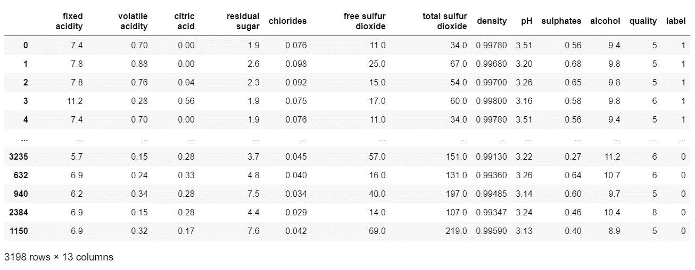
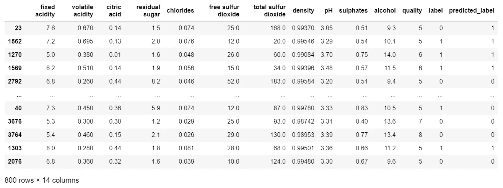

# 你想知道的关于 Python 中决策树的一切

> 原文：<https://towardsdatascience.com/everything-you-ever-wanted-to-know-about-decision-trees-in-python-17e8edb6b37b?source=collection_archive---------24----------------------->

## 从基本原则到生产环境中的部署，包括工作示例和易于理解的解释


沙哈达特·拉赫曼在 [Unsplash](https://unsplash.com/s/photos/python-code?utm_source=unsplash&utm_medium=referral&utm_content=creditCopyText) 上拍摄的照片

# 介绍

我在各种媒体上看到了许多关于 Python 中决策树机器学习算法的文章，但它们总是让我想要更多。

它们要么看起来在过程中中途跳跃，要么当我将代码应用到我的数据时它不工作，或者它们忽略了过程中的重要部分。

由于我找不到完全符合要求的东西，所以我想我自己也要试一试，这就产生了写这篇文章的想法。

# 背景

如果有人需要关于如何使用决策树来预测数据中的分类的介绍或复习，那么 R2D3 的这篇优秀文章提供了关于它如何工作的一步一步的可视化，绝对精彩！

【http://www.r2d3.us/visual-intro-to-machine-learning-part-1/ 

如果你想加深你的理解，包括一些数学知识和熵是如何工作的，那么福斯特·普洛沃斯和汤姆·福西特的这本书是一个主要书籍，它以一种简单易懂的方式解释了更复杂的主题

[https://www . Amazon . co . uk/Data-Science-Business-Data-analytic-thinking/DP/1449361323](https://www.amazon.co.uk/Data-Science-Business-data-analytic-thinking/dp/1449361323)

除了这些资源，还有大量关于 https://towardsdatascience.com/和 https://medium.com/的进一步阅读。

# 入门指南

有相当多的外部库涉及到决策树模型的开发和可视化，所以让我们从导入它们并设置几个配置参数开始…

# 导入和塑造数据

我选择处理的数据集是 UCI 机器学习库中的红酒和白酒数据集。这是一个非常好的数据集，因为我们可以查看代表葡萄酒的数据，然后训练决策树模型来预测葡萄酒是白还是红。

数据集可以在这里找到…[https://archive.ics.uci.edu/ml/datasets/wine+quality](https://archive.ics.uci.edu/ml/datasets/wine+quality)

…这是符合 https://archive.ics.uci.edu/ml/citation_policy.html[UCO 引文政策的参考文献…](https://archive.ics.uci.edu/ml/citation_policy.html)

Dua d .和 Graff c .(2019 年)。UCI 机器学习资源库【http://archive.ics.uci.edu/ml[】](http://archive.ics.uci.edu/ml%5D)。加州欧文:加州大学信息与计算机科学学院

首先，我们将读取来自两个不同的逗号分隔文件中的红葡萄酒和白葡萄酒数据，设置一个标签或目标变量 1 =红，0 =白，然后从这两个源生成一个单独的`DataFrame`,并查看数据...


作者图片

接下来，我们将看看数据集中白葡萄酒和红葡萄酒的相对数量…

```
0    0.753886
1    0.246114
Name: label, dtype: float64
```

所以我们的葡萄酒含 75.4%的白葡萄酒和 24.6%的红葡萄酒。根据对超市货架的一瞥，这听起来似乎是正确的，但为了我们的决策树机器学习算法的目的，它需要重新塑造，该算法将预测葡萄酒的颜色(红色或白色)。

对于这些类型的算法来说，目标变量的命题需要被平衡，我们的是 75.4% / 24.6%。

一种常见的技术是“下采样”,其中较小的部分被全部使用，而来自较大数据集的相同数量的数据点被随机采样。

在下面的代码中，我们简单地抽取所有的红葡萄酒，然后随机抽取白葡萄酒来匹配红葡萄酒的数量…



作者图片

让我们再检查一下比例，确保我们达到了平衡…

```
1    0.5
0    0.5
Name: label, dtype: float64
```

# 将数据分成训练和测试数据集

下一个代码块复制了所有的“特征”(酸度、氯化物等。)转换为 X，将“目标”变量(标签为红/白)转换为 y。

然后，它将 X 和 y 分成训练和测试数据。训练数据将用于训练模型，测试数据将用于评估模型。

这种分离的原因是将测试数据排除在训练之外，以便模型避免“过拟合陷阱”，即模型对训练数据表现良好，但对从未见过的新数据表现不佳。

开始了…

# 调整模型

在我们继续创建决策树模型之前，我们需要根据与我们的红葡萄酒和白葡萄酒数据最匹配的值来调整“超参数”，也就是说，我们需要为模型选择参数，使其在进行预测时具有最高的准确性。

如果我们手动这样做，我们可以不断调整设置，重新运行模型和分数，但这非常耗时，也不太科学。

相反，我们可以使用方便的`sklearn.model_selection.GridSearchCV`函数，该函数将尝试我们传递给它的所有超参数组合，并让我们知道哪些是最有效的。

我将它封装在`dtree_grid_search`函数中，该函数接受一个包含所有特性的`X`参数、一个包含所有标签的`y`参数和一个表示应该使用多少 X 和 y 数据分割来测试超参数的`nfolds`。

它在这里..


作者图片

# 创建决策树模型

我们可以看到网格搜索确定为“最佳”或“最准确”的参数，包括`criterion = 'entrophy'`、`max_features='auto'`等。

请注意，我选择了`max_depth=3`,而不是优化值 9，以减少树中的级别数，从而更容易为本文的目的可视化。

我有意识地选择牺牲准确性(在 9 个级别上，准确性约为 93%,而不是 95%)来换取简单性和可读性，这是一件完全有效的事情，事实证明，模型设计师在现实世界中构建模型时一直在进行这些权衡。

下一个代码块使用优化的超参数构建我们的决策树模型，使用训练数据训练模型，然后使用训练数据对我们模型的有效性进行评分，结论是我们的决策树模型可以基于葡萄酒特征值预测目标葡萄酒颜色，准确率为 92.8% …

```
0.9275
```

# 特征重要性

花两行代码来快速了解这些特性的相对重要性是值得的..


作者图片

原来`total sulfur dioxide`是最重要的特征，重要性为 0.6。`volatile acidity`和`chlorides`分别以 0.19 和 0.17 紧随其后。在此之下，其余特征的重要性得分较低。

这向我们展示了哪些特征影响了模型，并且可能需要去掉`chlorides`下面的特征并重新运行模型。如果精确度的损失可以忽略不计，但是复杂度的降低是显著的，那么移除它们可能是一个很好的折衷。

此外，即使我们拒绝我们的决策树，并探索不同的机器学习算法，如逻辑回归，关于哪些特征有影响的信息仍然会有用。

# 可视化决策树

将决策树转化为直观的可视化表示是帮助我们理解它如何工作以及它在做什么的关键一步。

有很多可视化决策树的库，这里我展示了一些我最喜欢的。

我从`dtreeviz`开始，它可以通过运行下面的命令行来安装

`pip install dtreeviz`

…您可以在此查看完整文档—[https://github.com/parrt/dtreeviz](https://github.com/parrt/dtreeviz)

我已经在网上找到了许多绘制 Seaborn 包附带的企鹅数据集的例子，但我很难找到任何有助于我在自己的数据帧上使用它的例子。

玩了一会儿之后，我想出了下面的代码，它可以在任何 X 特征`DataFrame`和 y 目标`Series`上工作。

在我看来,`dtreeviz`不仅提供了模型的视觉效果，还提供了特征的分布，以及算法如何做出分叉树和划分数据的决定


作者图片

这个`dtreeviz`真的很美是不是！从顶部读取决策树机器学习算法选择基于`total sulfur dioxide less than 74.50`进行第一次数据拆分。

这导致了我们在第二行中看到的数据分裂，我们可以很容易地看到和理解剩余的分裂，直到算法在深度为 3 时结束，其中 3 组被分类为白葡萄酒，5 组被分类为白葡萄酒。

然而，尽管`dtreeviz`在视觉上令人惊叹，但一些已经存在了一段时间的树可视化库中却缺少一些信息。

例如`graphviz`虽然在视觉上不那么吸引人，但确实包含了关于每个节点熵(即杂质)的附加信息，以及每个节点中出现的每个目标变量(红葡萄酒和白葡萄酒)的数量。

因此，我的偏好是使用两个库和两个版本的树可视化，我发现这有助于我完全理解模型在做什么。

请注意，我在下面添加了几行额外的代码，将树图像写出到一个`.png`文件中，然后再读回来。在这里，完全可以显示树，而不用用更少的代码行保存它，除非保存它，否则不可能控制比例，并且默认比例太大，不容易查看，因此我选择将其写入文件...


作者图片

# 使用模型进行预测

当我第一次学习决策树时，我想知道如何使用该模型对一组新数据进行预测，我努力在网上找到答案。

如果我只有一瓶我想预测颜色的葡萄酒，该怎么办？我会怎么做？

事实证明这相当简单，下面的函数将获取一组葡萄酒数据，进行预测，然后返回结果…

下面的两行代码只是从完整的数据集中挑选顶部和底部的数据行，这样我们就可以运行一个预测，看看它是否与实际标签相匹配…


作者图片


作者图片

我们走吧。我们使用第一行和最后一行的值调用单个预测函数，我们可以看到，在每种情况下，预测都与实际标签匹配(1=“红色”，0=“白色”)，这就是我们使用模型进行单个预测所需要知道的全部信息。

```
('red', 'white')
```

我们可能想做的另一件事是对整个文件或整个`DataFrame`进行预测，结果证明这也非常容易。

下面的代码将 X_test 和 y_test 数据放在一起，显示带有实际标签的数据集，然后调用模型对每一行进行预测。

然后它显示数据，我们可以看到实际标签和预测标签并排。



作者图片

我们还可以使用两种略有不同的方法来验证我们的模型的准确性。

第一个是将那些`label`与`predicted_label`匹配的行表示为行数的百分比，这给出了 92.3%的准确度。

然后运行`model.score`,这正好显示了这个库函数做了什么以及它是如何工作的。它只是计算实际值和预测值匹配的行的百分比...

```
(0.9275, 0.9275)
```

# 在生产环境中部署和实现决策树

一旦所有数据科学工作结束，就不可避免地需要在生产环境中实施，而该环境可能不是 Python，并且可能无法访问我们在本例中使用的所有专业建模库。

树形可视化让我们了解了算法正在做什么，但幸运的是，最简单的可视化技术——文本表示——以一种可以直接翻译成一系列`if` `else`语句的格式显示树形图，这些语句可以很容易地用任何编程语言进行编码。

在我的环境中，生产系统是用 C#或 VB 脚本编写的，因此能够执行这最后一步以“操作化”所有数据科学工作至关重要。

`sklearn.tree.export_text`方法可以用来给我们的模型一个非常有用的表示...


作者图片

这个输出可以很容易地转换成一个函数，这个函数可以很容易地用 C#、VB 脚本、Java 或任何其他编程语言编写…

最后，我们在下面测试了操作化函数，以验证标签的预测方式与使用上面的单行或整个数据帧方法完全相同…

```
('red', 'white')
```

# 结论

我们从一些在线资源开始，这些资源解释了决策树在提取和形成公共数据集之前如何从基本原则开始工作。

然后，我们将数据分为训练和测试两部分，创建了一个优化的决策树模型，将我们的数据拟合到该模型中，并评估该模型的准确性。

然后，我们使用两个不同的强大库来可视化我们的决策树，并对单个案例和整个数据文件进行预测。

最后，我们展示了如何将决策树模型转换为 if-then-else 算法，该算法可以轻松部署到生产环境中，即使该环境使用不同的编程语言(例如 C#)。NET、VBScript、Java 等。

完整的源代码可以在这里找到:

<https://github.com/grahamharrison68/Public-Github/tree/master/Decision%20Trees> 