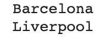

# 关于 Python 中的字典，你需要知道的一切

> 原文：<https://towardsdatascience.com/everything-you-need-to-know-about-dictionaries-in-python-de57480ac101?source=collection_archive---------10----------------------->

## Python — 30 天挑战

## 在本文中，我们将从基础开始，深入探究字典在 Python 中能做的一切

Python 中的字典或其他编程语言中的哈希表是存储和检索值的最有效的数据结构之一。它们根据一个键存储每个值，形成一个键-值对。在本文中，我们将学习开始使用 Python 时应该知道的关于字典的一切。


图片来自[像素](https://www.pexels.com/photo/photo-of-turned-on-laptop-computer-943096/)

以下是我们今天将要讨论的关于字典的话题列表:

*   字典介绍
*   如何定义字典
*   如何使用字典
*   如何在字典中赋值
*   词典研究方法
*   对字典键/值的限制
*   结论

> 这是我 30 天文章写作挑战的一部分。请随意查看我的新人帖子上的文章:

<https://nouman10.medium.com/lets-publish-30-articles-in-30-days-a0b8111855bb>  

# 字典介绍:

Dictionary 是 Python 中的一种复合数据结构，基本上由一系列键值对组成。键值对中的每个键都将该键映射到其关联值。

## 如何定义字典:

在 Python 中，字典通常由一列用大括号({})括起来的逗号分隔的键值对来定义。每个键都用冒号(:)与其关联的值隔开。

以下代码片段构建了一个足球运动员及其相关俱乐部的字典:

```
football_players_club = {
      "Cristiano Ronaldo": "Juventus",
      "Bruno Fernandes": "Manchester United",
      "Lionel Messi": "Barcelona",
      "Sadio Mane": "Liverpool",
      "Harry Kane": "Tottenham Hotspur"
}
```

还可以通过使用字典的构造函数`dict()`来定义字典。它可以接受一组键值对。因此，包含键-值对元组的列表是通过构造函数构造字典的有效方式，包含键-值对列表的元组也是如此。


作者图片

尽管可以像显示列表一样显示词典，但不能使用数字索引来访问它们。字典中没有顺序，你只能使用它的键来访问一个值。使用索引会导致一个`KeyError`。

## 如何访问字典值:

为了访问字典值，我们使用与值相关联的键。例如，要访问上面字典中的“巴塞罗那”和“利物浦”,我们使用:

```
print(football_players_club["Lionel Messi"])
print(football_players_club["Sadio Mane"])
```



作者图片

使用字典中不存在的键会导致一个`KeyError`:

```
football_players_club['Muhammad Salah']
football_players_club[1]
```

这两种情况都会导致以下错误:


作者提供的图片

请注意，尽管我们在第二个示例中使用了数字索引，但两者的误差是相同的。这是因为 Python 认为您在方括号内传递的任何内容都是字典的键。事实上，Python 实际上允许字典有如下的数字键:

```
numerical_keys = {
   1: 'a',
   0: 'b',
   4: 'c'
}numerical_keys[0]
```


作者图片

当我们使用“0”作为键时，我们不是说获取索引为 0 的值，而是将 0 作为键的值，这就是预期的“b”。

## 如何在字典中赋值:

我们可以为一个键指定新的值，甚至更新字典中现有键的值，只需简单地用这个键访问字典并将其设置为所需的值，如下所示:

```
football_players_club['Luis Suarez'] = 'Athletico Madrid'
football_players_club['Harry Kane'] = 'Manchester City'
```

# 词典方法:

# 词典的常用方法:

在这里，我们将研究 python 中应用于词典的一些常用方法，最后，我们将看到所有这些方法的演示:

注意:`*dict*` *、* `*dict_1*` *、* `*dict_2*` *都代表某种任意的字典。*

## len:

顾名思义，它返回字典中键值对的长度。

语法:`len(*dict)*`

## 在:

它允许我们检查一个键是否存在于字典中

语法:`key in *dict*`

我们可以利用这一点来避免访问字典中不存在的键。例如，如果关键字不在字典中，使用`dict[key]`将引发一个`KeyError`，但是使用下面一行代码不会，因为 python 短路评估将阻止它评估`and`语句的第二部分，以防`key in *dict*` 返回 false。

```
key in *dict* and *dict*[key]
```

## 获取:

它获取与给定键相关联的值。它还接受一个可选的默认参数，如果字典中没有这个键，就会返回这个参数。但是，如果键不存在，并且也没有传递默认值，则该函数返回 None。

语法:`*dict*.get(key)`或`*dict*.get(key, default_value)`

## 按键:

它返回字典的键

语法:`*dict*.keys()`

## 价值观:

它返回字典的值

语法:`*dict*.values()`

## 项目:

它将字典中的条目作为一个键值元组序列返回。

语法:`*dict*.items()`

注意:在字典中使用 for 循环会在每次迭代时返回键，即`for key in *dict*` 将遍历字典中的键列表

## popitem:

它从字典中删除最后一个键-值对并返回它。

语法:`*dict*.popitem()`

## 流行音乐:

它移除与给定键关联的键-值对。它还接受一个可选的默认参数，如果字典中没有这个键，就会返回这个参数。但是，如果键不存在并且默认值也没有被传递，那么该函数会引发一个`KeyError.`

语法:`*dict*.pop(key)`或`*dict*.pop(key, default_value)`

## 清除:

顾名思义，它清除字典(清空字典)

语法:`*dict*.clear()`

## 更新:

它将一个字典与另一个字典或一个键值对的 iterable 合并，就像我们在定义字典一节中看到的那样。两个字典中的所有键值对都被添加到第一个字典中。如果一个关键字已经存在于第一个字典中，则它的值由第二个字典中与该关键字相关联的值来更新。如果一个关键字不在第一个字典中

语法:`*dict_1*.update(*dict_2*)`(注意:只有`*dict_1*`被更新)

## 演示:


作者图片

# 对字典键/值的限制:

## 字典键:

正如我们之前看到的，您可以将字符串和整数设置为字典值中的键。您甚至可以像这样将 Python 中的内置对象设置为键:

```
dictionary = { int: 8, float: 9 }
dictionary[str] = 10
print(dictionary)
```


作者图片

然而，也有一些规则。给定的键在字典中只能出现一次，也就是说，每次试图为字典中已经存储的键设置值时，都会覆盖以前的值。最新的是存储的值。

此外，您只能使用不可变类型作为键。这意味着元组是一个非常好的键，而列表则不是。

```
dictionary = {(1, 1): 'a', (1, 2): 'b', (2, 1): 'c', (2, 2): 'd'}
print(dictionary)
```


这运行得很好，但是下面给出了一个错误:

```
dictionary = {[1, 1]: 'a'}
print(dictionary)
```


作者图片

## 字典值:

另一方面，字典值没有任何限制。任何值都是合适的字典值，不管它是可变的还是不可变的，是内置的还是用户定义的。字典值也可以重复，次数不限。

# 结论:

总结一下:

*   我们从 Python 中字典的基本介绍开始，包括定义、访问和赋值
*   然后我们研究了字典的一些内置方法
*   最后，我们研究了字典键和值的限制。

如果您觉得以上内容对您有用，请分享并随时支持我-->

*   [https://www.buymeacoffee.com/nouman10](https://www.buymeacoffee.com/nouman10)