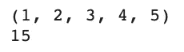

# 关于 Python 中的函数，你需要知道的一切

> 原文：<https://towardsdatascience.com/everything-you-need-to-know-about-functions-in-python-84abf677704c?source=collection_archive---------21----------------------->

## Python — 30 天挑战

## 在本文中，我们将从基础开始，深入探究使用 Python 中的函数可以做的一切

函数是任何编程语言中模块的基本构建块，是理想情况下执行单一任务的单一自包含代码块。本文为初学者提供了一种从 Python 中的函数开始的友好方式。我们将在这篇文章中讨论很多关于函数的内容，所以让我们开始吧！！


图片来自[像素](https://www.pexels.com/photo/person-using-macbook-pro-on-person-s-lap-1181298/)

以下是我们将讨论的函数主题列表:

*   在 Python 中定义您的第一个函数
*   Python 中的参数
*   位置参数
*   关键字参数
*   默认参数
*   可变长度位置参数
*   可变长度关键字参数
*   结论

> 这是我 30 天文章写作挑战的一部分。请随意查看我的新人帖子上的文章:

<https://nouman10.medium.com/lets-publish-30-articles-in-30-days-a0b8111855bb>  

# 在 Python 中定义您的第一个函数

让我们从定义第一个函数开始，这个函数完成将“Hello，world”打印到屏幕上的简单任务。

```
def print_hello_world():
    print("Hello, world")print_hello_world()
```

让我们来分解一下:

*   我们首先告诉解释器我们正在使用关键字`def`定义一个函数
*   然后是函数的名字，在我们的例子中是`print_hello_world`。你可以随心所欲地定义它
*   然后是两个圆括号。目前，它们是空的，但是它们包含了您想要传递给函数的任何参数(下一节将详细介绍)
*   然后是一个缩进的代码块，包含函数中要执行的代码。在我们的例子中，它只是打印“Hello，world”。
*   到目前为止，我们已经定义了我们的功能。它不会打印任何东西，除非我们在最后调用它。
*   类似地，我们可以调用该函数 10 次，它将打印 10 次“Hello，world ”,但定义将只编写一次。这就是功能在可用性方面的力量

注意，一个函数通常也有一个 return 语句。这是函数返回的值，可以按照您的意愿存储。

# 函数中的参数

参数是可以传递给函数的值，这些值将决定函数的执行方式。我们可以通过不同的方式传递参数:

## 位置参数:

传递参数最常见的方式是调用一个函数，并在与函数定义相同的位置传递参数。让我们以除法函数为例:

```
def integer_division(num_1, num_2):
    return num_1 // num_2
```

如果我们想将数字 10 除以数字 2，我们需要调用如下函数:

```
integer_division(10, 2)
```

这会返回 5。但是如果我们像这样改变位置:

```
integer_division(2, 10)
```

那么函数将返回 0，所以在传递位置参数时位置是很重要的。注意，我们需要在这里传递两个必需的参数，否则我们将得到一个`TypeError`,表明我们传递了不正确数量的参数

## 关键词参数:

我们也可以在调用函数时以`key=value`格式传递参数。这意味着我们不需要记住顺序。考虑与上面相同的函数:

```
def integer_division(num_1, num_2):
    return num_1 // num_2
```

我们可以像这样使用关键字参数来调用它:

```
integer_division(num_1=10, num_2=2)
```

或者像这样:

```
integer_division(num_2=2, num_1=10)
```

这两个都将返回 5。我们也可以传递位置参数和关键字参数的组合。但条件是关键字参数将出现在所有位置参数之后，如下所示:

```
integer_division(10, num_2=2)
```

这是必需的，以便 Python 解释器能够理解序列并为每个参数分配正确的值

## 默认参数:

Python 也允许我们在定义函数时定义默认参数。我们可以在函数定义期间这样定义它们:

```
def integer_division(num_1=12, num_2=2):
    return num_1 // num_2
```

现在我们可以如下调用该函数:

```
integer_division()
```

这将返回 6，但我们也可以传递自定义值(所有都是有效的选择):

```
integer_division(10) -> returns 5
integer_division(12, 3) -> returns 4
integer_division(num_2=4) -> returns 3
integer_division(10, num_2=5) -> returns 5
```

**注意:**当你将一个可变对象(比如一个列表)作为默认参数传递给一个函数时，默认参数有一个常见的问题。考虑以下函数:

```
def append_item(a_list=[]):
    a_list.append('item')
    print(a_list)
```

您可以使用列表调用如下函数:

```
append_item(['item_1'])
```


作者图片

```
append_item(['item_2'])
```


作者图片

这是意料之中的。每当一个新的列表被创建，我们添加一个项目到它。但是让我们看看当我们使用默认参数时会发生什么:

```
append_item()
append_item()
append_item()
```


作者图片

震惊吧？我也是。！。它应该每次只打印一个项目的列表。

这背后的原因是，默认参数在函数定义时创建一次，并存储在内存中。这就是为什么使用可变对象会修改内存中的对象，并可能导致一些意想不到的结果。实现此功能的更好方法如下:

```
def append_item(a_list=None):
    if a_list is None:
        a_list = []

    a_list.append('item')
    print(a_list)
```

这将确保每次使用默认参数时都创建一个新的空列表。

## 可变长度位置参数(*args):

你可能以前见过这个(`*args`)，但不知道它是什么意思。当我们不知道要传递的参数的确切数量，但需要以类似的方式处理它们时，就使用这种方法。

例如，你想写一个函数来增加一些数字。你事先不知道你要加多少个数。在这种情况下这很方便:

```
def add(*args):
    total = 0
    for num in args:
        total += num

    return total
```

当您使用这种语法时，`args`基本上是所有位置参数值的元组。让我们调用这个函数:

```
add(1, 2, 3, 4, 5)
```

这将像预期的那样返回 15。我们甚至可以打印元组并自己检查。另外，`args`这个名字不是必须的，你可以随意定义，但是要加一个星号(*)。

```
def add(*list_of_numbers):
    total = 0
    print(list_of_numbers)
    for num in list_of_numbers:
        total += num return total
```



作者图片

## 可变长度关键字参数(**kwargs):

我们还可以传递任意数量的关键字参数，函数将接收这些参数作为一个字典，从中我们可以提取我们想要的值:

```
def print_kwargs(**kwargs):
    print(kwargs)
```

我们可以用多种方式调用这个函数:

```
print_kwargs(num_1=10, num_2=5, num_3=1)
```


作者图片

```
print_kwargs(name='Nouman', age='23', profession='Software Engineer')
```


作者图片

# 结论:

总结一下:

*   我们从用 Python 编写第一个函数开始
*   然后我们研究了位置和关键字参数
*   最后，我们研究了缺省参数和可变长度参数

如果您觉得以上内容对您有用，请分享并随时支持我-->

*   [https://www.buymeacoffee.com/nouman10](https://www.buymeacoffee.com/nouman10)