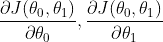

# 关于梯度下降你需要知道的一切

> 原文：<https://towardsdatascience.com/everything-you-need-to-know-about-gradient-descent-b1d9edfce0b5?source=collection_archive---------22----------------------->

[斯科特·格雷厄姆](https://unsplash.com/@homajob?utm_source=unsplash&utm_medium=referral&utm_content=creditCopyText)在 [Unsplash](https://unsplash.com/collections/3343030/algorithm-blog?utm_source=unsplash&utm_medium=referral&utm_content=creditCopyText) 上拍照

## 第 1 部分—详细解释算法

梯度下降是一种使用一阶迭代来解决优化问题的算法。由于梯度下降被设计成寻找微分函数的局部最小值，所以梯度下降被广泛用于机器学习模型中，以寻找使模型的成本函数最小化的最佳参数。本文将详细讨论梯度下降算法，下一篇文章将讨论它在线性回归模型中的应用。

**算法**

如上所述，梯度下降解决最小化问题，假设我们有一个优化问题:

我们想找出使函数 J(θ_0，θ_1)最小的正确参数θ_0 和θ_1。如果函数 J(。)是可微的，我们既可以基于微积分求解一阶条件，也可以使用梯度下降找到正确的θs，如果使用微积分，我们知道需要求解:

一阶条件

直觉是，函数的“斜率”在最优点将是水平的。如果函数是凸的，它将是最小值。下图说明了只有一个参数的函数的一阶条件。

求解最小值

尽管这种分析方法执行最小化而无需迭代，但它通常不用于机器学习模型。当参数数目太大时，效率不够高，并且如果函数太复杂，有时我们不能容易地求解一阶条件。因此，对于具有众多特征的模型，我们通常使用梯度下降算法来最小化成本函数。为了找到使 J(θ_0，θ_1)最小的θ_0 和θ_1，梯度下降操作如下:

*   1，对θ_0 和θ_1 进行初步猜测
*   2、检查最初猜测时的偏导数。偏导数在梯度下降中称为梯度:

偏导数给出了方向

*   3、基于偏导数和学习率𝛂:同时更新θ_0 和θ_1

右边的θ是旧值，而左边的θ是更新值

*   4、重复第 2 步和第 3 步，直到 J(θ_0，θ_1)不再显著下降。该算法输出使 J(θ_0，θ_1)最小的估计θ_0 和θ_1。

在下面的部分，我将解释为什么这个算法找到最小点，进行初步猜测，并选择正确的学习率。

**为什么有效？**

梯度下降的关键直觉是，从每一步到最小点，它采取最快的路线快速收敛。这是通过在每一步取偏导数来找到局部最小值的方向。下图解释了只有一个参数的函数的直觉。左侧面板显示了初始猜测位于最佳点左侧的时间。因为函数 J(。)是凸的，初始猜测的导数将是负的(初始点的斜率将是负的)。因此，我们需要增加θ，以达到局部最小值θ*。再看更新函数，由于 dJ(θ)/dθ为负，θ-𝛂*dJ(θ)/dθ会大于θ，从而向局部极小值θ*移动。右图显示了当初始猜测位于局部最小值θ*的右侧时的相反情况。由于 dJ(θ)/dθ为正，θ-𝛂*dJ(θ)/dθ将小于θ，从而向θ*移动。

梯度下降如何向θ*方向更新

你可能会注意到，当提到函数的最小点时，我使用局部最小值而不是全局最小值。这是因为梯度下降只能找到局部最小值。如果一个函数有多个局部极小值和一个全局极小值，不保证梯度下降会找到全局极小值。此外，它找到哪个局部最小值将取决于初始猜测的位置。以下图为例。b 是全局最小值，而 A 和 C 是 J(θ)的局部最小值。如果初始猜测位于区域 A 或区域 C，梯度下降将在局部最小值 A 或 C 处取最优θ。只有当初始猜测位于区域 B 时，算法才会找到使 J(θ)达到全局最小值 B 的最优θ。

局部最小值与全局最小值

**如何进行初步猜测？**

如上所述，进行初步猜测对于找到正确的最小值非常重要。从上图可以看出，C 点是一个局部极小值，它可能不能很好的代表 J(θ)的极小点。因此，如您所见，在大多数情况下，0 可能不是一个好的初始猜测。实际上，最初的猜测通常是通过应用随机函数来完成的。它可以是基于所有θ可能值范围内的均匀分布的随机函数。如果可能的话，您可以用不同的初始猜测运行算法，并比较 J(θ),以查看它们彼此之间是否有显著差异。

**什么是好的学习率？**

学习率𝛂在整个过程中是一个常数，它定义了算法更新的速度。使用正确的𝛂是有效运行梯度下降的关键。如下图所示，如果𝛂太小，算法就会太慢而无法收敛，因为它需要很多步骤。如果𝛂太大，它可能“跳过”局部最小值，有时甚至可能不收敛。实际上，对于大多数情况，0.01 是一个很好的学习率。

左:𝛂太小；右:𝛂太大

**批量梯度下降和随机梯度下降**

我们拥有的数据点越多，在训练机器学习模型时，我们给算法带来的计算负担就越大。在梯度下降的更新步骤中，我们可以在计算偏导数时取全部训练样本或部分训练样本。前者称为批量梯度下降，后者称为随机梯度下降。批量梯度下降更准确地找到正确的局部最小值。但是，如果训练样本很大，就太慢了。随机梯度下降仅单独考虑每个训练观察。它不是计算成本函数的精确偏导数，而是使用每个观察值来估计偏导数，然后在该方向上迈出一步。虽然每个观察将提供真实偏导数的差的估计，但是给定足够的随机性，参数将以快得多的速度收敛到良好的全局估计。此外，由于它只需要考虑一个单一的观察，随机梯度下降可以处理数据集太大，不适合在内存中。

本文详细解释了梯度下降算法。具体来说，它比较梯度下降和一阶条件来解决优化问题；梯度下降怎么操作，为什么有效；如何做好初始猜测，找到好的学习率；批量下降和随机梯度下降有什么区别？在下一篇文章中，我将讨论梯度下降在线性回归模型中的应用。

感谢您阅读这篇文章。这是我所有博客帖子的列表。如果你感兴趣的话，可以去看看！

<https://zzhu17.medium.com/my-blog-posts-gallery-ac6e01fe5cc3>  <https://zzhu17.medium.com/membership> 