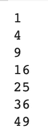
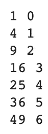
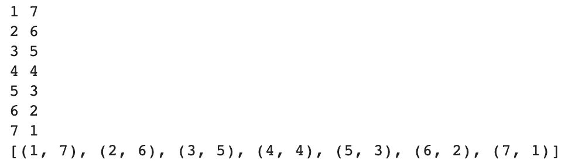
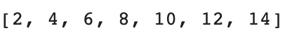
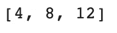
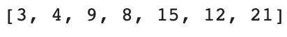
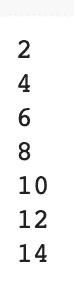
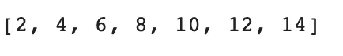
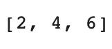
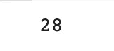

# 关于 Python 中迭代列表的所有知识

> 原文：<https://towardsdatascience.com/everything-you-need-to-know-about-iterating-lists-in-python-78009ff593d5?source=collection_archive---------11----------------------->

## Python — 30 天挑战

## 在本文中，我们将研究 Python 中迭代器的各种函数和循环方式

想了解 Python 中的高级迭代方式吗？你来对地方了。许多 Python 开发人员在遍历各种迭代器时使用简单的`for`和`while`循环，但是 Python 中有许多帮助函数可以让你的代码更简单甚至更快。


图像来自[像素](https://www.pexels.com/photo/woman-programming-on-a-notebook-1181359/)

在本文中，我们将了解以下内容:

*   `for`回路
*   `while`循环
*   `enumerate`
*   `zip`
*   列出理解
*   `lambda`
*   `map`
*   `filter`
*   `reduce`

> 这是我 30 天文章写作挑战的一部分。请随意查看我的新人帖子上的文章:

<https://nouman10.medium.com/lets-publish-30-articles-in-30-days-a0b8111855bb>  

# `For`循环

让我们从基础开始。For 循环几乎出现在每一种编程语言中，它们的用法都非常相似。但是在 Python 中，for 循环可以以多种方式使用:

## 按值:

我们可以遍历一个列表，每次都得到它的值，如下所示:

输出将是:



作者图片

## 按索引:

我们可以通过使用`range()`函数并传递列表的长度来遍历列表。它将返回从 0 到列表末尾的索引。

输出将与上面相同。

# `While`循环

与 for 循环类似，`while`循环也很常见，在各种语言中的用法也很相似。我们通常从定义一个带有初始值的计数器和基于该计数器的条件开始，当条件为真时，允许 while 循环运行。然后我们以某种方式改变 while 中的计数器，在某个时刻条件变为假。

输出将与上面相同。

# 列举:

`enumerate`函数让我们可以同时访问索引和列表中的值，如下所示:

这将给出如下预期的输出:



作者图片

# 邮编:

有时，我们需要同时遍历两个或更多的列表。`zip`是一个很棒的函数，它允许我们访问两个列表中相同索引处的值。在不相等列表的情况下，较小列表的长度被认为是最大索引。`zip`函数基本上通过从每个列表中选择一个值来创建元组的迭代器，如下所示。如果我们尝试将输出转换为列表，它基本上是一个元组列表:



作者图片

# 列表理解:

列表理解是以更紧凑的格式使用 for 循环的另一种方式。它们允许你在一个列表的每个元素上执行一个操作，例如转换。它们还可以用于过滤目的，因为您可以在其中包含 if…else 语句。

## 转型:



作者图片

## 过滤:

只有当数组中的元素是偶数时，下面的代码才会将该元素的值加倍:



作者图片

我们还可以使用 if…else 语句，如果数量是奇数，则将其增加三倍:



作者图片

# λ:

`lambda`功能不用于迭代，但在使用`map`、`filter`和`reduce`功能时很有帮助。它创建了一个匿名函数，您可以将它应用于一个值列表，即任何值。其格式可以定义为:

```
lambda argument(s): return value
```



作者图片

为了更好地理解它，这个函数也可以写成如下形式:

# 地图:

顾名思义，`map`函数将一个函数映射到列表中的每个值。它接受函数作为第一个参数，数组作为第二个参数。它返回一个 map 对象，该对象可以被迭代，但不能打印为一个完整的列表，但可以转换为一个列表



作者图片

# **过滤器:**

`filter`函数将一个函数映射到列表中的每个值，如果该函数为该值返回 true，则返回该值，否则跳过它。以下函数仅在偶数时返回值:



作者图片

# 减少:

`reduce` function 基本上将一个元素列表简化为一个元素。您从一个默认值开始，然后通过`reduce`传递的函数应用于列表中的每一项。关于`reduce`函数的一个棘手的概念是`reduce`中使用的函数接受两个参数。第一个是到目前为止的累积值，下一个是列表中的当前元素。第一个参数是开始时的默认值。我们可以使用下面的代码来计算一个使用`reduce`的数组的和:

我们从默认值 0 开始，并不断添加元素。



作者图片

# 结论:

总结一下:

*   我们从几乎每个开发人员都使用的基本 for 和 while 循环开始。
*   然后，我们研究了一些更有效、更简单的迭代函数以及列表理解。
*   最后，我们在各种函数中使用了`lambda`,用于转换、过滤和各种目的。

如果您觉得以上内容对您有用，请分享并随时支持我-->

*   [https://www.buymeacoffee.com/nouman10](https://www.buymeacoffee.com/nouman10)