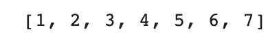
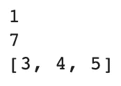
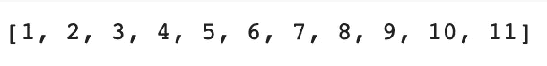
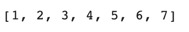
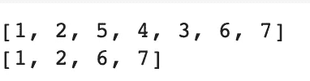
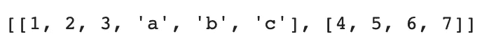
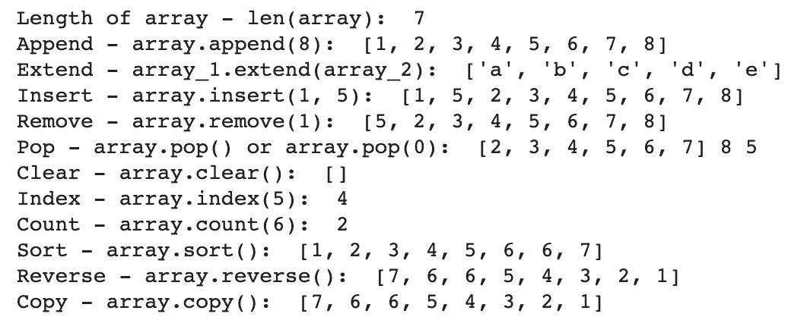
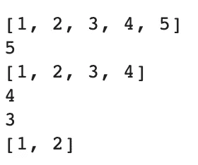
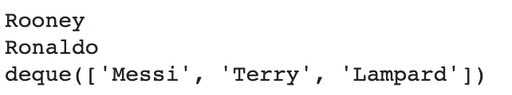

# 关于 Python 中的列表，您需要知道的一切

> 原文：<https://towardsdatascience.com/everything-you-need-to-know-about-lists-in-python-a503b1461c8f?source=collection_archive---------13----------------------->

## Python — 30 天挑战

## 在本文中，我们将从基础开始，深入探究列表在 Python 中能做的一切

Python 中的列表或其他编程语言中的数组基本上是一种复合数据结构，它基本上可以保存一个项目列表。本文为初学者提供了一种在 Python 中使用列表的友好方式。我们将在这篇文章中讨论很多关于列表的内容，所以让我们开始吧！！


图片来自 [Unsplash](https://unsplash.com/photos/RDolnHtjVCY)

以下是我们将在列表上讨论的主题列表(双关语 xD):

*   列表介绍
*   列表的常用方法
*   列表迭代
*   将列表用作堆栈
*   将列表用作队列
*   结论

> 这是我 30 天文章写作挑战的一部分。请随意查看我的新人帖子上的文章:

[](https://nouman10.medium.com/lets-publish-30-articles-in-30-days-a0b8111855bb) [## 让我们在 30 天内发表 30 篇文章

### 在这篇文章中，我将接受挑战，在未来 30 天内写 30 篇与数据科学相关的文章…

nouman10.medium.com](https://nouman10.medium.com/lets-publish-30-articles-in-30-days-a0b8111855bb) 

# 列表介绍

Python 有很多可以用来存储条目列表的数据结构，但是*列表*是最通用的一种。它被写成用方括号括起来的逗号分隔的值列表。

```
array = [1, 2, 3, 4, 5, 6, 7]
array
```



作者图片

python 中的列表可以进行索引(0 索引，允许负索引)和切片，如下所示:

```
array = [1, 2, 3, 4, 5, 6, 7]
print(array[0])
print(array[-1])
print(array[2:5])
```



作者图片

列表也允许如下连接(但不会像这样修改原始列表，除非您将值存储在该变量中):

```
array = [1, 2, 3, 4, 5, 6, 7]
print(array + [8, 9, 10, 11])
```



作者图片

列表是可变的，也就是说，可以像下面这样改变它们的内容:

```
array = [1, 2, 4, 4, 5, 6, 7] # 4 instead of 3 on index 2
array[2] = 3
print(array)
```



作者图片

我们也可以给列表的片段赋值(这可能会也可能不会改变它们的长度):

```
array = [1, 2, 3, 4, 5, 6, 7]
array[2:5] = [5, 4, 3]
print(array)
array[2:5] = []
print(array)
```



作者图片

列表可以包含不同类型的对象，甚至列表中的列表！(嵌套列表)

```
array_1 = [1, 2, 3, 'a', 'b', 'c']
array_2 = [4, 5, 6, 7]
combined = [array_1, array_2]
print(combined)
```



作者图片

关于列表的介绍就到此为止。让我们看看列表中常用的一些方法

# 列表的常用方法:

在这里，我们将研究 python 中应用于列表的一些常用方法，最后，我们将看到所有这些方法的演示:

注:`*list*` *、* `*list_1*` *、* `*list_2*` *均代表某种任意的列表。*

## len:

顾名思义，它返回一个列表的长度。

语法:`len(*list)*`

## 追加:

它允许我们将任何项目添加到列表的末尾。

语法:`*list*.append(item)`

## 扩展:

它将一个列表中的所有项目追加到另一个列表中。

语法:`*list_1*.extend(*list_2*)`

## 插入:

它在提到的索引中插入给定的项目

语法:`*list*.insert(index, item)`

## 移除:

它从列表中移除给定项的第一个匹配项。如果项目不存在，它会引发一个`ValueError`

语法:`*list*.remove(item)`

## 流行音乐:

它从给定的索引中移除该项并返回该项。在没有给定索引的情况下，它从列表中删除最后一项并返回。

语法:`*list*.pop()`或`*list*.pop(index)`

## 清除:

顾名思义，它清除列表(清空列表)

语法:`*list*.clear()`

## 索引:

它在列表中搜索给定的项，并返回它在列表中第一次出现的索引，如果它不在列表中，则返回-1。它还有可选参数， *start，*和 *end，*限制列表内的搜索空间

语法:`*list*.index(item)`

## 计数:

返回给定项目在列表中出现的次数

语法:`*list*.count(item)`

## 排序:

就地排序列表，即修改原始列表

语法:`*list*.sort()`

## 反转:

原地反转列表

语法:`*list*.reverse()`

## 副本:

返回列表的一个[浅拷贝](https://docs.python.org/3/library/copy.html#shallow-vs-deep-copy)

语法:`*list*.copy()`

## 演示:

## 输出:



作者图片

# 列表迭代:

列表迭代是一个独立的主题，我在以前的一篇文章中详细讨论过:

[](/everything-you-need-to-know-about-iterating-lists-in-python-78009ff593d5) [## 关于 Python 中迭代列表的所有知识

### 在本文中，我们将研究 Python 中迭代器的各种函数和循环方式

towardsdatascience.com](/everything-you-need-to-know-about-iterating-lists-in-python-78009ff593d5) 

# 将列表用作堆栈:

堆栈根据后进先出算法执行操作。通过使用内置方法，列表可以很容易地充当堆栈。要将任何元素追加到列表的末尾，我们可以使用`list.append(item)`并从列表中检索任何元素，我们可以使用`list.pop()`而不使用任何索引，这将移除并返回列表中的最后一个(追加的)元素。



作者图片

# 将列表用作队列:

队列根据 FIFO(先进先出)算法执行操作。为此，我们可以通过使用列表的索引方法`pop`和`insert`来使用列表，但这样效率不高，因为从列表末尾开始的追加和弹出非常快，而在列表开头的弹出和插入效率不高，因为所有元素都必须移动一个索引。

幸运的是，Python 有一个内置的`collections.deque`，可以实现快速追加和从两端弹出。



作者图片

# 结论:

总结一下:

*   我们从 Python 中列表的基本介绍开始
*   然后我们研究了列表的一些内置方法
*   最后，我们研究了如何将列表用作堆栈和队列。

如果您觉得以上内容对您有用，请分享并随时支持我-->

*   [https://www.buymeacoffee.com/nouman10](https://www.buymeacoffee.com/nouman10)