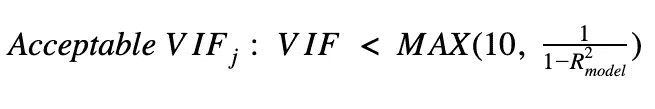
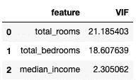

# 了解多重共线性以及如何在 Python 中检测多重共线性

> 原文：<https://towardsdatascience.com/everything-you-need-to-know-about-multicollinearity-2f21f082d6dc?source=collection_archive---------2----------------------->

## 它是什么，它从哪里来，为什么不好，以及如何处理它。


Amir-abbas Abdolali 在 [Unsplash](https://unsplash.com/s/photos/twins?utm_source=unsplash&utm_medium=referral&utm_content=creditCopyText) 上拍摄的照片

> **请务必点击** [**订阅此处**](https://terenceshin.medium.com/membership) **或我的** [**个人简讯**](https://terenceshin.substack.com/embed) **千万不要错过另一篇关于数据科学指南、技巧和提示、生活经验等的文章！**

# 介绍

在接下来的几篇文章中，我想写一些与**回归分析**相关的真正强大的主题。在很长一段时间里，我不认为线性回归有什么大不了的——我只是认为它是最简单的机器学习模型，只不过是一条最佳拟合线。

然而，随着我对回归分析和它所能提供的东西了解得越来越多，我意识到有很多强大的工具和技巧是大多数人不知道的。

所以，作为开始，我想谈谈多重共线性。具体来说，我要涵盖:

1.  什么是多重共线性
2.  什么导致多重共线性
3.  为什么它对线性回归模型不好
4.  如何检测和消除多重共线性
5.  如何检测 Python 中的多重共线性

说了这么多，让我们开始吧！

# 什么是多重共线性？

**多重共线性**(或共线性)当回归模型中的一个独立变量与另一个独立变量线性相关时发生。

例如，如果我们在回归模型中使用“**年龄**和“**年轮数**”来预测树的重量。

因为树的年龄和树的年轮数(通常每年一个年轮)之间有很高的相关性，所以多重共线性将出现在该模型中。

> **请务必点击** [**订阅此处**](https://terenceshin.medium.com/membership) **或我的** [**个人简讯**](https://terenceshin.substack.com/embed) **千万不要错过另一篇关于数据科学指南、技巧和提示、生活经验等的文章！**

# 什么原因导致多重共线性？

为了理解为什么多重共线性不好，我们必须看看回归系数(或模型参数)是如何估计的。这一部分涉及到一点线性代数，但是如果你不感兴趣，可以跳过这一部分。

***注:跳过这一部分也不用担心，只要把重点放在为什么多重共线性不好以及如何消除多重共线性上就可以了。:)***

请注意，回归系数是指每个变量的“斜率”,在方程 y = B0 + B1x+ B2x2 中，B1 和 B2 是回归系数。请记住，线性回归模型的要点是找到代表数据的最佳回归系数。

为了找到最佳回归系数，我们希望找到使平方误差最小的值。做了一点数学计算后，你可以用下面的等式找到最佳参数(B1，B2，…，Bp):


其中 B_hat 是包含所有单个回归系数的向量，X 是由预测变量组成的**设计矩阵**。

注意，为了估计 B_hat，我们在方程中假设(XTX)是可逆的。


如果 X 的列彼此线性相关(即，如果存在多重共线性)，XTX 是不可逆的，这将导致几个后果，您将在下一节中看到。

# 多重共线性产生的问题

概括地说，为了正确估计多元回归模型的回归系数，XTX 必须是可逆的。如果 XTX 是不可逆的，这意味着 X 的列彼此线性相关，并且存在多重共线性。

最终，多重共线性的存在会导致几个问题:

1.  如果其中一个 x 变量的其中一个值仅稍有改变，则拟合的回归系数(hat)将会显著改变。
2.  估计系数的方差将被夸大，这意味着难以检测统计显著性。此外，有可能 F 统计量是显著的，但单个 t 统计量不是显著的。
3.  最终，多重共线性会降低预测的准确性。对于给定的模型，潜在的假设是预测变量之间的关系以及它们与目标变量的关系是相同的。但是，当存在多重共线性时，这种情况不太可能出现。

# 如何检测和消除多重共线性

检测模型中多重共线性的一种简单方法是对每个预测变量使用称为**方差膨胀因子**或 **VIF** 的东西。


VIF 测量模型中只有该变量的给定回归系数的方差与模型中所有变量的给定回归系数的方差之比。

VIF 为 1(最小可能 VIF)意味着测试的预测值与其他预测值不相关。VIF 为 1(最小可能 VIF)意味着测试的预测值与其他预测值不相关。

VIF 越高，

*   一个预测值与其他预测值的相关性越大
*   标准误差被夸大得越多
*   置信区间越大
*   系数被评估为统计显著的可能性越小

可接受的 VIF 小于 10 和 1/1-R 模型的最大值(见下文):



# 如何用 Python 实现 VIF

举个例子，我要用 [Kaggle 的加州房价数据集](https://www.kaggle.com/camnugent/california-housing-prices)。

首先，我导入了所有相关的库和数据:

```
import pandas as pd
import numpy as np
from statsmodels.stats.outliers_influence import variance_inflation_factor
```

接下来，为了简单起见，我只选择了 3 列作为我的特征(X 变量),并删除了所有的空值和无穷大值:

```
df = pd.read_csv('housing.csv')
df = df[~df.isin([np.nan, np.inf, -np.inf]).any(1)]
X_variables = df[['total_rooms','total_bedrooms','median_income']]
```

最后，我计算了 X 变量的 VIF:

```
vif_data = pd.DataFrame()
vif_data["feature"] = X_variables.columns
vif_data["VIF"] = [variance_inflation_factor(X_variables.values, i) for i in range(len(X_variables.columns))]
```

就这样，我们得到了最后的结果:



直觉上，这完全说得通。房间总数和卧室总数远远高于 VIF 阈值，表明这些变量之间存在高度共线性。我们可以直观地理解这一点，因为房间数和卧室数之间有很强的相关性(卧室越多，房间越多，反之亦然)。

# 感谢阅读！

> **请务必点击** [**订阅此处**](https://terenceshin.medium.com/membership) **或我的** [**个人简讯**](https://terenceshin.substack.com/embed) **千万不要错过另一篇关于数据科学指南、技巧和提示、生活经验等的文章！**

我希望您发现这很有用，并且您学到了一些新东西！多重共线性是回归分析中一个极其重要的概念，因此它绝对是一个需要理解的重要概念。

不确定接下来要读什么？我为你挑选了另一篇文章:

</40-statistics-interview-problems-and-answers-for-data-scientists-6971a02b7eee>  

**又一个！**

</all-probability-distributions-explained-in-six-minutes-fe57b1d49600> [## 六分钟内解释所有概率分布

towardsdatascience.com](/all-probability-distributions-explained-in-six-minutes-fe57b1d49600) 

# 特伦斯·申

*   ***如果你喜欢这个，*** [***跟我上媒***](https://medium.com/@terenceshin) ***了解更多***
*   ***有兴趣合作？让我们连线上***[***LinkedIn***](https://www.linkedin.com/in/terenceshin/)