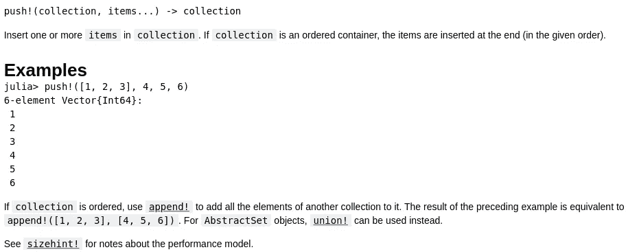
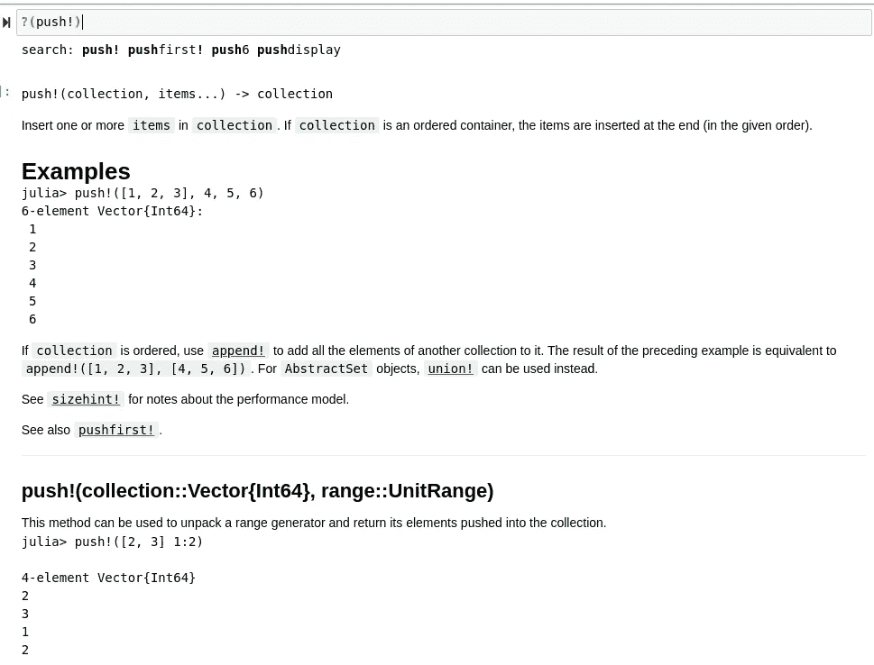
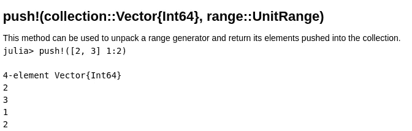

# 关于 Push 你需要知道的一切！在朱莉娅

> 原文：<https://towardsdatascience.com/everything-you-need-to-know-about-push-in-julia-1f01891f1c0a?source=collection_archive---------19----------------------->

## 用力！()方法是你需要了解的 Julia 基础的重要部分。让我们来看看它能做什么。


(图片由[蒂姆·莫斯霍尔德](https://unsplash.com/photos/zM9A6RTWUPE)在【Unsplash.com】T2 拍摄)

Julia 编程语言有一个丰富和扩展的基础，它本身能够做很多事情。Julia 与许多其他编程语言的不同之处在于它健壮的类型系统。方法系统当然伴随着这个很好，然而类型系统才是真正的抢镜。还有一些很棒的方法可以处理 Julia 中的所有类型。如果您使用 Julia 已经有一段时间了，那么您很可能已经遇到了推送！()野外法。该方法很常用，因为它是 Julia 的核心特性。也就是说，那些对 Julia 感兴趣的人可能想获得一些使用它的经验。

Julia 语言的一个优点是一个方法定义本质上有无限的能力。这是一个非常朱利安的事情进口推动！()方法，并扩展它以处理您环境中的类型。方法中也有一些不规则和奇怪的东西，可能很重要，其中一些甚至是一些有经验的 Julian 程序员也没有经历过。今天，我们将从核心 Julia 数据类型的基础开始，介绍该方法的所有细微差别，然后我想介绍如何扩展该模块以使用类型的示例实例。这个项目还有一个笔记本，您可以在这里查看:

<https://github.com/emmettgb/Emmetts-DS-NoteBooks/blob/master/Julia/Push%20in%20julia.ipynb>  

# 用力！:基础知识

我们将从一个简单的数组开始:

```
example = [9, 7, 4, 28]
```

关于数组，有一些特殊的事情需要注意:

*   它们是可重复的。
*   它们是 base Julia，所以 base-Julia 方法与它们一起工作。

与许多其他语言不同，我们有一个相当健壮的索引接口。既然这些都是可重复的，只要一推！()方法知道如何处理我们传递的 iterable，它可以将我们想要的任何类型放入其中——这很方便，因为像 append！()方法只方便某些数据类型的使用。我们可以用？(推！)来了解关于这个函数的更多信息，这也将给出这个函数的所有不同调用:

```
?(push!)
```

这在朱莉娅是一个很好的实践。那个？()方法允许我们尽可能深入地快速浏览文档。与传统上可能在 web 浏览器中查找一些文档相比，这种文档字符串系统有很多非常好的优点。实际上，我写了一整篇文章，更详细地讨论了 Juliahub 系统的文档，如果你不知道这两件事，你可能会感兴趣，下面是这个故事的链接:

</julias-doc-string-system-is-awesome-and-here-is-why-197ba6a0236b>  

从中我们可以看出一点，它将会变异成我们提供的第一个论点。在深入研究之前，我们可以立即指出这一点，因为这个方法在一个解释点结束。这是另一个深入到背后故事的很酷的故事:

</the-real-meaning-behind-in-method-calls-b10772f0e30b>  

回到我们的笔记本，我们已经对这个方法有了很好的了解，但是让我们看看实际的文档能告诉我们什么。



(图片由作者提供)

该文档为我们提供了一个 REPL 绑定的示例、详细描述的参数，甚至一些在不同情况下使用的其他方法。前面提到的追加！()在这里做了一个重要的注释，作为 append！如果追加是我们真正想要做的，那么()可能是某些结构的更好应用。我们将遵循这些参数，并为我们的旧示例数组加入一些新数据。

```
push!(example, 5)5-element Vector{Int64}:
  9
  7
  4
 28
  5
```

这将产生一个 5 元素的数组，一个整数向量，它将改变数组的维数和数组中的可迭代内容。奇怪的一点是，有一些细致入微的类型是不能推的。我们通常可以很好地将结构推进这里。然而，对于某些数据类型，甚至是构造类型，它将不起作用。

# 多带推！()

正如我前面提到的推！()，当涉及到类型时，这个方法有一些细微的差别。我发现提供范围生成器的例子很奇怪:

```
**push!(example, 1:5)**MethodError: Cannot `convert` an object of type UnitRange{Int64} to an object of type Int64
Closest candidates are:
  convert(::Type{T}, ::T) where T<:Number at number.jl:6
  convert(::Type{T}, ::Number) where T<:Number at number.jl:7
  convert(::Type{T}, ::Base.TwicePrecision) where T<:Number at twiceprecision.jl:250
```

这是一个很难辨别的错误，我觉得可能会让初学者感到困惑。这里的 stack-trace 并没有很好地展示出做错了什么，除非人们意识到这里的问题是键入。我们得到这个错误的原因是因为我们提供的类型是一个 UnitRange，但是每当它被添加到 vector 时，我们都会得到一个转换尝试。这是因为向量只能包含整数，因为它的类型是

```
Vector{Int64}
```

我们当然可以改变这一点。在 Julia 中，这可以通过将这个向量转换成一个可以包含任何类型的值的数组来实现。但是，这将改变行为，这可能是范围生成器所不希望的，例如:

```
push!(Array{Any}(example), 1:5)6-element Vector{Any}:
  9
  7
  4
 28
  5
   1:5
```

现在我们有一个 6 元素数组，里面有不同的类型，单位范围和那些整数在一起——我们可能期望在数组的末尾添加 1、2、3、4 和 5。这可能看起来更像是预期的行为，但通常这就是推动的方式！()方法会起作用。

# 延伸推！()

在一个真正的朱利安时尚，我们现在要延长推！()更好地配合我们的 UnitRange。每当我们想通过调度来扩展某种功能时，第一步就是直接导入它:

```
import Base: push!
```

如果你不知道如何扩展方法，就像这样，我就不在这里赘述了，但我有两篇文章，其中一篇有视频，在 Julia 中详细介绍了这一点:

<https://medium.com/chifi-media/extending-julias-base-for-our-superframes-jl-package-4574555ff6ae>  </extending-julias-operators-with-amazing-results-96c042369349>  

希望现在这个概念在你的头脑中是新鲜和熟悉的，这将更容易理解我到底想做什么。我们的目标输入参数将是:

*   我们的收藏
*   单位范围

我们想要的输出是集合中的所有元素。首先考虑我们的输入及其类型，让我们定义这个新函数:

```
function push!(collection::Vector{Int64}, range::UnitRange)
    [push!(collection, i) for i in range]
end
```

> 更快的方法可能是使用 collect()方法。

在函数内部，我有一个简单的迭代循环，它解包范围内的单个值，以便提供这个功能。每当将此新定义加载到环境中时，都可以将其添加到此方法定义的文档中:

```
"""## push!(collection::Vector{Int64}, range::UnitRange)
This method can be used to unpack a range generator and return its elements pushed into the collection. \
```
julia> push!([2, 3] 1:2)4-element Vector{Int64}
2
3
1
2
```"""
function push!(collection::Vector{Int64}, range::UnitRange)
    [push!(collection, i) for i in range]
end
```

现在让我们看看我们的？()前一个示例的文档调用:

```
?(push!)
```



(图片由作者提供)

幸运的是，我们的新定义被附加到其他文档中。我相信在这两组文档之间使用某种区分是有用的，因为 push！(::Vector{Int64}，::UnitRange)调用增加了一些不同的功能。这也是我们直接引用该调用的方式，例如:

```
?(push!(::Vector{Int64}, ::UnitRange))
```



(图片由作者提供)

让我们最后使用这个函数，看看将要进行的最后一次调用:

```
push!(example, 1:5)10-element Vector{Int64}:
  9
  7
  4
 28
  5
  1
  2
  3
  4
  5
```

这可能看起来工作量很大，为此要编写一个完整的方法扩展。然而，在您的编程语言中，在整个软件包生态系统中使用相同的方法调用简直令人惊奇。我们避免了命名冲突，并且能够根据类型反复使用相同的别名。虽然您可能希望编写一次 for 循环，但您可能不希望在这段代码的每个实例中反复编写它。也就是说，这就是函数的用途，把你的新函数写成一个众所周知的定义可能会让你的用户猜测如何更有效地使用你的包！

# 结论

右推！()挺牛逼的。这个方法的伟大之处在于它有许多不同类型的功能。我相信这是通过抽象来实现的，因为一般来说，Julia 中的大多数类型都是一个更大的类型层次结构的一部分，这个层次结构可以限制方法的行为。Julia 有很多优点，但有一点对我来说非常突出，那就是它的可扩展性。很少有人模仿 Julia 对多个分派和文档的处理，而且最重要的是，Julia 中的整个名称定义都可以重用和扩展。厉害！谢谢你的阅读，我希望你有一个可爱的一天！