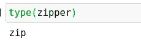
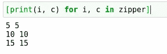
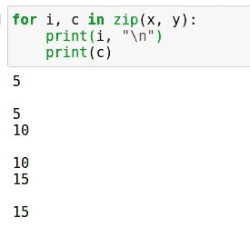
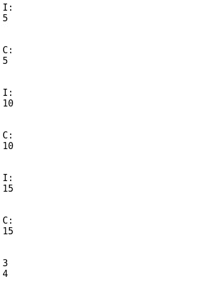
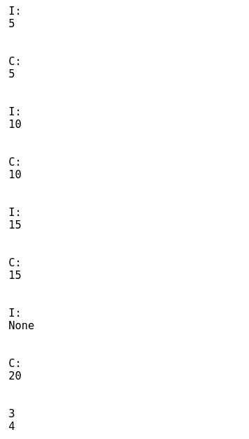

# 关于 Python 中的 Zip，您需要知道的一切

> 原文：<https://towardsdatascience.com/everything-you-need-to-know-about-zip-in-python-5da1416f3626?source=collection_archive---------24----------------------->

## Python 的 zip 类型的所有重要内容的概要。


(src =[https://pixabay.com/images/id-2923487/](https://pixabay.com/images/id-2923487/)

# 介绍

迭代是程序员在处理可迭代数据结构时非常常用的技术。迭代可能相当复杂，有时相当困难。有些情况下，迭代 for 循环可能无法非常有效地完成工作。也就是说，对于一次迭代多个元素的情况，列表的典型迭代可能会有问题。幸运的是，Python 为这个问题提供了一个很好的解决方案，叫做 zip。

Zip 很棒，因为它允许我们同时处理两个或更多的数据结构。使用 zip，我们可以在 Python 中同时迭代遍历多个对象。不用说，这在很多情况下都会派上用场。我还擅自将这款笔记本添加到了 Github 库，您可以在这里查看:

> [笔记本](https://github.com/emmettgb/Emmetts-DS-NoteBooks/blob/master/Python3/al%20about%20zip.ipynb)

# Zip 是什么？

Python 中的 zip 对象就是所谓的迭代器。迭代器在循环中使用，通常是基于元素的循环。给定名称，我们可以假定这些通常与迭代一起使用。Zip 是由 Python 的基础提供的，所以我们可以在语言的任何地方调用它。为了创建一个 zip 对象，我们简单地将两个 iterables 传递到它的初始化函数中:

```
x = [5, 10, 15]
y = [5, 10, 15, 20]
zipper = zip(x, y)
```

现在让我们来看看这个新迭代器的类型:



```
type(zipper)
```

现在我们可以在 for 循环中调用这个新的迭代器，以便同时遍历这两个列表中的元素。我不记得 Python 是否接受这个或一个元组的参数，因为没有答案的都是我们在 Julia 中做的。但是，我很确定这是 Python 中的参数，所以让我们试试:



```
[print(i, c) for i, c in zipper]
```

通常，该对象不会在迭代循环调用之外构造，因此使用 zip 类型的典型迭代循环通常是这样构造的:

```
for i, c in zip(x, y):
    print(i, "\n")
    print(c)
```



作者图片

# 重要细节

既然我们已经有了 zip down 的基础，现在让我们回顾一下关于这个类的所有重要细节。首先，我们需要理解为什么需要调用这个迭代器来进行实际迭代。通常在这种情况下，我们的迭代器会自动开始循环，而不需要创建 for 循环。

这是因为 zip 对象就是我们所说的惰性迭代器。懒惰迭代器之所以懒惰，是因为它们自己不做太多事情。尽管如此，当与 for-loop 语法结合使用时，它们会非常强大。接下来我要讲的是数组中元素的数量。

你可能已经注意到，在上面的例子中，x 和 y 是不同的维度。这是有意的，因为接下来我想演示的是当我们滑过数组时会发生什么，这就是情况。当然，在典型的应用程序中，情况并非如此，因为在 zip 迭代器中遇到这种情况的可能性似乎要小得多，然而，关于对不同维度的数组使用 zip，您可能需要知道一些事情。

您应该知道的第一件事是，zip 迭代器只会迭代较短的 in 元素。这意味着更大的数组中的任何元素都将被截掉，如下面的演示所示，我们看到当 y 的长度为 4 时，我们只得到三个不同的打印输出。

```
for i, c in zip(x, y):
    print("I:")
    print(i)
    print("\n")
    print("C:")
    print(c)
    print("\n")
print(len(x))
print(len(y))
```



如果我们想改变这一点，我们可以使用 itertools 模块中的 zip_longest。这个模块在标准库中，提供了一系列不同的迭代工具和迭代器，可以用来加速 Python，或者执行不编写自己的迭代器就不可能执行的迭代。如果你想了解更多关于 Itertools 的功能，我有一篇文章可以提供给你:

</wicked-fast-python-with-itertools-55c77443f84c>  

zip_longest 迭代器将参数迭代到最长元素的末尾。如果您不想遗漏任何值，这可能会很有用。任何没有被循环的元素都将被返回为 None，如下例所示:

```
from itertools import zip_longest
for i, c in zip_longest(x, y):
    print("I:")
    print(i)
    print("\n")
    print("C:")
    print(c)
    print("\n")
print(len(x))
print(len(y))
```



# 结论

当我们使用多个数组并希望以某种形式使用迭代时，Zip 是一个很好的工具。迭代器有一些细微差别，但一般来说，这是一个非常好的概念，许多高级程序员都习惯和熟悉它。也就是说，从各个方面了解它可能会在找出一些奇怪的输出或错误时派上用场。感谢您的阅读！