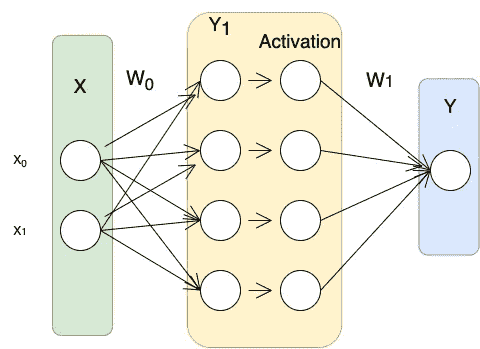
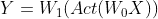
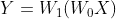
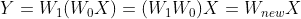
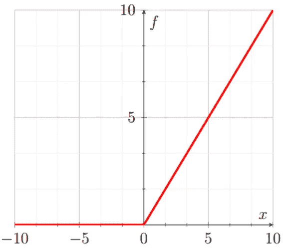
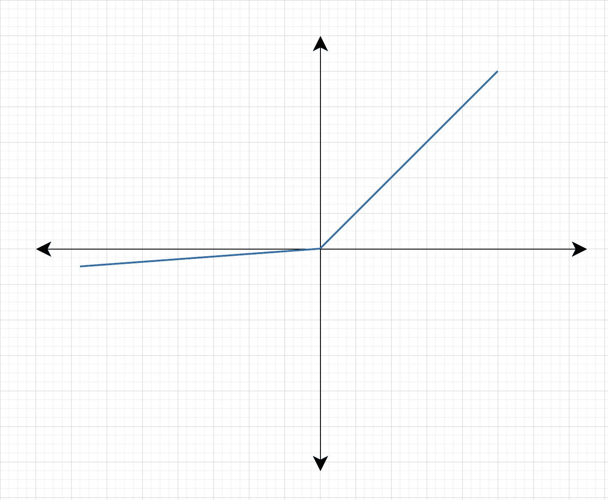
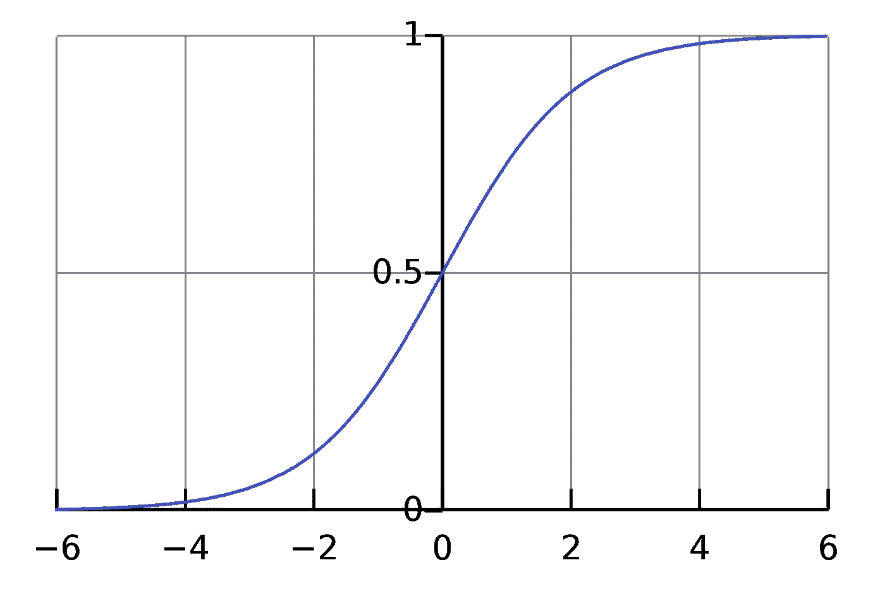

# 关于深度学习模型的“激活函数”，你需要知道的一切

> 原文：<https://towardsdatascience.com/everything-you-need-to-know-activation-functions-for-deep-learning-models-ac6f528da604?source=collection_archive---------27----------------------->

## 想知道什么是激活功能，为什么它们必不可少？

艾莉娜·格鲁布尼亚克在 [Unsplash](https://unsplash.com?utm_source=medium&utm_medium=referral) 上的照片

我们知道深度学习模型是激活函数、批量归一化、动量、梯度下降等不同成分的组合。因此，在这篇博客中，我选择了 DL 的一部分，通过回答以下问题给出了关于激活功能的详细解释:

*   什么是激活函数？
*   为什么我们在神经网络中需要一个激活函数，如果我们不使用，会发生什么？
*   激活函数的期望属性是什么？
*   有哪些不同类型的激活功能及其用途？

对于这个博客，我假设你们都对神经网络有一个基本的了解。所以事不宜迟，让我们更深入地研究激活函数。

# 激活功能

激活函数是一个**函数**，用于**变换神经网络中前一节点**的输出信号。这种转换有助于网络学习数据中的复杂模式。就是这样！一开始我也不相信事情会这么简单，但这是真的。

激活函数转换前一个节点的输出(图片由作者提供)

# 需要激活功能

是的，你现在已经知道基本原因了。有必要使神经网络能够**学习数据**中的复杂模式。但是它是如何实现的呢？激活函数通常是非线性函数，它给神经网络增加了非线性，从而允许它们学习更复杂的模式。还不清楚？让我们看一个神经网络的例子来理解这一点。

神经网络(图片作者提供)

对于这个例子，请假设我们没有添加偏差。我们可以将输出 Y 写成:

作者图片

其中 *Act* 表示我们的激活函数的输出，(这是一个非线性变换)。现在假设我们没有网络的任何激活函数，那么我们的 Y 看起来像这样:

作者图片

如果你仔细看上面的等式，那么

作者图片

这意味着，即使我们的网络中有两层，输入和输出关系实际上也可以由单个权重矩阵来定义(这是两个权重矩阵的乘积)。因此我们看到，在没有激活函数的情况下；我们给神经网络增加多少层并不重要，它们都可以被简化，只用一个权重矩阵来表示。但是，当我们添加激活函数时，它们会添加非线性转换，这使得我们无法简化多层神经网络。

激活函数的另一个重要性是，它有助于将神经元的输出值限制在我们需要的范围内。这一点很重要，因为激活函数的输入是 **W*x + b** ，其中 **W** 是单元的重量，而 **x** 是输入，然后还有偏置 **b** 加入其中。如果不受限制，该值可以达到非常高的量级，尤其是在处理数百万个参数的非常深的神经网络的情况下。这进而导致计算问题以及值溢出问题。

我知道没有激活函数的例子，很难理解我扔给你的所有事实，但是请耐心听我说。我们将很快在一个例子中回顾所有这些概念，但是为了你更好的理解，它们需要在这里被覆盖。

# 激活函数的期望属性

*   从上面可以清楚地看出，激活函数**应该**是非线性的**。**
*   在神经网络的每一层之后使用激活函数，因此，总是希望激活函数在计算上**高效**。
*   对神经网络的所有组件的主要要求是它们应该是可微分的，因此激活函数**应该**也是**可微分的**。
*   设计激活函数的一个重要方面是防止**消失梯度问题**。深入解释这个问题超出了本博客的范围，但让我给你要点。为了防止消失梯度问题，要求激活函数 w.r.t 输入参数的**导数**在理论上是**不有界**在 **-1 到 1** 之间。

# 不同类型的激活功能

## 热卢

ReLU 代表**Re**ctived**L**linear**U**nit，定义为 **f(x) = max(0，f(x))**

ReLU 图(图片由作者提供)

这是一个广泛使用的激活函数，尤其是与 CNN(卷积神经网络)一起使用。它易于计算，不会饱和，也不会导致梯度消失的问题。但是，它有一个问题，即对于负输入，它的值变为零。由于所有负输入的输出都是零，这导致一些节点完全死亡，什么也学不到。为了处理这个问题，使用了漏 ReLU 或者参数 ReLU，即 **F(x) = max(αx，x)。**

泄漏的 ReLU(图片由作者提供)

## 乙状结肠的

这个激活函数在计算上是昂贵的，导致消失梯度问题，并且不是零中心的。这种方法通常用于二进制分类问题，并且仅在神经网络的末端使用，以将输出转换为范围[0，1]。这个函数**一般不在神经网络内部使用**。

乙状结肠(此处[提供](https://en.wikipedia.org/wiki/Sigmoid_function)与 [CC 许可](https://commons.wikimedia.org/wiki/File:Fun%C3%A7%C3%A3o_Sigmoidal.png)

## Softmax

用于**多类分类问题**。像 sigmoid 一样，它产生 0-1 范围内的值，因此，它被用作分类模型中的最后一层。

# 结论

我希望在这个解释之后，你现在能更好地理解为什么神经网络需要激活函数，以及激活函数的性质和类型。如果你觉得有帮助，请在这个博客上发表评论，让我们知道。

关注我们的 [medium](https://medium.com/@AnveeNaik) 了解更多此类内容。

*成为* [*介质会员*](https://medium.com/@AnveeNaik/membership) *解锁并阅读介质上的许多其他故事。*