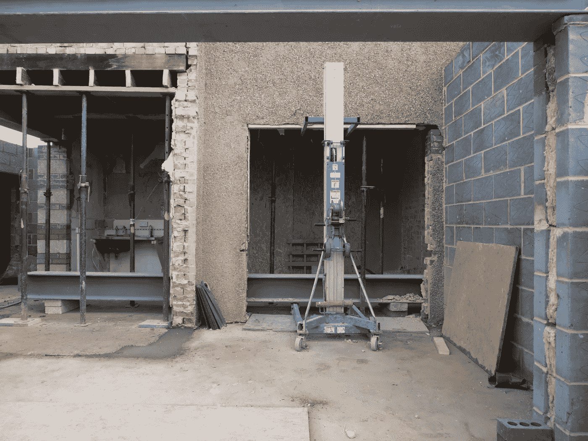

# 家得宝数字化转型的证据

> 原文：<https://towardsdatascience.com/evidence-of-digital-transformation-at-home-depot-bd1161935c57?source=collection_archive---------13----------------------->

## 一次周末的零售之旅激发了人们对数字化转型典范的关注。

布鲁克·拉克在 [Unsplash](https://unsplash.com/@brookelark?utm_source=unsplash&utm_medium=referral&utm_content=creditCopyText) 拍摄的照片

这个周末，当我在家得宝(Home Depot)闲逛，为我的公寓寻找新的外门时，我想到了一个组织，它是从我小时候在佛罗里达州莱克兰(Lakeland)认识的大盒子零售商演变而来的。我的高中朋友会在夏天在那里工作，我一直认为这是一个令人无法抗拒的地方。

我注意到……越来越多的时候，我能够不去家得宝零售点的大型仓库，而是雇佣专业人员使用应用程序和他们的网站来安装我的家居项目。我的整个外门项目都是通过他们的网站、呼叫中心和店内测量预订的。他们是如何变得如此擅长跨越不同接触点创造无缝体验的？

# 答案是:数字化转型。

数字化转型正在“融合物理、生物、化学和信息世界。”托尼·萨尔达尼亚认为这是第四次工业革命，他是《为什么数字化转型会失败》一书的作者，这是一本关于数字化转型最佳实践的非常成功的书。

Saldanha 提到“零售天启”或许多主要依赖实体销售的零售商申请破产的事实是第四次革命正在影响当今企业的一个征兆。(萨尔达尼亚，2019 年)

在这篇博客中，我将介绍美国主要家装零售商家得宝的一个例子，并描述他们正在进行的数字化转型及其成功的迹象。

# 是什么让数字化转型成功？

照片由[布雷特·乔丹](https://unsplash.com/@brett_jordan?utm_source=unsplash&utm_medium=referral&utm_content=creditCopyText)在 [Unsplash](https://unsplash.com/@brett_jordan?utm_source=unsplash&utm_medium=referral&utm_content=creditCopyText) 拍摄

成功的数字化转型意味着让您的企业能够创造永恒的运动。这意味着您正在不断发展，以便在客户需要您的产品/服务时，随时随地满足他们的需求，并以最有效的方式提供他们所寻求的价值。这意味着您已经接受了技术，使组织的所有部分都能够利用这项技术，并创建了允许您根据客户和潜在客户的速度调整业务模式的流程。

在他的第二章中，Saldanha 将一个成功的转型描述为一个连续体中五个发展阶段的顶点。他的第五个阶段，“活的 DNA”，被描述为一个不断运动的组织。他们的员工精通数字技术，他们的系统相互连接，他们采用了最具创新性的商业模式，并将继续这样做，因为他们正在以精益敏捷的方式进行测试、学习和适应。(Saldanha，2019)这个想法描述了成功的数字化转型。

# 家得宝的商业问题

家得宝(Home Depot)是一家总部位于美国的零售商，其成立的目的是为“自己动手”的人提供服务，其大型仓储式商店以卓越的选择、乐于助人的员工和一站式商店的优质产品使当地五金店相形见绌。(家得宝，2021 年)

该模式非常成功，但随着时间的推移，新类型的客户出现，减缓了他们的增长能力。2016 年，家得宝(Home Depot)电子商务总裁凯文·霍夫曼(Kevin Hoffman)描述了新兴的“为我动手型”消费者，他们寻求全方位服务的安装、优质产品和较少动手的家装体验。为了给顾客提供他们想要的体验，家得宝需要解决遗留技术问题，并在购物体验之初就接受电子商务和数字财产。(劳克伦，2015 年)

## 解决方案:一个家得宝

[杰西·奥里科在 Unsplash 上拍摄的照片](https://unsplash.com/@jessedo81)

2018 年，家得宝公布了他们的零售体验转型计划，以专注于其电子商务平台和店内的数字化、单一、互联的体验。该系统的引入是为了给消费者提供一种“无摩擦、互联的购物体验”(家得宝，2019 年)

尝试连接不同平台和商业模式的无摩擦购物体验的想法符合萨尔达尼亚概述的数字化转型的要求。就家得宝而言，它正在将店内购物体验和员工的帮助转化为电子商务和数字体验。转型需要以数字形式反映品牌，并确保供应商/商店能够交付在这些新渠道购买的服务。

## 解决的关键系统，使用的技术

为了开始转型，家得宝的首席执行官推出了 One Home Depot，这是一项创造互联体验的重大举措。高层领导的这种支持，以及在季度电话会议中讨论的目标和进展，为组织的其余部分定下了基调。变革需要发生，领导力需要投入。(邦德等人，2019 年)

为了实现转型，该组织对其 IT、开发人员、数据和分析能力进行了投资。2018 年，他们在美国各地的技术中心雇用了大约 1，000 名技术专业人员。这转变了公司的能力，使他们能够开发专为新的“为我做”细分市场构建的新的移动和电子商务客户体验。(家得宝，2018 年)

家得宝还更新了其在持续集成方面的能力和来自敏捷软件开发的想法。“OrangeMethod”是该公司教育员工新的思维方式，超越他们的核心能力，使数字化转型在他们的组织中发生。它还设定了让新技术员工能够建造一个家得宝的流程。(家得宝职业生涯，2018 年)

## 对家得宝的影响

[Alec Favale 在 Unsplash 上拍摄的照片](https://unsplash.com/@alecfavale)

由于积极主动的数字化转型，该公司为应对新冠肺炎的影响做好了充分准备。尽管商店关门，这家零售商在利用消费者趋势方面取得了巨大的成功，使家装零售商受益。根据他们的 2020 年年度报告，数字销售额比上一年增长了 86%，他们的数字资产全年的流量创下纪录，整体销售额增长了 20%。(家得宝，2020 年)

正如这位首席执行官所言，“创造无缝、互联体验，融合实体和数字世界的零售商将在市场中占据有利位置。”他将他的组织 2020 的成功归功于对数字化转型的投资，正如他们在 One Home Depot 愿景中实现的那样。(家得宝，2020 年)

# 参考资料:

t .萨尔达尼亚(2019)。在*为什么数字化转型会失败:如何起飞并保持领先的惊人法则*(第 3-31 页)。散文，Berrett-Koehler 出版社，BK 商业书籍。

*关于我们*。家得宝。(2021).[https://corporate.homedepot.com/about.](https://corporate.homedepot.com/about.)

劳克伦，S. (2019，4 月 29 日)。*家得宝——打造“自己动手型”顾客体验*。数码杂志。[https://diginomica . com/the-home-depot-building-the-do-it-for-me-customer-experience。](https://diginomica.com/the-home-depot-building-the-do-it-for-me-customer-experience.)

家得宝将提供“一个家得宝”投资战略的更新，以扩大市场领导地位。(2019 年 12 月 11 日)。*家得宝*。[https://IR . home depot . com/~/media/Files/H/home depot-IR/2019% 20 IAC/Press % 20 release _ VF . pdf](https://ir.homedepot.com/~/media/Files/H/HomeDepot-IR/2019%20IAC/Press%20Release_vf.pdf.)

Bonde，a .，Chirokas，m .，Shwerdlow，f .，& Beeson，M. (2019 年 7 月 19 日)。家得宝如何成为数字发电站？埃文斯顿。[https://www.forrester.com/go?objectid=RES155235.](https://www.forrester.com/go?objectid=RES155235.)

*家得宝雇佣 1000 名技术专业人员*。家得宝。(2018 年 4 月 18 日)。[https://IR . home depot . com/news-releases/2018/04-18-2018-130228118。](https://ir.homedepot.com/news-releases/2018/04-18-2018-130228118.)

家得宝职业生涯。(2018).家得宝的 OrangeMethod。*Vimeo.com*。[https://vimeo.com/272596009.](https://vimeo.com/272596009.)

家得宝。(2020).*年报*。佐治亚州亚特兰大:家得宝投资者关系。