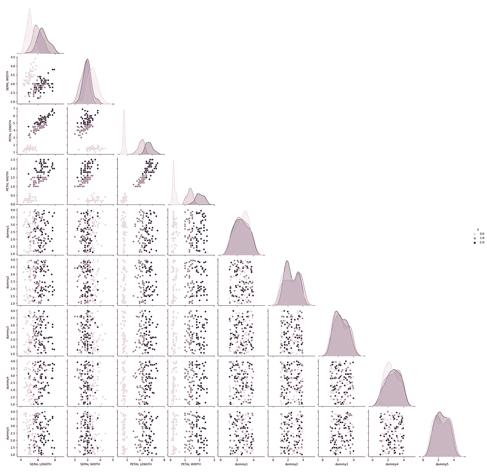
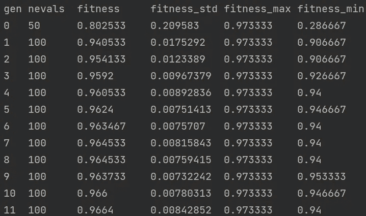

# 机器学习的进化特征选择

> 原文：<https://towardsdatascience.com/evolutionary-feature-selection-for-machine-learning-7f61af2a8c12?source=collection_archive---------21----------------------->

## 了解如何使用进化模型为机器学习算法选择特征


厄瓜多尔皮钦查省。Alexander Schimmeck 在 [Unsplash 上拍摄的照片。](https://unsplash.com/photos/Aohf8gqa7Zc)

在之前的一篇帖子中，我讨论了为什么我们应该使用基于优化的算法来微调机器学习模型的超参数。这也适用于特征选择；如果你有兴趣，可以在这里查看[。](/hyperparameters-tuning-from-grid-search-to-optimization-a09853e4e9b8)

这篇文章将展示如何使用 sklearn-genetic-opt 快速找到最大化交叉验证分数的特征，同时删除非信息变量。

一般来说，使用强力方法来优化模型并不是一个好主意，在特征选择的情况下，使用向前选择或向后排除等方法，一次只能改变一个特征，并且在查看不同的特征子集(具有相同大小)如何一起工作时往往会有问题。

即使我们不必从头开始编写代码，因为像 [sklearn-genetic-opt](https://sklearn-genetic-opt.readthedocs.io/en/stable/) 这样的包已经实现了它，我还是想解释一下我们如何使用进化算法来找到这些特性的一般思想；如果你不熟悉这类算法，你可以查看我的另一篇文章，我在那里一步一步地解释了它们是如何工作的，以及如何使用它们进行超参数调整；或者想看代码，可以去下一节。

## **1。模型表示:**

我们可以对这些特征建模如下:

*   群体中的每个个体代表特征的总子集。
*   个体的性别代表了一个特定的特征。
*   每个 gen 值可以是 0 或 1；零表示算法没有选择该特征，一表示包括该特征。
*   该突变与在突变概率内淹没随机选择的位置中的比特值相关联。


特征选择表示。图片由作者提供。

这一代有十个特点:该算法选择了功能 1、3、5 和 10，但不包括其他功能。


随机突变。图片由作者提供。

然后以足够低的概率，可能发生随机突变，现在在去除特征三的同时也包含了变量六；这是有帮助的，因此我们帮助模型不陷入局部最小值，并且探索更多的 bast 区域(特征子集),而不检查所有可能的特征组合。

有了这种表示，我们现在可以应用常规的进化算子来寻找新的解；这些新的解决方案将优化交叉验证分数，同时最大限度地减少特征的数量；我们通过使用多目标适应度函数来实现这一点。

## 2.Python 代码:

在这个实验中，我将使用一个分类数据集。尽管如此，我还是要添加随机噪声作为新的“垃圾特征”，这对模型没有用，并且增加了更多的复杂性。我希望模型能移除它们，可能还会移除一些原件。因此，第一步是导入数据并创建这些新特征:

数据设置。作者代码。

从前面的代码中，您可以看到有九个特性、四个原始特性和五个虚拟特性；我们可以绘制它们来检查它们与我们想要预测的“y”变量的关系。每种颜色代表一个类别。



数据分发。图片由作者提供。

我们可以看到，原始特征有助于区分每一类的观察值，每一类都有一个分隔它们的边界。尽管如此，新功能(虚拟)并没有增加价值，因为它们不能像预期的那样“分割”每个类别的数据。

现在，我们将把数据分成训练、测试和导入我们想要用来选择特征的基本模型，在这种情况下，是决策树。

数据分割和基本模型。作者代码。

下一步，让我们导入并拟合特征选择模型；如前所述，它使用进化算法来选择特征；它通过优化交叉验证分数来使用多目标函数，同时还最小化所使用的特征的数量。

一定要安装 sklearn-genetic-opt

```
pip install sklearn-genetic-opt
```

特征选择模式。作者代码。

我们将模型设置为基于交叉验证准确性来选择特征，但是任何 scikit-learn 度量都是可用的，我们还将 cv 策略设置为分层 k 倍。

当您开始拟合模型时，屏幕上会显示一个日志以查看优化进度，这里有一个它的样本，在这种情况下，“适应度”相当于跨代(行)的平均交叉验证分数，我们还会得到标准差、最大值和最小值。



培训日志。图片由作者提供。

模型完成后，我们可以使用 best_features_ property 检查它选择了哪些变量，它将获得一个 bools 数组，其中 true 表示选择了该索引处的特性。

```
evolved_estimator.best_features_[False True True True False False False False False]
```

在这次特别的运行中，该模型获得了大约 97%的准确率。它选择特征 2、3 和 4，它们是原始信息特征的一部分；它会丢弃第一个特征的所有伪特征。

如果你想了解这个包的更多信息，请告诉我，你也可以在这里查看文档和源代码:

[](https://sklearn-genetic-opt.readthedocs.io/en/stable/) [## sklean-genetic-opt 文档

### Sklearn-genetic-opt 使用 deap 包中的进化算法来选择一组超参数…

sk learn-genetic-opt . readthedocs . io](https://sklearn-genetic-opt.readthedocs.io/en/stable/) [](https://github.com/rodrigo-arenas/Sklearn-genetic-opt) [## GitHub-Rodrigo-arenas/sk learn-genetic-opt

### scikit-learn 使用进化算法对超参数调整和特征选择进行建模。这是一个…

github.com](https://github.com/rodrigo-arenas/Sklearn-genetic-opt)