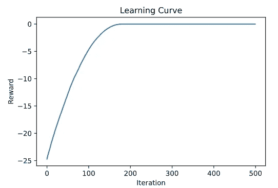

# 进化策略:理论实施指南

> 原文：<https://towardsdatascience.com/evolutionary-strategy-a-theoretical-implementation-guide-9176217e7ed8?source=collection_archive---------36----------------------->

Sebastian Unrau 在 [Unsplash](https://unsplash.com?utm_source=medium&utm_medium=referral) 上的照片

在这里，我将谈谈 OpenAI 在 [**本文**](https://arxiv.org/abs/1703.03864) 中描述的进化策略背后的直觉和一些统计数据。

如果你想要一些代码， [**这里就是**](https://github.com/09tangriro/AdamES/blob/main/es.py) ！

# 优化简介

在传统的优化设置中，目标是找到某个函数的全局最小值。例如，函数 **f(x) = x** 的最小值在 **x = 0** 处:

图片作者:f(x) = x 的图形很明显，当 f(x) = 0 时，这个函数的极小点在 x = 0 处

这个例子的解决方案相当明显，但是这些函数可以变得更加复杂，并且存在于更高维度中，在那里解决方案不是如此微不足道。传统优化方法背后的思想是使用函数的梯度来尝试“滑下斜坡”，直到到达底部。可以想象，这些算法都要求函数的梯度是明确定义的；事实上，一些像牛顿-拉夫森方法甚至需要二阶导数信息！通常，这些计算起来非常困难或耗时。**有没有一种不需要这些额外信息就能优化函数的方法？**

# ES 背后的一些直觉

ES 是另一种优化方法。将这种方法与更传统的优化算法分开的是缺少关于策略所需的函数本身的信息，es 根本不需要直接的梯度信息！这意味着我们可以将它应用于更抽象的优化问题，在这些问题中，被优化的函数在某种程度上是一个黑盒。

那么这实际上是如何工作的呢？假设有一个函数我们想要针对某些参数进行优化。这是一种迭代算法，其中我们不断更新由参数给出的位置，以有希望地收敛到一个最佳点(在这种情况下，**算法优化最大值而不是最小值**)。从一个开始位置，我们随机采样点，并计算这些点的函数值，以收集关于函数本身的信息。利用这些信息，我们可以更新自己，朝着上升的方向前进！基本上，我们在从采样点计算出更多大值的方向上移动一段距离。

# 方程式

让我们简单地浏览一下更新方程，看看发生了什么，我们想要优化一些函数， **F** 关于一些参数， **θ** :

图片作者:ES 更新方程式

在每个时间步 **t** ，我们更新上面定义的参数。这里最重要的特征是得到上升方向的和项。这里，我们计算围绕当前位置随机采样的 **n** 个点的总体的加权和 **θ_t** ，其中权重是这些点的函数值。采样是通过高斯分布完成的:

作者图片:高斯分布样本

使得更新等式中的 **σ** 表示该噪声的标准偏差。最后， **α** 代表学习率，控制我们在求和项确定的方向上行进多远。

# 先说统计！

这里的目标是更深入地理解方程，并预测算法的一些行为。这里又是等式，所以你不需要向上滚动来查阅😊

图片作者:ES 更新方程式

一、 **θ_{t+1}** 的分布是什么样子的？不幸的是，这取决于被优化的函数 **F** 。然而，如果我们假设总和中的项无论如何都具有有限方差，那么该方程遵守中心极限定理，并且我们可以假设当 **n** 增加到无穷大时是高斯分布！

在这种情况下，我们可以简单地得到期望和方差的项，并对分布感到相当有信心(注意:我们也假设独立抽样)。

作者形象:转型的期待与变异

你可能想知道这一切有什么意义。这些方程似乎没什么用，而且函数本身也有很多不确定性。然而，这也让我们对超参数调整和算法行为有了一些直觉:

*   较大的 **n** 不会对下一个状态的期望值产生影响，但会减少该期望值周围的方差，从而带来更大的稳定性。这可以解释为增加了搜索的信息密度，尽管这样做的代价是增加了计算时间。
*   增加 **α** 推动我们沿着上升方向走得更远，这可以允许更快的收敛。然而，它也增加了更新的方差，导致最优解附近的更大抖动。如果太大，甚至会导致算法发散时不稳定。
*   改变 **σ** 不太确定，因为它被输入到 **F** 。然而，直觉上它增加了搜索空间，这允许算法逃脱局部最大值陷阱。这是以降低信息密度为代价的，因此增加 **σ** 可能会受益于 **n** 的增加。

# 实验

为了简单起见，让我们在测试中使用函数， **f(x) = -x** 。作为参考，下面是学习曲线的大致情况:

图片作者:ES f(x)=-x 的学习曲线

该算法有两个阶段，过渡状态和稳定状态，在过渡状态下，算法移向解，在稳定状态下，算法已经到达解。**理想情况下，我们希望过渡状态尽可能短，同时在稳定状态下具有最小方差**。让我们看看当我们改变超参数时，这些指标是如何变化的。

图片由作者提供:收敛时间和变化的稳态标准偏差 **α**

正如所料，增加学习率 **α** ，以增加稳态标准偏差为代价，减少了收敛时间。由于收敛时间似乎趋于平稳，增加 **α** 超过一个点将导致收敛时间仅有微小的改善，代价是稳态性能下降。

作者图片:收敛时间和稳态标准偏差，用于改变 **σ**

增加采样噪声标准偏差， **σ** ，会增加收敛时间。这是预料之中的，因为每次更新的信息密度较小，这也反映在总体增加的稳态标准偏差中；尽管在非常小的 **σ** 下偏差减小是出乎意料的。

作者图片:收敛时间和稳态标准偏差，用于改变 **n**

增加人口规模， **n** ，也符合预期。减少收敛时间和稳态标准偏差与增加信息密度的想法一致，尽管与其他超参数的变化相比，这种影响很快达到平稳状态。

ES 实现起来非常简单，并且可以产生很好的效果。下次你需要优化一个函数(提示:机器学习👀)，记住这个工具！

我希望你觉得这篇文章很有见地，并让我知道你的想法😁