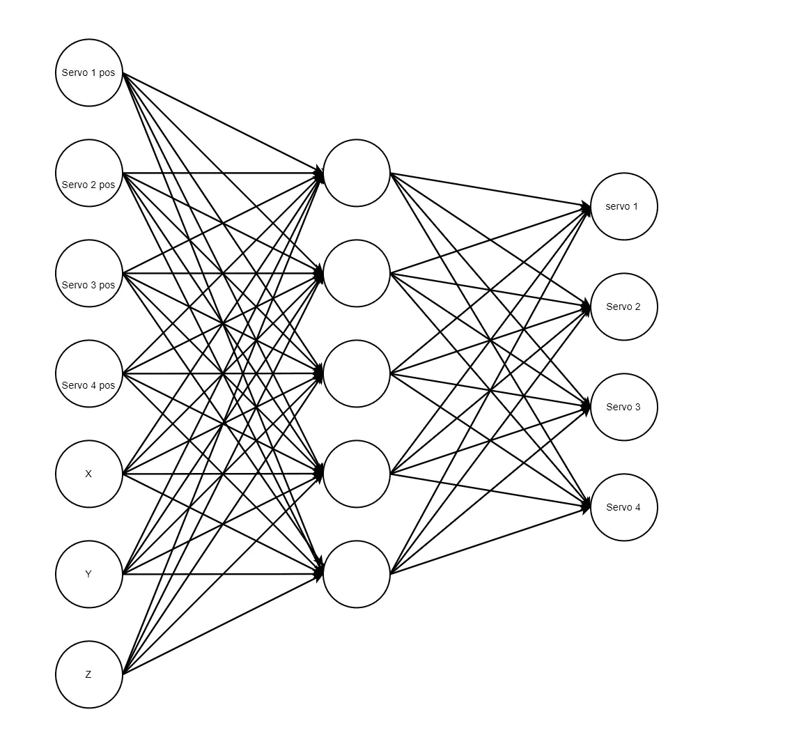

# 使用 Python 进化机器人行走

> 原文：<https://towardsdatascience.com/evolving-a-robot-to-walk-using-python-83417ca3df2a?source=collection_archive---------23----------------------->

## 让机器人教会自己走路

机器人行走是一项复杂的任务，要将运动的每一种可能性都写入一个程序中。随着马达和肢体的增加，在平衡底盘的同时必须理解硬件运动变得越来越困难。如果机器人能自己编代码走路不是更简单吗？这可以通过使用遗传算法和强化学习来实现。我们将使用 Python 开发一系列伺服电机，以一种创造行走运动的方式移动。

## 遗传算法

遗传算法(GAs)是蛮力和贪婪方法的替代品。他们使用进化理论，通过几代人来评估一个基因型的突变。思考这个问题的一个简单方法是，用一系列随机生成的步骤来制作一架纸飞机(我们的基因型)，然后执行这些步骤，看看飞机能飞多远。然后你改变一些步骤(变异)并重新制作飞机。如果这种改变允许飞机飞得更远，那么它就比上次更适合，如果不是，那么我们就放弃它，保留原来的。这种情况会重复一定数量的世代，或者直到满足某个条件。

遗传算法可以以不同的方式执行，例如使用简单的爬山算法，其中它突变一种基因型并在每一代评估适合度。这也可能是利用微生物气体，让一群基因型在比赛中相互竞争。根据任务选择不同的算法。我们将在这个项目中使用微生物算法。

> **算法 1 微生物**
> 
> **算法要求:人口**
> 
> current 1←人口[random nt()]
> 
> current 2←人口[random nt()]
> 
> 性能操作(当前 1)适合度 1←适合度()
> 
> 性能操作(当前 2)适合度 2←适合度()
> 
> **如果**合适 1 >不合适 2 **则**
> 
> 人口。AtIndex(f itness2)←f itness1
> 
> **其他**
> 
> 人口。AtIndex(f itness1)←f itness2
> 
> **结束 if**

## 神经网络遗传优化

代理是环境中执行动作的实体。使用神经网络可以根据某种形式的输入做出决策，这种输入告诉智能体它自己的环境状态。这方面的一个例子是游戏 Flappy Bird 自己玩。简单地通过遗传算法向上或向下进化不会帮助智能体在不断变化的环境中做出决策。本报告中使用的优化方法是一个不断进化权重和偏差的神经网络，以最佳地执行任务。

下面的文章对 RL 做了更详细的解释:

[](https://www.guru99.com/reinforcement-learning-tutorial.html) [## 强化学习:什么是，算法，应用，例子

### 强化学习被定义为一种机器学习方法，它关注的是软件代理应该如何采取…

www.guru99.com](https://www.guru99.com/reinforcement-learning-tutorial.html) 

# 方法

在本节中，我们将介绍所需的器件，并概述我们为硬件做出的选择。你不必遵循我们的设计。

零件清单:

*一个控制器如* [*树莓派*](https://shop.pimoroni.com/products/raspberry-pi-zero-w)

*伺服电机控制器如*[*Adafruit 16-伺服帽*](https://thepihut.com/products/adafruit-16-channel-pwm-servo-hat-for-raspberry-pi)

[*伺服电机*](https://www.amazon.co.uk/Lanyifang-Steering-Digital-Accessories-Manipulator/dp/B07MJ5Y985/ref=sr_1_1?dchild=1&keywords=servo+biped&qid=1621267159&sr=8-1) *(我们将用 4)*

*伺服硬件组成* [*两足动物底盘*](https://www.amazon.co.uk/Blesiya-Assembling-Walking-Humanoid-Accessories/dp/B07QGB2RLQ/ref=sr_1_7?dchild=1&keywords=servo+biped&qid=1621267184&sr=8-7)

*倾斜传感器如* [*MPU 6050*](https://www.amazon.co.uk/Neuftech%C2%AE-MPU-6050-3-gyroscope-accelerometer-crafting/dp/B00PIMRJX6/ref=sr_1_1_sspa?dchild=1&keywords=mpu+6050&qid=1621267302&sr=8-1-spons&psc=1&spLa=ZW5jcnlwdGVkUXVhbGlmaWVyPUFMU1YxUzNWMFlCVUwmZW5jcnlwdGVkSWQ9QTA5NDczNjUxSUxPVlNZMjdINldSJmVuY3J5cHRlZEFkSWQ9QTA1ODE4NTkzREdRTkFLU1U0MDlNJndpZGdldE5hbWU9c3BfYXRmJmFjdGlvbj1jbGlja1JlZGlyZWN0JmRvTm90TG9nQ2xpY2s9dHJ1ZQ==)

*距离传感器如* [*HC-SR04*](https://www.amazon.co.uk/HC-SR04-Ultrasonic-Distance-Rangefinder-Detection/dp/B0066X9V5K/ref=sr_1_7?dchild=1&keywords=ultrasonic+range+finder&qid=1621267338&sr=8-7)

*两个* [*脂电池*](https://shop.pimoroni.com/?q=lipo)

对于硬件的一体化套件，我们建议看看 Eleego 企鹅机器人。我们的设计基于 Bob Biped 底盘，但是，我们使用铝型材来构建它。如果你使用下面链接的底盘，树莓派 Zero 更便宜，更小，更适合 Elegoo Penguin 机器人。我们用的是树莓 Pi 型号 b。

注意:这个硬件使用微伺服系统，而不是我们使用的伺服系统。确保获得与这些设备上的电流相匹配的电池。我们推荐 4 节可充电 AA 电池用于 4 个微型伺服系统。

[](https://www.amazon.co.uk/ELEGOO-Penguin-Assembling-Tutorial-Hobbyists/dp/B07GN1JN6N/ref=pd_ybh_a_42?_encoding=UTF8&psc=1&refRID=QK93FABP5N8Z3BZM8K8R) [## ELEGOO Penguin Bot 双足机器人套件，用于 Arduino 项目，带组装教程，STEM 套件，用于…

### ELEGOO 企鹅机器人双足机器人套件，用于 Arduino 项目，带组装教程，STEM 套件，用于业余爱好者，STEM 玩具…

www.amazon.co.uk](https://www.amazon.co.uk/ELEGOO-Penguin-Assembling-Tutorial-Hobbyists/dp/B07GN1JN6N/ref=pd_ybh_a_42?_encoding=UTF8&psc=1&refRID=QK93FABP5N8Z3BZM8K8R) 

值得投资一个 Raspberry Pi 原型帽，您可以在其上焊接传感器并安排您的引脚排列。或者，你可以使用内置陀螺仪的[传感帽](https://shop.pimoroni.com/products/raspberry-pi-sense-hat)，但你仍然需要连接距离传感器和电池。


图 1:我们的两足动物底盘。图片由作者提供。

## 选择电池

伺服系统的电池需要在激活时为所有伺服系统提供足够的电流。伺服系统有两个我们需要关注的工作电流，一个是空闲电流，一个是活动电流。当伺服系统没有被命令时，空闲是牵引，而当伺服系统移动时，激活是牵引。最坏的情况是所有的伺服系统同时移动。经验法则是用有效电流乘以伺服系统的数量。你需要一个能提供合成电流的电池。

对我们来说是:

> 4*500 = 2000 毫安

我们将需要一个至少能提供 2000 毫安的电池，我们稍微检查了一下，购买了一个 3700 毫安和 3.7V 的电池。Raspberry Pi 对电池有自己的要求，应该与硬件电池分开，以防止电池产生过多的“噪声”。我们为 Pi 使用了 3000 毫安的 3.7V 电池。建议您使用 Lipo 电池，因为它们更安全，并且可以充电(节省您的电池费用)。

对于圆周率电池，我们使用了一个[电池帽](https://thepihut.com/products/lipo-battery-hat-for-raspberry-pi)，它也来自[圆周率零形式](https://thepihut.com/products/li-ion-battery-hat-for-raspberry-pi)。这使你可以充电，而不必从机器人身上取出来。

## 布线

接线的格式如下:

传感器引脚= Raspberry Pi GPIO 引脚

```
buzzer = 23
#Distance sensor
Trigger pin = 16
Echo pin = 12
#MPU tilt sensor
SDA = SDA
SCL = SCL
```

传感器上的所有接地和 5v 引脚都连接到 Raspberry Pi 引脚。如果传感器没有出现，您可以使用 Sudo 命令:

> sudo i2cdetect -y

您应该会看到一个 0x68 设备，这是您的倾斜传感器。超声波测距仪可以通过使用 Bluetin_Echo 库进行测试。如果值不符合预期，则检查您的接线。如果问题仍然存在，很可能是传感器损坏。

## 图书馆

我们将混合使用硬件库(仅用于 Raspberry Pi)和机器学习库。您需要以特定的方式安装 [PyTorch](https://medium.com/secure-and-private-ai-writing-challenge/a-step-by-step-guide-to-installing-pytorch-in-raspberry-pi-a1491bb80531) 才能使其工作。其余的可以通过 pip 完成。

```
import numpy as np
import torch
import random
import copy
import matplotlib.pyplot as plt
#libraries for the biped
from adafruit_servokit import ServoKit
from mpu6050 import mpu6050 as MPU
from Bluetin_Echo import Echo
import RPi.GPIO as GPIO
import time
```

## 神经网络的使用

就神经网络参数而言，你可以按照你希望的任何方式来设计你的代理。通过实验，我们发现在我们使用的样本中，2 层(每层 5 个节点)是表现最好的架构。对于输入层，它由当前伺服位置以及回转仪数据中的 x、y 和 z 位置组成。这然后被用来预测下一个伺服电机位置。



图 2:作者用 draw.io. Image 设计的图。

我们将输出编码为 1、0 或-1，表示向前移动 x 度、不移动或向后移动 x 度。我们的 x 将在每个伺服系统上旋转 30 度，以产生足够的移动而不会移动太多。

```
class Agent:
    def __init__(self, num_input, num_hiddenLayer, num_hiddenLayer2, num_output):
        self.num_input = num_input  #set input number
        self.num_output = num_output #set ooutput number
        self.num_genes = (num_input * num_hiddenLayer) + (num_output) + (num_hiddenLayer * num_hiddenLayer2) + (num_hiddenLayer2*num_output)
        self.num_hidden=num_hiddenLayer
        self.num_hidden2=num_hiddenLayer2
        self.weights = None
        self.weights2=None
        self.weights3=None
        self.bias = None

    def set_genes(self, gene):
        weight_idxs = self.num_input * self.num_hidden #size of weights to hidden
        weights2_idxs = self.num_hidden * self.num_hidden2 + weight_idxs #size and position
        weights3_idxs = self.num_hidden2 * self.num_output + weights2_idxs + #weight_idxs #size and position
        bias_idxs = weight_idxs + weights2_idxs + self.num_output #sizes of biases
        w = gene[0 : weight_idxs].reshape(self.num_hidden, self.num_input)   #merge genes
        w2 = gene[weight_idxs : weights2_idxs].reshape(self.num_hidden2, self.num_hidden)   #merge genes
        w3 = gene[weights2_idxs: weights3_idxs].reshape(self.num_output, self.num_hidden2) 
        b = gene[weights3_idxs: bias_idxs].reshape(self.num_output,) #merge genes
        self.weights = torch.from_numpy(w) #assign weights
        self.weights2 = torch.from_numpy(w2) #assign weights
        self.weights3 = torch.from_numpy(w3) #assign weights
        self.bias = torch.from_numpy(b) #assign biases

    def forward(self, x):
        x = torch.from_numpy(x).unsqueeze(0)
        x=torch.mm(x, self.weights.T) #first layer
        x =torch.mm(x,self.weights2.T) #second layer
        return torch.mm(x,self.weights3.T) + self.bias #third layer

    def get_action(self, x):
        items=list(self.forward(x)[0]) #get predictions
        arr=[]
        for i in items:
            if i>0.1: #if over 0.1 its on
                arr.append(1)
            elif i<=-0.1: #if in lower than -0.1 its off
                arr.append(-1)
            else: #if in middle bracket then
                arr.append(0)
        return arr
```

## 设置

我们将首先设置一个包含约束的伺服对象。这将阻止机器人移动伺服系统相互碰撞并造成损坏。校准的方法是通过手动移动你的伺服系统，并在潜在的损坏之前读取什么角度是极限。我们还想找到每个伺服机构的静止位置，以使机器人站立。这将被保存为起始位置。

```
class servoMotor:
    def __init__(self,servoObj,start,Min,Max): #initialize with all values and constraints
        self.servo=servoObj
        self.min=Min
        self.max=Max
        self.start=start
    def move(self,angle): #only move within a set space to avoid damage
        current=self.servo.angle
        if current+angle>=self.min and current+angle<=self.max:
            self.servo.angle=current+angle #increase by only if within constraint
    def startPos(self): #set servo to the start position (which will be standing)
        self.servo.angle=self.start
```

接下来，我们将需要定义所有必要的数据，如基因型、伺服电机和算法中使用的其他参数。

```
"""
define needed variables
"""
num_obs = 7 # depends on your environment
num_actions = 4 # depends on your environment
epochs, pop_size, mutation_std = 150, 15, 0.02 #define data for training
#create out agent
agent = Agent(num_obs, 5, 5, num_actions)

# Create our gene population
gene_pop = []

for i in range(10): #vary from 10 to 20 depending on purpose of robot
  gene_pop.append(np.random.normal(0, 0.1, (agent.num_genes)))#create

GPIO.setmode(GPIO.BCM)
NumServos=8
GPIO.setwarnings(False)
buzzer=23
#set up sensors
sensor = MPU(0x68)
sonar=Echo(16,12,315) #trigger pin, echo pin, speed

#set up outputs
kit = ServoKit(channels=16)
#lcd = lcddriver.lcd()
GPIO.setup(23,GPIO.OUT) #buzzer on 23

servos=[] #attach all the servo motor objects
servos.append(servoMotor(kit.servo[0],90,40,130))
servos.append(servoMotor(kit.servo[1],130,20,10))
servos.append(servoMotor(kit.servo[2],100,0,180))
servos.append(servoMotor(kit.servo[3],30,0,80))
```

您将需要更改伺服系统的参数，以匹配您在硬件中安装它们的方式。这些伺服系统连接到伺服帽的位置 0，1，2，3。这在以下文件中声明:

> kit.servo[pin]

## GA 的使用

我们将使用初始种群为 20 个基因的微生物算法。这将提供足够的变化，以帮助找到更好的解决方案，但足够小，以最终收敛于解决方案。

**健身**

健康将通过几个属性来评估。运动后获得的距离、末端倾斜位置和运动的多样性。获得的距离是在执行指令的开始和结束时从超声波测距仪收集的。开始-结束应为正值，否则将返回 0 适合度。如果终点位置没有站直，这个距离会被扣分。这将防止机器人到处倾斜。运动的多样性奖励创造大量运动而不是在最后一刻缓慢移动或跳跃的基因型。这有助于进化出能够行走的基因型。

```
def readDist():
    return int(sonar.read("mm",15)) #read the distance from ultrasound range finder
def readAcc():
     while True:
        try:
                d=sensor.get_accel_data() #read the accelerometer
                return float(d["x"]),float(d["y"]),float(d["z"]) #return values from gryoscopic data
        except:
                pass #return nothing if not plugged in
def withinBoundary(num,value,minus,plus): #whether or not a number is withi a value bounds
    if num>=value-minus and num<=value+plus: #get boundaries
        return True
    return False

def isReady():
    #check accelerometer values are within boundaries
    x,y,z=readAcc()#get gyroscope values
    if withinBoundary(x,-9.5,2,2) and withinBoundary(y,0.2,2,2): #get within bounds of standing
        return True
    return False
def getDiverseScore(positions):
    #given all the positions predicted, reward those with many changes
    counter=0
    for i,pos in enumerate(positions[1:]): #loop through positions
        for j in range(len(positions[0])): #loop through each
            if positions[i][j]!=pos[j]:
                counter+=1 #increase if different to last
    return counter
def fitness(startDist,positions):
    #get the fitness of the bots current position
    distance=readDist()
    diversityScore=getDiverseScore(positions) #gather a diversity of movement score
    x,y,z=readAcc()
    #get the distance score
    #get the gyro score
    #combine scores
    penalty=0
    if not withinBoundary(x,-9.5,2,2): #assign penalties for data not within boundary
        penalty=abs(max(-9.5,x)-min(-9.5,x))
    if not withinBoundary(y,0.2,2,2):
        penalty=abs(max(0.2,x)-min(0.2,x))

    if isReady(): #if in a near position
        if startDist-distance>0 and startDist-distance-penalty>0:
            return (startDist-distance-penalty)+diversityScore
    return 0
```

**突变**

变异是通过正态分布增加/减少权重和偏差来完成的。这被限制在 4 到-4 之间，因此权重不会变得太大/太小而支配网络。在实验中，使用 20%的标准差效果很好。

```
def mutation(gene, mean=0, std=0.1):
    gene = gene + np.random.normal(mean, std, size=gene.shape) #mutate the gene via normal 
    # constraint
    gene[gene > 4] = 4
    gene[gene < -4] = -4
    return gene
```

## 主 GA 循环

选择 150 个时代/代是因为虽然这需要很长时间，但它应该在这段时间内收敛到一个好的解决方案。每一代有 20 个动作，因此必须快速进化行走模式。

```
def output_step(servos,motorGenes): #move servos by given amounts
    for i,gene in enumerate(motorGenes):
        if gene==1:
            servos[i].move(30) #move by 30 degrees
        elif gene==-1:
            servos[i].move(-30) #move by -30 degrees
```

主循环将组合所有的代码，并产生一个适合度数组。您可以将这些拟合度保存到文本文件中，以便进行绘图。

```
prev_fitness = [0]
fitnesses=[0]
fittest=[0,0]
storedFav=-1
print("initial reading",readDist())
# Main loop performing Microbal GA
behaviour=[[0],[0],[0],[0]]
for epoch in range(epochs):
    print("Generation:",epoch)
    for i in servos:
        i.startPos()
    while isReady()==False: GPIO.output(buzzer,GPIO.HIGH) #wait for ready
    GPIO.output(buzzer,GPIO.LOW)
    time.sleep(2)
    startDist=readDist() #get sensor reading

    n1=random.randint(0,len(gene_pop)-1) #get random gene

    g1=copy.deepcopy(gene_pop[n1])
    g1=mutation(g1,std=0.2) #mutate this random gene
    positions=agent.set_genes(g1) #set the genes
    currentMotors=[servos[i].servo.angle for i in range(len(servos))] #set up current angles
    gathered=[]
    for i in range(20): #20 steps to get it right
        positions=agent.get_action(np.array(currentMotors+list(readAcc()))) #get random gene
        gathered.append(positions.copy())
        currentMotors=[servos[i].servo.angle for i in range(len(servos))] #set up current angles

        output_step(servos,positions) ######output steps
        time.sleep(0.3)
        if not isReady(): break #break if not standing up
    g1_fit = fitness(startDist,gathered) #gather the fitness

    for i in servos: #reset to start positions
        i.startPos()
    while isReady()==False: GPIO.output(buzzer,GPIO.HIGH) #wait for ready
    GPIO.output(buzzer,GPIO.LOW)
    time.sleep(2)
    startDist=readDist() #get sensor reading

    n2=random.randint(0,len(gene_pop)-1) #select a random gene
    g2=copy.deepcopy(gene_pop[n2])
    g2=mutation(g2,std=0.2) #mutate this random gene
    positions=agent.set_genes(g2) #set the genes
    currentMotors=[servos[i].servo.angle for i in range(len(servos))] #set up current angles
    gathered=[]
    for i in range(20): #20 steps to get it right
        positions=agent.get_action(np.array(currentMotors+list(readAcc()))) #get random gene
        gathered.append(positions.copy())
        currentMotors=[servos[i].servo.angle for i in range(len(servos))] #set up current angles
        output_step(servos,positions) ######output steps
        time.sleep(0.3)
        if not isReady(): break
    g2_fit = fitness(startDist,gathered)

    if g1_fit>g2_fit: gene_pop[n2]=copy.deepcopy(gene_pop[n1]) #copy over if fitter
    else: gene_pop[n1]=copy.deepcopy(gene_pop[n2]) #copy over if not fitter

    fitnesses.append(max([g1_fit,g2_fit])) #save best fitness out of two
print(fitnesses)
```

# 结果


图 3:两层网络的结果。图片由作者提供。


图 4:三层网络的结果。图片由作者提供。

如图所示，经过 3 次试验，我们发现平均而言，2 层网络优于 3 层网络。

# 结论

在本文中，我们开发了一种算法，可以让机器人进化出行走的动作。我们已经使用了一个 4 伺服两足动物的例子，但这可以使用一个完全不同的设计与更多的伺服，如人形两足动物。

进一步的实验可能包括添加更多的伺服系统，更多的传感器，或使用不同的遗传优化方法。这篇文章为你提供了发展机器人技术的基础。

# 附录

2 层代理代码可在此处找到:

[https://raw . githubusercontent . com/shepai/Biped/main/robot % 20 code % 20 deep . py](https://raw.githubusercontent.com/shepai/Biped/main/robot%20code%20deep.py)

可以找到更多的实验和代码:

[](https://github.com/shepai/Biped) [## shepai/Biped

### 双足机器人项目。在 GitHub 上创建一个帐户，为 shepai/Biped 开发做贡献。

github.com](https://github.com/shepai/Biped) 

更多类似的项目可以在我们的网站上找到:

[](https://shepai.github.io/) [## 艾

### 关于如何使用 Raspberry Pi 或 Python 构建自己的 SHEP 人工智能的指南。在您自己的机器人中实现它…

shepai.github.io](https://shepai.github.io/)