# JAX 进化中的神经网络

> 原文：<https://towardsdatascience.com/evolving-neural-networks-in-jax-dda73bd7afd0?source=collection_archive---------13----------------------->

## [实践教程](https://towardsdatascience.com/tagged/hands-on-tutorials)

## 用`vmap`和`jit`的功率缩放 CMA-ES

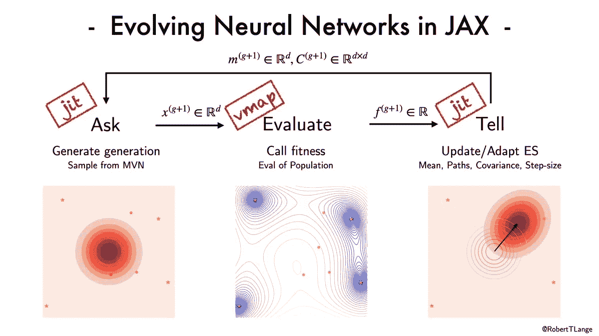

"那么，我为什么要从`<insert-autodiff-library>`转到 JAX 呢？"。谈论新电影《街区小子》时，第一个典型的消极攻击性问题。以下是我的答案:JAX 不仅仅是一个自动分化的快速库。如果你的科学计算项目想从 XLA、JIT 编译和批量数组编程范例中获益，那么 JAX 提供了一个极好的 API。虽然 PyTorch 依赖预编译内核和快速 C++代码来实现最常见的深度学习应用，但 JAX 允许我们利用高级接口来编写您最喜欢的加速器。`vmap`、`pmap`、`jit`跨阵列维度/计算设备加速和向量化，而无需处理进程的异步簿记。但是这不限于标准的基于梯度的优化设置。它也适用于许多进化方法。因此，在本帖中，我们将探讨 JAX 如何推动下一代可扩展神经进化算法:

1.  我们将介绍协方差矩阵适应进化策略(CMA-ES，例如 [Hansen，2016](https://arxiv.org/abs/1604.00772) )，并讨论“维数灾难”和高维协方差矩阵的统计估计等挑战。
2.  我们将在 JAX 实施 CMA-ES 更新方程。我们将展示如何最大限度地利用`vmap`并对专家系统的两个关键维度进行矢量化:世代群体规模和每个群体成员的适应性评估数量。
3.  我们将使用 CMA-ES 发展一种前馈策略来平衡钟摆。之后，我们探索了不同的超参数(神经网络规模、平均学习速率和选择度),以便对专家系统中的关键权衡有更好的直觉。
4.  最后，我们将分析 CMA-ES 生成迭代和跨不同硬件平台的运行和编译时间。我们将看到`vmap`的 XLA 编译和矢量化在不同平台(CPU/不同 GPU)上平滑扩展。

> *TL；博士* : JAX 在扩展神经进化算法方面令人敬畏。我们可以`vmap`对所有群体成员的参数化和他们的随机适应性评估。通过消除多处理/MPI 通信诡计，我们可以在现代加速器(GPU/TPU)上运行神经进化实验，并且几乎没有工程开销。如果你想知道 CMA-ES 是什么样子，那就来一趟吧。

**注意**:在整篇文章中，我们假设你已经知道 JAX 的基本元素，比如`jit`、`vmap`和`lax.scan`。如果你觉得你需要补上这些，查看一下 [JAX 快速入门指南](https://jax.readthedocs.io/en/latest/notebooks/quickstart.html)或者我的 [JAX 介绍博客文章](https://roberttlange.github.io/posts/2020/03/blog-post-10/)。

让我们从安装和导入几个包开始。

```
try:
    import jax
except:
    !pip install --upgrade jax
    !pip install --upgrade jaxlib%matplotlib inline
%load_ext autoreload
%autoreload 2
%config InlineBackend.figure_format = 'retina'

import jax
import jax.numpy as jnp
from jax import jit, vmap, lax
import functools, time
import matplotlib.pyplot as plt
```

# 进化策略和提问-评估-回答 API

进化策略的目标是在不使用显式解析导数或梯度估计的情况下最小化黑箱函数。相反，他们依赖于感兴趣的(潜在的噪声)函数的随机评估。先前积累的信息然后被巧妙地整合以通知搜索分布 **π** 。第个连续批次的建议方案 *x* 也称为一代个体 *g* 。在神经进化中, *x* 对应于神经网络的参数，而 *f* 表示某种性能度量。重要的是，我们不依赖于反向投影和产生的梯度，目标不必是平滑的和可微分的。这有几个实际影响:

1.  我们有更多的自由来设计神经网络。大多数常见的深度学习构建模块，如卷积层、线性层和注意力层，都是在我们的脑海中以梯度下降的方式设计的。但是，如果我们不需要梯度来学习，我们可以使用不可微的非线性，如尖峰和基于阈值的激活。
2.  我们不必精心手工制作目标函数，它支持梯度下降所规定的学习动力学。而是我们**可以直接优化感兴趣的函数**。例如，在 RL 中，我们可以直接以最大化剧集回报为目标，而不需要诸如均方贝尔曼误差之类的替代目标。
3.  ES 不是优化解参数的单点估计，而是保持解的搜索分布。这种客观景观的替代物可以用来对解决方案进行采样，这些解决方案在解决任务的方式上可能是不同的。例如，这种异质性可以用于集合预测。

ES 可以被认为是搜索算法，它使用一种记忆或者目标的代理模型。替代项 **π** 的具体形式因 ES 而异(例如，对于 CMA-ES，它将是缩放的多元高斯函数)。一般程序有三个重复步骤:

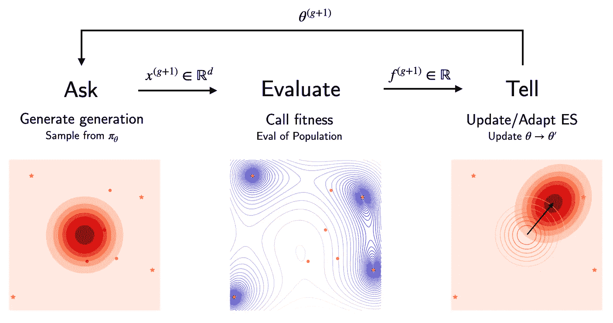

1.  **问**:给定当前的代理模型，我们“问”出一组评估候选或者新的一代，*x*~**π***()*。
2.  **评估**:我们使用目标 *f* 评估提议的代中每个成员 *x* 的适合度，这返回一个“效用”标量。对于随机目标，我们可能需要多次这样做，以获得可靠的适合度估计。
3.  **告诉**:接下来我们用 *(x，f(x))* 更新模型θ→θ’。搜索分布将被调整以增加表现良好的候选人的可能性。这次更新详细说明了如何应对*勘探开发*的权衡。

我们迭代这三个步骤，得到一组世代 *g = 1，…，G* 。这三步程序通常在超参数优化工具箱(如`[scikit-optimize](https://scikit-optimize.github.io/stable/auto_examples/parallel-optimization.html#sphx-glr-auto-examples-parallel-optimization-py)`)中实现，并提供了与专家系统接口的最小 API(如参见 [David Ha 的博客](https://blog.otoro.net/2017/10/29/visual-evolution-strategies/))。

# CMA-ES 及其更新规则

## ……以及如何在 JAX 实施

在 CMA-ES 中，搜索分布 **π** 是具有均值 *m* 和缩放协方差矩阵σ *C* 的多元高斯分布。更新步骤调整高斯和步长标准偏差σ的均值和协方差。不严格地说，平均值将被拉向最佳执行候选的方向，而协方差更新将旨在将采样分布的密度轮廓与目标的等高线对齐，从而与最陡下降的方向对齐。这听起来似乎合理——但是高效搜索算法的理想特征是什么呢？它应该在广泛的函数范围内通用，并且对输入和输出的各种变换都是健壮的。这种鲁棒性元目标可以在**不变性属性**的概念下进行重铸，我们将看到其中几个应用于 CMA-ES 的解决方案质量:

*   通过“尺度无关”的秩截断选择对适应度函数的**保序变换**的不变性。例如，如果我们向目标函数添加一个常数，解决方案不应改变。
*   如果初始搜索点被相应地变换，则对搜索空间的**保角变换**的不变性。

现在让我们看看 CMA-ES 是如何实现这些元目标的，并研究 CMA-ES 的各个更新方程以及如何在 JAX 实施它们。我自由地编写了一些助手函数，这些函数对于我们理解 JAX 或 CMA-ES 并不重要。这包括我们如何初始化和终止策略以及一些日志记录工具。请随意检查[链接存储库](https://github.com/RobertTLange/code-and-blog/07_neuroevolution)中的源文件。

```
from helpers.es_helpers import (init_cma_es,              
                                eigen_decomposition,
                                check_termination,
                                init_logger,
                                update_logger)
from helpers.viz_helpers import plot_fitness, plot_sigma
```

## 问答界面

第一步是定义 CMA-ES 的核心功能以及我们与搜索算法交互的方式:通过**从搜索分布中向**请求一组候选建议，然后**评估**这些候选建议。只有在之后，我们才能用评估期间收集的信息更新战略。在 CMA-ES 中，ask-step 是从一个多元高斯样本中选取的，其中充分的统计量定义了搜索的方向。直觉上，平均值应该更接近表现最佳的候选者，而协方差应该将我们的搜索指向最陡下降的方向。为了有效地从这个潜在的高维高斯样本中进行采样，我们将使用 [**重新参数化技巧**](http://blog.shakirm.com/2015/10/machine-learning-trick-of-the-day-4-reparameterisation-tricks/) :

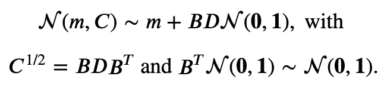

*C* 的本征分解将协方差分解为 *B* 和 *D* 。 *B* 是一个正交矩阵，它的列构成了特征向量的标准正交基。 *D* 是 *C* 对应特征值的平方根对角矩阵。直观地说， *D* 缩放球形‘基本’高斯分布，并可视为*维度特定的*步长矩阵。对角线条目对应于我们的优化问题的各个$d$维度的标准偏差。因此，它控制着搜索分布沿着特定的轴“延伸”多远。另一方面， *B* 定义了这些主轴的方向。**简而言之: *D* 音阶， *B* 定向**。最后，σ是一个与*尺寸无关的*步长。在代码中，如下所示:

```
def ask(rng, params, memory):
    """ Propose parameters to evaluate next. """
    C, B, D = eigen_decomposition(memory["C"], memory["B"], memory["D"])
    x = sample(rng, memory, B, D, params["n_dim"], params["pop_size"])
    memory["C"], memory["B"], memory["D"] = C, B, D
    return x, memory

@functools.partial(jit, static_argnums=(4, 5))
def sample(rng, memory, B, D, n_dim, pop_size):
    """ Jittable Multivariate Gaussian Sample Helper. """
    z = jax.random.normal(rng, (n_dim, pop_size)) # ~ N(0, I)
    y = B.dot(jnp.diag(D)).dot(z)                 # ~ N(0, C)
    y = jnp.swapaxes(y, 1, 0)
    x = memory["mean"] + memory["sigma"] * y      # ~ N(m, σ^2 C)
    return x
```

`memory`存储所有暴露于来自 es 的更新的变量。另一方面，`params`是固定的超参数，例如不同的学习规则或群体规模。我们稍后将重用协方差的特征分解，以便我们可以通过将 *C，B，D* 存储在我们的记忆字典中来缓冲计算。从一个`ask`函数调用中获得一组λ个候选函数后，我们可以使用目标函数来评估它们的`fitness`。

一个 CMA-ES 代的更新由 **5 个顺序更新方程** : *m* ，p_σ，σ，p_c，和 *C* 更新组成。这些是存储在`memory`中的。由此产生的动态规定了我们的搜索分布如何在连续几代中演变。示意性地，这看起来如下:

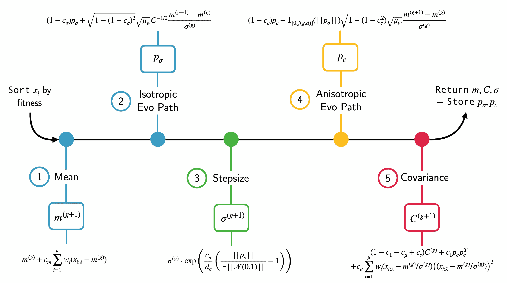

等等！但是 *p_σ* 和 *p_c* 从何而来？从单个世代中对 *C* 进行经验估计是困难的，尤其是当参数的数量大于群体规模*d>N*时(进化神经网络时通常会出现这种情况)。因此，我们希望通过利用前几代人积累的信息来获得可靠的估计。这就是不同进化路径发挥作用的地方。他们的角色是跟踪均值统计的变化，以及不同的更新如何影响下一代的性能。 *p_c* 然后用于通知总体方差的各向异性部分的更新(so *C* )和用于更新各向同性部分的*p _ C*(soσ)。先不要担心方程，我们很快就会看到所有这些是如何详细工作的。现在只要记住 *p_c* 和 *p_σ* 提供了一个整合了过去更新的内存跟踪。下面的函数包含了所有五个更新步骤以及呼叫中解决方案的初始排序:

```
def tell_cma_strategy(x, fitness, params, memory):
    """ Update the surrogate ES model. """
    # Update/increase the generation counter
    memory["generation"] = memory["generation"] + 1

    # Sort new results, extract parents, store best performer
    concat_p_f = jnp.hstack([jnp.expand_dims(fitness, 1), x])
    sorted_solutions = concat_p_f[concat_p_f[:, 0].argsort()]

    # Update mean, isotropic path, stepsize, anisotropic path, cov.
    mean, y_k, y_w = update_mean(sorted_solutions, params, memory)
    memory["mean"] = mean

    p_sigma, C_2, C, B, D = update_p_sigma(y_w, params, memory)
    memory["p_sigma"], memory["C"], memory["B"], memory["D"] = p_sigma, C, B, D

    sigma, norm_p_sigma = update_sigma(params, memory)
    memory["sigma"] = sigma

    p_c, ind_sigma = update_p_c(y_w, norm_p_sigma, params, memory)
    memory["p_c"] = p_c

    C = update_covariance(y_k, ind_sigma, C_2, params, memory)
    memory["C"] = C
    return memory

# JIT-compiled version for tell interface
tell = jit(tell_cma_strategy)
```

让我们仔细看看各个更新步骤，以及它们在 JAX 是如何实施的:

## 更新 1:通过截断选择和重新加权进行均值更新

我们从平均值开始，它依赖于**截断选择**。不是让所有候选人平等地拉动均值更新，我们将只考虑群体中表现最好的人(或父母μ)的子集来影响 *m* 的更新。通常父母的集合被选择为整个人口的大约 50%。随着父母在群体中的排名降低，每个父母的权重也降低。

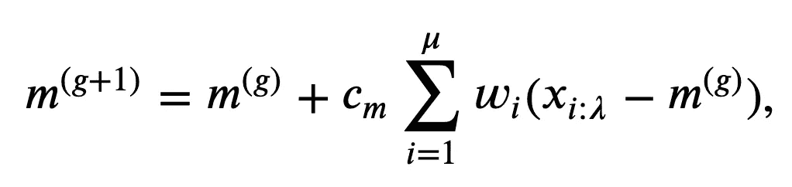

其中 *x_:λ* 表示世代 *g* 的适应度排序候选，而 *c_m* 表示均值更新的学习速率。权重 *w_i* 通常被选择为递减的，使得表现最好的解决方案被给予更大的影响。这是群体大小 *λ = 100* 和 *μ = 50* 的默认情况:

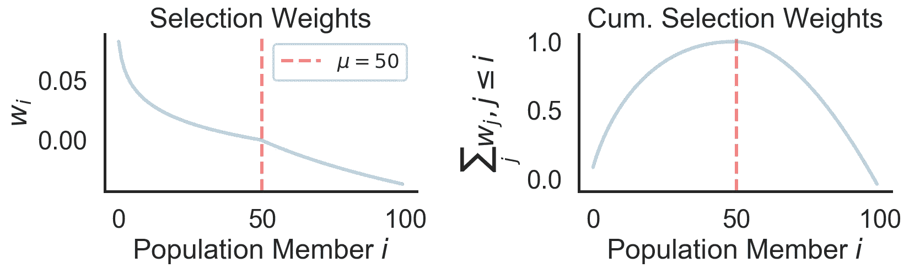

在下面的代码中，我们还定义了 z 得分参数以及所选的均值归一化父参数的加权和。`update_mean`返回更新后的平均值以及 *y_k* 和 *y_w* 。这些将在协方差更新步骤中重复使用。

```
def update_mean(sorted_solutions, params, memory):
    """ Update mean of strategy. """
    x_k = sorted_solutions[:, 1:]       # ~ N(m, σ^2 C)
    y_k_temp = (x_k - memory["mean"])   # ~ N(0, σ^2 C)
    y_w_temp = jnp.sum(y_k_temp.T * params["weights_truncated"], axis=1)
    mean = memory["mean"] + params["c_m"] * y_w_temp
    # Comple z-scoring for later updates
    y_k = y_k_temp / memory["sigma"]
    y_w = y_w_temp / memory["sigma"]
    return mean, y_k, y_w
```

## 更新 2:各向同性进化路径更新

在接下来的两步中，我们将推导协方差矩阵各向同性部分的更新，也称为“步长”σ的缩放。CMA-ES 使用一个进化路径 *p_σ* ，它集成了前面的步骤来执行**累积步长自适应**:

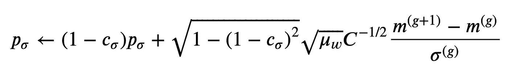

```
def update_p_sigma(y_w, params, memory):
    """ Update evolution path for covariance matrix. """
    C, B, D = eigen_decomposition(memory["C"], memory["B"], memory["D"])
    C_2 = B.dot(jnp.diag(1 / D)).dot(B.T)  # C^(-1/2) = B D^(-1) B^T
    p_sigma_new = (1 - params["c_sigma"]) * memory["p_sigma"] + jnp.sqrt(
        (1 - (1 - params["c_sigma"])**2) *
        params["mu_eff"]) * C_2.dot(y_w)
    _B, _D = None, None
    return p_sigma_new, C_2, C, _B, _D
```

不严格地说，这意味着在以下两种情况下调整勘探-开采权衡:

1.  如果两个更新步骤是反相关的(它们指向相反的方向)，那么我们在参数空间中并没有真正移动。更新来来回回，没有明确的前进方向，这表明收敛。在这种情况下，累积步长自适应将降低σ。
2.  另一方面，如果步骤指向相同的方向，这将增加步长，使得搜索在共识的方向上进行得更快。直观上，这种行为类似于动量在基于梯度的优化中的工作方式。

适应的速度和整合的时间尺度取决于两个关键因素:学习率 *p_σ* ， *c_σ* 和特征值 *C* 的大小。 *c_c* 越大， *p_σ* 响应越快，但积分时间尺度也越小。另一方面，协方差的精度提供了额外的重新标度，这种重新标度以非平凡的方式相互作用。那么我们实际上如何更新σ呢？

## 更新 3:累积步长自适应

步长是标量，而 p_σ是 *d* 维。所以我们需要减少事情。 *p_σ* 的范数提供了一个聚合步长的度量和一个简单的移动统计量，用于决定是增加还是减少σ。这里我们将跳过一些数学，但是可以表明 *p_σ* 处于期望标准正态分布。然后，如果||p_σ||偏离其期望值，我们可以使用指数比例更新:

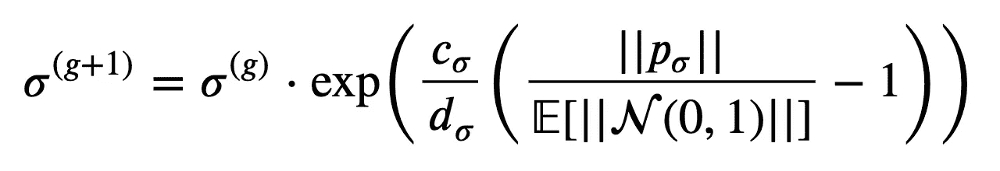

```
def update_sigma(params, memory):
    """ Update stepsize sigma. """
    norm_p_sigma = jnp.linalg.norm(memory["p_sigma"])
    sigma = (memory["sigma"] * jnp.exp((params["c_sigma"] / params["d_sigma"])
                                      * (norm_p_sigma / params["chi_d"] - 1)))
    return sigma, norm_p_sigma
```

注意，如果||p_σ||等于期望值，则步长不会有任何变化。d_σ ~ 1 是所谓的阻尼参数，重新标度了 ln σ的大小变化。

## 更新 4:各向异性进化路径更新

到目前为止一切顺利。现在我们有了一个更新的公式来计算方差的均值和各向同性部分。最后，我们需要一个估计协方差的过程。一个自然的起点可以是基于当前 *x* 的样本估计。但是对于参数的数量远大于父节点的数量 d > > λ的情况，这是非常不可靠的。这是**维度诅咒**统计挑战的另一个例子。CMA-ES 不再仅仅依赖于最新一代，而是再次使用了一个自适应过程，该过程在连续的更新步骤中利用了该结构:

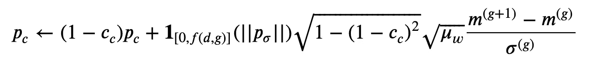

乍一看，这个等式与 p_σ的各向同性路径更新非常相似。但是有两个显著的区别:

1.  我们不通过协方差矩阵 *C* 的平方根来重新调整归一化的均值变化。因此，它仍然是一个各向异性变量。
2.  更新依赖于布尔值。如果 *p_σ* 的范数变得太大，指示器功能会“停止”p_c 更新。当步长过小时，这可防止 *C* 的轴过冲。Hansen (2016)指出，当初始σ选择得太小或目标函数不稳定时，这尤其有用。

```
def update_p_c(y_w, norm_p_sigma, params, memory):
    """ Update evolution path for sigma/stepsize. """
    ind_sigma_cond_left = norm_p_sigma / jnp.sqrt(
        1 - (1 - params["c_sigma"]) ** (2 * (memory["generation"] + 1)))
    ind_sigma_cond_right = (1.4 + 2 / (memory["mean"].shape[0] + 1)) * params["chi_d"]
    ind_sigma = 1.0 * (ind_sigma_cond_left < ind_sigma_cond_right)
    p_c = (1 - params["c_c"]) * memory["p_c"] + ind_sigma * jnp.sqrt((1 -
          (1 - params["c_c"])**2) * params["mu_eff"]) * y_w
    return p_c, ind_sigma
```

## 更新 5:协方差自适应步骤

我们现在可以将演化路径 *p_c* 用于协方差矩阵自适应步骤的一部分:由外积 *p_c p_c^T* 给出的秩 1 更新。该更新由从最近一代评估的加权样本协方差估计构建的秩μ更新来补充:

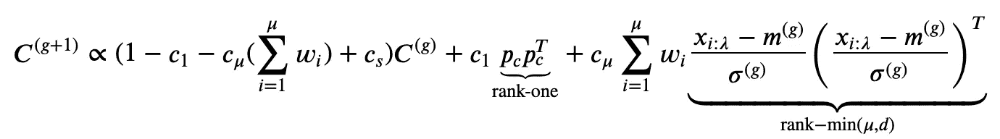

直观上，自适应步骤的目标是增加采样 *p_c* 和归一化参数的机会。再次， *c_1* 、 *c_μ* 和 *c_s* 表示一组学习率。要更好地了解 CMA-ES 中的超参数，请查看博客末尾的概述表。总的协方差矩阵自适应步骤如下:

```
def update_covariance(y_k, ind_sigma, C_2, params, memory):
    """ Update cov. matrix estimator using rank 1 + μ updates. """
    w_io = params["weights"] * jnp.where(params["weights"] >= 0, 1,
                                        memory["mean"].shape[0]/
            (jnp.linalg.norm(C_2.dot(y_k.T), axis=0) ** 2 + 1e-20))
    c_s = (1 - ind_sigma) * params["c_1"] * params["c_c"] * (2 - params["c_c"])
    rank_one = jnp.outer(memory["p_c"], memory["p_c"])
    rank_mu = jnp.sum(
        jnp.array([w * jnp.outer(y, y) for w, y in zip(w_io, y_k)]), axis=0)
    C = ((1 - params["c_1"] - params["c_mu"] * jnp.sum(params["weights"]) + c_s ) * memory["C"]
         + params["c_1"] * rank_one + params["c_mu"] * rank_mu)
    return C
```

# 在 ES 中利用`vmap`的全部功能

现在，让我们看看如何扩展 CMA-ES 来优化一个经典强化学习任务的小型神经网络。传统上，这将涉及大量代码和涉及多处理和 OpenMPI 的通信管道。另一方面，在《JAX》中，我们将使用`vmap`通过以下方式处理大量的工程复杂性:1)我们将在使用`lax.scan` &重写健身房环境后`jit`RL 插曲循环。2)我们`vmap`通过评估片段来评估代理的健康状况。3)最后，我们还`vmap`在一代人内的不同提议网络上。图片显示如下:

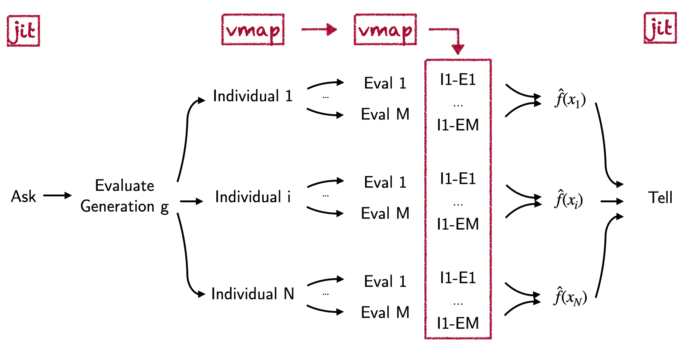

不涉及多处理工作队列，我们可以轻松地将其扩展到 GPU 甚至 TPU 等加速器。我已经有了在 JAX 重写 [OpenAI 的](https://github.com/openai/gym/blob/master/gym/envs/classic_control/pendulum.py) `[Pendulum-v0](https://github.com/openai/gym/blob/master/gym/envs/classic_control/pendulum.py)` [NumPy 环境](https://github.com/openai/gym/blob/master/gym/envs/classic_control/pendulum.py)的自由。对于简单的钟摆-ODE 情况，它基本上归结为用等价的`jnp.<op>`操作替换所有的`np.<op>`操作，并避免布尔的显式使用(例如，通过使用掩码代替)。此外，RL `step`现在将把环境变量的附加字典和环境的当前状态作为输入。这允许我们在`lax.scan`原语的帮助下`jit`整个剧集的展示。我们现在导入简单的环境助手。接下来，我们定义一个单隐藏层 MLP 策略和一个策略卷展包装器。为简单起见，我们假设策略确定性地从观察映射到行动:

```
from helpers.pendulum_jax import reset, step, env_params

def ffw_policy(params, obs):
    """ Compute forward pass and return action from deterministic policy """
    def relu_layer(W, b, x):
        """ Simple ReLu layer for single sample """
        return jnp.maximum(0, (jnp.dot(W, x) + b))
    # Simple single hidden layer MLP: Obs -> Hidden -> Action
    activations = relu_layer(params["W1"], params["b1"], obs)
    mean_policy = jnp.dot(params["W2"], activations) + params["b2"]
    return mean_policy

def policy_pendulum_step(state_input, tmp):
    """ lax.scan compatible step transition in jax env. """
    obs, state, policy_params, env_params = state_input
    action = ffw_policy(policy_params, obs)
    next_o, next_s, reward, done, _ = step(env_params, state, action)
    carry, y = [next_o.squeeze(), next_s.squeeze(),
                policy_params, env_params], [reward]
    return carry, y

def pendulum_rollout(rng_input, policy_params, env_params, num_steps):
    """ Rollout a pendulum episode with lax.scan. """
    obs, state = reset(rng_input)
    _, scan_out = jax.lax.scan(policy_pendulum_step,
                               [obs, state, policy_params, env_params],
                               [jnp.zeros(num_steps)])
    # Return the sum of rewards accumulated by agent in episode rollout
    return jnp.sum(jnp.array(scan_out))
```

最后，是 JAX 终极魔术的时候了。我们`vmap`在我们当前群体中的不同评估事件和所有不同神经网络的数量上。助手`v_dict`表示我们不同字典参数条目的第一维对应于我们想要矢量化的人口维度。之后，我们`jit`了`vmap`ed 批处理卷展栏，并指出环境参数以及剧集步骤的数量是静态的:

```
# vmap over different MC fitness evaluations for single pop. member
batch_rollout = jit(vmap(pendulum_rollout, in_axes=(0, None, None, None),
                         out_axes=0), static_argnums=(3))

# vmap over different members in the population
v_dict = {"W1": 0, "b1": 0, "W2": 0, "b2": 0}
generation_rollout = jit(vmap(batch_rollout,
                              in_axes=(None, v_dict, None, None),
                              out_axes=0), static_argnums=(3))
```

我们需要最后一个要素:当向 CMA-ES 请求下一代的参数样本时，它将对参数的平面向量进行采样。但是评估过程需要特定于层的权重数组的字典。因此，我们需要一个助手来将扁平建议向量重新组装到 JAX 的权重和偏差的适当参数字典中。下面是一个简单的函数，它为我们的单个隐藏层 MLP 完成了这项工作:

```
def flat_to_network(flat_params, layer_sizes):
    """ Reshape flat parameter vector to feedforward network param dict. """
    pop_size = flat_params.shape[0]
    W1_stop = layer_sizes[0]*layer_sizes[1]
    b1_stop = W1_stop + layer_sizes[1]
    W2_stop = b1_stop + (layer_sizes[1]*layer_sizes[2])
    b2_stop = W2_stop + layer_sizes[2]
    # Reshape params into weight/bias shapes
    params = {"W1": flat_params[:, :W1_stop].reshape(pop_size,
                                                     layer_sizes[1],
                                                     layer_sizes[0]),
              "b1": flat_params[:, W1_stop:b1_stop],
              "W2": flat_params[:, b1_stop:W2_stop].reshape(pop_size,
                                                            layer_sizes[2],
                                                            layer_sizes[1]),
              "b2": flat_params[:, W2_stop:b2_stop]}
    return params
```

现在，我们准备好将所有东西放入钟摆任务的 CMA 搜索循环和一个具有 48 个隐藏单元的多层感知器中:我们首先初始化策略超参数、搜索分布、进化路径和跟踪策略进展的记录器。然后，我们在不同的世代迭代中运行`ask` - `evaluate` - `tell`循环。

```
# Setup the ES hyperparameters
num_generations = 200
num_evals_per_gen = 50
num_env_steps = 200
pop_size, parent_size = 100, 50

# Setup the random number gen., init ES and the logger
rng = jax.random.PRNGKey(0)
net_size = [3, 48, 1]
num_params = 3*48 + 48 + 48*1 + 1
mean_init, sigma_init = jnp.zeros(num_params), 1
params, memory = init_cma_es(mean_init, sigma_init, pop_size, parent_size)
top_k = 5
evo_logger = init_logger(top_k, num_params)WARNING:absl:No GPU/TPU found, falling back to CPU. (Set TF_CPP_MIN_LOG_LEVEL=0 and rerun for more info.)# Loop over different generations in evolutionary strategy
start_t = time.time()
for g in range(num_generations):
    rng, rng_ask, rng_eval = jax.random.split(rng, 3)
    # Ask for set of proposal param candidates and reshape
    x, memory = ask(rng_ask, params, memory)
    generation_params = flat_to_network(x, net_size)
    rollout_keys = jax.random.split(rng_eval, num_evals_per_gen)

    # Evaluate generation population on pendulum task - min cost!
    population_returns = generation_rollout(rollout_keys, generation_params,
                                            env_params, num_env_steps)
    values = - population_returns.mean(axis=1)

    # Tell the results and update the strategy + logger
    memory = tell(x, values, params, memory)
    evo_logger = update_logger(evo_logger, x, values, memory, top_k)
    if (g+1) in [15, 30, 75, 200]:
        jnp.save("gen_" + str(g+1) + ".npy", evo_logger["top_params"])
    if (g + 1) % 15 == 0:
        print("# Generations: {} | Fitness: {:.2f} | Cum. Time: {:.2f}".format(g+1, evo_logger["top_values"][0],
                                                                               time.time()-start_t))
        if check_termination(values, params, memory):
            break# Generations: 15 | Fitness: 923.41 | Cum. Time: 9.43
# Generations: 30 | Fitness: 318.41 | Cum. Time: 13.25
# Generations: 45 | Fitness: 318.41 | Cum. Time: 16.62
# Generations: 60 | Fitness: 269.11 | Cum. Time: 20.07
# Generations: 75 | Fitness: 197.12 | Cum. Time: 23.36
# Generations: 90 | Fitness: 165.14 | Cum. Time: 26.74
# Generations: 105 | Fitness: 138.38 | Cum. Time: 30.10
# Generations: 120 | Fitness: 136.69 | Cum. Time: 33.19
# Generations: 135 | Fitness: 136.69 | Cum. Time: 36.39
# Generations: 150 | Fitness: 136.69 | Cum. Time: 39.50
# Generations: 165 | Fitness: 136.69 | Cum. Time: 42.76
# Generations: 180 | Fitness: 131.25 | Cum. Time: 45.95
# Generations: 195 | Fitness: 123.69 | Cum. Time: 49.10# Plot the results
fig, axs = plt.subplots(1, 2, figsize=(15, 4))
plot_fitness(evo_logger, title="Evolved Pendulum MLP - Performance", ylims=(90, 1600), fig=fig, ax=axs[0])
plot_sigma(evo_logger, title="Evolved Pendulum MLP - Stepsize", ylims=(0.8, 1.5), fig=fig, ax=axs[1])(<Figure size 1080x288 with 2 Axes>,
 <matplotlib.axes._subplots.AxesSubplot at 0x7fe2ba8ca048>)
```

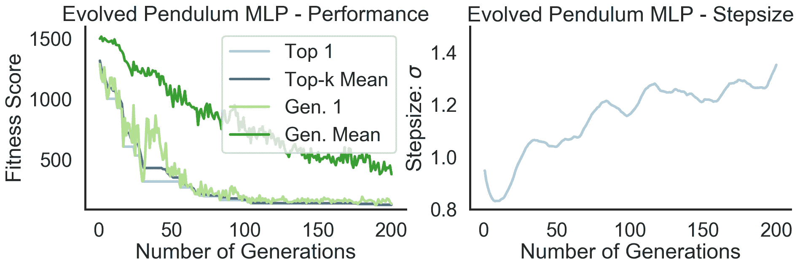

在上面的左图中，我们看到该策略能够解决钟摆任务(适应值约为。120)，耗时不到 50 秒(在 2,7 GHz 四核英特尔酷睿 i7 芯片上)。该图显示了到目前为止找到的总体最佳性能解决方案(“前 1”)以及搜索迭代中前 5 个解决方案的平均值(“前 k 个平均值”)。我们总共经历了 200 代，每代有 100 个网络，用 200 个连续步骤评估了 50 集的每一个网络。在标准 CPU 上，在不到一分钟的时间内，总共进行了 2 亿次阶跃转换和 200 次网络采样/协方差自适应步骤。这甚至包括了`jit`——编译时间。如果你问我的话，我会觉得很蠢。现在让我们来看看进化轨迹不同阶段的进化行为:

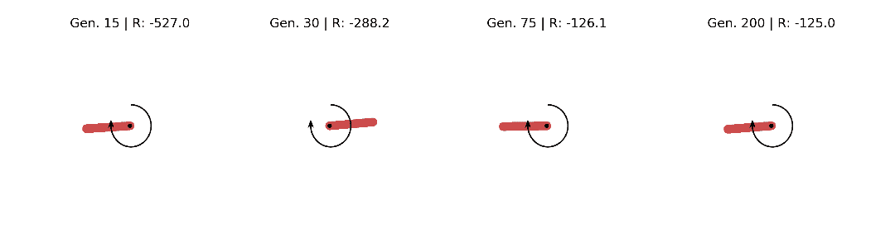

## CMA-ES 的超空间漫游

当周围有额外的计算机时，我喜欢做的一件事是弄清楚什么时候会出问题。对我来说，这意味着运行网格搜索，并对我们算法的“白盒”动力学建立一些直觉，这可能无法直接从更新方程中看到。我特别感兴趣的是 CMA-ES 如何扩展到更大的网络，截断选择(λ > μ)如何影响性能，以及平均学习速率(c_m)有多大的回旋余地。因此，我运行了与上面相同的配置，但是更改了各个参数。为了得到更多的统计数据，我对 10 种不同的种子重复了这个实验。在下图中，您可以看到这 3 个参数之间的性能差异(越小越好):

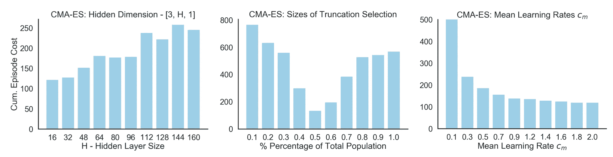

1.  **左**:我们用单个隐藏层和不同的隐藏维度训练简单的前馈策略。自适应搜索后的最终累积成本随着网络容量的增加而增加。 *C* 的估计变得更加困难，性能下降。当在恒定的绝对截断强度下增加群体规模时，这可能变得更好。
2.  **中间**:100 人总体的最优截断选择约为 50%。精英主义或多或少都会降低绩效。一方面，你想积极利用这一代人的最新信息。另一方面，只有 20 集的有限评估也存在一些风险。
3.  我们可以选择一个相当大的平均学习率，而不会影响 CMA-ES 的性能。虽然 Hansen (2016)的教程建议将其设置为小于 1，但我们并没有看到较大学习速率的显著性能下降。这可能是因为我们的政策和目标都是确定的。

## 跨设备比较单代运行时

最后但同样重要的是，我们必须看看我们可以在 GPU 上扩展它有多难。在下图中，您可以找到一个运行时(**左**)和编译时(**右**)基准，用于单摆任务上的单个`ask` - `eval` - `tell`迭代以及不同的群体规模(和 50 个 MC 适应性评估):

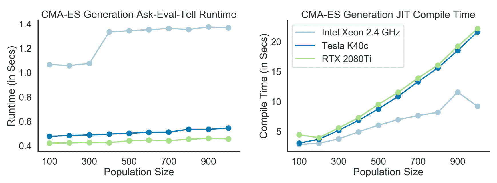

测量时间是 1000 次迭代的平均值，是在三个不同的设备上获得的。在 CPU 上，我们可以看到随着群体规模的增加，每代时间也在增加。另一方面，两个 GPU 都使用简单的并行化来轻松处理增加的群体规模。但是这似乎伴随着一个小警告:增加 XLA 编译时间。我不确定这是怎么回事，但是考虑到你只需要在第一次函数调用时编译一次，这似乎可以忽略不计。

# 结论和最终要点

在这篇文章中，我们了解了 CMA 进化策略，并体验了`jit`、`vmap`和`lax.scan`组合的力量是如何扩展神经进化方法的。通过两行代码，我们能够对随机适应性评估和群体成员进行矢量化。XLA 的强大功能让我们可以在加速硬件上运行整个询问-评估-告知过程。最终，这些是软件和硬件发展的类型，它们使新类型的研究成为可能(使人想起 Sara Hooker 的[‘硬件彩票’](https://hardwarelottery.github.io/)中的论点),并有可能复兴被遗忘的技术。在这里，我们研究了一种无梯度优化，它可以把我们从处处使用可微函数的要求中解放出来。我们可以使用尖峰信号(就像大脑一样！).在未来，我们可能会梦想完全不同类型的神经网络架构，它们利用可扩展的随机搜索/0 阶方法。

最后，本教程的全部代码都可以在这个[库](https://github.com/RobertTLange/code-and-blog/07_neuroevolution)中找到，供您深入研究。此外，我将整个管道放入一个 [120 行片段](https://github.com/RobertTLange/code-and-blog/07_neuroevolution/cma_es_toy.py)。我希望得到一些反馈，⭐ CMA-ES 显然不是唯一的 ES。因此，如果您想了解更多关于不同 ES 的信息，或者对 CMA-ES 有不同的看法，我建议您查看以下链接:

*   尼古拉·汉森伟大的[关于 CMA-ES](https://arxiv.org/pdf/1604.00772.pdf) 和[文档页](http://cma.gforge.inria.fr/)的教程论文。
*   David Ha 的 [estool](https://github.com/hardmaru/estool/tree/9a3c40853aa49629386e5b9d98633ffc2979860f) 工具箱和 ES 的[可视化介绍。](https://blog.otoro.net/2017/10/29/visual-evolution-strategies/)
*   Lilian Weng 关于进化策略的[博客/调查](https://lilianweng.github.io/lil-log/2019/09/05/evolution-strategies.html)。
*   带有 Numpy [CMA-ES 实现](https://github.com/CyberAgent/cmaes)的 CyberAgents Github repo。

我要感谢 Joram Keijser 帮助我使这个博客成为一个更好的版本，也感谢他是我在《JAX-爱情犯罪》中的伙伴。

## 附加:CMA-ES 的超参数概述

我们只是浏览了如何初始化/设置 CMA-ES 的不同参数初始化的细节。这主要是因为我想把重点放在高层次的直觉上，而不是让你过多地沉浸在数学中。如果你想了解更多关于 nitty 细节的信息，我推荐你查阅 Hansen (2016)的教程。下面我收集了一个关键超参数的表格，以及它们在参考教程中是如何设置的:

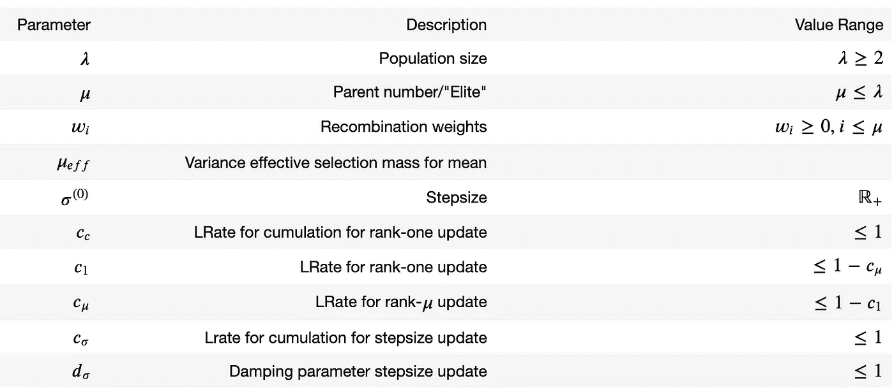