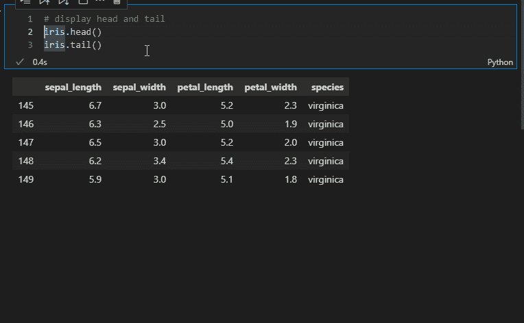
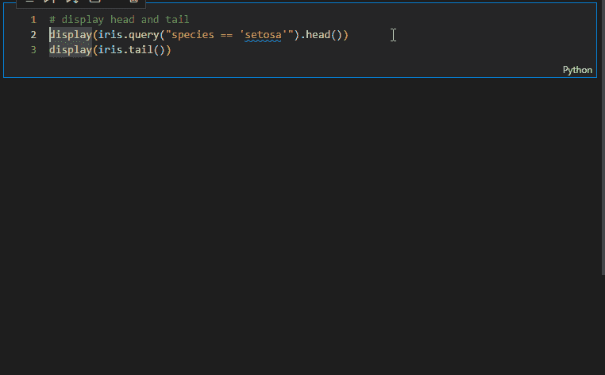
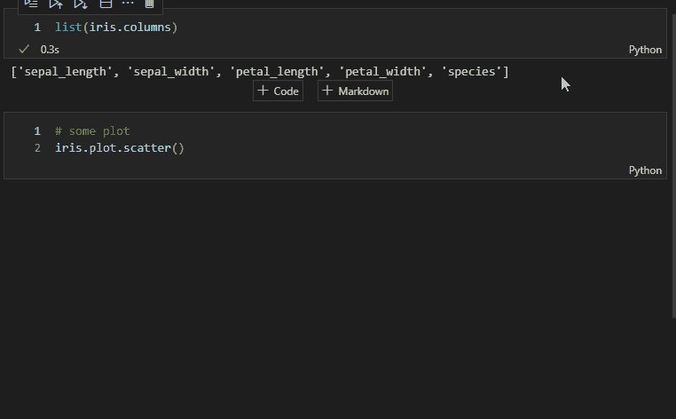
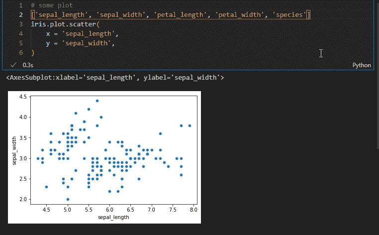
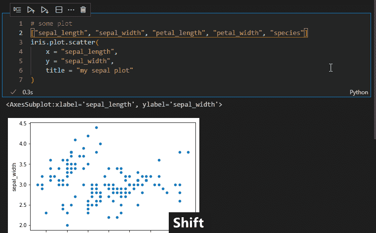
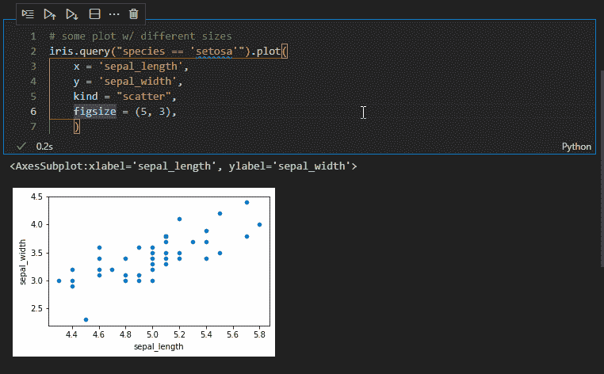
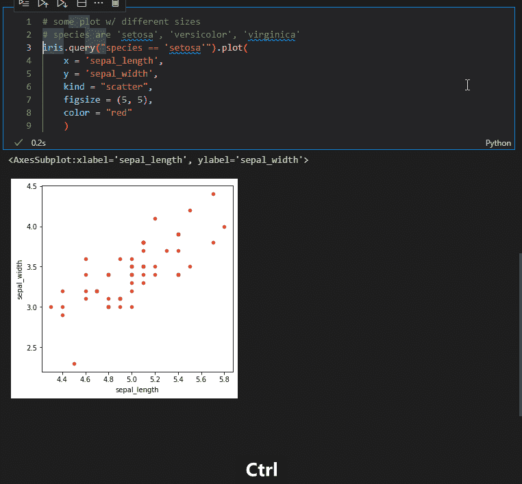
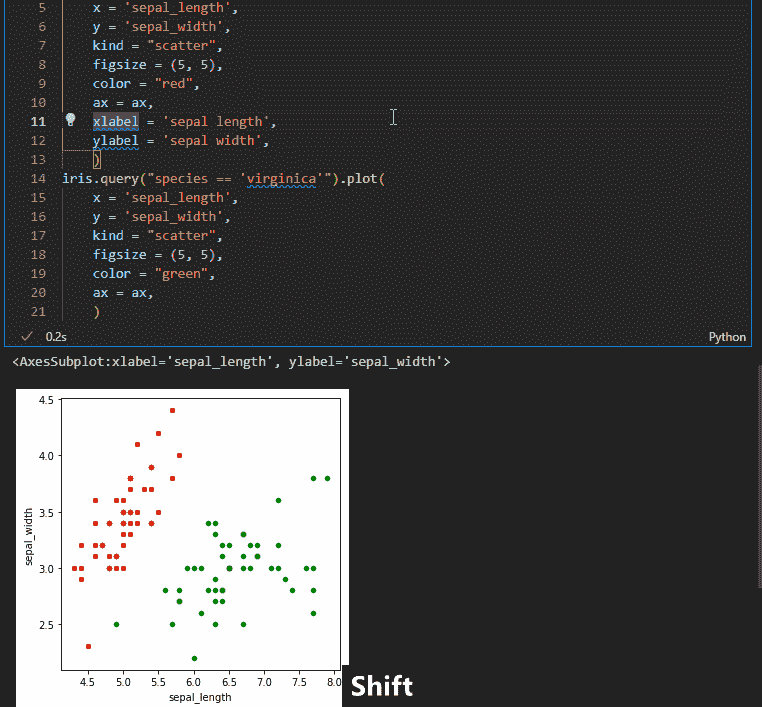
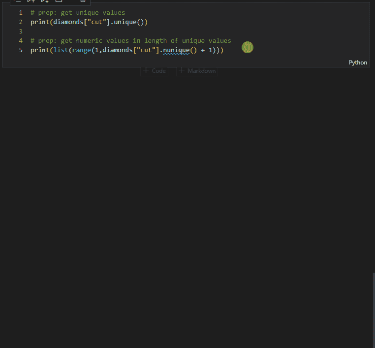

# 用于处理数据的多光标示例

> 原文：<https://towardsdatascience.com/examples-of-multi-cursor-for-working-with-data-92407ca9c77?source=collection_archive---------13----------------------->

## 在 VS 代码中使用多光标和选择特性进行数据分析时，如何节省时间和精力

一次做多件事——照片由[马特·贝罗](https://unsplash.com/@mbeero)在 [unsplash](https://unsplash.com/photos/t6w2xpAI12g) 拍摄

处理数据可能是非常动态的，需要在代码中反复向前和向后移动，以调整和复制代码片段，引入新的假设、过滤器或步骤，从而对下面的方式产生影响。当进行 EDA 或开发处理流水线时，这种情况经常发生，你必须通过实验找到解决方案的路径，问自己:这将如何寻找不同的变量？如果调整到第 99 百分位，它会有什么变化？如果我提前两步过滤，会不会更快并且仍然有效？这个过程被称为发现是有原因的，但如果我们对自己诚实，那就是我们喜欢它的原因。在这个过程中，新的想法会很快出现。然而，改变代码来迎合这些想法可能是一件苦差事。这就是我看到多光标和高级选择功能的好处。

我读过一些关于多光标是非常高级的开发人员的工具的评论，指出缺乏初学者的用例。我想证明这是错误的，因为这是关于这些特性的*智能使用*为每个级别的编码人员创建用例。一方面，它为我节省了大量时间。但它也有助于减少手动更改六七处变量名、测试微小调整或纠正错误时的麻烦。我觉得手动进行这些更改会导致您的分析工作流出现某种[门道效应](https://en.wikipedia.org/wiki/The_Doorway_Effect)，您在调整代码时忘记了您想要分析的内容。我希望看到下面的功能可以帮助你更加专注。我在 VS 代码中使用它们，但是如果您使用任何现代的 IDE，我相信您也可以获得类似的特性。

# 插入多光标

让我们从简单明了的开始。您希望看到数据集的头部和尾部，但是，当然，您忘记了只有在调用没有被`print()`或`display()`函数包装的情况下，Jupyter 才会显示最后一次调用的输出。您可以手动编写这两个显示函数，或者手动复制&粘贴`display(`部分并在第二行添加`)`。或者使用多光标和“alt+lmb ”( LMB——鼠标左键)同时书写。

插入多光标—按作者排列的图像

# 将光标插入上方/下方

我知道，我刚刚犯了最大的错误，用了鼠标。但是请继续关注，对于上面的用例，我通常不会这样做，因为您可以使用“Ctrl + Alt+ ↑ / ↓”来完成。但是让我们把这个变得复杂一点，让你更好地理解我所说的*聪明用法*的意思。您可以使用“pos1”、“end”或“ctrl + ←/→”来跳转一行代码，并在两行(或更多行)不同的代码中移动，同时实现类似的功能。假设我们只需要头和尾的 3 行，我们的 head 函数由于某种原因被一个`.query()`方法过滤了，我们在第一行的开始。我们现在可以用上面的键盘快捷键得到第二个光标，用' end '跳到两行的末尾，返回两个字符，并将我们的 3 作为参数添加到函数中。

将光标插入上方/下方—按作者排列的图像

# 使用多光标复制和粘贴

如果你曾经打错了过滤值或列名，你会喜欢这个！当然可以用多光标复制粘贴。下一个示例将上面的两个想法放在一起，通过复制和粘贴从 Dataframe 获取列名，并填充绘图函数的 x 和 y 参数。使用下面的“添加选择”功能，你可以更有效地操作，但是让我们一步一步来。

使用多光标复制和粘贴—按作者分类的图像

# 将所选内容添加到下一个查找匹配项

这是迄今为止我最喜欢的功能，因为它使上述所有功能更加通用。如果一个会非常准确，“添加选择”功能属于“搜索和替换”功能组，但它允许添加多个光标，然后做你的事情。选择几个出现的逗号或引号可以让你非常有效地做事(见下面的“所有事情放在一起”一节)。具体来说，如果您没有选择任何内容，则“Ctrl + d”将选择当前单词，再次按下快捷键将选择该“单词”的下一个出现位置，依此类推。如果您选择了某个内容，它会找到该特定选择的下一个内容。举个例子，出于我不记得的原因，我更喜欢双引号而不是单引号，为了保持一致，我每次都要改变它们。

添加选择(简单)-按作者排列的图像

但是让我们来看一个真实的用例:改变一个被绘制的变量。如果您正在创建一个更高级的绘图，该变量的名称也可能包含在其他地方—如标题或轴标签。这个例子的额外好处是:如果你移动箭头键，你将取消选择这个词，只有多光标。此时，您可以使用“Alt + LMB”来删除选择之间不需要的多光标。如果你选择了很远，你可以用“Ctrl + k，Ctrl + d”返回。

添加选择(用于编辑)—按作者分类的图像

顺便说一句，使用“Ctrl + F2”可以一次找到所有事件，这对于使用笔记本来说非常好，因为它被限制在一个单元格内。不过，在较长的脚本中我会小心使用它。我刚刚对不同的位置做了一个非常耗时的分析，这个特性真的为我节省了一些对不同位置的变量应用相同函数的时间。

# 额外奖励:上下移动线条和上下复制线条

你已经成功了，让我给你看一个额外的。我想展示的这些最终功能实际上属于“基本编辑”功能，但我体验到我通常将它们与多光标编辑结合使用。因此，我认为他们非常适合这里。先说 copy line up/down，用` Shift + Alt + ↑ / ↓'得到。当我测试调整后的输入和参数，但想确保快速返回到之前的状态时，比如测试图形大小时，我会使用这个方法。

向上/向下复制行—按作者复制图像

向上/向下复制不限于一行。只需在选定的多行上按“Shift + Alt + ↑ / ↓”键，它就可以复制上面或下面的整个部分。它允许你很快地做两件相似的事情。在下面的例子中，我在 30 秒内将 iris 数据集中的另一个物种放入了图中。复制&粘贴所有这些会花费更长的时间。为了补充我关于*智能用法*的观点，请注意，我在两个函数调用中使用 color 参数作为锚点来获得多光标，以便在 color 参数下面添加相同的新行——使用代码中的内容来充分利用这些工具。

向上/向下复制多行—按作者复制图像

最后但也是最基本的，我想介绍的一个特性是上移/下移线特性，只是为了确保您了解它。非常简单，它允许您更改代码的顺序，从而更改数据处理步骤。它也适用于多行选择。例如，我真的很难记住，如果我合并两个图，并想改变轴标签，我必须在最后一个图函数调用中这样做才能产生效果。

向上/向下移动线条—按作者排列图像

# 所有的事情放在一起

一个特别的操作是创建从数据集列或唯一列值到其他值的映射，以分配函数或分类等，我觉得它真正减少了我们在上面学到的这些特性的麻烦。例如，当我构建数据管道时，我用它来构建将列名从数据框映射到 SQL 数据类型的“create table”SQL 语句。我这样做也是为了设置存储某些值的配置文件，这些值应该被映射到特定的变量值。我最近读到的一个有趣的例子是，通过将一个字典映射到一个字符串变量(尚未排序的类别),将该字符串变量转换为预测模型的工程特征，从而创建数字排序值。过去，我在这种操作上浪费了大量时间和精力，所以我想通过使用上面的特性，以 *diamonds* 数据集的“cut”列为例(其中“好”和“非常好”没有正确排序)，快速展示这是如何工作的。

将变量值映射到有序数值-作者图片

# 结论

最后，我想回到我关于门口效应的观点。用代码分析数据必须做的一些事情可能会很麻烦，而且做这些事情的努力会分散你的注意力，打断你的思维分析流程。我希望这能帮助你坚持下去。编码快乐！