# Excalidraw:如何在草图中将复杂的数据科学理念变为现实

> 原文：<https://towardsdatascience.com/excalidraw-how-to-bring-complex-data-science-ideas-to-life-in-sketches-9349dead934a?source=collection_archive---------21----------------------->

## 通过有趣的自定义视觉效果解释硬数据科学主题

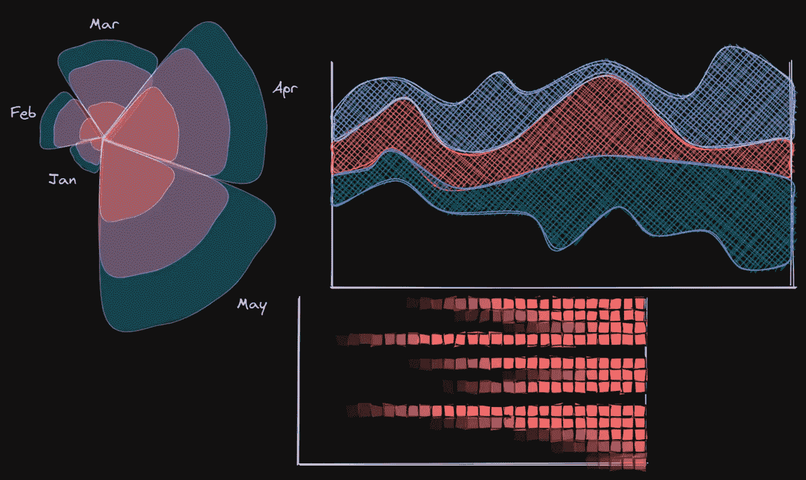

所有图片和 gif 都是作者的

# 介绍

写了 100 多条，我悟出了一个硬道理。我可以是一个漫谈 5 分钟的作家，解释一个困难的话题，倾吐我的心声。我也可以是一个写得不多，但展示简单视觉效果的作家，就像下面这样，既节省了我的时间，也节省了读者的时间:

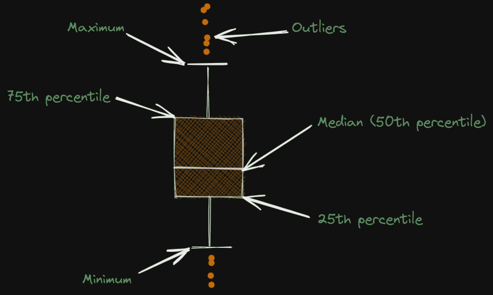

尽管你已经听过无数遍了，我还是要重复一遍——一张图胜过千言万语。在数据科学交流中，这句话在字面上、比喻上、口头上都是正确的。

你不想让你的读者、经理、老板或任何阅读你的作品的人用大术语和长句来烦你。取而代之的是，通过杀手级的视觉效果来传达你的想法，这种视觉效果可以穿透任何人无聊的眼睛，直入主题。

不知道怎么做，还是觉得没必要的难？嗯，你显然没有听说过 [Excalidraw](https://excalidraw.com/) 。

<https://ibexorigin.medium.com/membership>  

获得由强大的 AI-Alpha 信号选择和总结的最佳和最新的 ML 和 AI 论文:

<https://alphasignal.ai/?referrer=Bex>  

# 图纸、数字和文本

[Excalidraw](https://excalidraw.com/) 是一个在线画板，你可以在这里绘制自定义的视觉效果。它受欢迎的部分原因是它能够创造出类似潦草手绘的图形。

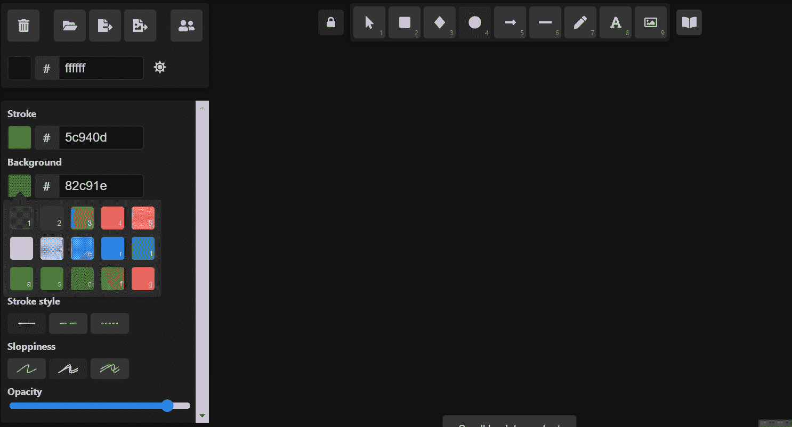

您可以从顶部的工具栏开始绘制基本图形:

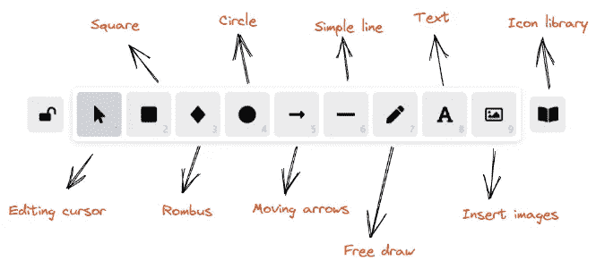

使用这些选项中的任何一个都会在左侧弹出一个菜单，您可以在其中更改图形:

*   中风
*   背景
*   充满
*   笔画宽度/样式
*   马虎
*   不透明

这是一张 gif 图，展示了当你使用这些设置时，体形是如何变化的:

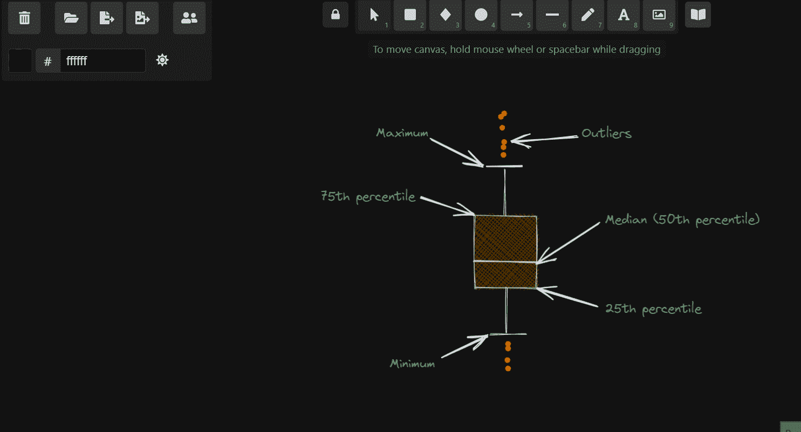

Excalidraw 的另一个很酷的功能是智能箭头。将箭头附加到对象后，箭头会随着对象的移动而移动:

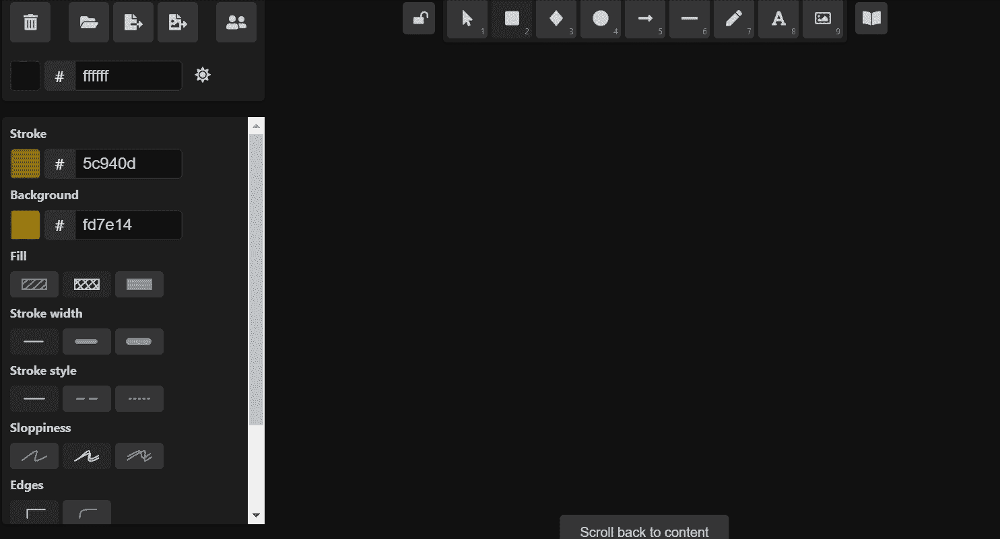

此外，您可以随意更改和弯曲这些箭头:

一旦你开始画箭头，你可以左键点击你的鼠标来创建断点。完成后，您可以双击箭头来更改断点。

# 在 Excalidraw 中导航

右键单击任何对象都会弹出一个包含许多有用选项的上下文菜单:

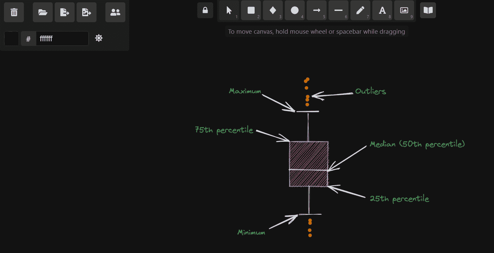

更改显示顺序、组合多个对象、将选择内容复制到剪贴板都是一些例子。

接下来，右键单击任何空白区域都会出现一个不同的上下文菜单，其中有几个更改编辑模式的选项:

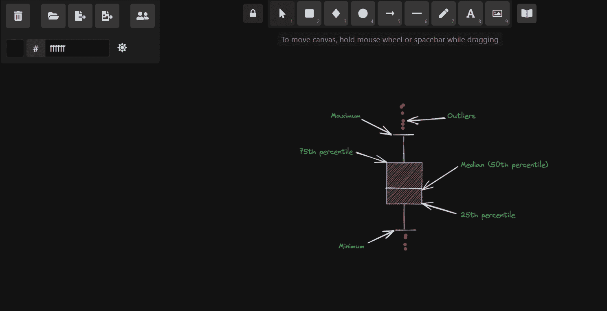

您可以选择启用“网格”和“我的最爱”——进入查看模式，该模式显示项目保存到图像时的样子。

此外，您可以在视觉工作时打开/关闭黑暗模式。最棒的是，在将项目存储到图像时，您可以使用相同的选项:

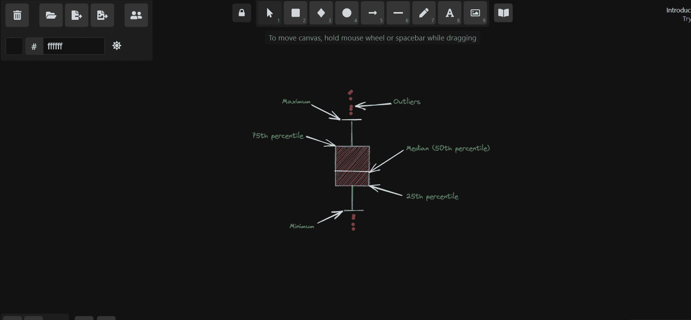

Excalidraw 还有一些特性，使同时控制多个对象变得轻而易举。例如，您可以控制显示顺序:

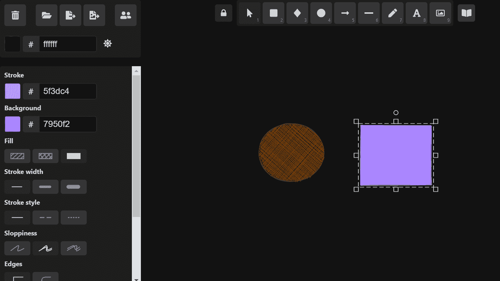

或者更改多个图形的对齐方式:

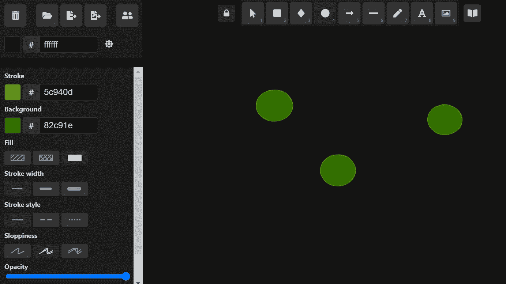

# 最棒的是，图标库

最后，我最喜欢的 Excalidraw 特性是它广泛的现成图标草图套件，这些图标与编程、数据科学和技术相关:

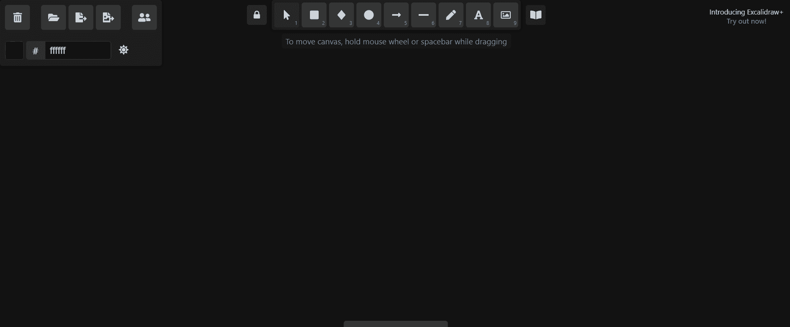

将这些图标添加到资源库后，您可以在项目中以任何喜欢的方式添加和编辑它们:

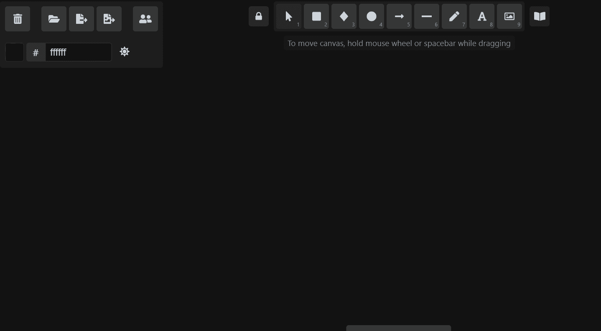

此外，如果您想要将视觉效果存储为形状，您可以将它们添加到此图标资源库，以便在其他项目中使用它们:

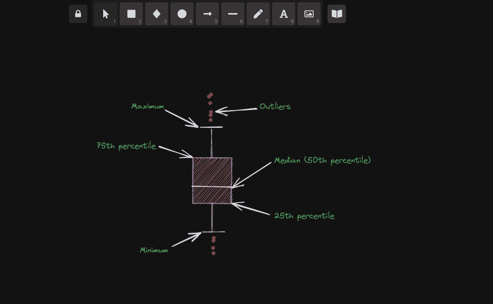

# 摘要

我希望我能早点找到 Excalidraw。它可以让我以前的帖子更有趣，更有信息量，更重要的是，不那么罗嗦。

下次当你发现自己处于无法用语言表达的情况时，请使用 Excalidraw。这对自己和他人都是一种恩惠。

# 您可能也会感兴趣…

</6-pandas-mistakes-that-silently-tell-you-are-a-rookie-b566a252e60d>  </10-advanced-matplotlib-concepts-you-must-know-to-create-killer-visuals-9a32d241e31d>  </kagglers-guide-to-lightgbm-hyperparameter-tuning-with-optuna-in-2021-ed048d9838b5>  </5-cross-validation-techniques-you-need-to-create-models-that-people-trust-62c4629a678b>  </love-3blue1brown-animations-learn-how-to-create-your-own-in-python-in-10-minutes-8e0430cf3a6d>  <https://ibexorigin.medium.com/how-i-earn-thousands-for-learning-data-science-with-no-degree-and-experience-3481e09dddd> 