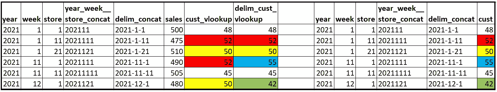

# Excel: 2 个常见错误，1 个罕见错误

> 原文：<https://towardsdatascience.com/excel-2-common-bugs-1-rare-1cbe2dc5faef?source=collection_archive---------15----------------------->

## 每个人都在使用它，确保他们知道如何使用！

约书亚·科尔曼通过 Unsplash 拍摄的照片

Excel 才是王道。它可能被你公司的许多利益相关者使用。它通常用于快速分析。与编码相比，它的门槛相当低。这么多人在这么多报告中使用它，你几乎肯定会发现一个 bug。

我将介绍两个常见的错误和一个不太常见的例子。这篇文章既可以帮助你避免这些情况，也可以帮助你为那些使用不符合事实的数字的报告的人提供指导。

# (少数派报告的红球滚下来)有数据不符！！！

你戴上手套，这样你就可以浏览录像，找出问题的根源。你所有的监视器都装满了证据。你在执行任务！

有人指出，他们得出的“average_$_per_cust”值与他们在其他地方看到的值不同。

作者照片

此报告采用了一个已经按商店按月计算了“average_$_per_customer”的列，现在它正在计算每个月的平均值。平均是不允许的！当使用“销售额”的总和/创建的公式“客户”的总和时，请注意上面数据透视表中的差异。

这可能看起来没有很大的区别，但当涉及到一些重要的决定时，这可能是一个项目的结束，这个项目实际上做得刚刚好，足以生存。

# 求平均值会带来多大的麻烦？

说到平均值，最棘手的是分母的值会对结果产生相当大的影响。在这个例子中，商店 10 去年还没有开业，所以没有相关的销售。在我们的左栏中，我们将销售额记为 0。在我们的右栏中，我们没有值。使用 0 将在每个观察实例的分母上加 1。

作者照片

与计算中实际需要的 9 家商店相比，在 10 家商店之间分摊的 905 美元(我们假设以千计)非常不同。

# 这个有点鬼鬼祟祟

我们要换个场景，请来了我们的老朋友:V-Lookup。这种情况有点古怪。我想展示一下，以防你遇到类似的情况。首先，看一下靠近输出中间的两列。

作者照片

在这个场景中，我们使用 V-Lookup 引入最右边的“客户”值，以匹配“销售”值。我们没有唯一的标识符来加入，所以创建了一个。“year_week_store_concat”列似乎不言自明。它连接了 year、week 和 store 列。这会给我们一个独特的价值，对不对？

请注意，在我们的“cust_vlookup”列中，我们看到了值 52 和 50 的副本。如果您查看我们的“year_week_store_concat”列，您会注意到对于 52 的两行，这两行的查找都是 2021111。第 1 周，商店 11 看起来就像第 11 周，商店 1。使用 V-Lookup，它首先找到的任何值都将被引入。

解决办法？使用分隔符。请注意，现在我们有 2021–1–11 对 2021–11–1。使用此方法，“delim_cust_vlookup”将正确匹配这些值！

# 最后的想法

因为将数据放入 Excel 文件并在几秒钟内创建数据透视表是如此容易，人们可能会忘记较小的细节。我希望你不会遇到这些问题，但是如果你遇到了，也许这些会在调试过程中有所帮助并节省你的时间。

这些都是帮助他人避免问题的很好的小技巧。理想情况下，你们将能够像一个团队一样前进，花更少的时间比较结果。一如既往，继续学习！

对于那些使用 SQL 的人来说，在对两个列求和时检查这个可能的错误，并解释它是如何工作的:

 [## 总和(A+B)与总和(A)+总和(B)

### 粉碎 SQL Bug！

towardsdatascience.com](/sum-a-b-vs-sum-a-sum-b-31fb094b786) 

这将帮助您在 SQL 中使用 DateDiff()时避免年份计算错误:

 [## 使用 SQL 的 DateDiff()表示年龄

### 潜在的 Bug 以及如何避免它

towardsdatascience.com](/using-sqls-datediff-for-age-dc0cb5b34190)