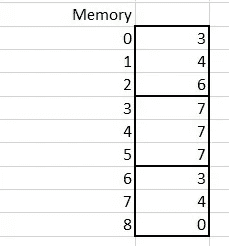
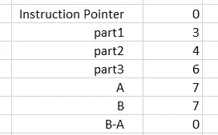
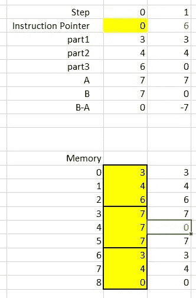
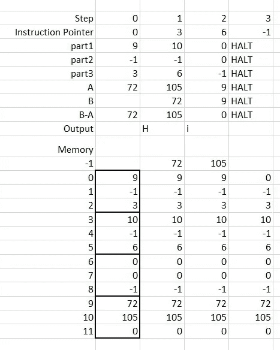
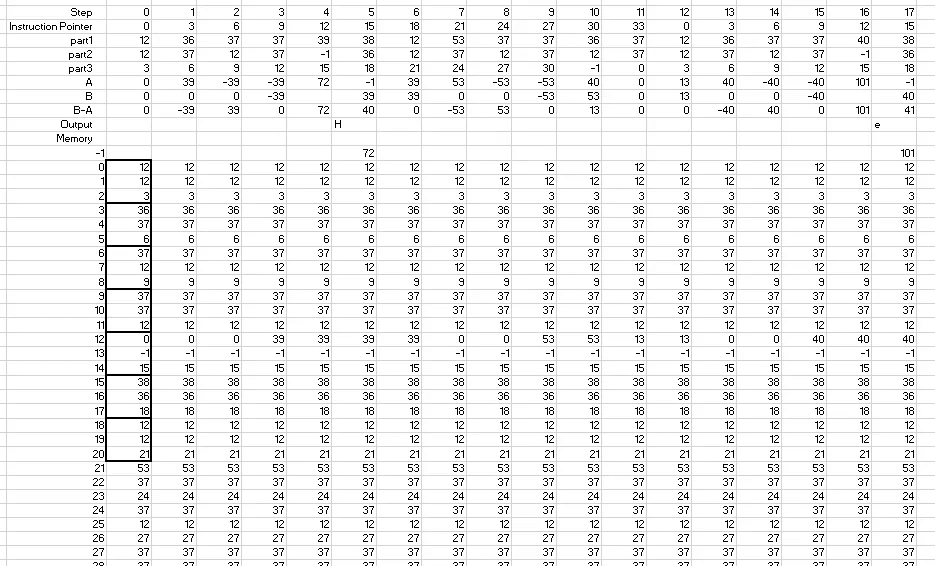
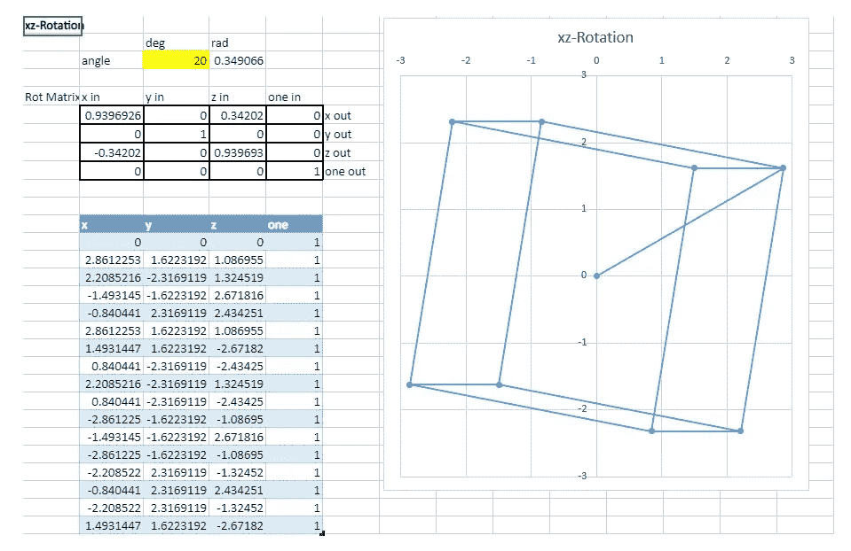

# 在电子表格上建立一台单指令集计算机(OISC)

> 原文：<https://towardsdatascience.com/excel-fun-bd5a1a8992b8?source=collection_archive---------31----------------------->

## Excel 的乐趣:让我们看看一个电子表格如何在指令集层面上模拟一台完整的计算机


[菠萝供应公司](https://unsplash.com/@pineapple?utm_source=medium&utm_medium=referral)在 [Unsplash](https://unsplash.com?utm_source=medium&utm_medium=referral) 上拍摄的照片

在数据科学中，我们经常使用电子表格来分析数据和原型算法，但是电子表格还能做什么呢？让我们看看电子表格是如何在指令集层面上模拟整个计算机的。

我们必须支持多少条指令？嗯，Intel x86 芯片(大多数 PC 用的)理解 1500 条指令。ARM 芯片(用于大多数手机、平板电脑和新 MAC 电脑)将这一数字减少到 50 左右。然而，一台可行的计算机只需要一条叫做 SUBLEQ 的指令就可以制造出来。我们将使用 Excel 来看看这是如何工作的。(这里是 OneDrive 上的[完整电子表格。)](https://1drv.ms/x/s!AkoPP4cC5J64wv1TlM2xFFzdXSEDiw?e=aSSCKF)

典型的计算机芯片提供指令来

*   加载和复制内存位置中的值
*   比较两个存储单元中的值，
*   跳转到内存的新部分，并开始评估那里的指令。
*   对整数、浮点数，有时甚至是数字数组进行加法和乘法等数学运算

一些计算机芯片提供指令来做更多的事情，例如，与人工智能、3D 图形、密码学相关的指令。

但是，如果我们不添加更多的指令，而是删除指令呢？我们能逃脱多少指令？包括奥列格·马宗卡和亚历克斯·科洛金在内的计算机科学家说，答案是一个。马宗卡和科洛金建议选择 SUBLEQ 作为一个指令，因为它

> “是最古老、最流行、也可以说是最高效的[单指令集计算机]”[[基于 sub leq(arxiv.org)的简单多处理器计算机](https://arxiv.org/ftp/arxiv/papers/1106/1106.2593.pdf)

# SUBLEQ

SUBLEQ 指令包含三个部分:

*   `A`的存储位置，要减去的值
*   `B`的存储位置，从中减去`A`的值
*   如果`B`小于或等于 0，跳转到的内存位置。如果`B`是正的，我们向前跳 3 个记忆位置。

让我们来看一个基于[sub leq—Esolang(esolangs.org)](https://esolangs.org/wiki/Subleq)的 Excel 示例。我们把数字 3，5，6，7，7，7，3，4，0 存入内存。



计算机的指令指针指向下一条要执行的指令的存储位置。假设我们的指令指针指向内存位置 0，那么计算机查看三个值，从内存位置 0 开始，即 3、4 和 6。这意味着 3 是`A`的存储位置，要减去的值是 7。而且，4 是`B`的存储位置，是要从中减去 a 的值。该值从 7 开始，但减去`A`后将变为 0。最后，如果`B`变为 0 或更小，6 是要跳转到的存储器位置，因此指令指针将变为 6。

# 设置 Excel

在 Excel 中，我们添加以下内容:



我们希望能够将指令指针设置到任何内存位置，并让 Excel 填充该表的其余部分。这怎么可能呢？以下是我对`part1`使用的公式:

```
=INDIRECT(ADDRESS(ROW(D19)+D9,COLUMN(D19)))
```

其中`D9`是`Instruction Pointer`的单元，而`D19`是存储单元 0 的单元。该公式要求从内存开始向下查找值`Instruction Pointer`。由于`Instruction Pointer`为 0，这将找到包含值 3 的内存位置 0。`part2`的公式是一样的，只是我们在行中加了 1。对于`part3`我们加 2。`A`的公式几乎相同，即:

```
=INDIRECT(ADDRESS(ROW(D19)+D10,COLUMN(D19)))
```

其中`D10`是`part1`的单元格。所以，这表示从内存的开始向下查找值`part1`。那是内存位置 3，包含 7。对于`B`，我们使用`A`公式，但用`D11`代替 `D10`。最后，当然，`B-A`单元格的值就是`B`单元格的值减去`A`单元格的值。

# 走向

下一个问题是我们如何用它们的新值更新`Instruction Pointer`和`B`？我们可以想象关闭 Excel 的 Recalc 设置，就地更改它们的值，然后使用 F9 键将程序向前推进。我没那么做。相反，我为程序的下一步创建了一个新的专栏。我把程序的原步骤称为“0 步”，下一步称为“1 步”。

电子表格看起来像这样。



黄色显示用户输入(原始存储值和`Instruction Pointer`)。注意，在步骤 1 中，`Instruction Pointer`的变化和存储器位置 4 中的值(显示为红色)。`Instruction Pointer`的新值的公式是:

```
=IF(D9<0,D9,IF(D15<=0,D12,D9+3))
```

其中`D9`是`Instruction Pointer`的旧值，`D15`是`B-A`的值，`D12`是前一条指令的`part3`。上面写着:

*   如果`instruction pointer`为负，保持不变(表示程序完成)。
*   否则，如果`B-A`小于或等于 0，则将`Instruction Pointer`设置为`part3`。
*   否则，将`Instruction Pointer`增加 3。

存储单元 4 的新值的公式为

```
=IF($C23=D$11,D$15,D23)
```

其中`C23`是包含位置号的单元格，即 4。单元格`D11`是`part2`。单元格 `D15`是`B-A`。单元格`D23`是该存储单元中的前一个值。所以，这表示:如果这个内存位置是前一步的`B`，那么将其值设置为`B-A`，否则保持值不变。所有的存储单元都有一个类似的公式。

我们可以将步骤 1 的列复制到右边，以获得任意数量的未来步骤的列(最多到 Excel 的限制，大约 16，000)。我们可以向下复制最后一个内存行，以获得任意数量内存的位置(最多可达 Excel 的 1，000，000 个内存的限制)。

# 你好世界！

最后一个大问题仍然存在:我们如何输出任何东西？按照惯例，SUBLEQ 通过向特殊内存地址-1 写入一个数字来创建输出。我们可以将该数字解释为 ASCII 字符。下面是一个来自[sub leq—Esolang(esolangs.org)](https://esolangs.org/wiki/Subleq)的输出“Hi”的示例:



在第 0 步，`Instruction Pointer`表示从内存位置 0 开始，这给了我们`9, -1, 3`。因为第二个数字是-1，这意味着输出存储单元 9 的值，即 72，然后将`Instruction Pointer`设置为 3。ASCII 72 是字符“H”。

在步骤 1 中，`Instruction Pointer`表示从内存位置 3 开始，这给了我们`10, -1, 6`。这意味着输出存储单元 10 的值，即 105 (ASCII 表示“I”)，并将指令指针设置为 6。

在第 2 步，`Instruction Pointer`告诉我们从内存位置 6 开始，这给了我们`0, 0, -1`。这意味着从自身减去内存位置 0(即 9)的值，并将`Instruction Pointer`设置为-1。

在步骤 3，`Instruction Pointer`表示从-1 开始，这是一个负数，所以程序完成。

为了支持输出，我对电子表格做了以下更改:

*   添加了存储位置“-1”。第一步的公式是`=IF(D11=-1,D13,””)`，如果`part2`为-1，则输出`A`，否则为空。
*   在`B-A`下方增加了一行`Output`。它只是存储单元-1 的 ASCII 版本。其步骤 1 的公式为`=IF(E18<>””,CHAR(E18),””)`，表示如果内存位置-1 不为空，则显示其 ASCII 值，否则为空。
*   将`B-A`的公式改为`=IF(E9<0,”HALT”,IF(E11>=0,E14-E13,E13))` ，公式为:1)如果`Instruction Pointer`小于 0，显示“HALT”，2)如果`A`的存储位置至少为 0，从`B`中减去`A`，3)否则为`B`。我还更改了`part1`、`part2`、`part3`、`A`和`B` 的公式，以便在指令指针为负时显示“暂停”。

有了这个，我们可以运行更多有趣的 SUBLEQ 程序。例如，“你好，世界！” [Subleq 示例—Esolang(esolangs.org)](https://esolangs.org/wiki/Subleq)使用循环将所需字符串复制到输出，并在到达字符串末尾时停止。这是电子表格的顶角。您可以在输出行中看到“H”和“e”。



在 OneDrive 上找到[完整的电子表格。在网上或下载后，你可以玩电子表格。你也可以放入你自己的 SUBLEQ 程序，或者看看如果你改变初始的`Instruction Pointer`值会发生什么。](https://1drv.ms/x/s!AkoPP4cC5J64wv1TlM2xFFzdXSEDiw?e=aSSCKF)

# 讨论

在电子表格上实现 SUBLEQ 让我们看到如何只用一条指令就能设计出计算机芯片。用更传统的语言(比如 Python)演示 SUBLEQ 会更容易，但是电子表格提供了两个好处:

*   首先，把计算的每一步放入它自己的列，让我们以一种新的方式来看一个程序。我们不再把程序和计算机看作是随时间变化的一维向量，而是把程序的整个历史看作是一个二维数组。
*   其次，我们可以更改单个输入单元格，Excel 将只有效地更新那些需要更改的单元格。例如，在完整的“Hello World！”例如，将初始的`Instruction Pointer`从 0 改为 1。令人惊讶的是，该程序仍然有效。把它改成 3，你会发现程序不仅还能工作，甚至运行得更快了。

如果你想要更多的 Excel 乐趣，请参阅我的文章 [Excel 乐趣——从电子表格构建 3D 图形——微软 365 博客](https://www.microsoft.com/en-us/microsoft-365/blog/2015/02/18/excel-fun-build-3d-graphics-spreadsheet/)。我展示了如何实现和理解 3D 图形。您可以通过更改电子表格值来交互式旋转正方形和立方体。

