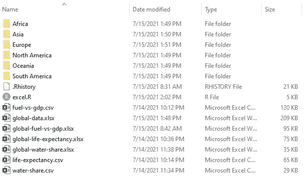
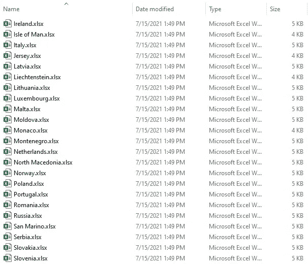

# 使用 R 的 Excel:自动化 Excel

> 原文：<https://towardsdatascience.com/excel-ing-with-r-automating-excel-52648568229c?source=collection_archive---------13----------------------->

## 使用 R 自动读取、写入、合并和拆分多个 Excel 文件


由[米卡·鲍梅斯特](https://unsplash.com/@mbaumi?utm_source=medium&utm_medium=referral)在 [Unsplash](https://unsplash.com?utm_source=medium&utm_medium=referral) 拍摄的照片

数据分析领域的魅力之一是它对多种工具的开放性。这个领域已经表明，只知道一种工具是一种障碍。为了在这个领域生存和发展，你应该:

> *样样精通，样样精通*。—未知

在大多数企业中，Excel 是处理数据的重要工具之一。我自己有使用 Excel 进行数据分析的经验，并没有发现什么缺点。我面临的问题不是我自己的问题，而是大多数用户面临的问题。

在这里，我提出了从 Excel 转换到开源编程语言的理由，或者更确切地说是利用它们的力量:

1.  Excel 列不区分输入和输出。
2.  用户定义的公式不直观，因为单元格位置被标记而不是变量名。
3.  打开/处理大文件很慢，系统经常崩溃(企业不能经常升级计算机)。
4.  将不同的 Excel 文件合并到一个文件中是很麻烦的，同样，在一个文件中处理不同的工作表也很麻烦。
5.  Excel 在付费墙后面。

正如已经提到的，开源编程是选项之一，这里我将使用 R 来自动化简单的 Excel 文件处理。

涵盖的主题有:

1.  机器可读文件命名
2.  读取 Excel 文件
3.  合并 Excel 文件
4.  拆分 Excel 文件
5.  创建多个 Excel 文件

## 目标

*目标是两个读取三个 Excel 文件，其中包含与预期寿命、GDP 支出、天然燃料使用和水可用性相关的全球数据。将这些文件合并成一个包含三个工作表的 Excel 文件，并保存在工作文件夹中。使用* `*Outer Join*` *将三张表格合并成一张，并将每个国家的数据保存到相应的洲文件夹中。*


作者 Gif

那么，我们开始吧。

# 机器可读文件命名

正确命名文件很重要，因为在处理自动化时它会很方便。命名文件的最好方式应该是机器可读的。命名文件时，请尝试执行以下规则:

1.  避免重音字符、空格，避免区分大小写的文本。
2.  使用分隔符或分隔符，如“-”或“_”。
3.  使用机器可读的日期格式，如 YYYY-MM-DD。
4.  在末尾添加版本控制以便于导航(例如-01，-02，…,-10)。

命名文件的示例:2021–07-15 _ Excel _ Automation-01 . xlsx

# 读取 Excel 文件

为了读取文件，使用了`xlsx`包。有两个功能:`read.xlsx()`和`read.xlsx2()`读取`xlsx`包中的文件。`read.xlsx2()`在处理大型数据集时快速高效。下面的代码是用来读取 Excel 工作表的。

```
# reading individual files
fuel <- read.xlsx2("global-fuel-vs-gdp.xlsx",sheetIndex = 1)
life_exp <- read.xlsx2("global-life-expectancy.xlsx",sheetIndex = 1)
water <- read.xlsx2("global-water-share.xlsx",sheetIndex = 1)
```

因为我们在这里是为了自动化，所以让我们研究一下。要解决读取多个文件的问题，使用`list.files()`功能创建一个包含所有感兴趣的文件名的列表。将单个工作表中的 Excel 数据存储到数据框中。为定义的数据框对象使用正确的命名约定，因为这将有助于自动化。通过两个 For 循环和`assign()`功能将数据帧分配给单个页面。

```
# set the working directory
setwd("C:/Users/amalasi/Documents/R/Blog post/Blog17-Excel1")
```

# 合并 Excel 文件

一旦加载了 Excel 数据，数据就可以进行处理了。这里讨论两种可能的数据合并方法。*第一个路径是创建一个包含多个工作表的工作簿，这些工作表对应于所有工作簿的工作表。第二个路径是将第一个路径中创建的工作簿中的所有工作表合并成一个工作表。*

## 创建具有对应于所有工作簿的多个工作表的多个工作表的单个工作簿

通过在 for 循环中使用`write.xlsx()`函数，可以帮助将包含多个工作表的多个工作簿作为不同的工作表添加到一个工作簿中。使用`write.xlsx()`功能时应小心，第一次确保将`append`参数值设置为默认值，即 FALSE。这将创建工作簿，要向该工作簿添加单个工作表，只需设置参数`append=TRUE`。

## 通过合并工作簿的多个工作表来创建单个工作表

这里的技巧是记住命名所有在自动化过程中创建的临时数据帧，使其具有固定的模式(记住机器可读文件命名中定义的约定)。至少在这一部分，这非常有帮助。

本练习的目标是使用*外部连接*合并工作表。为此，请创建所有相关数据框的列表，这些数据框将被合并以创建单个数据框或表。使用`ls()`和`mget()`函数，创建临时数据帧列表，并将其分配给名为 *local_list* 的对象。通过定义 list 对象，可以在 For 循环中轻松操作数据帧。这段代码将创建一个名为 *global_final* 的对象，并将所有数据合并到一个工作表中。

# 拆分 Excel 文件

当处理包含多个工作表的大型工作簿时，可以使用下面的代码提取所有单个的工作表并将其分配给单个的数据框。这是通过使用`getSheets()`功能实现的。

# 创建多个文件和文件夹

最后一个目标是创建特定于国家的文件，并将它们保存在对应于各自大陆的文件夹中。这里有两个步骤是完全实现目标所必需的。

第一步是创建以大陆命名的文件夹，这是通过使用`dir.create()`功能实现的。

第二步是将工作表分割成多个包含各个国家信息的数据框，并保存它们。从索引单个国家开始，因为这有助于创建 For 循环。接下来，使用`filter()`，提取国家信息并将其存储在一个临时对象中。然后创建一个工作簿，定义一个工作表并将数据写入工作表。最后一步是将文件保存在目标文件夹中。



作者图片

完整代码的链接是这里的。

# 结论

这篇文章清楚地展示了花几个小时编写 R 代码脚本，从长远来看，在合并和拆分多个 Excel 文件时可以节省大量时间。

上述代码与工作簿中的工作表数量无关，可以处理具有不同数据列的工作表。

关键的学习是:定义机器可读的文件命名约定，以及读取、写入、合并和拆分多个 Excel 表格和工作簿。

下一步将是使用数据透视表、Vlookup 和其他使用 r 的 Excel 函数。

对我写的更多自动化相关的博客感兴趣，请查看这个博客:

[](/create-your-resume-with-pagedown-package-in-r-123ca6310d52) [## 用 R 中的 pagedown 包创建你的简历

### 使用 pagedown 包在 1 小时内制作令人印象深刻的简历

towardsdatascience.com](/create-your-resume-with-pagedown-package-in-r-123ca6310d52) 

关于 R 和用 R 绘图的其他博客:

[](/3-lesser-known-pipe-operators-in-tidyverse-111d3411803a) [## Tidyverse 三家不太知名的管道运营商

### Tee、exposition 和赋值管道操作符，用于干净的代码编写。

towardsdatascience.com](/3-lesser-known-pipe-operators-in-tidyverse-111d3411803a) [](/all-you-need-to-know-to-build-your-first-shiny-app-653603fd80d9) [## 构建您的第一个闪亮应用程序所需要知道的一切

### 涵盖了从数据准备到连接用户界面和服务器再到在线发布应用程序的基本概念。

towardsdatascience.com](/all-you-need-to-know-to-build-your-first-shiny-app-653603fd80d9) [](/7-shortcuts-worth-knowing-for-efficient-workflow-in-r-cc52c351cb73) [## R 中高效工作流值得知道的 7 个捷径

### RStudio 中常规编码的便捷键盘快捷键

towardsdatascience.com](/7-shortcuts-worth-knowing-for-efficient-workflow-in-r-cc52c351cb73) [](/data-visualization-using-ggplot2-5-features-worth-knowing-c0447a760335) [## 使用 ggplot2 的数据可视化:值得了解的 5 个特性

### 使用 ggplot2 包提高 dataviz 效率的技巧

towardsdatascience.com](/data-visualization-using-ggplot2-5-features-worth-knowing-c0447a760335) [](/master-data-visualization-with-ggplot2-pie-charts-spider-plots-and-bar-plots-899a07a15827) [## 使用 ggplot2 实现主数据可视化:饼图、蜘蛛图和条形图

### 关于在 r 中创建饼图、蜘蛛图和圆形条形图的指南。

towardsdatascience.com](/master-data-visualization-with-ggplot2-pie-charts-spider-plots-and-bar-plots-899a07a15827) 

## 数据源

1.  [https://ourworldindata.org/grapher/life-expectancy](https://ourworldindata.org/grapher/life-expectancy)
2.  https://ourworldindata.org/water-sanitation-2020-update
3.  【https://ourworldindata.org/energy-poverty-air-pollution 

链接到 [Github 库](https://github.com/amalasi2418/Blog-post/tree/master/Blog%2017%20-%20Excel%201)。

*可以在*[*LinkedIn*](https://www.linkedin.com/in/abhinav-malasi/)*和*[*Twitter*](https://twitter.com/malasi_abhinav)*上与我连线，跟随我的数据科学和数据可视化之旅。*