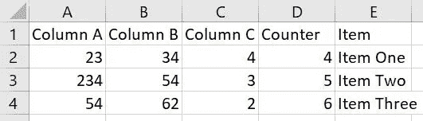
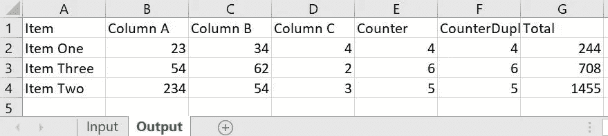
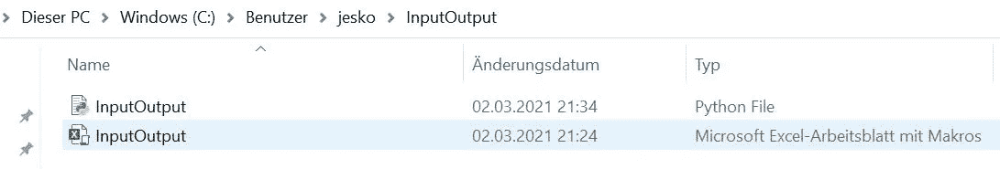
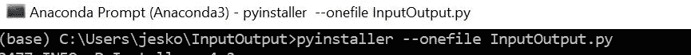
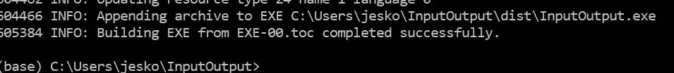
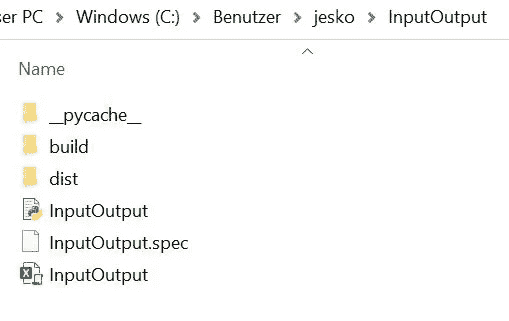
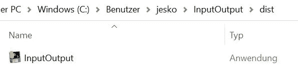

# 面向非 Python 爱好者的 Excel-Python 应用程序

> 原文：<https://towardsdatascience.com/excel-python-app-for-non-pythonists-68b4fec0fabf?source=collection_archive---------11----------------------->

## 让您的非编码同事预测 Python 在 Excel 中的威力(用 Xlwings 和 PyInstaller 释放野兽)


N.Y.T .(突然……)，水彩纸上的丙烯颜料和蜡笔，[马蒂亚斯·布勒](http://boehler-orendt.com/boehler/index.html)(得到我朋友马蒂亚斯的友好许可)

**动机:**

我们经常进行令人印象深刻的 Python 分析，但我们的同事所要求的只是在 Excel 中获得最终结果。我们的许多同事不想使用 Jupyter Notebook、Python 脚本之类的东西。他们只想坚持使用他们钟爱的电子表格工具(比如微软的 Excel)。在这个故事中，我们将学习如何构建这样一个 Excel 解决方案，它在后台使用 Python。因此，我们的非 Python 专家同事可以直接从 Excel 中启动 Python 代码，不需要任何 Python 知识(也不需要处理任何技术问题，如包安装或版本故障排除)。

**解决方案:**

现在让我们一步一步地研究如何在 Excel 中运行 Python。

首先你需要 pip 安装 xlwings。如果您尚未安装 [Xlwings](https://www.xlwings.org/) ，请现在安装，例如通过 [pip install](https://pypi.org/project/xlwings/) :

```
pip install xlwings
```

之后，我们导入 Xlwings 进行一个简短的测试:

```
import pandas as pd
import xlwings as xw
df = pd.read_excel('InputOutput.xlsm')
xw.view(df)
```



这就是我们在 Excel 中的输入选项卡的样子。

与熊猫相反，Xlwings 打开这个 Excel 文件(。view ),这样我们就可以直接在 Excel 电子表格中查看数据框架。这在检查大数据帧时非常方便(比在 Juypter 笔记本单元格中直接检查大数据帧更方便，尤其是在交叉检查大量计算时)。

多亏了 Xlwings，我们可以在 Jupyter 笔记本上做几乎所有的事情，并最终将数据帧写回到 Excel 表中。基本概念就是简单地将你的代码编写到一个主函数中。让我们先来看一个简单的例子:

```
# Make sure, that the Excel file is located in the same path as this file.import pandas as pd
import xlwings as xw
def main():
    wb = xw.Book.caller()
    sht = wb.sheets['Input']
    df = sht.range('A1').options(pd.DataFrame, header=1, index=False, expand='table').value
    counter = []
# add Counter starting from one until max counter is reached 
    for index, row in df.iterrows():
        for x in range(int(row['Counter'])):
            counter.append(x+1)
# duplicate the rows according to Item specific max counter
    df = df.loc[df.index.repeat(df.Counter)]
# Add the counter number per row
    df['CounterDuplRow'] = counter
    df['Total']=(df['Column A']+df['Column B'] + df['Column C']) *df['CounterDuplRow']
    df2 = df.sort_values("Total").groupby("Item", as_index=False).last()
    shtout = wb.sheets['Output']
    shtout.range('a1').options(pd.DataFrame, index=False).value = df2
[@xw](http://twitter.com/xw).func
def hello(name):
    return f"Hello {name}!"
if __name__ == "__main__":
    xw.Book("InputOutput.xlsm").set_mock_caller()
    main()
# in case this Jupyter Notebook is working well, you can download it as a Python file (.py)
# to do so, just click on "file" in the menu above and choose "download as py"
```

请注意，Excel 文件必须与您的 Jupyter 笔记本位于同一文件夹中才能正常工作。这个脚本主要做的是从 Excel 的 input 选项卡中获取输入，遍历它并进行一些计算(出于训练目的，我们添加了一个循环)。结果数据帧被写回到同一个 Excel 文件中的“输出”选项卡中:



我们将 df 写入 Output 选项卡，从单元格 A1 开始。

如果一切正常，我们可以将 Jupyter 笔记本保存为 Python 脚本(只需在 Jupyter 笔记本菜单中单击“文件”并选择“下载为 py”)，并确保将其命名为与我们的 Excel 文件相同的名称:



我们现在能够在 Jupyter 笔记本上开始计算，从 Excel 中读取和写入数据帧。到目前为止，没什么新发现。但多亏了 Xlwings，我们现在可以在 Excel 中添加 VBA 宏，这样我们就可以在 Excel 中启动 Jupyter 笔记本了。好吧，越来越有意思了。但我们真正寻求的是将一个 Excel-Python 应用程序交给我们的同事，而不需要他们在自己的机器上设置 Python(或 Excel 中的 Xlwings 插件)。我们现在将学习如何到达那里。我们的解决方案是通过 [PyInstaller](https://www.pyinstaller.org/) 导出所有需要的 Python 包。同样，如果您还没有 PyInstaller，请立即安装:

```
pip install pyinstaller
```

然后我们可以使用 PyInstaller 为我们的 Excel-Python 应用程序创建所有需要的文件。我们只需进入终端，转到我们的两个文件(InputOutput.py 和 InputOutput.xslm)所在的同一个文件夹，然后输入:

```
pyinstaller –-onefile InputOutput.py
```



根据您的环境，这可能需要一些时间。但是最后终端应该告诉你一个 Exe 文件已经成功构建:



现在，当我们再次查看我们的文件夹时，我们会发现为我们的 Excel-Python 应用程序部署的所有必需的包:



在“dist”文件夹中，我们会找到 exe 文件:



现在，您可以双击这个可执行文件 InputOutput.xlsm，然后您可以检查您的 InputOutput.xlsm:您将看到 Output 选项卡已经被计算出来。这意味着，您可以将完整的文件夹“InputOutput”交给您的同事，他们的计算机上没有安装 Python。您将看到他们也可以启动 exe，并且他们将在 Excel 中收到与您刚才所做的相同的输出选项卡。

为了更方便我们的同事，我们将做最后的修改。我们将在 Excel 中添加一点 VBA，这样我们的同事可以直接从 Excel 中启动代码:

```
Sub ExeExecute()
‘ Windows-Editor start
Dim TaskID As Long
TaskID = Shell(“C:\Users\Jesko\InputOutput\dist\InputOutput.exe”, vbNormalNoFocus)
End Sub
```

恭喜，我们已经成功地创建了一个完整的 Excel-Python 应用程序，它甚至可以在不需要额外安装 Python 的计算机上运行 Excel。你可以在[我的 Github](https://github.com/DAR-DatenanalyseRehberg/XlwingsPyInstaller) 中找到 Jupyter 笔记本和 Excel 的例子。

非常感谢您的阅读！希望这篇文章对你有帮助。请随时在 [LinkedIn](https://de.linkedin.com/in/jesko-rehberg-40653883) 、 [Twitter](https://twitter.com/DAR_Analytics) 或[工作室](https://jesko-rehberg.medium.com/virtual-reality-vr-for-education-a532aa5b6272)与我联系。

<https://jesko-rehberg.medium.com/membership>  

最初发布于我的网站 [DAR-Analytics](http://dar-analytics.com/) 。